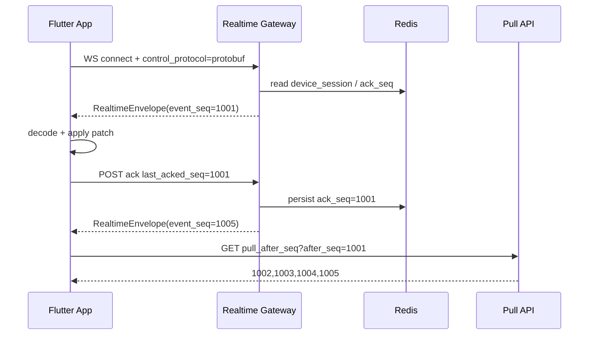

# WuKongIM 协议迁移实施文档

## 1. 文档目标

本文档定义 WuKongIM 从“控制事件以 JSON 为主”迁移到“控制面 protobuf 化、消息面引入统一 Seq / Ack / Pull 修补”的实施方式。目标是平滑迁移，不打断现有 JSON 客户端。

## 2. 当前基线

### 已落地能力

- Flutter 已支持 JSON / protobuf 双栈控制帧解码【F:/C:/Users/COLORFUL/Desktop/WuKongIM/wukong_im_app/lib/realtime/session/session_event_gateway.dart†L99-L133】
- Flutter 已能把 `RealtimeEnvelope` 还原为 `SessionEventFrame`【F:/C:/Users/COLORFUL/Desktop/WuKongIM/wukong_im_app/lib/realtime/control/control_proto_codec.dart†L155-L200】
- `conversation.updated` 已能映射为局部 patch【F:/C:/Users/COLORFUL/Desktop/WuKongIM/wukong_im_app/lib/realtime/control/control_event.dart†L23-L57】
- `IMService` 已默认请求 protobuf 控制协议【F:/C:/Users/COLORFUL/Desktop/WuKongIM/wukong_im_app/lib/service/im/im_service.dart†L59-L61】【F:/C:/Users/COLORFUL/Desktop/WuKongIM/wukong_im_app/lib/service/im/im_service.dart†L1341-L1364】
- 服务端 `api_session_compat.go` 已支持 `control_protocol=protobuf` 和 `X-Realtime-Control-Protocol: protobuf` 协商【F:/C:/Users/COLORFUL/Desktop/WuKongIM/wukong_im_app/.task4_remote_sync/modules/user/api_session_compat.go†L242-L372】
- 服务端 helper 已具备 JSON / protobuf 探测、精度保护和边界保护【F:/C:/Users/COLORFUL/Desktop/WuKongIM/wukong_im_app/.task4_remote_sync/modules/realtime/control_stream.go†L32-L207】

### 当前缺口

- 主消息链路还没有统一 `server_seq`
- `pull_after_seq` 还未形成正式 API
- `AckSeq` 目前只在控制层面具备基础能力，还没有联动消息补偿

## 3. 目标协议模型

### 3.1 Envelope

```proto
syntax = "proto3";

package rtproto;

message RealtimeEnvelope {
  uint64 event_seq = 1;
  string event_type = 2;
  bytes payload = 3;
  uint64 ack_seq = 4;
  string device_id = 5;
  uint64 issued_at_ms = 6;
  uint32 schema_version = 7;
}
```

### 3.2 设计约束

- `event_seq` 由服务端分配，单用户单调递增
- `ack_seq` 表示客户端已经完整处理的最大连续 `event_seq`
- `payload` 必须包含客户端重建 UI 所需的最小元数据
- 所有 protobuf 控制事件都必须携带 `event_id`、`aggregate_id`、`server_ts`
- JSON 客户端保持旧协议不破坏

## 4. 协商规则

### Client -> Server

任一满足即视为 protobuf：

- Query: `control_protocol=protobuf`
- Header: `X-Realtime-Control-Protocol: protobuf`

其余情况默认 JSON。

### 服务端协商伪代码

```go
func resolveSessionControlProtocol(queryValue, headerValue string) realtime.ControlProtocol {
	if strings.EqualFold(strings.TrimSpace(queryValue), "protobuf") ||
		strings.EqualFold(strings.TrimSpace(headerValue), "protobuf") {
		return realtime.ProtocolProtobuf
	}
	return realtime.ProtocolJSON
}
```

## 5. 消息流转



## 6. payload 最小字段规范

### `device.invalidated`

```json
{
  "event_id": "evt_xxx",
  "aggregate_id": "u_1001",
  "server_ts": 1712000444
}
```

### `conversation.updated`

```json
{
  "event_id": "evt_conv_xxx",
  "aggregate_id": "1:u_2001",
  "server_ts": 1712000555,
  "channel_id": "u_2001",
  "channel_type": 1,
  "unread_count": 3,
  "last_message_digest": "hello",
  "sort_timestamp": 1712000555
}
```

## 7. 客户端实施顺序

### Phase A: 控制面二进制化

- [ ] `device.invalidated`
- [ ] `session.kicked`
- [ ] `conversation.updated`

验收命令：

```powershell
flutter test test/realtime/control/control_proto_codec_test.dart test/realtime/session/session_event_gateway_test.dart
```

### Phase B: Ack / Gap Repair

- [ ] 本地持久化 `last_acked_seq`
- [ ] 当收到 `event_seq > lastReceivedSeq + 1` 时触发 `pull_after_seq`
- [ ] 增量数据落库与 UI patch 在同一恢复流程内完成

建议实现：

```dart
Future<void> recoverIfGapDetected(int incomingSeq) async {
  if (incomingSeq <= gateway.lastReceivedSeq + 1) {
    return;
  }
  final delta = await IMSyncApi.instance.pullAfterSeq(
    afterSeq: gateway.lastReceivedSeq,
    limit: 200,
  );
  await applyDelta(delta);
}
```

### Phase C: 主消息链路 Seq 化

- [ ] 消息同步 API 返回 `server_seq`
- [ ] 数据库按 `server_msg_id + message_seq` 双维度去重
- [ ] 历史分页全部以 `message_seq` 为主游标

## 8. 服务端实施顺序

### Phase A: Helper 层稳定化

已完成：

- protobuf 前导字节误判修复
- 大整数精度保护
- 空 JSON 控制帧拒绝
- `issued_at_ms` 溢出保护【F:/C:/Users/COLORFUL/Desktop/WuKongIM/wukong_im_app/.task4_remote_sync/modules/realtime/control_stream.go†L32-L207】

### Phase B: Gateway 层协商

已完成：

- `api_session_compat.go` 协议协商
- `device.invalidated` 按协商编码返回【F:/C:/Users/COLORFUL/Desktop/WuKongIM/wukong_im_app/.task4_remote_sync/modules/user/api_session_compat.go†L242-L372】

### Phase C: 增量同步

待完成：

```go
type PullAfterSeqResp struct {
    Events []rtproto.RealtimeEnvelope `json:"events"`
    LastSeq uint64                    `json:"last_seq"`
}
```

### Phase D: 网关解耦

- [ ] `modules/user` 仅保留 HTTP / WS 路由入口
- [ ] `modules/realtime` 承担编解码、会话状态、event seq 生成
- [ ] Redis 持有 `device_session -> ack_seq -> protocol`

## 9. Redis 键设计

```text
device_session:state:{session_id}
device_session:ack:{session_id}
device_session:protocol:{session_id}
user_event_seq:{uid}
```

字段建议：

```text
uid
device_id
bind_version
protocol
ack_seq
updated_at
```

## 10. 灰度发布规则

### 发布顺序

1. 内部账号强制 protobuf
2. Android 新版本默认 protobuf
3. iOS / Desktop 小流量放量
4. 全量用户开启 protobuf，保留 JSON fallback 7 天

### 回滚条件

- `control_frame_decode_error_rate > 0.5%`
- `ack_persist_error_rate > 0.3%`
- `gap_repair_trigger_rate > 5%`
- `session_ws_reconnect_p95` 高于基线 2 倍

### 回滚方式

- 客户端立即关闭 `_preferProtobufControlProtocol`
- 服务端保留 JSON 分支不删除
- 已落库 protobuf envelope 不回滚，只关闭协商入口

## 11. 验证命令

### Flutter

```powershell
flutter test test/realtime/control/control_proto_codec_test.dart test/realtime/session/session_event_gateway_test.dart
dart analyze lib/realtime/control/control_event.dart lib/realtime/control/control_proto_codec.dart lib/realtime/session/session_event_gateway.dart lib/service/im/im_service.dart test/realtime/control/control_proto_codec_test.dart test/realtime/session/session_event_gateway_test.dart
```

### Go

```powershell
ssh ubuntu@42.194.218.158 "sudo -n docker run --rm -e GOPROXY=https://goproxy.cn,direct -v /opt/wukongim-prod/src:/work -w /work golang:1.22-bookworm /usr/local/go/bin/go test -count=1 ./modules/realtime/..."
ssh ubuntu@42.194.218.158 "sudo -n docker run --rm -e GOPROXY=https://goproxy.cn,direct -v /opt/wukongim-prod/src:/work -w /work golang:1.22-bookworm /usr/local/go/bin/go test -v -count=1 ./modules/user -run '^TestSessionCompat'"
```

## 12. 实施原则

- Push 只负责通知，不承担历史修补
- Pull 负责修补 gap 和断线恢复
- UI 只消费本地一致数据，不直接信任瞬时网络包
- 所有协议升级都必须保留 JSON fallback 至少一个完整发布周期
