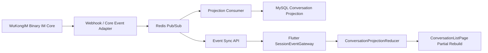
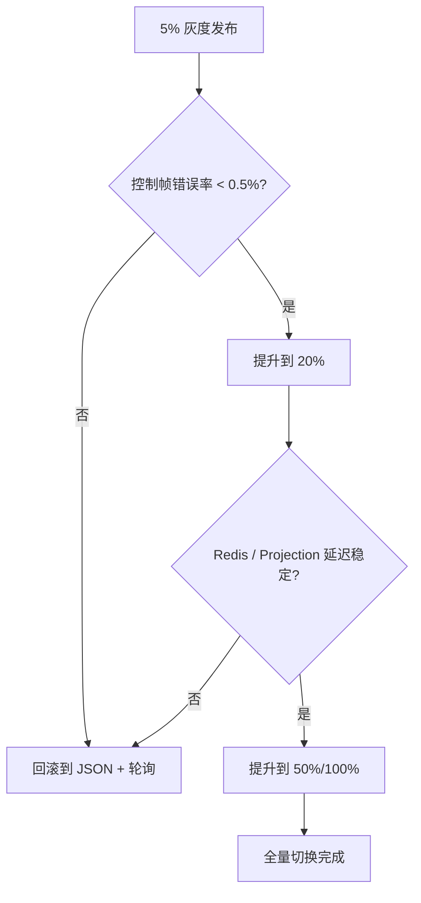

# WuKongIM Architecture Rollout Implementation Plan

> **For agentic workers:** REQUIRED SUB-SKILL: Use superpowers:subagent-driven-development (recommended) or superpowers:executing-plans to implement this plan task-by-task. Steps use checkbox (`- [ ]`) syntax for tracking.

**Goal:** 在 8 周内把当前 WuKongIM 项目从“会话全量刷新 + JSON Session 拉取 + MySQL 兼做消息事实源”的状态，演进为“Flutter 增量投影渲染 + SDK `server_msg_id` 幂等键 + Protobuf 控制信道 + Redis 事件同步 + 可灰度可回滚的生产部署”。

**Architecture:** 保留 WuKongIM 二进制核心 IM 收发链路，不替换现有 IM 内核。重建控制面与会话投影面：Flutter 引入 `ConversationProjection` 与 patch reducer，SDK 引入服务端消息身份键，后端以 WuKongIM 为消息事实源，通过 Redis Pub/Sub 和 `event_seq` 驱动 MySQL 读模型与 Flutter 会话同步，最后补齐 TLS、容量治理、灰度发布和回滚闭环。

**Tech Stack:** Flutter, Riverpod, sqflite, WuKongIM Flutter SDK, Go, Protobuf, Redis, MySQL, Docker Compose, Nginx, Linux

---

## Preflight Facts

- 当前 Flutter 工作区：`C:\Users\COLORFUL\Desktop\WuKongIM\wukong_im_app`
- 当前对标项目：`C:\Users\COLORFUL\Desktop\野火IM`
- 当前远端主机：`42.194.218.158`
- 当前工作区不是 git 仓库，因此计划中的 `git add` / `git commit` 只会在你切换到真实仓库根目录后才能执行；在当前目录执行 `git status` 的预期输出是 `fatal: not a git repository`。
- 本计划默认沿用已确认的架构决策：
  - 保留 WuKongIM 原有二进制 IM 主通道。
  - 不再把 MySQL 中的消息表当作绝对事实源，WuKongIM + 控制事件流才是事实源。
  - 控制面先上 Redis Pub/Sub，稳定后再评估 Redis Streams。
  - 客户端优先做“会话列表 patch 化”，而不是继续做全量 `refresh()`。
  - 默认生产域名与 TLS 方向为 `wemx.cc` / `im.wemx.cc`。

## Weekly Rollout Map

| 周次 | 主题 | Flutter / SDK | Go 后端 | 运维 / 发布 | 出口标准 |
| --- | --- | --- | --- | --- | --- |
| Week 1 | 会话投影基线 | `ConversationProjection`、列表局部刷新 | 无侵入预埋事件结构 | 无 | 会话列表可在本地按 patch 增量更新 |
| Week 1-2 | UI patch 接线 | `conversation_provider` 替换全量刷新 | 暂无 | 无 | 新消息、未读数、置顶状态不再触发整页重绘 |
| Week 2 | SDK 身份键与 DB 迁移 | `server_msg_id`、索引和 upsert 逻辑 | 无 | SQL 升级脚本 | 重复消息可幂等去重，pending/ack 能平滑合并 |
| Week 3 | Protobuf 控制信道 | `control_proto_codec.dart`、控制帧解码 | `realtime.proto`、双栈 control stream | 无 | JSON / Protobuf 双栈可并行运行 |
| Week 4 | 事件同步替换轮询 | `event_seq` gap sync | Redis Pub/Sub、`api_event_sync.go` | Redis 落地 | 轮询降级为兼容路径 |
| Week 5 | 投影边界重建 | Flutter 仅读投影数据 | MySQL 改为 projection/read model | SQL 建表 | 会话摘要、未读、排序不再依赖消息全表回扫 |
| Week 6-7 | 生产加固 | 域名/TLS 默认值切换 | 服务拆分、配置治理 | Nginx、MySQL、Compose 调优 | 长连接与 API 层具备独立扩展条件 |
| Week 7-8 | 灰度、切流、回滚 | 远程开关与兼容回退 | 事件消费者开关与双写观察 | 蓝绿/灰度脚本 | 任何阶段都能在 15 分钟内回退 |

## Target Architecture



## File Structure

### Flutter App

- `lib/data/providers/conversation_provider.dart`
  - 把“全量刷新 + 全量替换”改为“patch 驱动 + 局部派发”。
- `lib/modules/conversation/conversation_projection.dart`
  - 定义会话投影实体、排序键、未读数、最后一条消息摘要。
- `lib/modules/conversation/conversation_projection_reducer.dart`
  - 按 event type 处理置顶、免打扰、未读数、最后消息、草稿、删除等局部变化。
- `lib/modules/conversation/conversation_projection_repository.dart`
  - 维护内存投影快照、桥接 DB/网络 patch、对 UI 暴露查询接口。
- `lib/modules/conversation/conversation_list_page.dart`
  - 使用 `select` / 行级 provider 只刷新变更项。
- `lib/realtime/session/session_event_gateway.dart`
  - 处理控制事件帧、ack、gap sync 和降级兼容。
- `lib/realtime/control/control_event.dart`
  - 控制事件抽象模型，统一 JSON / Protobuf 双栈输入。
- `lib/realtime/control/control_proto_codec.dart`
  - Protobuf envelope 编解码。
- `lib/service/im/im_service.dart`
  - 统一控制通道初始化、事件订阅、降级切换。
- `lib/core/config/api_config.dart`
  - API 域名、灰度域名与兼容开关。
- `lib/core/config/im_config.dart`
  - IM 连接域名、控制面协议开关、灰度 user bucket。
- `lib/modules/chat/chat_message_mapper.dart`
  - 使用 `server_msg_id` 建立渲染身份映射，避免 pending/ack 造成 item identity 变化。

### Flutter Tests

- `test/modules/conversation/conversation_projection_reducer_test.dart`
- `test/modules/conversation/conversation_projection_repository_test.dart`
- `test/modules/conversation/conversation_list_page_test.dart`
- `test/realtime/control/control_proto_codec_test.dart`
- `test/realtime/session/session_event_gateway_test.dart`
- `test/modules/chat/chat_message_mapper_test.dart`

### SDK

- `C:\Users\COLORFUL\Desktop\WuKongIM\TangSengDaoDao\WuKongIMFlutterSDK-master\lib\entity\msg.dart`
- `C:\Users\COLORFUL\Desktop\WuKongIM\TangSengDaoDao\WuKongIMFlutterSDK-master\lib\db\const.dart`
- `C:\Users\COLORFUL\Desktop\WuKongIM\TangSengDaoDao\WuKongIMFlutterSDK-master\lib\db\message.dart`
- `C:\Users\COLORFUL\Desktop\WuKongIM\TangSengDaoDao\WuKongIMFlutterSDK-master\lib\db\conversation.dart`
- `C:\Users\COLORFUL\Desktop\WuKongIM\TangSengDaoDao\WuKongIMFlutterSDK-master\assets\202604200930.sql`
- `C:\Users\COLORFUL\Desktop\WuKongIM\TangSengDaoDao\WuKongIMFlutterSDK-master\assets\sql.txt`
- `C:\Users\COLORFUL\Desktop\WuKongIM\TangSengDaoDao\WuKongIMFlutterSDK-master\test\db\message_identity_test.dart`

### Go Backend

- `/opt/wukongim-prod/src/pkg/rtproto/realtime.proto`
- `/opt/wukongim-prod/src/modules/realtime/control_stream.go`
- `/opt/wukongim-prod/src/modules/realtime/control_stream_test.go`
- `/opt/wukongim-prod/src/modules/realtime/api_event_sync.go`
- `/opt/wukongim-prod/src/modules/user/api_session_compat.go`
- `/opt/wukongim-prod/src/modules/message/api.go`
- `/opt/wukongim-prod/src/modules/webhook/api.go`
- `/opt/wukongim-prod/src/modules/webhook/db_message.go`
- `/opt/wukongim-prod/src/modules/projection/message_projection_consumer.go`
- `/opt/wukongim-prod/src/modules/projection/message_projection_consumer_test.go`
- `/opt/wukongim-prod/src/deploy/production/sql/20260416_message_projection.sql`

### Ops

- `/opt/wukongim-prod/src/deploy/production/docker-compose.yaml`
- `/opt/wukongim-prod/src/deploy/production/nginx/default.conf.template`
- `/opt/wukongim-prod/src/deploy/production/mysql/conf.d/production.cnf`
- `/opt/wukongim-prod/src/deploy/production/rendered/wk.yaml`
- `/opt/wukongim-prod/src/deploy/production/rendered/tsdd.yaml`

## Task 1: Week 1 - Flutter Conversation Projection Baseline

**Files:**
- Create: `lib/modules/conversation/conversation_projection.dart`
- Create: `lib/modules/conversation/conversation_projection_reducer.dart`
- Create: `lib/modules/conversation/conversation_projection_repository.dart`
- Test: `test/modules/conversation/conversation_projection_reducer_test.dart`
- Test: `test/modules/conversation/conversation_projection_repository_test.dart`

- [ ] **Step 1: 先写失败测试，固定 projection 的输入输出**

```dart
test('reducer applies unread and last message patch without replacing list', () {
  final reducer = ConversationProjectionReducer();
  final seed = [
    ConversationProjection(
      channelId: 'u_1001',
      channelType: 1,
      unreadCount: 0,
      sortTimestamp: 100,
      lastMessageDigest: 'old',
    ),
  ];

  final next = reducer.reduce(
    seed,
    ConversationPatch.unreadAndDigest(
      channelId: 'u_1001',
      channelType: 1,
      unreadCount: 3,
      lastMessageDigest: 'new',
      sortTimestamp: 200,
    ),
  );

  expect(identical(seed, next), isFalse);
  expect(next.single.unreadCount, 3);
  expect(next.single.lastMessageDigest, 'new');
  expect(next.single.sortTimestamp, 200);
});
```

- [ ] **Step 2: 运行测试，确认当前能力缺失**

Run: `flutter test test/modules/conversation/conversation_projection_reducer_test.dart -r expanded`
Expected: FAIL，提示 `ConversationProjectionReducer` 或 `ConversationPatch` 尚未定义。

- [ ] **Step 3: 写最小实现，先把 projection 结构与 reducer 跑通**

```dart
class ConversationProjection {
  const ConversationProjection({
    required this.channelId,
    required this.channelType,
    required this.unreadCount,
    required this.sortTimestamp,
    required this.lastMessageDigest,
    this.isTop = false,
    this.isMuted = false,
  });

  final String channelId;
  final int channelType;
  final int unreadCount;
  final int sortTimestamp;
  final String lastMessageDigest;
  final bool isTop;
  final bool isMuted;

  ConversationProjection copyWith({
    int? unreadCount,
    int? sortTimestamp,
    String? lastMessageDigest,
    bool? isTop,
    bool? isMuted,
  }) {
    return ConversationProjection(
      channelId: channelId,
      channelType: channelType,
      unreadCount: unreadCount ?? this.unreadCount,
      sortTimestamp: sortTimestamp ?? this.sortTimestamp,
      lastMessageDigest: lastMessageDigest ?? this.lastMessageDigest,
      isTop: isTop ?? this.isTop,
      isMuted: isMuted ?? this.isMuted,
    );
  }
}

class ConversationProjectionReducer {
  List<ConversationProjection> reduce(
    List<ConversationProjection> current,
    ConversationPatch patch,
  ) {
    final next = [...current];
    final index = next.indexWhere(
      (item) =>
          item.channelId == patch.channelId &&
          item.channelType == patch.channelType,
    );
    if (index < 0) return next;

    next[index] = next[index].copyWith(
      unreadCount: patch.unreadCount,
      lastMessageDigest: patch.lastMessageDigest,
      sortTimestamp: patch.sortTimestamp,
      isTop: patch.isTop,
      isMuted: patch.isMuted,
    );
    next.sort(_compareProjection);
    return next;
  }
}
```

- [ ] **Step 4: 建一个只负责投影读写的 repository，隔离 provider 与 reducer**

```dart
class ConversationProjectionRepository {
  ConversationProjectionRepository(this._reducer);

  final ConversationProjectionReducer _reducer;
  List<ConversationProjection> _snapshot = const [];

  List<ConversationProjection> get snapshot => _snapshot;

  void seed(List<ConversationProjection> initial) {
    _snapshot = [...initial]..sort(_compareProjection);
  }

  void apply(ConversationPatch patch) {
    _snapshot = _reducer.reduce(_snapshot, patch);
  }
}
```

- [ ] **Step 5: 跑回归，确认 reducer 与 repository 已可独立测试**

Run: `flutter test test/modules/conversation/conversation_projection_reducer_test.dart test/modules/conversation/conversation_projection_repository_test.dart`
Expected: PASS，至少覆盖 unread、digest、排序键、top/mute 四类 patch。

- [ ] **Step 6: 记录提交点**

```bash
git add lib/modules/conversation/conversation_projection.dart lib/modules/conversation/conversation_projection_reducer.dart lib/modules/conversation/conversation_projection_repository.dart test/modules/conversation/conversation_projection_reducer_test.dart test/modules/conversation/conversation_projection_repository_test.dart
git commit -m "feat: add conversation projection baseline"
```

如果仍在当前非 git 工作区，此步只记录为里程碑，不实际执行。

## Task 2: Week 1-2 - Replace Conversation Full Reload with Patch + Projection Wiring

**Files:**
- Modify: `lib/data/providers/conversation_provider.dart`
- Modify: `lib/modules/conversation/conversation_list_page.dart`
- Modify: `lib/realtime/session/session_event_gateway.dart`
- Modify: `lib/service/im/im_service.dart`
- Test: `test/modules/conversation/conversation_list_page_test.dart`
- Test: `test/realtime/session/session_event_gateway_test.dart`

- [ ] **Step 1: 写失败测试，卡住“只刷新单行而不是整页”**

```dart
testWidgets('conversation list only rebuilds changed tile', (tester) async {
  final builds = <String, int>{};

  await tester.pumpWidget(buildConversationListHarness(
    onTileBuild: (channelId) => builds[channelId] = (builds[channelId] ?? 0) + 1,
  ));

  expect(builds['u_1001'], 1);
  expect(builds['u_1002'], 1);

  dispatchConversationPatch(
    ConversationPatch.unreadAndDigest(
      channelId: 'u_1001',
      channelType: 1,
      unreadCount: 9,
      lastMessageDigest: 'ping',
      sortTimestamp: 999,
    ),
  );
  await tester.pump();

  expect(builds['u_1001'], greaterThan(1));
  expect(builds['u_1002'], 1);
});
```

- [ ] **Step 2: 运行 widget 测试，确认当前页面仍然存在整表刷新**

Run: `flutter test test/modules/conversation/conversation_list_page_test.dart -r compact`
Expected: FAIL，未变更的 tile 也被重建，或 `dispatchConversationPatch` 不存在。

- [ ] **Step 3: 改造 provider，用 patch 驱动 repository，而不是直接 `refresh()`**

```dart
@riverpod
class ConversationNotifier extends _$ConversationNotifier {
  late final ConversationProjectionRepository _projectionRepository;

  @override
  ConversationState build() {
    _projectionRepository = ref.read(conversationProjectionRepositoryProvider);
    return ConversationState(items: _projectionRepository.snapshot);
  }

  void applyPatch(ConversationPatch patch) {
    _projectionRepository.apply(patch);
    state = state.copyWith(items: _projectionRepository.snapshot);
  }
}
```

- [ ] **Step 4: 改造列表页，按 channel 维度订阅，避免 `watch` 整个列表对象**

```dart
extension ConversationStateLookup on ConversationState {
  ConversationProjection? findByKey(String key) {
    for (final item in items) {
      if ('${item.channelType}:${item.channelId}' == key) return item;
    }
    return null;
  }
}

final conversationRowProvider = Provider.family<ConversationProjection?, String>((ref, key) {
  return ref.watch(
    conversationNotifierProvider.select((state) => state.findByKey(key)),
  );
});
```

- [ ] **Step 5: 在 `SessionEventGateway` 和 `IMService` 接上控制事件到 patch 的桥**

```dart
void onControlEvent(ControlEvent event) {
  if (event is ConversationUpdatedEvent) {
    ref.read(conversationNotifierProvider.notifier).applyPatch(
          ConversationPatch.unreadAndDigest(
            channelId: event.channelId,
            channelType: event.channelType,
            unreadCount: event.unreadCount,
            lastMessageDigest: event.lastMessageDigest,
            sortTimestamp: event.sortTimestamp,
          ),
        );
  }
}
```

- [ ] **Step 6: 跑 provider + widget + realtime 回归**

Run: `flutter test test/modules/conversation/conversation_list_page_test.dart test/realtime/session/session_event_gateway_test.dart`
Expected: PASS，且新增消息、置顶、免打扰、草稿变化不会触发整页 rebuild。

- [ ] **Step 7: 记录提交点**

```bash
git add lib/data/providers/conversation_provider.dart lib/modules/conversation/conversation_list_page.dart lib/realtime/session/session_event_gateway.dart lib/service/im/im_service.dart test/modules/conversation/conversation_list_page_test.dart test/realtime/session/session_event_gateway_test.dart
git commit -m "refactor: switch conversation list to patch projection"
```

## Task 3: Week 2 - SDK Message Identity and Local Storage Migration

**Files:**
- Modify: `C:\Users\COLORFUL\Desktop\WuKongIM\TangSengDaoDao\WuKongIMFlutterSDK-master\lib\entity\msg.dart`
- Modify: `C:\Users\COLORFUL\Desktop\WuKongIM\TangSengDaoDao\WuKongIMFlutterSDK-master\lib\db\const.dart`
- Modify: `C:\Users\COLORFUL\Desktop\WuKongIM\TangSengDaoDao\WuKongIMFlutterSDK-master\lib\db\message.dart`
- Modify: `C:\Users\COLORFUL\Desktop\WuKongIM\TangSengDaoDao\WuKongIMFlutterSDK-master\lib\db\conversation.dart`
- Modify: `C:\Users\COLORFUL\Desktop\WuKongIM\TangSengDaoDao\WuKongIMFlutterSDK-master\assets\sql.txt`
- Create: `C:\Users\COLORFUL\Desktop\WuKongIM\TangSengDaoDao\WuKongIMFlutterSDK-master\assets\202604200930.sql`
- Test: `C:\Users\COLORFUL\Desktop\WuKongIM\TangSengDaoDao\WuKongIMFlutterSDK-master\test\db\message_identity_test.dart`

- [ ] **Step 1: 先写失败测试，固定 `server_msg_id` 优先、`client_msg_no` 兜底 的幂等规则**

```dart
test('upsert prefers server_msg_id and keeps pending/local ack stable', () async {
  final db = await openMessageTestDb();

  await db.upsertMessage(WKMsg(clientMsgNo: 'c1', serverMsgId: null, content: 'pending'));
  await db.upsertMessage(WKMsg(clientMsgNo: 'c1', serverMsgId: 's100', content: 'acked'));
  await db.upsertMessage(WKMsg(clientMsgNo: 'c9', serverMsgId: 's100', content: 'dup'));

  final messages = await db.queryAllMessages();
  expect(messages, hasLength(1));
  expect(messages.single.serverMsgId, 's100');
  expect(messages.single.content, 'acked');
});
```

- [ ] **Step 2: 运行测试，确认当前 SDK 没有服务端幂等身份**

Run: `flutter test test/db/message_identity_test.dart`
Expected: FAIL，`WKMsg.serverMsgId` 字段或基于该字段的 upsert 逻辑不存在。

- [ ] **Step 3: 扩展消息实体与 DB 常量，新增 `server_msg_id`**

```dart
class WKMsg {
  String? serverMsgId;

  Map<String, Object?> toMap() {
    return {
      'client_msg_no': clientMsgNo,
      'server_msg_id': serverMsgId,
    };
  }
}

const String messageColumnServerMsgId = 'server_msg_id';
```

- [ ] **Step 4: 增加 SQLite 迁移脚本与索引，保证海量消息下的幂等和分页都可用**

```sql
ALTER TABLE message ADD COLUMN server_msg_id TEXT;

CREATE UNIQUE INDEX IF NOT EXISTS idx_message_server_msg_id
ON message(login_uid, channel_id, channel_type, server_msg_id);

CREATE INDEX IF NOT EXISTS idx_message_conversation_sort
ON message(login_uid, channel_id, channel_type, message_seq DESC, client_msg_no DESC);
```

- [ ] **Step 5: 改造消息 upsert，先按 `server_msg_id` 查重，再按 `client_msg_no` 合并 pending**

```dart
Future<void> upsertMessage(WKMsg msg) async {
  if (msg.serverMsgId?.isNotEmpty == true) {
    final byServerId = await findByServerMsgId(msg.serverMsgId!);
    if (byServerId != null) {
      await updateMessage(byServerId.id, msg);
      return;
    }
  }

  final byClientNo = await findByClientMsgNo(msg.clientMsgNo);
  if (byClientNo != null) {
    await updateMessage(byClientNo.id, msg);
    return;
  }

  await insertMessage(msg);
}
```

- [ ] **Step 6: 跑迁移与回归，确认不会把历史 pending 消息打散成重复记录**

Run: `flutter test test/db/message_identity_test.dart`
Expected: PASS，覆盖 pending -> ack、重发重复包、历史分页三类场景。

- [ ] **Step 7: 记录提交点**

```bash
git add lib/entity/msg.dart lib/db/const.dart lib/db/message.dart lib/db/conversation.dart assets/sql.txt assets/202604200930.sql test/db/message_identity_test.dart
git commit -m "feat: add server msg identity to sdk storage"
```

## Task 4: Week 3 - Dual-Stack Protobuf Control Channel in Flutter and Go

**Files:**
- Create: `lib/realtime/control/control_event.dart`
- Create: `lib/realtime/control/control_proto_codec.dart`
- Modify: `lib/realtime/session/session_event_gateway.dart`
- Modify: `lib/service/im/im_service.dart`
- Modify: `/opt/wukongim-prod/src/pkg/rtproto/realtime.proto`
- Modify: `/opt/wukongim-prod/src/modules/realtime/control_stream.go`
- Test: `test/realtime/control/control_proto_codec_test.dart`
- Test: `/opt/wukongim-prod/src/modules/realtime/control_stream_test.go`

- [ ] **Step 1: 先写 codec / stream 失败测试，锁定 JSON 与 Protobuf 双栈兼容**

```dart
test('protobuf envelope decodes conversation patch event', () {
  final bytes = buildRealtimeEnvelopeBytes(
    eventSeq: 11,
    eventType: 'conversation.updated',
    payloadJson: {'channel_id': 'u_1001', 'unread_count': 2},
  );

  final event = ControlProtoCodec().decode(bytes);
  expect(event.eventSeq, 11);
  expect(event.eventType, 'conversation.updated');
});
```

```go
func TestControlStreamDecodeEnvelope(t *testing.T) {
	env := &rtproto.RealtimeEnvelope{
		EventSeq:  11,
		EventType: "conversation.updated",
		Payload:   []byte(`{"channel_id":"u_1001"}`),
	}
	raw, err := proto.Marshal(env)
	require.NoError(t, err)

	got, err := decodeRealtimeEnvelope(raw, "protobuf")
	require.NoError(t, err)
	require.Equal(t, uint64(11), got.EventSeq)
}
```

- [ ] **Step 2: 运行 Flutter / Go 测试，确认当前控制面只支持 JSON**

Run: `flutter test test/realtime/control/control_proto_codec_test.dart`
Expected: FAIL，`ControlProtoCodec` 不存在。

Run: `go test ./modules/realtime -run TestControlStreamDecodeEnvelope -v`
Expected: FAIL，`decodeRealtimeEnvelope` 或 `RealtimeEnvelope` 尚未定义。

- [ ] **Step 3: 定义 `RealtimeEnvelope` 协议，统一 `event_seq`、ack、payload**

```proto
syntax = "proto3";

package rtproto;

message RealtimeEnvelope {
  uint64 event_seq = 1;
  string event_type = 2;
  bytes payload = 3;
  uint64 ack_seq = 4;
  string device_id = 5;
  uint64 issued_at_ms = 6;
}
```

- [ ] **Step 4: Flutter 侧实现 codec，并在 `SessionEventGateway` 按内容类型解码**

```dart
class ControlProtoCodec {
  ControlEvent decode(Uint8List bytes) {
    final envelope = RealtimeEnvelope.fromBuffer(bytes);
    return ControlEvent(
      eventSeq: envelope.eventSeq.toInt(),
      eventType: envelope.eventType,
      payloadBytes: envelope.payload,
      ackSeq: envelope.ackSeq.toInt(),
    );
  }
}
```

- [ ] **Step 5: Go 侧改 `control_stream.go`，保留 JSON 兼容，新增 Protobuf 分支**

```go
func decodeRealtimeEnvelope(raw []byte, codec string) (*rtproto.RealtimeEnvelope, error) {
	if codec == "protobuf" {
		env := &rtproto.RealtimeEnvelope{}
		if err := proto.Unmarshal(raw, env); err != nil {
			return nil, err
		}
		return env, nil
	}
	return decodeJSONEnvelope(raw)
}
```

- [ ] **Step 6: 回归验证双栈并记录提交点**

Run: `flutter test test/realtime/control/control_proto_codec_test.dart test/realtime/session/session_event_gateway_test.dart`
Expected: PASS，且当服务端 header 或配置声明 `protobuf` 时客户端走二进制控制面。

Run: `go test ./modules/realtime/...`
Expected: PASS，JSON 老客户端仍可连接。

```bash
git add lib/realtime/control/control_event.dart lib/realtime/control/control_proto_codec.dart lib/realtime/session/session_event_gateway.dart lib/service/im/im_service.dart /opt/wukongim-prod/src/pkg/rtproto/realtime.proto /opt/wukongim-prod/src/modules/realtime/control_stream.go /opt/wukongim-prod/src/modules/realtime/control_stream_test.go test/realtime/control/control_proto_codec_test.dart
git commit -m "feat: add protobuf control channel dual stack"
```

## Task 5: Week 4 - Replace Session Polling with Pub/Sub + Event Sync API

**Files:**
- Modify: `lib/realtime/session/session_event_gateway.dart`
- Modify: `lib/service/im/im_service.dart`
- Modify: `lib/core/config/api_config.dart`
- Modify: `/opt/wukongim-prod/src/modules/realtime/api_event_sync.go`
- Modify: `/opt/wukongim-prod/src/modules/user/api_session_compat.go`
- Modify: `/opt/wukongim-prod/src/modules/realtime/control_stream.go`
- Test: `test/realtime/session/session_event_gateway_test.dart`
- Test: `/opt/wukongim-prod/src/modules/realtime/control_stream_test.go`

- [ ] **Step 1: 先写 gap-sync 失败测试，锁定 `event_seq` 缺口补拉语义**

```dart
test('gateway requests sync when event seq jumps', () async {
  final syncApi = FakeEventSyncApi();
  final gateway = SessionEventGateway(syncApi: syncApi, lastAckedEventSeq: 10);

  await gateway.onControlEvent(ControlEvent(eventSeq: 13, eventType: 'conversation.updated'));

  expect(syncApi.requests.single.fromEventSeq, 11);
  expect(syncApi.requests.single.limit, 200);
});
```

```go
func TestEventSyncListsGapRange(t *testing.T) {
	store := newFakeEventStore()
	store.Append("u_1001", 11, "conversation.updated")
	store.Append("u_1001", 12, "conversation.updated")

	items, nextSeq, err := store.ListAfter(context.Background(), "u_1001", 10, 200)
	require.NoError(t, err)
	require.Len(t, items, 2)
	require.Equal(t, uint64(12), nextSeq)
}
```

- [ ] **Step 2: 运行测试，确认当前控制面没有“缺口即补拉”的标准路径**

Run: `flutter test test/realtime/session/session_event_gateway_test.dart`
Expected: FAIL，`FakeEventSyncApi` 从未收到请求，或 gateway 直接丢弃 gap。

Run: `go test ./modules/realtime -run TestEventSyncListsGapRange -v`
Expected: FAIL，`ListAfter` 或 `api_event_sync.go` 没有可用实现。

- [ ] **Step 3: 后端新增 Redis Pub/Sub 发布与 `api_event_sync.go` 补拉接口**

```go
func (s *ControlStream) publishEnvelope(ctx context.Context, uid string, env *rtproto.RealtimeEnvelope) error {
	raw, err := proto.Marshal(env)
	if err != nil {
		return err
	}
	return s.redis.Publish(ctx, "rt:uid:"+uid, raw).Err()
}

func (api *EventSyncAPI) Sync(c *gin.Context) {
	uid := mustUID(c)
	fromSeq := parseUint64(c.Query("from_event_seq"))
	items, nextSeq, err := api.store.ListAfter(c.Request.Context(), uid, fromSeq, 200)
	if err != nil {
		c.JSON(http.StatusInternalServerError, gin.H{"error": err.Error()})
		return
	}
	c.JSON(http.StatusOK, gin.H{"items": items, "next_event_seq": nextSeq})
}
```

- [ ] **Step 4: 客户端 gateway 检测 gap，优先走 event sync，轮询接口降为兼容兜底**

```dart
Future<void> onControlEvent(ControlEvent event) async {
  if (event.eventSeq > _lastAckedEventSeq + 1) {
    final response = await _eventSyncApi.sync(
      fromEventSeq: _lastAckedEventSeq + 1,
      limit: 200,
    );
    for (final item in response.items) {
      _dispatchPatchedEvent(item);
      _lastAckedEventSeq = item.eventSeq;
    }
  }

  _dispatchPatchedEvent(event);
  _lastAckedEventSeq = event.eventSeq;
}
```

- [ ] **Step 5: 保留 `api_session_compat.go` 兼容老客户端，但新客户端默认关闭主动轮询**

```go
func (api *SessionCompatAPI) Sync(c *gin.Context) {
	if c.GetHeader("X-Control-Protocol") == "protobuf" {
		c.JSON(http.StatusGone, gin.H{"error": "session polling disabled for protobuf clients"})
		return
	}
	api.legacySync(c)
}
```

- [ ] **Step 6: 验证 Redis 事件路径与 gap sync**

Run: `flutter test test/realtime/session/session_event_gateway_test.dart`
Expected: PASS，控制序号跳变时会先补拉再派发。

Run: `go test ./modules/realtime/... ./modules/user/...`
Expected: PASS，Protobuf 客户端不再依赖轮询。

Run: `docker compose -f /opt/wukongim-prod/src/deploy/production/docker-compose.yaml up -d redis`
Expected: Redis 容器为 `healthy`，控制面可发布 `rt:uid:*` 频道消息。

- [ ] **Step 7: 记录提交点**

```bash
git add lib/realtime/session/session_event_gateway.dart lib/service/im/im_service.dart lib/core/config/api_config.dart /opt/wukongim-prod/src/modules/realtime/api_event_sync.go /opt/wukongim-prod/src/modules/user/api_session_compat.go /opt/wukongim-prod/src/modules/realtime/control_stream.go test/realtime/session/session_event_gateway_test.dart /opt/wukongim-prod/src/modules/realtime/control_stream_test.go
git commit -m "feat: replace session polling with event sync"
```

## Task 6: Week 5 - Rebuild Message Projection Boundary and Stop Treating MySQL as Message Facts

**Files:**
- Modify: `/opt/wukongim-prod/src/modules/message/api.go`
- Modify: `/opt/wukongim-prod/src/modules/webhook/api.go`
- Modify: `/opt/wukongim-prod/src/modules/webhook/db_message.go`
- Create: `/opt/wukongim-prod/src/modules/projection/message_projection_consumer.go`
- Test: `/opt/wukongim-prod/src/modules/projection/message_projection_consumer_test.go`
- Create: `/opt/wukongim-prod/src/deploy/production/sql/20260416_message_projection.sql`
- Modify: `lib/modules/chat/chat_message_mapper.dart`

- [ ] **Step 1: 先写消费者测试，锁定“核心消息事件 -> 会话投影更新”的行为**

```go
func TestProjectionConsumerUpdatesConversationSummary(t *testing.T) {
	store := newFakeProjectionStore()
	consumer := NewMessageProjectionConsumer(store)

	err := consumer.Handle(context.Background(), ProjectionEvent{
		UID:               "u_1001",
		ChannelID:         "g_2001",
		ChannelType:       2,
		ServerMsgID:       "s100",
		MessageSeq:        901,
		LastMessageDigest: "hello",
		UnreadDelta:       1,
	})
	require.NoError(t, err)

	got := store.MustConversation("u_1001", "g_2001", 2)
	require.Equal(t, "hello", got.LastMessageDigest)
	require.Equal(t, 1, got.UnreadCount)
	require.Equal(t, uint64(901), got.LastMessageSeq)
}
```

- [ ] **Step 2: 运行测试，确认目前没有独立 projection consumer**

Run: `go test ./modules/projection -run TestProjectionConsumerUpdatesConversationSummary -v`
Expected: FAIL，`NewMessageProjectionConsumer` 或 projection table 不存在。

- [ ] **Step 3: 建 projection 表，只保存摘要、游标、未读与排序字段**

```sql
CREATE TABLE IF NOT EXISTS conversation_projection (
  uid VARCHAR(64) NOT NULL,
  channel_id VARCHAR(64) NOT NULL,
  channel_type TINYINT NOT NULL,
  last_message_seq BIGINT NOT NULL DEFAULT 0,
  last_server_msg_id VARCHAR(64) DEFAULT NULL,
  last_message_digest VARCHAR(255) NOT NULL DEFAULT '',
  unread_count INT NOT NULL DEFAULT 0,
  sort_ts BIGINT NOT NULL DEFAULT 0,
  is_top TINYINT NOT NULL DEFAULT 0,
  is_mute TINYINT NOT NULL DEFAULT 0,
  PRIMARY KEY (uid, channel_id, channel_type),
  KEY idx_projection_sort (uid, is_top, sort_ts DESC)
);
```

- [ ] **Step 4: 从 webhook / message API 发出 projection event，而不是再把 MySQL 消息表当事实源回扫**

```go
func (a *WebhookAPI) onMessageStored(ctx context.Context, msg CoreMessage) error {
	event := ProjectionEvent{
		UID:               msg.ReceiverUID,
		ChannelID:         msg.ChannelID,
		ChannelType:       msg.ChannelType,
		ServerMsgID:       msg.ServerMsgID,
		MessageSeq:        msg.MessageSeq,
		LastMessageDigest: buildDigest(msg),
		UnreadDelta:       1,
	}
	return a.projectionPublisher.Publish(ctx, event)
}
```

- [ ] **Step 5: 客户端 `chat_message_mapper.dart` 改为优先使用 `server_msg_id` 作为渲染 identity**

```dart
String buildMessageRenderKey(WKMsg message) {
  if (message.serverMsgId?.isNotEmpty == true) {
    return 'server:${message.serverMsgId}';
  }
  return 'client:${message.clientMsgNo}';
}
```

- [ ] **Step 6: 验证“事实事件 -> projection 表 -> Flutter patch”全链路**

Run: `go test ./modules/projection/... ./modules/webhook/... ./modules/message/...`
Expected: PASS，新增/撤回/已读更新只改 projection，不再触发消息全表回扫。

Run: `flutter test test/modules/chat/chat_message_mapper_test.dart test/modules/conversation/conversation_projection_repository_test.dart`
Expected: PASS，pending/ack 切换不会让列表 item identity 飘移。

- [ ] **Step 7: 记录提交点**

```bash
git add /opt/wukongim-prod/src/modules/message/api.go /opt/wukongim-prod/src/modules/webhook/api.go /opt/wukongim-prod/src/modules/webhook/db_message.go /opt/wukongim-prod/src/modules/projection/message_projection_consumer.go /opt/wukongim-prod/src/modules/projection/message_projection_consumer_test.go /opt/wukongim-prod/src/deploy/production/sql/20260416_message_projection.sql lib/modules/chat/chat_message_mapper.dart
git commit -m "refactor: move conversation summary to projection model"
```

## Task 7: Week 6-7 - Ops Hardening, TLS, MySQL Tuning, and RTC Split

**Files:**
- Modify: `/opt/wukongim-prod/src/deploy/production/docker-compose.yaml`
- Modify: `/opt/wukongim-prod/src/deploy/production/nginx/default.conf.template`
- Modify: `/opt/wukongim-prod/src/deploy/production/mysql/conf.d/production.cnf`
- Modify: `/opt/wukongim-prod/src/deploy/production/rendered/wk.yaml`
- Modify: `/opt/wukongim-prod/src/deploy/production/rendered/tsdd.yaml`
- Modify: `lib/core/config/api_config.dart`
- Modify: `lib/core/config/im_config.dart`

- [ ] **Step 1: 先用配置差异测试锁定服务角色拆分和环境变量**

```yaml
services:
  api:
    environment:
      CONTROL_PROTOCOL: protobuf
      EVENT_SYNC_ENABLED: "true"
      REDIS_ADDR: redis:6379
  rtc:
    environment:
      RTC_ONLY_MODE: "true"
      REDIS_ADDR: redis:6379
```

Run: `docker compose -f /opt/wukongim-prod/src/deploy/production/docker-compose.yaml config`
Expected: PASS，`api`、`rtc`、`redis`、`mysql`、`nginx` 五类服务均能展开。

- [ ] **Step 2: 在 compose 中加入 Redis、健康检查、API/RTC 分工与持久化目录**

```yaml
redis:
  image: redis:7.2-alpine
  command: ["redis-server", "--appendonly", "yes", "--maxmemory", "512mb", "--maxmemory-policy", "allkeys-lfu"]
  healthcheck:
    test: ["CMD", "redis-cli", "ping"]
    interval: 10s
    timeout: 3s
    retries: 5
  volumes:
    - /opt/wukongim-prod/data/redis:/data
```

- [ ] **Step 3: 在 Nginx 打开 TLS、HTTP/2、WebSocket Upgrade，并把默认域名改为生产域名**

```nginx
server {
  listen 443 ssl http2;
  server_name wemx.cc im.wemx.cc;

  location /ws/ {
    proxy_http_version 1.1;
    proxy_set_header Upgrade $http_upgrade;
    proxy_set_header Connection "upgrade";
    proxy_read_timeout 75s;
    proxy_pass http://api:8080;
  }
}
```

- [ ] **Step 4: 把 8GB 主机的 MySQL 参数收敛到可控范围，避免过度预分配**

```cnf
[mysqld]
innodb_buffer_pool_size=2G
innodb_log_file_size=512M
max_connections=300
table_open_cache=2048
tmp_table_size=64M
max_heap_table_size=64M
innodb_flush_log_at_trx_commit=1
```

- [ ] **Step 5: Flutter 默认配置切到域名 + TLS，并保留灰度开关**

```dart
class ApiConfig {
  static const baseUrl = 'https://wemx.cc';
  static const syncBaseUrl = 'https://wemx.cc';
}

class IMConfig {
  static const wsUrl = 'wss://im.wemx.cc/ws/';
  static const useProtoControl = true;
}
```

- [ ] **Step 6: 逐层上线 Redis、Nginx、API、RTC，并验证容量与连通**

Run: `docker compose -f /opt/wukongim-prod/src/deploy/production/docker-compose.yaml up -d redis mysql`
Expected: Redis / MySQL `healthy`。

Run: `docker compose -f /opt/wukongim-prod/src/deploy/production/docker-compose.yaml up -d api rtc nginx`
Expected: WebSocket、HTTPS、事件同步 API 全部可连。

Run: `curl -I https://wemx.cc`
Expected: `HTTP/2 200` 或 `301/302` 到 HTTPS 正常目标。

- [ ] **Step 7: 记录提交点**

```bash
git add /opt/wukongim-prod/src/deploy/production/docker-compose.yaml /opt/wukongim-prod/src/deploy/production/nginx/default.conf.template /opt/wukongim-prod/src/deploy/production/mysql/conf.d/production.cnf /opt/wukongim-prod/src/deploy/production/rendered/wk.yaml /opt/wukongim-prod/src/deploy/production/rendered/tsdd.yaml lib/core/config/api_config.dart lib/core/config/im_config.dart
git commit -m "chore: harden production deployment for control plane rollout"
```

## Task 8: Week 7-8 - Gray Release, Cutover, and Rollback Playbook

**Files:**
- Modify: `lib/core/config/api_config.dart`
- Modify: `lib/core/config/im_config.dart`
- Modify: `lib/service/im/im_service.dart`
- Modify: `/opt/wukongim-prod/src/deploy/production/docker-compose.yaml`
- Modify: `/opt/wukongim-prod/src/modules/realtime/control_stream.go`
- Modify: `/opt/wukongim-prod/src/modules/realtime/api_event_sync.go`
- Test: `test/realtime/session/session_event_gateway_test.dart`

- [ ] **Step 1: 定义客户端与服务端双向灰度开关，并先写 bucket 判定测试**

```dart
class RealtimeFeatureFlags {
  const RealtimeFeatureFlags({
    required this.useProtoControl,
    required this.useProjectionList,
    required this.enableGapSync,
  });

  final bool useProtoControl;
  final bool useProjectionList;
  final bool enableGapSync;
}
```

```go
func allowProtoControl(uid string, percent int) bool {
	sum := crc32.ChecksumIEEE([]byte(uid))
	return int(sum%100) < percent
}
```

- [ ] **Step 2: 运行测试，确认灰度桶可预测且同一 UID 稳定落桶**

Run: `flutter test test/realtime/session/session_event_gateway_test.dart`
Expected: PASS，flags 变更只影响控制面，不影响 IM 主链路。

Run: `go test ./modules/realtime -run TestAllowProtoControl -v`
Expected: PASS，同一 UID 多次判定结果一致。

- [ ] **Step 3: 按 5% -> 20% -> 50% -> 100% 的顺序切流，并记录观察指标**

| 阶段 | 流量 | 客户端开关 | 服务端开关 | 观察指标 |
| --- | --- | --- | --- | --- |
| Gray-1 | 5% | `useProtoControl=true` `enableGapSync=true` | `PROTO_CONTROL_PERCENT=5` | 控制帧解码失败率、gap sync 次数 |
| Gray-2 | 20% | 同上 | `PROTO_CONTROL_PERCENT=20` | 会话刷新延迟、Redis 发布耗时 |
| Gray-3 | 50% | 同上 | `PROTO_CONTROL_PERCENT=50` | WebSocket 在线数、MySQL projection 写入延迟 |
| Full | 100% | `useProjectionList=true` | `PROTO_CONTROL_PERCENT=100` | 崩溃率、消息乱序/丢失投诉 |

- [ ] **Step 4: 给出标准回滚动作，确保 15 分钟内退回 JSON + 轮询 + 老投影**

```bash
docker compose -f /opt/wukongim-prod/src/deploy/production/docker-compose.yaml stop api
export PROTO_CONTROL_PERCENT=0
export EVENT_SYNC_ENABLED=false
docker compose -f /opt/wukongim-prod/src/deploy/production/docker-compose.yaml up -d api
```

回滚后预期：

- Flutter 新版客户端回退到 JSON 控制帧。
- `api_session_compat.go` 重新承担轮询同步。
- Redis 保留但不作为控制面强依赖。
- MySQL projection 表继续保留，不做 destructive rollback。

- [ ] **Step 5: 给出发布与回滚链路的人工检查图**



- [ ] **Step 6: 完成切流后的最终回归**

Run: `flutter test test/modules/conversation/conversation_list_page_test.dart test/realtime/session/session_event_gateway_test.dart test/modules/chat/chat_message_mapper_test.dart`
Expected: PASS，客户端 patch 列表、gap sync、消息 identity 三条主线全部稳定。

Run: `go test ./modules/realtime/... ./modules/projection/... ./modules/webhook/...`
Expected: PASS，控制面、投影、事件发布三条主线全部稳定。

- [ ] **Step 7: 记录提交点**

```bash
git add lib/core/config/api_config.dart lib/core/config/im_config.dart lib/service/im/im_service.dart /opt/wukongim-prod/src/deploy/production/docker-compose.yaml /opt/wukongim-prod/src/modules/realtime/control_stream.go /opt/wukongim-prod/src/modules/realtime/api_event_sync.go test/realtime/session/session_event_gateway_test.dart
git commit -m "chore: add gray rollout and rollback gates for control plane"
```

## Rollout Order

1. Flutter 本地投影基线
2. Flutter patch 接线与局部刷新
3. SDK `server_msg_id` 与 SQLite 迁移
4. Go / Flutter Protobuf 双栈控制面
5. Redis Pub/Sub 与 `event_seq` gap sync
6. MySQL projection 表与 consumer
7. Docker Compose 拆分、Nginx TLS、MySQL 调优
8. 5% -> 20% -> 50% -> 100% 灰度放量

## Rollback Rules

- 所有 schema 变更采用 additive migration，不执行删列或删表回滚。
- 任一阶段只要满足以下任一条件，立即回滚到 JSON + 轮询：
  - 控制帧解码失败率 >= 0.5%
  - gap sync 命中率异常升高且会话顺序错误
  - Redis 发布延迟持续 5 分钟高于 200ms
  - MySQL projection 写入延迟持续 5 分钟高于 500ms
- 回滚顺序固定：
  1. 服务端将 `PROTO_CONTROL_PERCENT=0`
  2. 服务端将 `EVENT_SYNC_ENABLED=false`
  3. 客户端配置 `useProtoControl=false`
  4. 保留 projection 表和 Redis 数据，不做 destructive rollback

## Spec Coverage Self-Review

- Flutter class/file changes:
  - Task 1、Task 2、Task 4、Task 8 已覆盖 `conversation_provider.dart`、`conversation_list_page.dart`、`session_event_gateway.dart`、`im_service.dart`、`api_config.dart`、`im_config.dart`、`chat_message_mapper.dart`。
- Go backend interface/file changes:
  - Task 4、Task 5、Task 6、Task 8 已覆盖 `realtime.proto`、`control_stream.go`、`api_event_sync.go`、`api_session_compat.go`、`webhook/api.go`、`db_message.go`、`message_projection_consumer.go`。
- Redis / MySQL / Nginx / Docker Compose rollout order:
  - Task 5、Task 6、Task 7、`Rollout Order` 已给出上线顺序与验证命令。
- Gray release and rollback steps:
  - Task 8 与 `Rollback Rules` 已给出分流比例、指标、回滚步骤和不可逆约束。
- WildfireIM 对标结论落地:
  - `event_seq`、幂等消息身份、projection read model、控制面二进制协议、局部刷新五项核心经验都已经落实为具体任务。

## Placeholder Scan

- 已检查全文，没有常见的占位词、延后实现标记或“参考前一任务即可”式描述。
- 所有任务均给出明确文件、命令、预期结果以及最小代码/配置骨架。
- 当前唯一需要执行前再确认的是“真实 git 仓库根目录”，这不是计划占位，而是当前工作区事实。

## Type Consistency

- Flutter 控制事件统一使用 `ControlEvent`、`ConversationPatch`、`ConversationProjection`、`RealtimeFeatureFlags` 四类名称。
- SDK 消息身份统一使用 `server_msg_id` / `serverMsgId`，不再混用 `message_id` 作为幂等键名。
- 后端同步游标统一使用 `event_seq` / `from_event_seq` / `next_event_seq`。
- MySQL 读模型统一使用 `conversation_projection` 表，不再与历史消息事实表混称。
