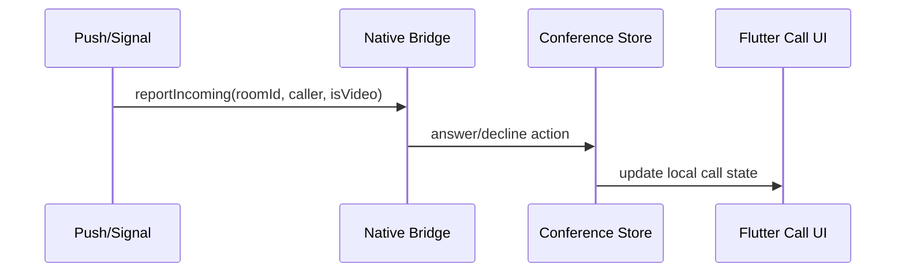

# WuKongIM AV Parity Implementation Plan

> **For agentic workers:** REQUIRED SUB-SKILL: Use superpowers:subagent-driven-development (recommended) or superpowers:executing-plans to implement this plan task-by-task. Steps use checkbox (`- [ ]`) syntax for tracking.

**Goal:** Upgrade WuKongIM audio/video from basic direct-call capability into a conference-capable, native-integrated, measurable AV subsystem that closes the biggest practical gaps with Wildfire IM.

**Architecture:** Keep the current bootstrap, realtime, and media split, but insert two missing layers: a typed AV command domain and a conference state store. Then wire UI, native call adapters, and telemetry on top of that shared state so conference moderation and system integration stop living in page-level code.

**Tech Stack:** Flutter, Dart, flutter_webrtc, livekit_client, existing WuKongIM REST/WebSocket call infrastructure, platform channels for iOS/Android system call integration.

---

## Delivery Order

Ship this work in three releases, not one:

1. **R1: Direct-call hardening**
   - typed lifecycle protocol
   - native incoming call bridge
   - stable participant state
2. **R2: Conference governance**
   - mute-all
   - apply-unmute
   - hand-up
   - focus user
   - moderator state
3. **R3: Operability**
   - telemetry
   - mismatch detection
   - rollout guardrails

## File Map

### Existing files to modify first

- Modify: `lib/modules/video_call/infrastructure/call_realtime_client.dart`
- Modify: `lib/modules/video_call/call_session_service.dart`
- Modify: `lib/modules/video_call/video_call_service.dart`
- Modify: `lib/modules/video_call/video_call_page.dart`
- Modify: `lib/modules/video_call/group_call_service.dart`
- Modify: `lib/modules/video_call/rtc_notification_bridge.dart`
- Modify: `lib/modules/video_call/call_notification.dart`

### New Flutter files to create

- Create: `lib/modules/video_call/domain/av_command.dart`
- Create: `lib/modules/video_call/domain/av_command_codec.dart`
- Create: `lib/modules/video_call/domain/conference_state.dart`
- Create: `lib/modules/video_call/domain/conference_participant.dart`
- Create: `lib/modules/video_call/conference/conference_store.dart`
- Create: `lib/modules/video_call/conference/conference_controller.dart`
- Create: `lib/modules/video_call/conference/conference_actions.dart`
- Create: `lib/modules/video_call/infrastructure/call_native_bridge.dart`
- Create: `lib/modules/video_call/infrastructure/call_native_bridge_stub.dart`
- Create: `lib/modules/video_call/infrastructure/call_native_bridge_mobile.dart`
- Create: `lib/modules/video_call/av_telemetry_service.dart`

### New test files to create

- Create: `test/modules/video_call/av_command_codec_test.dart`
- Create: `test/modules/video_call/conference_store_test.dart`
- Create: `test/modules/video_call/video_call_service_conference_test.dart`
- Create: `test/modules/video_call/call_native_bridge_test.dart`

## Task 1: Introduce a typed AV command model

**Files:**
- Create: `lib/modules/video_call/domain/av_command.dart`
- Create: `lib/modules/video_call/domain/av_command_codec.dart`
- Modify: `lib/modules/video_call/infrastructure/call_realtime_client.dart`
- Test: `test/modules/video_call/av_command_codec_test.dart`

- [ ] **Step 1: Write the failing codec test**

```dart
import 'package:flutter_test/flutter_test.dart';
import 'package:wukong_im_app/modules/video_call/domain/av_command.dart';
import 'package:wukong_im_app/modules/video_call/domain/av_command_codec.dart';

void main() {
  test('encodes mute-all-audio command with typed fields', () {
    final command = AvCommand.muteAllAudio(
      roomId: 'room-1',
      actorUid: 'owner-1',
      allowMemberUnmute: false,
    );

    final encoded = AvCommandCodec.encode(command);

    expect(encoded['kind'], 'conference.mute_all_audio');
    expect(encoded['room_id'], 'room-1');
    expect(encoded['actor_uid'], 'owner-1');
    expect(encoded['allow_member_unmute'], false);
  });
}
```

- [ ] **Step 2: Run the test to verify it fails**

Run: `flutter test test/modules/video_call/av_command_codec_test.dart`

Expected: fail because `AvCommand` and `AvCommandCodec` do not exist yet.

- [ ] **Step 3: Implement the minimal typed command model**

```dart
enum AvCommandKind {
  invite('call.invite'),
  accept('call.accept'),
  reject('call.reject'),
  bye('call.bye'),
  muteAllAudio('conference.mute_all_audio'),
  muteAllVideo('conference.mute_all_video'),
  applyUnmuteAudio('conference.apply_unmute_audio'),
  approveUnmuteAudio('conference.approve_unmute_audio'),
  handUp('conference.hand_up'),
  focusUser('conference.focus_user');

  const AvCommandKind(this.value);
  final String value;
}

class AvCommand {
  const AvCommand({
    required this.kind,
    required this.roomId,
    required this.actorUid,
    this.targetUid,
    this.boolValue,
    this.extra = const <String, Object?>{},
  });

  final AvCommandKind kind;
  final String roomId;
  final String actorUid;
  final String? targetUid;
  final bool? boolValue;
  final Map<String, Object?> extra;

  factory AvCommand.muteAllAudio({
    required String roomId,
    required String actorUid,
    required bool allowMemberUnmute,
  }) {
    return AvCommand(
      kind: AvCommandKind.muteAllAudio,
      roomId: roomId,
      actorUid: actorUid,
      boolValue: allowMemberUnmute,
    );
  }
}
```

- [ ] **Step 4: Adapt the realtime client to send and receive typed commands**

Target shape inside `call_realtime_client.dart`:

```dart
abstract interface class CallRealtimeClient {
  Stream<AvCommand> get events;
  Future<void> connect({required Uri uri, Map<String, String>? headers});
  Future<void> send(AvCommand command);
  Future<void> disconnect();
}
```

- [ ] **Step 5: Run the codec test again**

Run: `flutter test test/modules/video_call/av_command_codec_test.dart`

Expected: PASS

- [ ] **Step 6: Commit**

```bash
git add lib/modules/video_call/domain/av_command.dart lib/modules/video_call/domain/av_command_codec.dart lib/modules/video_call/infrastructure/call_realtime_client.dart test/modules/video_call/av_command_codec_test.dart
git commit -m "feat: add typed av command model"
```

## Task 2: Add a conference state store

**Files:**
- Create: `lib/modules/video_call/domain/conference_participant.dart`
- Create: `lib/modules/video_call/domain/conference_state.dart`
- Create: `lib/modules/video_call/conference/conference_store.dart`
- Create: `lib/modules/video_call/conference/conference_actions.dart`
- Modify: `lib/modules/video_call/video_call_service.dart`
- Test: `test/modules/video_call/conference_store_test.dart`

- [ ] **Step 1: Write the failing conference-state test**

```dart
import 'package:flutter_test/flutter_test.dart';
import 'package:wukong_im_app/modules/video_call/conference/conference_store.dart';

void main() {
  test('owner mute-all updates audience mode and local policy', () {
    final store = ConferenceStore.initial(roomId: 'room-1', selfUid: 'owner-1');

    store.applyMuteAllAudio(actorUid: 'owner-1', allowMemberUnmute: false);

    expect(store.state.isMuteAllAudio, true);
    expect(store.state.allowMemberUnmuteAudio, false);
    expect(store.state.audienceMode, true);
  });
}
```

- [ ] **Step 2: Run the test to verify it fails**

Run: `flutter test test/modules/video_call/conference_store_test.dart`

Expected: fail because `ConferenceStore` is missing.

- [ ] **Step 3: Implement the conference participant and room state models**

Required state fields:

- `roomId`
- `selfUid`
- `ownerUid`
- `moderatorUids`
- `participants`
- `isMuteAllAudio`
- `isMuteAllVideo`
- `allowMemberUnmuteAudio`
- `allowMemberUnmuteVideo`
- `handUpUids`
- `focusUid`
- `recording`
- `audienceMode`

- [ ] **Step 4: Route typed commands into the conference store**

Inside `video_call_service.dart`, add a translation layer like:

```dart
void _applyConferenceCommand(AvCommand command) {
  switch (command.kind) {
    case AvCommandKind.muteAllAudio:
      _conferenceStore.applyMuteAllAudio(
        actorUid: command.actorUid,
        allowMemberUnmute: command.boolValue ?? true,
      );
      break;
    case AvCommandKind.handUp:
      _conferenceStore.applyHandUp(
        targetUid: command.actorUid,
        raised: command.boolValue ?? true,
      );
      break;
    default:
      break;
  }
}
```

- [ ] **Step 5: Run the conference-store test**

Run: `flutter test test/modules/video_call/conference_store_test.dart`

Expected: PASS

- [ ] **Step 6: Commit**

```bash
git add lib/modules/video_call/domain/conference_participant.dart lib/modules/video_call/domain/conference_state.dart lib/modules/video_call/conference/conference_store.dart lib/modules/video_call/conference/conference_actions.dart lib/modules/video_call/video_call_service.dart test/modules/video_call/conference_store_test.dart
git commit -m "feat: add conference state store"
```

## Task 3: Move the UI from direct-call controls to conference controls

**Files:**
- Create: `lib/modules/video_call/conference/conference_controller.dart`
- Modify: `lib/modules/video_call/video_call_page.dart`
- Modify: `lib/modules/video_call/group_call_service.dart`
- Test: `test/modules/video_call/video_call_service_conference_test.dart`

- [ ] **Step 1: Write the failing UI-behavior test**

```dart
import 'package:flutter/material.dart';
import 'package:flutter_test/flutter_test.dart';
import 'package:wukong_im_app/modules/video_call/conference/conference_store.dart';
import 'package:wukong_im_app/modules/video_call/video_call_page.dart';

void main() {
  testWidgets('conference page shows mute-all control only for owner', (
    tester,
  ) async {
    final store = ConferenceStore.initial(roomId: 'room-1', selfUid: 'owner-1')
        .copyWithOwner(ownerUid: 'owner-1');

    await tester.pumpWidget(
      MaterialApp(
        home: VideoCallPage.conferencePreview(
          channelId: 'group-1',
          channelName: 'Conference',
          conferenceState: store.state,
        ),
      ),
    );

    expect(find.text('Mute all'), findsOneWidget);
  });
}
```

- [ ] **Step 2: Run the test to verify it fails**

Run: `flutter test test/modules/video_call/video_call_service_conference_test.dart`

Expected: FAIL because owner-aware conference UI does not exist yet.

- [ ] **Step 3: Split UI into direct-call and conference modes**

Rules:

- Keep the direct 1v1 control row compact.
- Add a conference toolbar only when participant count is greater than 2 or when room policy indicates conference mode.
- Surface these owner-only actions:
  - mute all audio
  - mute all video
  - focus user
  - approve unmute
- Surface these member actions:
  - hand up
  - apply unmute audio
  - apply unmute video

- [ ] **Step 4: Upgrade group-call creation from picker flow to conference bootstrap**

Inside `group_call_service.dart`, move beyond selection-only validation and ensure created rooms carry:

- owner UID
- invited participant list
- conference mode flag
- initial room policy

- [ ] **Step 5: Run the conference UI test**

Run: `flutter test test/modules/video_call/video_call_service_conference_test.dart`

Expected: PASS

- [ ] **Step 6: Commit**

```bash
git add lib/modules/video_call/conference/conference_controller.dart lib/modules/video_call/video_call_page.dart lib/modules/video_call/group_call_service.dart test/modules/video_call/video_call_service_conference_test.dart
git commit -m "feat: add conference controls and owner actions"
```

## Task 4: Add native system call integration

**Files:**
- Create: `lib/modules/video_call/infrastructure/call_native_bridge.dart`
- Create: `lib/modules/video_call/infrastructure/call_native_bridge_stub.dart`
- Create: `lib/modules/video_call/infrastructure/call_native_bridge_mobile.dart`
- Modify: `lib/modules/video_call/rtc_notification_bridge.dart`
- Modify: `lib/modules/video_call/call_notification.dart`
- Test: `test/modules/video_call/call_native_bridge_test.dart`

- [ ] **Step 1: Write the failing native-bridge test**

```dart
import 'package:flutter_test/flutter_test.dart';
import 'package:wukong_im_app/modules/video_call/infrastructure/call_native_bridge.dart';

void main() {
  test('incoming room is reported to system call surface', () async {
    final bridge = FakeCallNativeBridge();

    await bridge.reportIncoming(
      roomId: 'room-1',
      callerUid: 'u-1001',
      callerName: 'Alice',
      isVideo: true,
    );

    expect(bridge.lastRoomId, 'room-1');
  });
}
```

- [ ] **Step 2: Run the test to verify it fails**

Run: `flutter test test/modules/video_call/call_native_bridge_test.dart`

Expected: FAIL because the bridge abstraction does not exist yet.

- [ ] **Step 3: Create a platform-neutral native bridge API**

Required methods:

- `reportIncoming`
- `reportConnected`
- `reportEnded`
- `setMuted`
- `listenActions`

- [ ] **Step 4: Wire incoming-call notifications through the bridge**

Expected flow:



- [ ] **Step 5: Run the native-bridge test**

Run: `flutter test test/modules/video_call/call_native_bridge_test.dart`

Expected: PASS

- [ ] **Step 6: Commit**

```bash
git add lib/modules/video_call/infrastructure/call_native_bridge.dart lib/modules/video_call/infrastructure/call_native_bridge_stub.dart lib/modules/video_call/infrastructure/call_native_bridge_mobile.dart lib/modules/video_call/rtc_notification_bridge.dart lib/modules/video_call/call_notification.dart test/modules/video_call/call_native_bridge_test.dart
git commit -m "feat: add native call integration bridge"
```

## Task 5: Add AV telemetry and guardrails

**Files:**
- Create: `lib/modules/video_call/av_telemetry_service.dart`
- Modify: `lib/modules/video_call/call_session_service.dart`
- Modify: `lib/modules/video_call/media/livekit_call_media_engine.dart`
- Test: `test/modules/video_call/video_call_service_conference_test.dart`

- [ ] **Step 1: Add a failing telemetry test or assertion**

```dart
import 'package:flutter_test/flutter_test.dart';
import 'package:wukong_im_app/modules/video_call/av_telemetry_service.dart';

void main() {
  test('join success emits a call-connected telemetry sample', () async {
    final events = <Map<String, Object?>>[];
    final telemetry = AvTelemetryService(record: events.add);

    await telemetry.recordJoinSucceeded(
      roomId: 'room-1',
      mediaStats: const <String, Object?>{
        'publish_bitrate': 128000,
        'subscribe_bitrate': 256000,
      },
    );

    expect(events.single['event'], 'call_join_succeeded');
    expect(events.single['room_id'], 'room-1');
  });
}
```

- [ ] **Step 2: Run the focused test**

Run: `flutter test test/modules/video_call/video_call_service_conference_test.dart`

Expected: FAIL because telemetry service is not wired yet.

- [ ] **Step 3: Create the telemetry service**

Emit structured samples for:

- `call_invite_started`
- `call_join_succeeded`
- `call_join_failed`
- `conference_policy_changed`
- `conference_permission_mismatch`
- `native_call_action_received`

- [ ] **Step 4: Attach transport stats to telemetry**

Use existing stats already available from `LiveKitCallMediaEngine.collectStats()`:

```dart
await telemetry.recordJoinSucceeded(
  roomId: roomId,
  mediaStats: await _mediaEngine.collectStats(),
);
```

- [ ] **Step 5: Run the focused test**

Run: `flutter test test/modules/video_call/video_call_service_conference_test.dart`

Expected: PASS

- [ ] **Step 6: Commit**

```bash
git add lib/modules/video_call/av_telemetry_service.dart lib/modules/video_call/call_session_service.dart lib/modules/video_call/media/livekit_call_media_engine.dart test/modules/video_call/video_call_service_conference_test.dart
git commit -m "feat: add av telemetry guardrails"
```

## Task 6: Backend contract alignment and rollout readiness

**Files:**
- Modify: `lib/modules/video_call/infrastructure/call_bootstrap_api.dart`
- Modify: `docs/superpowers/specs/2026-04-18-wukongim-av-parity-design.md`
- Create: `docs/superpowers/artifacts/2026-04-18-av-backend-contract-checklist.md`

- [ ] **Step 1: Document the client-side contract fields that the backend must support**

Checklist must include:

- room policy payload
- owner UID
- moderator UIDs
- participant permission snapshots
- typed command kind field
- command actor UID
- target UID
- command timestamp or server sequence

- [ ] **Step 2: Update bootstrap parsing to accept conference policy**

Expected additions to bootstrap models and API parsing:

```dart
final requestData = <String, dynamic>{
  'conference_mode': true,
  'owner_uid': currentUid,
  'participants': participants.map((item) => item.toJson()).toList(),
};
```

- [ ] **Step 3: Write the artifact checklist**

The checklist file should enumerate:

- backend endpoints to update
- realtime command compatibility rules
- backward compatibility fallback for old clients
- rollout order:
  - backend accepts both old and new payloads
  - new client starts sending typed commands
  - moderation commands gated by capability flags

- [ ] **Step 4: Run regression tests for AV bootstrap and realtime**

Run:

```bash
flutter test test/modules/video_call/av_command_codec_test.dart
flutter test test/modules/video_call/conference_store_test.dart
flutter test test/modules/video_call/video_call_service_conference_test.dart
flutter test test/modules/video_call/call_native_bridge_test.dart
```

Expected: all PASS

- [ ] **Step 5: Commit**

```bash
git add lib/modules/video_call/infrastructure/call_bootstrap_api.dart docs/superpowers/specs/2026-04-18-wukongim-av-parity-design.md docs/superpowers/artifacts/2026-04-18-av-backend-contract-checklist.md
git commit -m "docs: add av backend contract rollout checklist"
```

## Release Checklist

- [ ] Direct-call regressions tested on Android, iOS, and desktop where applicable
- [ ] Old clients still interoperate with the server during typed-command rollout
- [ ] Conference actions are permission-checked in the client and server
- [ ] Native incoming-call path works from background and locked-screen states
- [ ] Telemetry is visible before full rollout
- [ ] Group-call creation now produces conference-aware room metadata

## Honest Scope Notes

- This plan is intentionally client-first because the current workspace gives exact file visibility for the Flutter app.
- Server implementation should mirror the typed command schema and conference policy fields defined here.
- Before backend coding starts, map the server repository and produce a matching file-level execution plan there.

## Self-Review

- **Spec coverage:** This plan covers the main observed AV gaps versus Wildfire IM: typed protocol, conference governance, native integration, and telemetry.
- **Placeholder scan:** No `TODO`, `TBD`, or "implement later" placeholders are used as task instructions.
- **Type consistency:** `AvCommand`, `ConferenceStore`, and `CallNativeBridge` are used consistently across tasks.

## Execution Handoff

Plan complete and saved to `docs/superpowers/plans/2026-04-18-wukongim-av-parity-roadmap.md`. Two execution options:

**1. Subagent-Driven (recommended)** - I dispatch a fresh subagent per task, review between tasks, fast iteration

**2. Inline Execution** - Execute tasks in this session using executing-plans, batch execution with checkpoints

Which approach?
