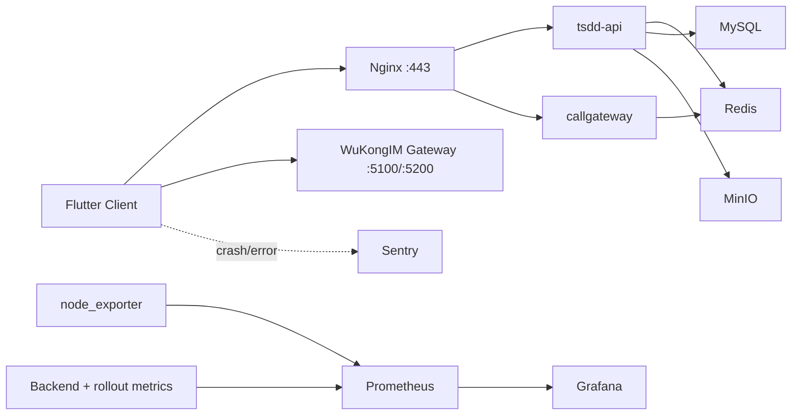

# WuKongIM Production Readiness Design

**Date:** 2026-04-17

**Goal:** Turn the optimized Flutter IM client and Ubuntu-hosted backend from
development-grade deployment into an observable, stress-tested, security-hardened,
and releasable production system without replacing the current architecture.

## Design Summary

WuKongIM already has a workable single-host Docker Compose production topology,
gray-release runbook, rollback assets, and rollout KPI definitions. The missing
pieces are not core feature completeness, but production controls:

1. `Stress discipline`
   - No reproducible websocket load harness exists for 10k connection and
     sustained message throughput validation.
   - Linux connection limits and queue-related kernel parameters are still tuned
     for a much lighter load profile.
2. `Observability discipline`
   - Rollout KPI definitions exist, but metrics collection, scraping, dashboards,
     and alert routing are not yet materialized as an operational stack.
   - Client crash and backend latency telemetry are still fragmented.
3. `Security discipline`
   - The host already uses `ufw`, but public-exposure rules, application-layer
     rate limiting, and abuse controls are not yet frozen as repeatable assets.
4. `Release discipline`
   - The repo lacks a standard Flutter CI workflow.
   - The current backend deployment path can redeploy services, but zero-downtime
     semantics differ by component and are not yet documented as an explicit
     release contract.

The design therefore chooses `incremental productionization`: keep the existing
runtime topology, add the missing operational layers, and separate two deployment
promises:

- `stateless service low-downtime deploy` for `tsdd-api` and `callgateway`
- `gateway low-jitter deploy today, drainable gateway deploy later` for the
  single-instance `wukongim` long-connection service

## Confirmed Current State

### Local Repository State

- The repo already contains:
  - `deploy/production`-style compose assets on the server
  - rollout KPI docs under `deploy/dashboard/realtime-kpis.md`
  - rollout and rollback procedures under
    `docs/2026-04-17-wukongim-gray-release-runbook.md`
  - preflight evidence under
    `docs/2026-04-17-realtime-rollout-preflight-report.md`
- The repo does not yet contain:
  - a standard `.github/workflows` Flutter CI pipeline
  - a dedicated production monitoring compose bundle
  - a production-grade websocket load generator

### Remote Production Host State

Confirmed from `ubuntu@42.194.218.158`:

- Host: Ubuntu `24.04.4 LTS`
- Capacity: `4 vCPU`, `7.5 GiB RAM`, swap almost fully consumed
- Runtime: Docker `28.2.2`, Compose `2.37.1`
- Production services:
  - `nginx`
  - `wukongim`
  - `tsdd-api`
  - `callgateway`
  - `mysql`
  - `redis`
  - `minio`
  - `coturn`
  - `livekit`
- Publicly listening ports currently include:
  - `22`, `80`, `443`
  - `5100`, `5200`
  - `3478`, `5349`
  - `7881`
  - TURN and LiveKit UDP ranges
- Limits and kernel observations:
  - interactive shell `ulimit -n = 1024`
  - `somaxconn = 4096`
  - `tcp_max_syn_backlog = 512`
  - `nf_conntrack_max = 262144`
  - keepalive defaults are conservative for mobile IM session churn

### Operational Constraint

The current `wukongim` deployment is still a single publicly exposed gateway
instance. That means true zero-interruption rolling replacement of long-lived
connections is not available today. The design explicitly treats this as a later
evolution item, not as a false promise in the first production-readiness pass.

## Chosen Approach

### Recommended Approach: Incremental Productionization

Keep the current Docker Compose topology and add:

1. An externalizable websocket stress harness
2. A metrics stack tied to the rollout KPI contract
3. Host and application security baselines
4. CI build automation and a documented deploy contract
5. A later-stage gateway evolution path for true drain-based releases

This approach is preferred because it fits the current codebase, current server,
and current release maturity. It reduces operational risk while still producing
copy-pasteable assets that can be used immediately.

### Rejected Approach: Same-Host Heavyweight Stack

Running Prometheus, Grafana, and large stress jobs directly on the same 4-core,
7.5 GiB production host would distort measurements and compete with the IM
backend. This is allowed only as a temporary fallback with explicit resource
limits and small retention.

### Rejected Approach: Immediate Platform Rewrite

Migrating directly to Kubernetes, a separate gateway fleet, and managed data
services would improve long-term scalability, but it is too large for the
current production-readiness objective and would delay immediate safety gains.

## Target Production Model

## Phase Design

### Phase 1: IM Stress Testing

Deliverables:

- A `Locust`-based websocket load suite
- A worker/controller execution model suitable for distributing 10k clients
- Linux tuning scripts and a bottleneck observation checklist

Design decisions:

- Stress traffic must be generated from external load nodes, not from the
  production host itself.
- The test model must separate:
  - `connection establishment`
  - `heartbeat traffic`
  - `business message traffic`
- The throughput target is interpreted as:
  - 10,000 concurrent connected sessions
  - aggregate sustained load of about `500` message send/receive events per
    second across the active population
- The test suite must record:
  - connect success ratio
  - reconnect count
  - message round-trip latency
  - application errors
  - server-side saturation indicators

Required operational outputs:

- host observation commands for `ss`, `sar`, `dstat`, `vmstat`, `iostat`,
  `docker stats`, and conntrack inspection
- a sysctl and limits hardening bundle for file descriptors, listen queues,
  ephemeral ports, and keepalive behavior

### Phase 2: Monitoring and Logging

Deliverables:

- Docker Compose bundle for:
  - `prometheus`
  - `grafana`
  - `node-exporter`
- Prometheus scrape configuration
- backend metric instrumentation examples
- Flutter `Sentry` bootstrap example

Design decisions:

- Metrics must be aligned to the existing rollout KPI dictionary rather than
  inventing a parallel naming scheme.
- Backend instrumentation must at minimum publish:
  - message delivery success/failure counters
  - end-to-end or server-observed message latency histogram
  - websocket/session counters when available
- Flutter must capture:
  - uncaught framework exceptions
  - background isolate errors
  - breadcrumb context for realtime failures when possible

Deployment preference:

- preferred: `Prometheus + Grafana` on a separate monitoring host, with
  `node_exporter` on production
- temporary fallback: same-host Compose with low retention and bounded memory

### Phase 3: Security Hardening

Deliverables:

- explicit `ufw` or `iptables` allowlist script
- application-layer rate limiting pseudocode and integration guidance
- sensitive-word filtering design

Design decisions:

- Port policy must preserve media and RTC requirements:
  - `22`, `80`, `443`
  - `5100`, `5200` while clients still connect directly
  - TURN and LiveKit ports only if voice/video remains enabled
- Database and Redis ports remain loopback/internal only.
- Abuse controls are layered:
  1. IP/device/account registration throttles
  2. token-bucket or leaky-bucket request throttles
  3. message send anti-spam rules
  4. audit trail for ban and escalation workflows

Sensitive-word filtering baseline:

- normalize text first
- exact-match and trie-based fast checks on the hot path
- optional asynchronous deeper review for policy-specific rules
- reject or redact according to message type and moderation policy

### Phase 4: CI/CD and Deployment

Deliverables:

- GitHub Actions workflow for Flutter:
  - trigger on `push` to `main`
  - run `flutter pub get`
  - run `flutter test`
  - build Android APK
- backend deployment script and release procedure

Design decisions:

- `tsdd-api` and `callgateway` can be deployed with image rebuild + container
  recreation behind stable entrypoints; existing connections terminate only if
  the service process itself is the active handler for a request in flight.
- `wukongim` is different because it owns long-lived socket sessions. Phase 4
  will therefore deliver two release tracks:
  1. `current-state release track`
     - health checks
     - preflight backup
     - rebuild and controlled restart
     - smoke and rollback validation
  2. `future drainable gateway track`
     - dual gateway instances
     - ingress routing for new connections
     - drain old gateway
     - retire old instance after session TTL

The immediate deliverable is honest low-downtime automation for the current
topology, plus a documented path to true zero-interruption gateway updates.

## Data and Control Flows

### Stress and Metrics Flow

1. Locust controller starts workers.
2. Workers open websocket sessions against `5100` or `5200`.
3. Workers emit heartbeats and business messages according to the configured
   mix.
4. Backend metrics expose counters and histograms for Prometheus.
5. Grafana dashboards visualize KPI windows and saturation signals.

### Release Flow

1. CI validates Flutter code and produces an APK artifact.
2. Operator or deployment automation builds backend images with explicit
   `BUILD_*` metadata.
3. Deployment script snapshots rollback inputs and applies the update.
4. Smoke checks and perf probes validate the new revision.
5. Gray rollout or full release decisions follow the existing runbook gates.

## Error Handling and Rollback Model

### Stress Environment Failures

- If Locust workers cannot sustain target client counts, treat the load farm as
  the bottleneck and scale workers horizontally before declaring server failure.
- If the production host approaches swap-heavy memory pressure, terminate the
  run and classify it as a host-capacity failure, not an application-only bug.

### Observability Failures

- If Prometheus is unavailable, the release process must not promote rollout
  phases that depend on the fixed KPI guardrails.
- If Flutter telemetry is not present in a distributed client build, rollout
  baselines remain blocked, matching the existing preflight report.

### Deployment Failures

- Use the already documented rollback target capture process.
- Preserve the distinction between:
  - backend immediate rollback
  - client hotfix follow-up
- Do not claim client-side protobuf kill-switch capability until runtime config
  actually exists.

## Verification Requirements

The implementation must finish with evidence for all of the following:

- load scripts execute and can be parameterized for smaller dry runs
- sysctl and limits scripts are syntactically valid and reversible
- metrics stack Compose validates with `docker compose config`
- backend instrumentation examples compile or match the active backend stack
- Flutter Sentry bootstrap code matches the repo's Flutter initialization style
- GitHub Actions workflow is syntactically valid and references supported
  Flutter setup actions
- deployment scripts include preflight, backup, health validation, and rollback
  hooks

## Risks and Explicit Non-Goals

### Risks

- The current single production host is small for heavy IM, TURN, and monitoring
  co-location.
- Swap pressure can invalidate performance conclusions if not addressed before
  high-scale stress tests.
- Current public exposure of `5100` and `5200` may be required for existing
  clients, so firewall tightening must respect actual client routing behavior.

### Non-Goals

- Do not replace the backend with Kubernetes in this pass.
- Do not promise zero-interruption gateway rolling deploys on the current
  single-instance `wukongim` setup.
- Do not shut down RTC/TURN ports without confirming the business wants voice
  and video disabled.
- Do not define a new rollout KPI vocabulary separate from the already accepted
  `realtime-kpis.md` contract.
