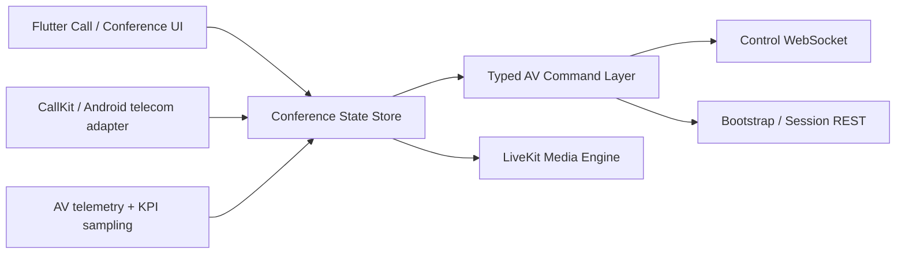

# WuKongIM Audio/Video Parity Design

> **Status:** Drafted from direct code comparison with the current WuKongIM Flutter client and Wildfire IM client stacks.
> **Date:** 2026-04-18
> **Scope:** Flutter AV subsystem, exposed call-control protocol, client-side conference state, and native mobile integration targets needed to close the gap with Wildfire IM.

## Goal

Turn WuKongIM audio/video from a usable call feature into a product-grade IM AV subsystem that can stand next to Wildfire IM in daily usage.

## Current Baseline

### WuKongIM already has

- A real AV dependency stack based on `flutter_webrtc` and `livekit_client`.
- A three-plane call connection model:
  - bootstrap REST via `call_bootstrap_api.dart`
  - control WebSocket via `call_realtime_client.dart`
  - media session via `livekit_call_media_engine.dart`
- Basic direct-call and group-call entry points.
- Basic in-call controls:
  - answer
  - reject
  - hang up
  - mute microphone
  - toggle camera
  - speaker toggle
- Basic signal buffering and recovery logic in `video_call_service.dart`.

### WuKongIM is still missing or thin in

- AV-specific typed protocol semantics.
- Multi-party conference governance.
- Owner/moderator role model.
- Raise hand, apply-unmute, approve/reject, focus user, recording state sync.
- Native operating-system integration depth comparable to CallKit-level behavior.
- A conference-oriented UI state model for roster, permissions, layout mode, and stage/focus.

### Wildfire IM already demonstrates

- Dedicated AV engine packaging across Android, iOS, and Web.
- Rich AV message taxonomy, not just generic control payloads.
- Conference command state machine with:
  - mute all
  - cancel mute all
  - request member mute
  - apply unmute
  - approve or reject unmute
  - raise hand and put hand down
  - focus user
  - recording state broadcast
- Native iOS call handling through CallKit and incoming push routing.

## Gap Statement

The current gap is not "can it place a call." The real gap is "can AV behave like a first-class IM product layer under multi-party, cross-end, and system-level scenarios."

The gap splits into four layers:

1. **Feature layer**
   - WuKongIM is already usable for basic 1v1 audio/video.
   - WuKongIM is not yet a mature meeting product.
2. **Protocol layer**
   - WuKongIM currently models control events generically.
   - Wildfire models AV actions as dedicated message and command types.
3. **State layer**
   - WuKongIM lacks a full conference state model for permissions, moderation, and layout control.
   - Wildfire keeps meeting state synchronized through explicit conference commands.
4. **Platform layer**
   - WuKongIM currently behaves mostly like an app page.
   - Wildfire behaves more like a system-integrated communication app.

## Recommended Direction

### Recommendation

Adopt a **protocol-first conference architecture** on top of the existing WuKongIM media foundation.

This means:

- Keep LiveKit as the near-term media plane.
- Replace generic call-control thinking with a typed AV command domain.
- Introduce a conference state store that owns participant roles, permissions, hand-raise state, focus user, and room policy.
- Add native integration as a separate adapter layer instead of burying it in UI pages.

This is the fastest route to catch Wildfire IM where it matters without throwing away your current foundation.

### Rejected alternatives

#### Option A: Keep current call stack and only add more buttons

- Lowest cost.
- Fastest visible progress.
- Fails to solve state consistency, moderation semantics, and cross-end parity.
- Produces UI debt and duplicated business logic.

#### Option B: Replace the entire media stack first

- Highest theoretical control.
- Too expensive for the current gap.
- Does not automatically solve protocol modeling, moderation, or platform integration.

## Target Architecture

## Core Design Decisions

### 1. Introduce a typed AV command layer

Add a strict command model instead of passing loosely shaped payload maps.

Minimum command families:

- call lifecycle
  - invite
  - ringing
  - accept
  - reject
  - bye
- participant moderation
  - request_mute_audio
  - request_mute_video
  - mute_all_audio
  - mute_all_video
  - cancel_mute_all_audio
  - cancel_mute_all_video
- participation workflow
  - apply_unmute_audio
  - apply_unmute_video
  - approve_unmute_audio
  - approve_unmute_video
  - reject_unmute_audio
  - reject_unmute_video
  - hand_up
  - put_hand_down
- stage management
  - focus_user
  - cancel_focus
  - update_recording

### 2. Introduce a conference state store

The current call session logic and buffered signal handling should remain, but meeting state must move into a dedicated store that tracks:

- room metadata
- participant roster
- owner and moderator roles
- local and remote mute states
- audience mode
- whether members can self-unmute
- hand-up queue
- focused participant
- recording flag
- layout mode

### 3. Separate media state from governance state

Media transport and moderation should not live in the same abstraction.

- `LiveKitCallMediaEngine` should remain responsible for:
  - connect
  - publish local tracks
  - unpublish or mute local tracks
  - collect transport stats
- A new governance layer should own:
  - permission changes
  - moderation commands
  - conference policy sync
  - roster updates

### 4. Add native adapters, not native leakage

Do not hardcode CallKit or Android telecom behavior directly in `video_call_page.dart`.

Instead, create a native bridge service that exposes:

- report incoming call
- answer from system UI
- decline from system UI
- mute from system UI
- end from system UI
- wake call page after system accept

### 5. Instrument AV as an operated system

Parity is not only feature count. AV must become measurable.

Track at minimum:

- call invite to answer success rate
- room join success rate
- reconnect count per call
- remote participant render latency
- permission-state mismatch count
- AV command decode failures
- media publish bitrate and subscribe bitrate

## Scope by Milestone

### Milestone 1: Productize current direct call

- Typed lifecycle commands
- Stable roster and participant state
- Better error surfacing
- Native incoming-call bridge

### Milestone 2: Reach usable conference parity

- Owner/moderator roles
- Mute-all and member-mute flows
- Apply-unmute and approval flows
- Hand-up queue
- Focus user
- Conference layout states

### Milestone 3: Reach operated AV parity

- Recording state sync
- KPI instrumentation
- Cross-end state reconciliation
- Graceful degradation under reconnect and partial media failures

## What Not To Do

- Do not rewrite the whole media engine before the protocol and state model are in place.
- Do not implement conference controls as UI-only toggles.
- Do not add group-call UI variations without a canonical conference state source.
- Do not bind moderation logic directly to raw JSON maps.

## Success Criteria

WuKongIM can be considered close to Wildfire IM AV parity when all of the following are true:

- 1v1 audio/video calls behave stably across foreground, background, and interrupted states.
- Group call is upgraded into conference mode with owner-led moderation.
- AV commands are strongly typed and test-covered.
- Native incoming-call behavior works through mobile system surfaces.
- A single conference state store drives UI, moderation, and telemetry.
- AV regressions can be detected through metrics instead of manual observation alone.

## Practical Sequence

1. Freeze the AV command schema.
2. Introduce conference state in Flutter.
3. Replace generic UI control paths with command-driven state mutations.
4. Add native call integration adapters.
5. Add conference controls and permissions.
6. Add KPI instrumentation and rollout guardrails.

## Why This Design Fits WuKongIM

- It preserves the working parts of the current architecture instead of restarting.
- It upgrades the weakest layer first: protocol and state semantics.
- It directly targets the largest observed gap versus Wildfire IM:
  - conference governance
  - cross-end consistency
  - native integration
  - operational maturity
