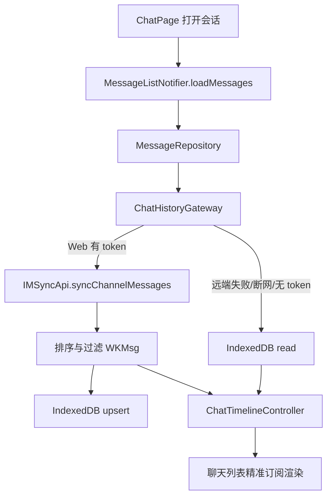
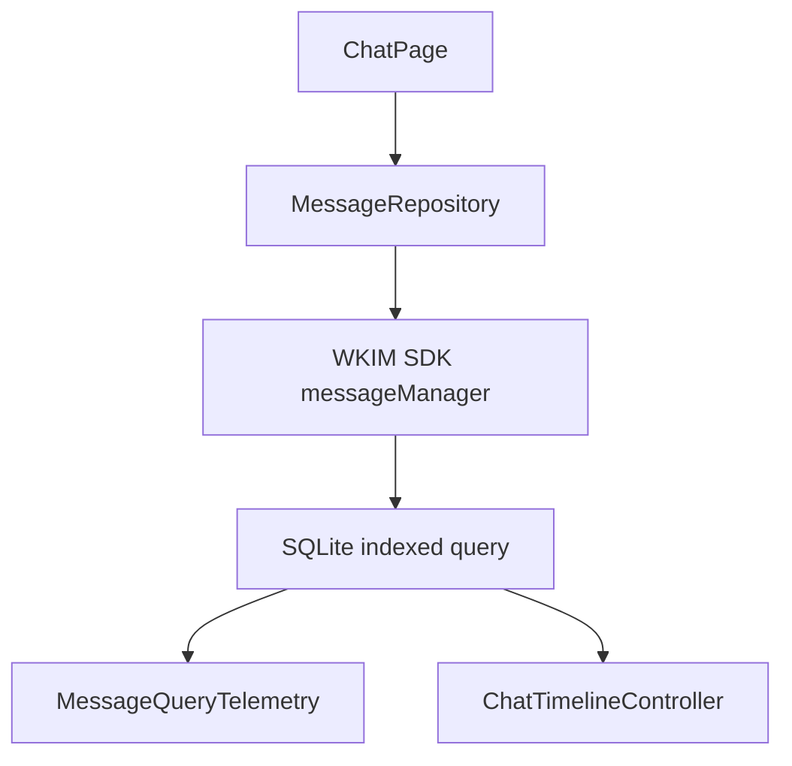

# Phase 3：大历史、底层存储与 Web 突破设计

日期：2026-05-04  
项目：WuKong IM Flutter 客户端  
范围：Phase 3（P1/P2，第 4-6 周）  
状态：设计已由用户确认，等待实施计划

## 1. 背景与目标

前两个阶段已经完成生产止血、高危风险解除，以及客户端 IM 核心重构与状态管理优化。Phase 3 的目标是把“能用”的聊天链路推进到“可承载大历史、Web 可恢复、滚动稳定”的体验基线。

当前代码已经具备以下基础：

- 聊天历史访问已收敛到 `ChatHistoryGateway` / `MessageRepository`。
- Web 历史加载已走远端 `IMSyncApi.syncChannelMessages`，并预留了 `WebChatCacheStore` 接口。
- 现有 Web cache 实现仍是 `MemoryWebChatCacheStore`，刷新浏览器后缓存消失。
- Native 端继续复用 WuKongIM Flutter SDK 的 SQLite 消息存储，但 Phase 3 需要补齐索引、查询耗时观测和必要的后台化策略。
- 聊天 UI 已完成较多 Riverpod 精准订阅优化，Phase 3 不再扩大状态管理重构范围。

Phase 3 的三个验收目标全部纳入本次设计：

1. Web 端历史消息真持久化。
2. 桌面/移动端大历史分页不卡顿。
3. 长列表图片加载不引发明显 UI Jank，并能观测超阈值帧。

## 2. 非目标

本阶段不做以下工作：

- 不重写整个消息 SDK 或替换 WuKongIM Flutter SDK。
- 不把 Web、Native、服务端历史同步抽象成全新统一存储大框架。
- 不继续向旧 `IMService` 塞新功能。
- 不引入端到端加密、服务端 Redis Streams、文件分片上传等 Phase 4/治理红线工作。
- 不以盲目扩容服务器作为性能优化手段。

## 3. 推荐方案

采用“垂直切片逐项落地”的方案：

1. 先打通 Web IndexedDB 真缓存，使 Web 刷新/重启/断网后可恢复最近会话消息。
2. 再补齐 Native SQLite 大历史分页索引和查询观测，必要时将 Windows 大页查询和解析移出 UI isolate。
3. 最后收敛聊天列表图片 decode 尺寸和 frame timing 监控，控制图片内存与 Jank 风险。

选择该方案的原因：

- 每个切片都有独立验收闭环。
- 侵入面小，能复用 Phase 2 后已经稳定的 `MessageRepository`、`ChatTimelineController`、精准 Riverpod 订阅。
- 避免一次性重写存储层带来的回归风险。

## 4. 架构设计

### 4.1 Web IndexedDB 缓存

新增 Web 侧持久化实现，挂在现有 `WebChatCacheStore` 接口下。

建议文件边界：

- `lib/data/cache/web_chat_cache_store.dart`：保持接口，必要时补充轻量能力注释。
- `lib/data/cache/web_chat_cache_store_memory.dart`：保留作为非 Web 或 IndexedDB 不可用时的降级实现。
- `lib/data/cache/indexed_db_web_chat_cache_store.dart`：Web IndexedDB 实现。
- `lib/data/cache/web_chat_cache_store_factory.dart`：条件导入工厂，Web 返回 IndexedDB store，非 Web 返回 null 或 memory fallback。
- `lib/data/providers/conversation_provider.dart`：`chatHistoryGatewayProvider` 注入 Web cache store。

IndexedDB 数据库建议：

- 数据库名：`wukong_chat_cache_v1`。
- Object Store：`messages`。
- 主键：`cache_key`，由 `uid/channel_type/channel_id/message identity` 组成，确保多用户隔离。
- 索引：
  - `byUserChannelOrderSeq`：`uid + channel_type + channel_id + order_seq`。
  - `byServerMsgId`：`uid + server_msg_id`。
  - `byClientMsgNo`：`uid + client_msg_no`。
  - `byMessageSeq`：`uid + channel_type + channel_id + message_seq`。
- 预留 Object Store：`conversations`、`message_extra`，第一轮只实现 `messages`，避免范围膨胀。

消息写入策略：

- `WkImChatHistoryGateway._fetchRemote` 远端同步成功后，将排序后的消息写入 Web cache。
- 实时新消息进入 `MessageListNotifier` 时，后续可追加写入 Web cache；第一轮最低闭环以“历史加载后可刷新恢复”为验收门槛。
- upsert 去重优先级：`server_msg_id/message_id` > `client_msg_no` > `message_seq` > `order_seq`。
- 每个会话保留最近可配置数量，例如 2000 条，避免 IndexedDB 无限膨胀。

读取策略：

- `loadLatest`：读取当前用户、当前会话最新 N 条，按 `order_seq` 升序返回给现有上层逻辑。
- `loadOlder`：读取 `order_seq < oldestOrderSeq` 的上一页。
- `loadAround`：读取锚点附近窗口，优先取锚点前后各半页；如果锚点不存在，退化到 latest。
- 远端同步失败、无 token、断网时，优先读 IndexedDB。

数据格式：

- IndexedDB 存储原始字段 Map，不存 Dart 对象实例。
- 必须包含：`uid`、`channel_id`、`channel_type`、`message_id`、`client_msg_no`、`message_seq`、`order_seq`、`timestamp`、`content_type`、`content`、`is_deleted`、`status`。
- 反序列化时构造 `WKMsg`，并复用现有 `shouldIncludeRemoteHistoryMessage` / `shouldDisplayConversationMessage` 过滤。
- 复杂 `messageContent` 解析优先沿用 `WKIM.shared.messageManager.getMessageModel` 或现有 sync message 转换逻辑，不能让 UI 层感知 Web cache 的序列化细节。

降级策略：

- 浏览器不支持 IndexedDB、隐私模式写入失败、schema 升级失败时，不阻断聊天页；降级到内存 cache 或空 cache，并记录 debug 日志。
- IndexedDB 异常不能导致 `loadMessages` 失败，最多导致离线缓存不可用。

### 4.2 Native SQLite 大历史分页性能

Native 端继续使用 WuKongIM Flutter SDK 的 SQLite 存储，不新增平行消息数据库。

Phase 3 要做的是“加固查询路径”：

- 在 SDK 侧或 app 启动侧确认消息表存在以下索引：
  - `idx_msg_channel_seq`：`channel_id, channel_type, message_seq DESC`。
  - `idx_msg_channel_order_seq`：`channel_id, channel_type, order_seq DESC`。
  - `idx_msg_client_msg_no`：`client_msg_no`，用于 ACK/刷新去重。
  - `idx_msg_message_id`：`message_id`，用于服务端消息 ID 去重。
- 索引创建必须使用 `CREATE INDEX IF NOT EXISTS`，允许老库无损升级。
- 如果 SDK 已有等价索引，不重复创建，只补缺口。

查询行为保持现有接口：

- `MessageRepository.loadLatest`：最近页。
- `MessageRepository.loadOlder`：基于 `oldestOrderSeq` 翻旧页。
- `MessageRepository.loadAround`：基于锚点恢复浏览位置。

性能观测：

- 保留并使用 `MessageQueryTelemetry.recordSqlitePageQuery`。
- 对 latest、older、around 三类查询分别打标签。
- 建议阈值：单页查询超过 100ms 记录 warning，P95 进入后续监控面板。

Windows / 桌面后台化策略：

- 第一轮先完成索引和耗时观测。
- 如果 Windows 上分页仍出现 UI 卡顿，再将“大页查询 + JSON/Map 到 `WKMsg` 的转换”移入 Worker isolate。
- Worker isolate 和 SDK SQLite 连接必须谨慎隔离，不能直接跨 isolate 共享 sqflite database 实例。

### 4.3 图片内存与 UI Jank 控制

目标是降低长历史列表滚动时图片 decode 和缓存对 UI 线程的冲击。

建议落点：

- 聊天图片 bubble 或通用 media image 组件新增受控 decode 参数。
- 列表中图片显示尺寸限制，例如展示宽度 180，最大 decode 宽度 360。
- 大图预览仍走独立页面，不进入聊天列表一级图片缓存。
- 对 `CachedNetworkImage` / `Image` 使用 `memCacheWidth`、`cacheWidth` 或等价能力。

Jank 监控：

- 在 app 启动或聊天模块初始化处注册 `SchedulerBinding.instance.addTimingsCallback`。
- 仅 debug/profile 或采样启用，避免生产日志噪声。
- 当 `FrameTiming.buildDuration` 或 raster duration 超过阈值时记录 warning。
- 建议阈值：build 超过 8ms 预警，frame 总耗时超过 16ms 记录 jank。

### 4.4 数据流

Native 端数据流保持：

## 5. 测试设计

### 5.1 单元测试

新增或扩展测试覆盖：

- `MemoryWebChatCacheStore` 与 IndexedDB store 的共同分页语义：latest、older、around。
- upsert 去重优先级：server id、client msg no、message seq、order seq。
- Web cache 反序列化后仍能被 `shouldDisplayConversationMessage` 正确过滤。
- `WkImChatHistoryGateway` 在远端失败时会读取 cache。
- Native 查询索引创建 SQL 幂等。
- Jank 阈值判断函数可测试，避免直接依赖真实 frame timing。

### 5.2 集成/手工验收

Web 验收：

1. 登录 Web。
2. 打开一个有历史消息的会话。
3. 确认 IndexedDB 中 `messages` store 有该会话记录。
4. 刷新浏览器。
5. 最近消息仍可见。
6. 模拟断网或让远端同步失败。
7. 再次打开会话，能从 IndexedDB 恢复最近页。

Native 验收：

1. 准备 10 万级历史消息或等价压测数据。
2. 执行 latest、older、around 三类分页。
3. 确认查询耗时被 telemetry 记录。
4. 确认分页没有重复、顺序稳定、锚点恢复正确。

图片/Jank 验收：

1. 准备包含多张大图的长聊天记录。
2. 快速滚动聊天列表。
3. 确认列表图片使用受限 decode 宽度。
4. 超阈值帧能被监控记录。

## 6. 验收标准

本阶段完成需同时满足：

1. Web 打开会话并加载消息后，刷新浏览器仍能看到最近消息。
2. Web 断网后打开最近会话，能从 IndexedDB 恢复缓存消息。
3. Native 端历史分页查询有索引保护，latest/older/around 行为测试通过。
4. 聊天列表图片使用受限 decode 尺寸，避免原图直接进入列表 decode/cache。
5. Jank 监控能记录超过阈值的 frame timing。
6. `flutter analyze` 和相关测试通过。

## 7. 风险与缓解

| 风险 | 影响 | 缓解 |
| --- | --- | --- |
| IndexedDB API 在 Dart Web 下类型和浏览器兼容复杂 | Web 编译或运行失败 | 使用条件导入隔离 Web 实现，非 Web 不引用 Web API |
| WKMsg 序列化字段不完整 | 缓存恢复后消息展示异常 | 第一轮只缓存展示必需字段，并用测试覆盖文本/图片/系统消息 |
| 老库索引创建阻塞启动 | Native 启动变慢 | 索引使用 IF NOT EXISTS；必要时延迟到 IM 初始化后后台执行 |
| Worker isolate 直接共享 SQLite 连接 | 崩溃或数据错乱 | 第一轮不跨 isolate 共享连接；如需 isolate，单独打开只读连接 |
| Jank 日志噪声过多 | 干扰排查 | debug/profile 默认开启，release 采样或关闭 |

## 8. 实施顺序建议

1. 写 Web cache store 工厂和 IndexedDB 实现。
2. 将 `chatHistoryGatewayProvider` 注入 Web cache。
3. 完成 Web cache 分页、upsert、远端失败 fallback 测试。
4. 补齐 Native SQLite 索引确保逻辑和测试。
5. 补聊天列表图片 decode 限制。
6. 加 Jank frame timing 监控。
7. 跑 `flutter analyze`、相关单元测试和 Web 手工验收。

## 9. 设计自检结论

- 无 TBD/TODO 占位。
- 设计范围只覆盖 Phase 3 三个验收目标，没有扩展到 Phase 4 或治理红线工作。
- Web/Naitve 数据路径分离清晰，避免统一大重构。
- IndexedDB、SQLite、图片/Jank 都有明确文件边界、降级策略和验收方式。
