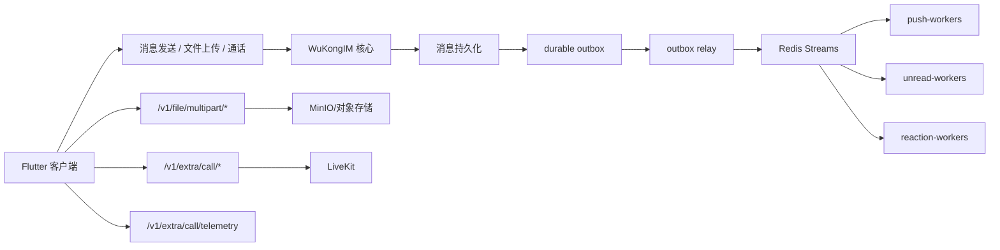

# Phase 4 服务端解耦与富媒体/通话强化设计

> 日期：2026-05-04  
> 范围：Phase 4（P2，第 7-10 周）  
> 执行模式：方案 C，客户端 + 远端服务端 + 生产部署验证  
> 生产窗口：允许 1-5 分钟短暂停机；必须可回滚

## 1. 背景与目标

用户已完成 Phase 1、Phase 2、Phase 3，本阶段进入 Phase 4：服务端解耦与富媒体/通话强化。Phase 4 的目标不是继续客户端局部修补，而是把服务端副作用、文件传输、LiveKit 通话状态补齐到可承受高并发与线上排障的工业级形态。

本轮选择方案 C：实施核心链路深度重构，并进行生产部署验证。考虑到生产窗口为 1-5 分钟，设计必须满足：先构建与验证新镜像、短窗口切换、失败快速回滚、所有高风险路径有开关或兼容路径。

## 2. 当前系统事实

### 2.1 本地 Flutter 客户端

本地仓库：`C:\Users\COLORFUL\Desktop\WuKong`。

已存在的 Phase 4 基础：

- 分片上传模型：`C:\Users\COLORFUL\Desktop\WuKong\lib\core\upload\multipart_upload_models.dart`
- 断点续传 store：`C:\Users\COLORFUL\Desktop\WuKong\lib\core\upload\resumable_upload_store.dart`
- 断点续传执行器：`C:\Users\COLORFUL\Desktop\WuKong\lib\data\upload\resumable_file_uploader.dart`
- SharedPreferences 持久化：`C:\Users\COLORFUL\Desktop\WuKong\lib\data\upload\shared_preferences_resumable_upload_store.dart`
- multipart API client：`C:\Users\COLORFUL\Desktop\WuKong\lib\service\api\file_multipart_upload_client.dart`
- 通话状态机：`C:\Users\COLORFUL\Desktop\WuKong\lib\realtime\call\call_state_machine.dart`
- 通话 store：`C:\Users\COLORFUL\Desktop\WuKong\lib\realtime\call\call_store.dart`
- LiveKit media engine：`C:\Users\COLORFUL\Desktop\WuKong\lib\modules\video_call\media\livekit_call_media_engine.dart`

### 2.2 远端服务端

可通过 `ssh ubuntu@42.194.218.158` 登录。

远端代码与运行态：

- WuKongIM 核心源码：`/home/ubuntu/wukongim-build-src-uploaded`
- 生产业务 API / 文件 / Webhook / 部署源码：`/opt/wukongim-prod/src`
- 生产核心容器：`wukongim_prod-wukongim-1`
- 生产业务 API 容器：`wukongim_prod-tsdd-api-1`
- 通话网关容器：`wukongim_prod-callgateway-1`
- Redis 容器：`wukongim_prod-redis-1`
- LiveKit 容器：`wukongim_prod-livekit-1`
- Nginx 容器：`wukongim_prod-nginx-1`

生产容器当前通过 `/opt/wukongim-prod/src/deploy/production/docker-compose.yaml` 编排，核心服务配置从 `/opt/wukongim-prod/src/deploy/production/rendered/*.yaml` 挂载。

## 3. 设计总览

Phase 4 拆成三个可独立验证但最终联动的子系统：

1. **Redis Streams 副作用解耦**：核心消息持久化后写 durable outbox，由 relay 投递 Redis Streams，消费者组异步处理 push、unread、reaction 等副作用。
2. **大文件分片与断点续传**：保留现有 `/v1/file/multipart/*` 路径，增强 idempotency、并发上传、服务端校验和 Nginx streaming 配置。
3. **LiveKit 通话状态机与 Telemetry**：客户端建立严格状态机和失败原因，服务端接收 telemetry，Dashboard 可统计成功率与失败分布。



## 4. 服务端核心解耦：Outbox + Redis Streams Relay

### 4.1 备选接口形态

设计阶段比较过三种接口形态：

1. **薄 Publisher 模式**：消息入库后直接 `XADD im:message:effects:v1`。优点是实现简单；缺点是 Redis 短暂不可用时副作用可能丢失。
2. **全命令队列模式**：发消息请求直接写入 Redis Stream，由消费者落库。优点是解耦彻底；缺点是重写核心收发语义，生产风险过高。
3. **Outbox + Redis Streams Relay 模式**：消息入库流程写 durable outbox，relay 投递 Redis Streams，消费者异步处理副作用。该方案在深度解耦和生产可靠性之间最平衡。

最终选择 **Outbox + Redis Streams Relay**。

### 4.2 模块边界

- **消息核心链路**：只负责鉴权、序号分配、消息持久化、ACK 所需最小响应。
- **Outbox writer**：在消息持久化成功后写入待投递事件。事件必须具备幂等键。
- **Outbox relay**：扫描未投递事件并投递 Redis Streams。投递成功后标记 outbox 状态。
- **Redis Streams**：承载已持久化消息的异步副作用事件。
- **Consumer groups**：按职责拆分为 `push-workers`、`unread-workers`、`reaction-workers`。
- **DLQ**：消费者多次失败后写入 `im:message:effects:dlq:v1`，保留事件、错误码、失败次数和最后错误。

### 4.3 Stream 事件契约

Stream key：`im:message:effects:v1`。

事件字段：

```json
{
  "event_id": "message:<channel_id>:<message_seq>:<effect>",
  "event_type": "message.persisted",
  "channel_id": "channel-a",
  "channel_type": 1,
  "message_id": 123456789,
  "message_seq": 456,
  "client_msg_no": "client-uuid",
  "from_uid": "u1",
  "payload_ref": "db/message",
  "created_at": 1770000000000
}
```

幂等规则：

- `event_id` 是消费者幂等键。
- 同一消费者组处理完成后记录 `consumer_group + event_id`。
- 消费者重复收到同一事件时直接 ACK，不重复执行外部副作用。

### 4.4 Consumer groups

- `push-workers`：只处理离线推送、badge 变化和推送供应商调用；不得阻塞消息发送接口。
- `unread-workers`：只处理未读数、会话版本和设备角标等可异步更新内容。
- `reaction-workers`：只处理 reaction 同步、reaction 补偿和后续 reaction cache invalidation。

### 4.5 失败与回滚

- Redis 不可用：核心消息入库仍成功，outbox 保留 `pending`，relay 恢复后补投。
- 消费者失败：事件进入 pending retry；超过阈值进入 DLQ。
- 新消费者异常：关闭对应 consumer 或切回同步旧路径。
- 发布回滚：恢复旧镜像与 compose 配置；outbox 未投递事件保留，避免副作用丢失。

## 5. 大文件分片上传与断点续传

### 5.1 HTTP API 契约

路径保持兼容：

- `POST /v1/file/multipart/init`
- `PUT /v1/file/multipart/part`
- `POST /v1/file/multipart/complete`
- `DELETE /v1/file/multipart/abort`

调用方是 Flutter 客户端；版本策略是 `/v1/` 下 additive evolution，不做破坏性改名。

统一错误形态：

```json
{
  "error": {
    "code": "multipart_part_missing",
    "message": "Multipart part 4 is missing",
    "details": {"upload_id": "abc", "part_number": 4},
    "request_id": "req_xxx"
  }
}
```

HTTP 状态码必须真实表达失败：

- 400：请求 JSON 或 query 格式错误。
- 401：未登录或 token 无效。
- 403：无权限访问该 upload session。
- 409：fingerprint/path/size 与已有 session 冲突。
- 422：part 缺失、大小不匹配、校验失败。
- 500：服务端不可预期错误。

#### `POST /v1/file/multipart/init`

请求：

```json
{
  "type": "chat",
  "path": "/1/channel/large.zip",
  "size": 104857600,
  "chunk_size": 8388608,
  "fingerprint": "sha256-or-local-fingerprint"
}
```

响应：

```json
{
  "upload_id": "abc",
  "path": "/1/channel/large.zip",
  "chunk_size": 8388608,
  "uploaded_parts": [1, 2, 3],
  "expires_at": 1770000000
}
```

语义：同一个 `fingerprint + type + path + size + chunk_size` 重试时复用未完成 session。

#### `PUT /v1/file/multipart/part`

Query：

```text
upload_id=abc&type=chat&path=/1/channel/large.zip&part_number=4&offset=25165824&length=8388608
```

Body：`application/octet-stream`。

可选 header：`Content-MD5` 或 `X-Part-Sha256`。

响应：

```json
{
  "upload_id": "abc",
  "part_number": 4,
  "size": 8388608,
  "etag": "part-checksum"
}
```

#### `POST /v1/file/multipart/complete`

请求：

```json
{
  "upload_id": "abc",
  "type": "chat",
  "path": "/1/channel/large.zip",
  "size": 104857600,
  "parts": [1, 2, 3, 4]
}
```

响应：

```json
{
  "path": "file/preview/chat/1/channel/large.zip",
  "url": "https://example.com/file/preview/chat/1/channel/large.zip"
}
```

### 5.2 客户端上传策略

- 默认分片大小：8MB。
- 并发：最多 3 个 part 同时上传。
- 单 part 失败：指数退避 + jitter，最多重试 5 次。
- 进度：按服务端确认 part 累加，不按 socket 写入量乐观估计。
- App 重启：从 `SharedPreferencesResumableUploadStore` 恢复 checkpoint，再调用 init 校准服务端 `uploaded_parts`。
- 小文件：低于阈值继续使用 `POST /v1/file/upload`，避免普通图片、语音消息承担分片复杂度。

### 5.3 服务端与 Nginx

服务端必须满足：

- part 原子写入：先 `.tmp`，校验通过后 rename。
- complete 前校验 `upload_id/type/path/size/parts`。
- 支持超期 session 清理。
- 支持重复上传同一 part，且相同校验时视为幂等成功。

Nginx 对分片 part 关闭 request buffering：

```nginx
location /v1/file/multipart/part {
  proxy_request_buffering off;
  client_body_buffer_size 512k;
  proxy_pass http://tsdd-api;
}
```

## 6. LiveKit 通话状态机与 Telemetry

### 6.1 状态机

对 UI 和 Telemetry 暴露的公共状态：

```text
idle -> ringing -> connecting -> connected -> reconnecting -> ended | failed
```

客户端可保留现有 `invited`、`ending` 等内部状态，但必须映射到公共状态，避免 Dashboard 和 UI 出现多个含义重叠的状态。

### 6.2 标准事件

客户端统一记录：

- `call.invite.received`
- `call.dial.started`
- `call.accepted`
- `call.livekit.connecting`
- `call.livekit.connected`
- `call.livekit.reconnecting`
- `call.livekit.reconnected`
- `call.ended`
- `call.failed`

失败原因枚举：

- `declined`
- `cancelled`
- `timeout`
- `ice_failed`
- `token_invalid`
- `permission_denied`
- `network_lost`
- `livekit_connect_failed`
- `signaling_failed`
- `unknown`

### 6.3 Telemetry API

接口：`POST /v1/extra/call/telemetry`。

请求：

```json
{
  "room_id": "room_x",
  "call_id": "call_x",
  "uid": "u1",
  "event": "call.livekit.connected",
  "state": "connected",
  "reason": "",
  "duration_ms": 1234,
  "network_type": "wifi",
  "sdk": "livekit_client",
  "platform": "android",
  "stats": {
    "publish_bitrate": 12345,
    "subscribe_bitrate": 23456,
    "participant_count": 2
  },
  "created_at": 1770000000000
}
```

响应：

```json
{
  "ok": true
}
```

错误：沿用统一错误形态；鉴权失败返回 401，字段非法返回 422。

### 6.4 客户端职责

- `CallStateMachine` 只做合法转换，不发网络请求。
- 新增 `CallTelemetryReporter`，订阅 `CallStore.events`、`CallStore.stream` 和 LiveKit engine 状态。
- `LiveKitCallMediaEngine` 暴露连接状态变化流，捕获 connecting、connected、reconnecting、failed、disconnected。
- Telemetry 上报失败不影响通话主流程；本地最多保留最近 100 条待上报事件。

### 6.5 服务端职责

- 接收 telemetry 并落库或写入 Redis Stream。
- 允许 Dashboard 按 room/call 聚合。
- 对失败 reason 建立稳定枚举，不依赖自由文本。

Dashboard 指标：

- 呼叫发起数。
- LiveKit 连接成功数。
- 平均连接耗时。
- reconnect 次数。
- failed reason 分布。

## 7. 生产发布与回滚设计

### 7.1 发布步骤

1. 在远端源码目录创建变更分支或备份当前目录。
2. 运行服务端单元测试与关键 API 测试。
3. 构建新镜像，使用带日期和阶段名的 tag。
4. 更新生产 compose，但保留旧镜像 tag 和旧配置备份。
5. 维护窗口内切换服务。
6. 运行 smoke：健康检查、登录/路由、发消息、分片上传 init/part/complete、通话 session/telemetry。
7. 若 smoke 失败，立即恢复旧 compose 与旧镜像。

### 7.2 回滚条件

任一条件满足即回滚：

- `/health` 失败或连续 3 次超时。
- 发消息 smoke 失败。
- Redis Streams consumer lag 持续增长且无法 ACK。
- 文件上传 complete 后无法 preview。
- Call telemetry API 返回 5xx。
- Nginx 配置测试失败。

### 7.3 数据安全

- Redis Streams 和 outbox 增量数据不删除。
- 分片临时目录保留超期清理策略，回滚不删除进行中的 upload session。
- 生产配置变更前复制到带时间戳备份目录。

## 8. 测试策略

### 8.1 TDD 要求

所有实现任务必须按 TDD 执行：先写失败测试，再写最小实现，再重构。不得先改生产代码再补测试。

### 8.2 服务端测试

- Outbox writer：消息持久化后生成幂等 event。
- Relay：Redis 暂不可用时不丢 outbox，恢复后补投。
- Consumer：重复事件不会重复 push/unread/reaction。
- DLQ：超过重试阈值写入 DLQ。
- Multipart：init 复用 session、part 原子写入、complete 校验 size/parts。
- Telemetry：合法事件 200，非法 reason 422，未鉴权 401。

### 8.3 客户端测试

- Multipart planner：8MB 分片与尾片长度正确。
- Resumable uploader：并发不超过 3，失败重试带 backoff，重启恢复 uploaded parts。
- Call state machine：非法转换被拒，合法转换进入目标状态。
- Telemetry reporter：状态变化生成标准事件，失败原因映射稳定，上报失败不影响 call store。

### 8.4 生产 smoke

- `docker compose config` 成功。
- `nginx -t` 成功。
- `/health` 成功。
- 发送消息 API 成功，客户端可同步。
- 分片上传 2-3 个 part 后 complete，preview 可访问。
- Telemetry API 接收一条 `call.livekit.connected` 和一条 `call.failed`。

## 9. 风险与缓解

- **核心消息链路风险**：Outbox relay 不替代消息落库；先保持 ACK 语义不变。
- **Redis 压力风险**：Stream 设置长度修剪策略和 consumer lag 监控。
- **副作用重复风险**：所有消费者以 `event_id` 做幂等。
- **上传大文件占用磁盘**：临时分片目录有超期清理，complete 后删除 session。
- **Nginx streaming 配置风险**：仅对 multipart part 关闭 buffering，不影响普通 API。
- **Telemetry 噪声风险**：客户端本地限流，服务端按枚举接收。
- **生产回滚风险**：compose、配置、镜像 tag 都保留备份。

## 10. 明确不做

- 不引入 E2EE。
- 不重写客户端 UI。
- 不把所有消息发送请求改成 Redis 命令队列。
- 不移除旧 `/v1/file/upload`。
- 不让 Telemetry 上报失败影响通话主流程。
