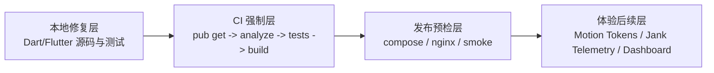
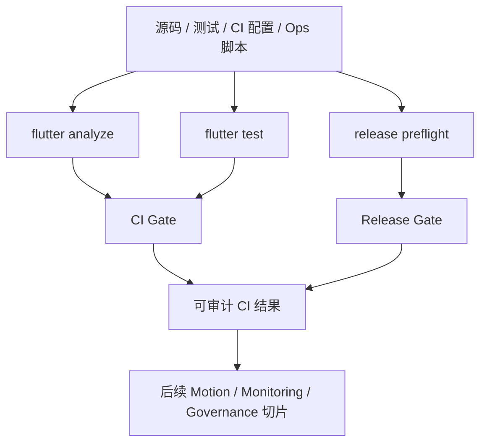

# Phase 5：视觉体验、监控与长效治理（门禁优先）设计

> 日期：2026-05-05
> 阶段：Phase 5 / P3 / 持续治理
> 决策：采用 **A. 门禁优先**。先让质量生命线可执行，再进入视觉动效与监控体验深化。

## 1. 背景与当前状态

`docs/IM系统全链路综合优化计划书.md` 将 Phase 5 定义为“视觉体验、监控与长效治理”，目标是把 IM 做到“好用”，并建立严格的质量生命线。

当前项目已完成 Phase 1-4 的主要优化。进入 Phase 5 时，本地仓库已有部分基础：

- `lib/core/motion/chat_motion.dart` 已有聊天动效 token 雏形。
- `lib/core/transitions/message_animations.dart` 和聊天页发送按钮已有微动效基础。
- `lib/realtime/telemetry/realtime_rollout_telemetry.dart` 已承接 realtime、conversation patch、message query 指标。
- `.github/workflows/flutter-android-ci.yml` 已能运行测试和 Android release build，但尚未把 `flutter analyze` 作为门禁。
- 当前 `flutter analyze` 仍有 70 个问题，其中 2 个 error 来自未收敛的 Phase 3 IndexedDB/Web cache 改动。

因此 Phase 5 第一批不先扩大视觉动效，而是先把“质量生命线”落到代码、CI 和发布预检中。

## 2. 目标与非目标

### 2.1 目标

1. **Analyzer 清零**：修复当前 `flutter analyze` 的全部 70 个问题（error / warning / info），让输出达到 `No issues found!`。
2. **CI/CD 门禁**：GitHub Actions 在构建前运行 `flutter analyze`，并在 PR 与 main push 上生效。
3. **发布预检沉淀**：明确生产发布前必须验证 docker compose、Nginx 语法和端到端 smoke 脚本。
4. **体验治理后置但不丢失**：Motion Tokens、发送状态、Jank/Telemetry Dashboard 进入后续切片，前提是门禁保持绿色。

### 2.2 非目标

1. 本批不做大范围视觉重设计。
2. 本批不新增高风险 IM 功能。
3. 本批不通过批量 ignore 或放宽 analyzer 配置来伪造“清零”。
4. 本批不做与 analyzer 无关的大范围旧模块重写；但当前 `flutter analyze` 报出的 info 也纳入本批修复。

## 3. 总体方案

采用四层门禁优先架构：



核心规则：**Phase 5 后续任何 UI polish、监控或体验改动都不能破坏 analyze 与关键测试门禁。**

## 4. 组件设计

### 4.1 本地修复层

职责：让当前工作区回到可静态分析、可测试状态。

范围：

- `lib/data/cache/*`：收敛 Phase 3 IndexedDB/Web cache 的类型、条件导入和内存 fallback 行为。
- `test/data/cache/*`：修复 cache contract 与 IndexedDB 测试。
- 其他 analyzer warning/error：真实修复 unused import、override mismatch、死代码等问题。
- Analyzer info：修复 deprecated API、unnecessary import、collection literal、命名与测试桩问题，目标是当前 analyze 输出无剩余 issue。

边界：

- 不回滚用户已有 Phase 3/4 改动。
- 不为了清零而降低 `analysis_options.yaml` 的规则强度。
- 若单个 info 暴露出大范围历史设计问题，采用最小兼容修复让 analyzer 清零，不顺手扩展成 unrelated refactor。

### 4.2 CI 强制层

职责：把本地门禁变成团队合并门禁。

`.github/workflows/flutter-android-ci.yml` 调整方向：

- 增加 `pull_request` 触发。
- 在 `flutter pub get` 后立即运行 `flutter analyze`。
- `flutter analyze` 必须早于 `flutter test` 与 `flutter build apk`。
- 保留 Android release build 与 artifact upload。

建议顺序：

```text
checkout -> setup java -> setup flutter -> flutter pub get -> flutter analyze -> flutter test -> flutter build apk -> upload artifact
```

### 4.3 发布预检层

职责：防止 CI 只证明客户端可构建，却无法证明生产发布安全。

生产发布前必须有证据：

1. `docker compose config` 可渲染通过。
2. Nginx 配置语法检查通过。
3. 端到端 smoke 脚本通过。
4. 关键服务健康检查与日志窗口无 fatal/panic/exception。

这些检查可以先以文档/runbook 和现有 `scripts/ops/*` 资产收敛，不要求本批一次性重写后端部署系统。

### 4.4 体验后续层

职责：保留 Phase 5 的视觉体验目标，但让它在绿色门禁下推进。

后续切片包括：

- Motion Tokens 标准化：如 `fast: 120ms`、`normal: 220ms`、`pressedScale: 0.92`。
- 消息进场动画：仅对新消息做轻微向上位移 + 透明度，不对历史大列表整体动画。
- 发送状态：时钟 -> 单灰勾 -> 双灰勾 -> 双蓝勾。
- Jank/Telemetry：将 frame timing、build/raster threshold 和 dashboard query 固化。

## 5. 数据流与证据流



证据产物：

- 本地 `flutter analyze` 输出为 clean。
- 关键测试输出为 pass。
- GitHub Actions 包含 analyze gate。
- 发布预检文档明确检查项、失败处理和证据归档位置。

## 6. 错误处理

1. **Analyzer error / warning / info**：当前输出中的全部问题必须修复，不批量 suppress。
2. **旧代码 info**：采用最小安全改动修复；不得以“只是 info”为由留下本批已知 analyzer issue。
3. **CI analyze 失败**：阻断测试和 build，优先回到本地修复层。
4. **测试失败**：按所属模块定位；cache/motion/ops 相关失败不得跳过。
5. **Ops 预检失败**：阻断生产发布，不阻断本地开发分支继续修复。
6. **Telemetry 上报失败**：不影响 IM 主流程，但发布前必须能看到失败证据和降级说明。

## 7. 测试与验证策略

必跑：

```powershell
flutter analyze
flutter test test/data/cache/web_chat_cache_store_contract_test.dart test/data/cache/indexed_db_web_chat_cache_store_test.dart
```

根据实际改动追加：

```powershell
flutter test test/core/motion/chat_motion_test.dart
flutter test test/scripts/ops/collect_im_performance_baseline_test.dart
```

CI 验证：

- 检查 `.github/workflows/flutter-android-ci.yml` 中 analyze 位于 build 前。
- 若本地不可执行 GitHub Actions，则通过 YAML 静态检查和最终 CI 运行结果验证。

## 8. 验收标准

1. `flutter analyze` 输出 `No issues found!`。
2. 当前 IndexedDB/Web cache 改动不再导致 analyzer error。
3. cache 相关测试通过。
4. GitHub Actions 已包含 PR/main 的 analyze gate。
5. 发布预检文档明确 docker compose、Nginx、smoke 三项不可缺失。
6. 后续视觉体验与监控切片有明确 backlog，不会绕过质量门禁。

## 9. 风险与缓解

| 风险 | 影响 | 缓解 |
| --- | --- | --- |
| 历史 info 数量较多 | 清理时间膨胀 | 本批仍以当前 70 个 analyzer issue 清零为目标；采用最小安全改动，不做无关重构 |
| IndexedDB Web API 类型不稳定 | Web 编译/analyze 反复失败 | 收敛 adapter 边界，必要时用小型 typed adapter 包装 JS interop |
| CI 时间增加 | PR 反馈变慢 | analyze 前置 fail-fast，避免失败后仍跑 build |
| 视觉体验被推迟 | 用户感知改善慢 | 在门禁绿色后立即进入 Motion/Jank 后续切片 |
| Ops 检查只停留在文档 | 发布风险仍存在 | 将预检命令写入 runbook，并在后续切片脚本化 |

## 10. 实施顺序建议

1. 修复当前 analyzer error，特别是 IndexedDB/Web cache 类型问题。
2. 清理 analyzer warning。
3. 清理 analyzer info，直到 `flutter analyze` 无剩余 issue。
4. 跑 cache 相关测试。
5. 更新 GitHub Actions analyze gate。
6. 补充 Phase 5 发布预检 runbook。
7. 运行完整验证并记录结果。
8. 将 Motion/Jank/Telemetry 后续切片写入 backlog 或下一份计划。

## 11. 自检

- 本设计没有要求回滚 Phase 3/4 改动。
- 本设计没有通过放宽 analyzer 规则达成门禁。
- 本设计的第一批范围聚焦质量生命线，符合用户选择的 A 方案。
- Motion/监控目标被后置但未取消，仍属于 Phase 5 的持续治理范围。
