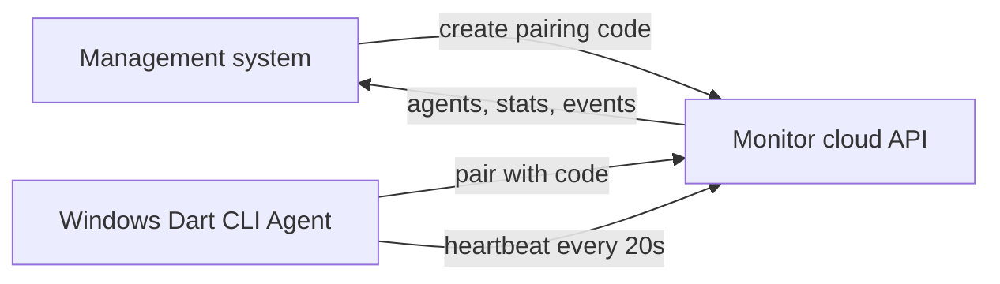

# Feishu Agent Pairing and Heartbeat MVP Design

## Reader and post-read action

This document is for engineers implementing the next Feishu monitoring slice. After reading it, they should be able to implement the cloud API, management-console integration, and a Windows Agent command-line MVP that proves Agent pairing and heartbeat online status end to end.

## Scope

This MVP proves the control-plane link between the management system and a user's local Windows Agent. It does not monitor Feishu Web messages yet and does not forward messages to Wukong IM yet.

In scope:

- Generate a short-lived Agent pairing code from the management system.
- Pair a local Windows Agent with the current user by using that code.
- Issue an Agent token after successful pairing.
- Persist Agent identity locally on the user's machine.
- Send periodic Agent heartbeat events to the cloud.
- Show the Agent as online in the Feishu information monitoring center.
- Record pairing and heartbeat state changes in monitor events.

Out of scope for this MVP:

- Playwright browser automation.
- Feishu Web login persistence.
- Feishu message extraction.
- Wukong IM forwarding.
- Windows tray UI, installer, auto-update, and service mode.
- DingTalk and Xiaoetong Agent support beyond reusable naming.

## Recommended approach

Use a real backend contract and a small Dart CLI Agent first. The management UI already expects Monitor API resources. The next slice should make those resources real and add the minimum Agent runtime needed to pair and heartbeat.

Why Dart CLI for the MVP:

- The current client stack already uses Dart and Flutter.
- The Agent can later share models and packaging knowledge with a Windows tray app.
- A CLI has fewer moving parts than a desktop Agent shell and is easier to test.
- It keeps the first milestone focused on cloud-to-local connectivity, not browser automation.

## Architecture



The cloud API owns user identity, pairing codes, Agent records, Agent tokens, online/offline calculation, and monitor events. The Windows Agent owns local device identity, local Agent token storage, heartbeat scheduling, and local logs.

## Domain model

### Agent pairing code

A pairing code is a short-lived credential created by an authenticated management user.

Fields:

- `code`: human-readable code, 6 to 8 uppercase characters or digits.
- `user_id`: owner who created the code.
- `device_name`: optional label supplied by the console.
- `platform`: first value is `windows`.
- `expires_at`: default 10 minutes from creation.
- `used_at`: null until successful pairing.
- `created_at`.

Rules:

- A code can be used once.
- Expired codes return `410 Gone`.
- Codes are stored hashed server-side if the backend has a credential-hash helper; plaintext code should not be logged.
- Multiple unused codes may exist for a user, but the console only needs to show the latest one.

### Monitor Agent

An Agent is a local runtime bound to one user.

Fields:

- `id`: stable server-generated Agent id.
- `user_id`: owner.
- `device_name`.
- `platform`: `windows` for this MVP.
- `version`.
- `status`: `online`, `offline`, or `login_required`.
- `last_heartbeat_at`.
- `created_at`.
- `updated_at`.
- `revoked_at`.

Rules:

- `online` is computed when `last_heartbeat_at` is within the online threshold.
- MVP threshold: online if last heartbeat is within 60 seconds.
- Agent heartbeat interval: 20 seconds with jitter of 0 to 5 seconds.
- If an Agent token is revoked, heartbeat returns `401` and the Agent stops with a clear local message.

### Monitor event

Events are append-only operational records shown in the monitor center.

Fields:

- `id`.
- `user_id`.
- `platform`: `feishu` for this MVP console surface.
- `agent_id`: optional.
- `route_id`: optional.
- `type`: `agent_paired`, `agent_online`, `agent_offline`, `heartbeat`, `agent_auth_failed`.
- `message`: short Chinese display text.
- `occurred_at`.
- `metadata`: optional object.

Rules:

- Do not emit one visible event for every heartbeat in the UI by default. Store heartbeat state on the Agent row; emit events only for transitions or debug mode.
- Pairing success emits `agent_paired`.
- First heartbeat after offline emits `agent_online`.
- Offline can be computed by reads; a scheduled reconciler may later emit `agent_offline`.

## API contract

All endpoints use `/v1`. Management-console endpoints use the normal user auth already used by the app. Agent runtime endpoints use an Agent bearer token returned by pairing.

Canonical error shape:

```json
{
  "error": {
    "code": "pairing_code_expired",
    "message": "绑定码已过期，请在管理系统重新生成",
    "details": {},
    "request_id": "req_abc123"
  }
}
```

### Create pairing code

`POST /v1/monitor/agent-pairing-codes`

Caller: authenticated management system.

Request:

```json
{
  "device_name": "COLORFUL-PC",
  "platform": "windows"
}
```

Response `201 Created`:

```json
{
  "data": {
    "pairing_code": "A7K9Q2",
    "expires_at": "2026-05-06T10:25:00Z"
  }
}
```

Errors:

- `401 invalid_user_session` when user auth is missing or invalid.
- `422 invalid_device_name` when device name is too long or unsupported.
- `429 pairing_rate_limited` when the user generates too many codes.

Idempotency: not required. Creating another code is allowed and produces a new code.

### Pair Agent

`POST /v1/monitor/agents/pair`

Caller: Windows Agent before it has an Agent token.

Request:

```json
{
  "pairing_code": "A7K9Q2",
  "device_name": "COLORFUL-PC",
  "platform": "windows",
  "agent_version": "0.1.0"
}
```

Response `201 Created`:

```json
{
  "data": {
    "agent_id": "agent_01HX...",
    "agent_token": "agent_token_value",
    "heartbeat_interval_seconds": 20,
    "server_time": "2026-05-06T10:15:03Z"
  }
}
```

Errors:

- `400 invalid_pairing_request` when required fields are missing.
- `404 pairing_code_not_found` when the code does not exist.
- `409 pairing_code_used` when the code was already used.
- `410 pairing_code_expired` when the code expired.
- `422 unsupported_agent_platform` when platform is not supported.
- `429 pairing_attempt_rate_limited` when repeated invalid attempts are detected.

Idempotency: code use is single-shot. If a network retry happens after the server created the Agent but before the Agent received the response, the backend should return `409 pairing_code_used`. A later enhancement can support `Idempotency-Key`; the MVP Agent can instruct the user to regenerate the code if this rare case occurs.

Security:

- Pairing code comparison should be constant-time if the backend stores hashes.
- Pairing attempts should be rate-limited by IP and code prefix.
- `agent_token` must never be logged by backend or Agent logs.

### Agent heartbeat

`POST /v1/monitor/agents/heartbeat`

Caller: paired Windows Agent.

Auth: `Authorization: Bearer <agent_token>`.

Request:

```json
{
  "agent_id": "agent_01HX...",
  "status": "online",
  "device_name": "COLORFUL-PC",
  "platform": "windows",
  "agent_version": "0.1.0",
  "capabilities": ["feishu_web_group"],
  "observed_at": "2026-05-06T10:15:20Z"
}
```

Response `200 OK`:

```json
{
  "data": {
    "agent_id": "agent_01HX...",
    "status": "online",
    "next_heartbeat_after_seconds": 20,
    "server_time": "2026-05-06T10:15:20Z"
  }
}
```

Errors:

- `401 invalid_agent_token` when token is missing, invalid, or revoked.
- `403 agent_owner_mismatch` when token does not belong to the submitted Agent id.
- `404 agent_not_found` when Agent id is unknown.
- `422 invalid_heartbeat_payload` when fields are malformed.
- `429 heartbeat_rate_limited` when the Agent heartbeats too often.

Idempotency: heartbeat is safe to retry. The backend overwrites `last_heartbeat_at` with server receive time and keeps the latest Agent metadata.

### List Agents

`GET /v1/monitor/agents?platform=feishu&limit=50&cursor=<opaque>`

Caller: authenticated management system.

Response `200 OK`:

```json
{
  "data": [
    {
      "id": "agent_01HX...",
      "device_name": "COLORFUL-PC",
      "platform": "windows",
      "version": "0.1.0",
      "status": "online",
      "last_heartbeat_at": "刚刚"
    }
  ],
  "page": {
    "next_cursor": null
  }
}
```

Pagination:

- Cursor pagination.
- Default `limit` is 50.
- Maximum `limit` is 100.

Compatibility note:

- The current Flutter client accepts a `data` array. Adding `page` is backward-compatible.
- Query parameter `platform=feishu` means the console is asking for Agents relevant to Feishu monitoring, not that the Agent OS is Feishu.

### List monitor events

`GET /v1/monitor/events?platform=feishu&limit=20&cursor=<opaque>`

Caller: authenticated management system.

Response `200 OK`:

```json
{
  "data": [
    {
      "id": "event_01HX...",
      "type": "agent_paired",
      "occurred_at": "10:15",
      "message": "Windows Agent COLORFUL-PC 已绑定"
    }
  ],
  "page": {
    "next_cursor": null
  }
}
```

Pagination:

- Cursor pagination.
- Default `limit` is 20.
- Maximum `limit` is 100.

## Windows Agent MVP behavior

### Commands

The MVP CLI should expose two user-facing commands.

Pair command:

```powershell
dart run bin/feishu_monitor_agent.dart pair --server https://infoequity.qingyunshe.top --code A7K9Q2
```

Run command:

```powershell
dart run bin/feishu_monitor_agent.dart run
```

### Local config

The Agent stores local state in a user-specific application data directory.

Stored fields:

- `server_url`.
- `agent_id`.
- `agent_token`.
- `device_name`.
- `agent_version`.
- `paired_at`.

Security rule:

- MVP may use a local JSON file with restricted file permissions.
- The next hardening slice should move the token to Windows Credential Manager or DPAPI encryption before broad distribution.

### Pair flow

1. User creates a pairing code in the management system.
2. User runs the Agent pair command with server URL and code.
3. Agent sends device name, platform, version, and pairing code.
4. Cloud validates and consumes the code.
5. Cloud creates or updates the Agent row, returns Agent token and heartbeat interval.
6. Agent saves local config.
7. Cloud emits an `agent_paired` event.
8. Management system refresh shows the Agent card.

### Heartbeat flow

1. User runs the Agent run command.
2. Agent loads local config.
3. Agent sends heartbeat immediately.
4. Agent repeats every server-provided interval plus jitter.
5. If heartbeat succeeds, Agent logs a concise local success line.
6. If network fails, Agent retries with exponential backoff capped at 60 seconds.
7. If token is invalid, Agent stops and tells the user to regenerate a binding code.

## Management system behavior

The existing Feishu information monitoring center remains the entry point.

Changes for this MVP:

- Pairing card should pass `platform=windows` when creating a code.
- Agent card should show online/offline based on backend response.
- Recent logs should show Agent pairing and online transitions.
- The page can keep manual refresh for this MVP; auto-refresh can be added after the Agent heartbeat endpoint is stable.

No new top-level navigation is needed.

## Data retention and cleanup

- Pairing codes expire after 10 minutes.
- Used or expired codes can be deleted after 24 hours.
- Monitor events should keep at least 30 days for MVP debugging.
- Agent records remain until the user revokes or deletes them in a later management slice.

## Observability

Cloud logs should include:

- Request id.
- User id for management endpoints.
- Agent id for Agent endpoints.
- Event type for pairing and heartbeat transitions.
- Error code for failed pairing and heartbeat attempts.

Cloud logs must not include:

- Agent token.
- Raw pairing code.
- Full Authorization header.

Agent local logs should include:

- Pairing start/success/failure without printing token.
- Heartbeat success at a throttled interval.
- Network retry state.
- Auth failure instruction.

## Testing strategy

Backend tests:

- Creating a pairing code returns code and expiry.
- Pairing consumes the code and returns Agent token.
- Reusing a code returns `409 pairing_code_used`.
- Expired code returns `410 pairing_code_expired`.
- Heartbeat with valid token updates Agent online state.
- Heartbeat with invalid token returns `401 invalid_agent_token`.
- Agent and event list endpoints are user-scoped.

Agent tests:

- Pair command persists config on success.
- Pair command does not log token.
- Run command sends heartbeat immediately.
- Run command backs off on network failure.
- Run command stops on invalid token.

Flutter tests:

- Pairing code request includes `platform=windows`.
- Feishu center renders online Agent from API data.
- Recent logs render Agent pairing event.

Manual smoke test:

1. Start backend with Monitor endpoints enabled.
2. Open management system and generate a binding code.
3. Run Agent pair command.
4. Run Agent heartbeat loop.
5. Refresh Feishu information monitoring center.
6. Confirm Agent is online and recent logs include pairing.

## Rollout plan

Phase 1 implements this document's MVP only.

Phase 2 adds route pull and local rule cache so the Agent can receive Feishu Web group monitoring rules.

Phase 3 adds Playwright-based Feishu Web login and text/link message detection.

Phase 4 adds Wukong IM forwarding, deduplication, retry queue, and delivery logs.

Phase 5 hardens packaging with installer, tray mode, token encryption, auto-start, and auto-update.

## Open decisions resolved for this MVP

- Agent platform is `windows`.
- Monitor console platform remains `feishu`.
- First Agent runtime is Dart CLI, not Flutter desktop tray.
- Heartbeat interval is 20 seconds; online threshold is 60 seconds.
- Pairing code TTL is 10 minutes.
- Full Feishu message monitoring is intentionally deferred.
