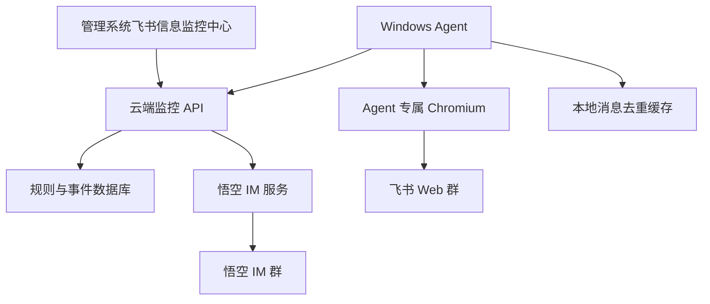

# 飞书 Web 群监听与悟空 IM 转发 MVP 设计

## 背景

当前飞书信息监控中心已经完成控制面基础能力：管理系统入口、飞书监控规则入口、Windows Agent 配对、心跳、一键绑定上线、重新配对和基础状态展示。下一阶段需要从“Agent 在线”推进到“真实监听并转发”：用户在飞书 Web 群中看到的新闻消息，可以通过本地 Windows Agent 监听，上报云端，并转发到指定悟空 IM 群。

本设计聚焦第一个可验证闭环：一个飞书 Web 群转发到一个悟空 IM 群。钉钉、小鹅通、多账号、多群并发、复杂媒体完整转发在后续阶段扩展。

## 已确认约束

1. Agent 必须使用 Chromium 浏览器能力。
2. 不使用用户日常 Chrome、Edge 的浏览器资料。
3. 不采用严格无痕模式，因为严格无痕会导致 Agent 重启后登录态丢失，需要频繁扫码，不适合长期监控。
4. 采用 Agent 专属隔离 Chromium 用户目录：
   `%APPDATA%\InfoEquity\FeishuMonitorAgent\chromium-profile`
5. 飞书登录态仅保存在 Agent 专属目录中。
6. 管理系统需要提供清除飞书登录状态、重新扫码登录的入口。
7. 不在页面、日志、文档输出中暴露 Agent token、用户 token、Bearer token、数据库密码等敏感信息。

## 目标

构建飞书 Web 群监听与悟空 IM 转发 MVP，实现：

1. Windows Agent 可以启动专属 Chromium 环境并打开飞书 Web。
2. 用户可以通过 Chromium 扫码登录飞书，登录态可复用。
3. Agent 可以检查飞书登录状态，并同步到管理系统。
4. Agent 可以根据云端规则进入指定飞书群，读取新消息。
5. Agent 将抓取到的消息上报云端。
6. 云端完成去重、入库、转发到指定悟空 IM 群，并记录事件日志。
7. 管理系统展示飞书登录状态、监听状态、最近消息、转发结果和异常原因。

## 非目标

本阶段不做以下能力：

1. 多飞书账号同时登录。
2. 多浏览器实例并发监听大量群。
3. 飞书文件、语音、视频的完整转发。
4. 钉钉、小鹅通监听实现。
5. 严格无痕浏览器模式。
6. 使用用户默认浏览器资料读取登录态。
7. 绕过飞书安全策略或验证码机制。

## 推荐架构

采用“云端控制台 + 用户本地 Windows Agent”的混合架构。



职责划分：

- 管理系统：创建规则、触发本地 Agent 操作、展示状态和日志。
- 云端 API：保存规则、Agent 状态、消息记录、转发记录，执行二次去重和转发。
- Windows Agent：控制 Chromium 登录飞书 Web、拉取规则、读取群消息、上报云端。
- Chromium 专属目录：保存飞书 Web 登录态，与用户默认浏览器隔离。

## 浏览器隔离方案

Agent 使用 Playwright 或等价 Chromium 自动化能力启动 Chromium persistent context，指定专属用户数据目录：

```text
%APPDATA%\InfoEquity\FeishuMonitorAgent\chromium-profile
```

目录规划：

```text
%APPDATA%\InfoEquity\FeishuMonitorAgent\
  agent_config.json
  chromium-profile\
  runtime\
    logs\
    dedupe-cache.json
    last-browser-status.json
```

安全策略：

1. 不复制、不读取 Chrome、Edge 默认 profile。
2. 页面和日志只展示登录状态，不展示 Cookie、token、localStorage 内容。
3. “清除飞书登录状态”只删除 `chromium-profile`，不删除 Agent 配对配置。
4. “重新配对 Agent”只影响 Agent 与云端绑定关系，不等同于飞书退出登录。

## Agent CLI 设计

现有 Agent CLI 已支持：

```powershell
pair --server <SERVER> --code <PAIRING_CODE>
run --once
```

新增命令：

### browser-login

```powershell
dart run bin/feishu_monitor_agent.dart browser-login --store-dir <STORE_DIR>
```

行为：

1. 读取 Agent 配置。
2. 启动专属 Chromium profile。
3. 打开飞书 Web 登录页或消息页。
4. 保持浏览器窗口打开，用户手动扫码登录。
5. 登录成功后本地记录浏览器状态摘要，并上报云端。

成功判断：页面出现飞书主界面、消息入口或可识别的已登录元素。

### browser-status

```powershell
dart run bin/feishu_monitor_agent.dart browser-status --store-dir <STORE_DIR>
```

行为：

1. 使用专属 Chromium profile 启动/连接浏览器。
2. 打开飞书 Web。
3. 判断登录状态。
4. 输出友好中文状态。
5. 上报云端。

状态枚举：

- `logged_in`：已登录
- `login_required`：未登录或登录失效
- `browser_error`：浏览器启动失败
- `unknown`：无法判断

### clear-browser-profile

```powershell
dart run bin/feishu_monitor_agent.dart clear-browser-profile --store-dir <STORE_DIR>
```

行为：

1. 关闭可控 Chromium 进程或提示用户关闭。
2. 删除 Agent 专属 `chromium-profile` 目录。
3. 保留 `agent_config.json`。
4. 上报飞书登录状态为 `login_required`。

### listen --once

```powershell
dart run bin/feishu_monitor_agent.dart listen --once --store-dir <STORE_DIR>
```

行为：

1. 读取 Agent 配置。
2. 使用 Agent token 拉取云端启用规则。
3. 启动专属 Chromium profile。
4. 检查飞书登录态。
5. 对启用规则，进入指定飞书群。
6. 读取最近可见消息。
7. 本地去重后上报云端。
8. 输出监听摘要。

## 云端 API 设计

### Agent 拉取规则

```http
GET /v1/monitor/agents/me/routes
Authorization: Bearer <agent_token>
```

返回当前 Agent 需要执行的启用规则。仅返回必要字段：

```json
{
  "data": [
    {
      "route_id": "route_123",
      "platform": "feishu",
      "connector_type": "feishu_web_group",
      "route_type": "feishu_web_group_to_wukong_im_group",
      "source": {
        "chat_name": "新闻群"
      },
      "destination": {
        "type": "wukong_im_group",
        "group_no": "10001",
        "group_name": "悟空新闻群"
      },
      "message_policy": {
        "include_text": true,
        "include_links": true,
        "include_images": false,
        "include_files": false
      }
    }
  ]
}
```

### Agent 上报浏览器状态

```http
POST /v1/monitor/agents/browser-status
Authorization: Bearer <agent_token>
```

请求：

```json
{
  "agent_id": "agent_123",
  "platform": "feishu",
  "browser": "chromium",
  "profile_mode": "isolated_persistent",
  "login_status": "logged_in",
  "observed_at": "2026-05-07T10:00:00Z",
  "error_message": ""
}
```

### Agent 上报已观察消息

```http
POST /v1/monitor/messages/observed
Authorization: Bearer <agent_token>
```

请求：

```json
{
  "agent_id": "agent_123",
  "route_id": "route_123",
  "source_platform": "feishu",
  "source_chat_name": "新闻群",
  "source_message_id": "feishu_web_hash_abc",
  "message_type": "text",
  "content": "新闻正文",
  "source_created_at": "2026-05-07T10:00:00Z",
  "observed_at": "2026-05-07T10:00:05Z"
}
```

云端处理：

1. 校验 Agent token 和 route 归属。
2. 使用 `(route_id, source_message_id)` 二次去重。
3. 写入消息观察记录。
4. 根据规则转发到悟空 IM 群。
5. 写入转发记录和事件日志。
6. 更新规则最近转发时间与今日转发数。

## 管理系统页面设计

在 `飞书信息监控中心` 中增强现有页面。

### 飞书登录状态卡片

显示：

- 浏览器：Chromium
- 浏览器环境：专属隔离环境
- 飞书登录状态：未检测、已登录、需要登录、浏览器异常
- 最近检测时间
- 最近错误摘要

按钮：

- 打开飞书登录
- 检查登录状态
- 清除飞书登录状态
- 测试监听一次

### 规则卡片增强

每条规则显示：

- 飞书群名称
- 悟空 IM 群名称
- 监听状态
- 今日转发数量
- 最近抓取时间
- 最近转发时间
- 最近错误

### 消息流水

展示最近消息事件：

- 监听到消息
- 已去重跳过
- 转发成功
- 转发失败
- 飞书登录失效
- 页面结构异常

## 消息识别策略

第一版使用保守策略，只处理稳定可识别的可见消息。

### source_message_id 生成

飞书 Web 不一定暴露稳定消息 ID，因此 MVP 使用组合 hash：

```text
sha256(route_id + source_chat_name + normalized_content + source_created_at_or_dom_order)
```

如果 DOM 中能读取到稳定 ID，则优先使用飞书 Web DOM ID。

### 本地去重

Agent 本地保留最近 N 条消息 hash，例如 1000 条，存储在：

```text
runtime\dedupe-cache.json
```

本地去重只用于减少重复上报。最终一致性由云端二次去重保证。

### 消息类型

MVP 支持：

- `text`
- `link`
- `image_placeholder`

图片第一版可以先记录“检测到图片消息”，完整图片下载、上传、转发放到后续阶段。

## 错误处理

Agent 需要输出友好中文错误，不直接暴露堆栈或 token。

常见错误映射：

- Chromium 未安装或启动失败：`浏览器启动失败，请检查 Agent 运行环境。`
- 飞书未登录：`飞书需要登录，请点击“打开飞书登录”扫码。`
- 找不到群：`未找到指定飞书群，请检查群名称是否准确。`
- 页面结构变化：`飞书页面结构可能已变化，需要更新监听适配。`
- 云端鉴权失败：`Agent 绑定已失效，请重新配对。`
- 转发失败：`消息已监听，但转发到悟空 IM 群失败。`

## 测试策略

### Agent 单元测试

覆盖：

1. 浏览器 profile 路径生成。
2. 清除 profile 不删除 `agent_config.json`。
3. 浏览器状态枚举解析。
4. 消息 hash 去重。
5. Agent API 请求体不包含敏感日志输出。

### Mock Server 测试

覆盖：

1. Agent 拉取规则。
2. Agent 上报浏览器状态。
3. Agent 上报消息。
4. 云端模拟去重。
5. 事件日志返回。

### 管理页面测试

覆盖：

1. 显示飞书登录状态卡片。
2. 点击打开飞书登录调用本地 binder/runner。
3. 点击清除登录状态调用本地命令。
4. 点击测试监听一次后刷新页面。
5. 错误提示使用中文友好文案。

### 手工验收

1. 在管理系统生成并绑定 Windows Agent。
2. 点击“打开飞书登录”。
3. Chromium 弹出并进入飞书 Web。
4. 扫码登录后关闭窗口，再次打开仍保持登录。
5. 新建规则：飞书群名称 + 悟空 IM 群。
6. 点击“测试监听一次”。
7. 飞书群发一条文字消息。
8. 悟空 IM 群收到转发消息。
9. 管理系统消息流水显示监听和转发成功。
10. 点击“清除飞书登录状态”，再次检查显示需要登录。

## 分阶段实施建议

### 阶段 1：Agent Chromium 登录态能力

交付：Agent 能启动 Chromium 专属 profile、打开飞书 Web、清除 profile、检测登录状态。

### 阶段 2：管理系统接入本地浏览器操作

交付：页面按钮可以打开飞书登录、检查登录状态、清除登录状态，并自动刷新状态。

### 阶段 3：Agent 拉取规则并读取飞书群消息

交付：`listen --once` 可以按飞书群名称读取最近可见文本消息，并本地去重。

### 阶段 4：云端消息上报、去重、转发悟空 IM

交付：云端接收 Agent 消息，二次去重后转发到悟空 IM 群，并记录事件日志。

## 风险与应对

1. 飞书 Web DOM 结构变化  
   应对：将选择器集中在 Agent 的 Feishu Web adapter 中，页面结构变化时只改 adapter。

2. 飞书登录态失效  
   应对：Agent 上报 `login_required`，管理系统提示重新扫码。

3. 严格无痕与长期监听冲突  
   应对：采用专属隔离 persistent profile，并提供一键清除登录态。

4. 重复转发  
   应对：本地 hash 去重 + 云端 `(route_id, source_message_id)` 唯一约束。

5. 云端压力  
   应对：Agent 只上报增量新消息；MVP 单 Agent 单群；后续加入轮询间隔、批量上报和限流。

6. 敏感信息泄露  
   应对：日志和页面不展示 Cookie、token、Bearer token；错误输出做脱敏。

## 验收标准

MVP 完成时必须满足：

1. 使用 Chromium，不使用用户默认浏览器资料。
2. 使用 Agent 专属隔离 profile，能复用飞书登录态。
3. 管理系统能打开飞书登录、检查状态、清除登录态。
4. Agent 能按规则监听一个飞书群的文本消息。
5. 飞书群新文本消息能转发到指定悟空 IM 群。
6. 管理系统能看到监听和转发日志。
7. Agent 重新启动后仍保持配对；未清除 profile 时飞书登录态可复用。
8. 页面和日志不暴露任何敏感 token。
