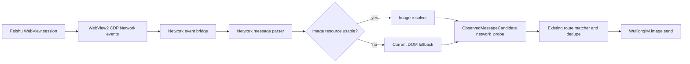

# Feishu Network Image Capture Design

Date: 2026-05-10

## Goal

Upgrade the standalone Feishu shell so it can attempt to capture and forward Feishu image messages without opening the specific Feishu conversation view.

The target outcome is:

- Text still forwards from the feed-list/event path.
- Images are captured from the Feishu Web network layer when Feishu exposes enough resource data outside the opened conversation DOM.
- The current DOM-based conversation opening remains as a fallback, not the primary path.
- The system reports honestly whether each image was captured as original, preview, thumbnail, or fallback DOM data.

## Non-Goals

- Do not use official Feishu bot event subscriptions, because the current operating constraint is an ordinary Feishu user account.
- Do not bypass Feishu account permissions. The shell may only use data available to the already logged-in Web session.
- Do not claim millisecond or original-image forwarding unless network evidence proves it.
- Do not remove the current DOM image extraction path until the network path is proven stable.

## Current Limitation

The current shell reads feed-list cards and page DOM.

For text, the feed-list card contains the needed content, so forwarding can happen quickly.

For images, the feed-list usually contains only a placeholder such as `[图片]`. The real image data currently appears after the shell opens or is already viewing the relevant Feishu conversation, where the conversation DOM exposes an image `src`, `blob:`, or `data:image` value.

This means image forwarding is seconds-level and can require opening the latest feed item.

## Research Summary

WebView2 supports Chrome DevTools Protocol methods and events through the native `ICoreWebView2` API. Relevant capabilities include:

- Calling `Network.enable`.
- Receiving `Network.responseReceived`, `Network.loadingFinished`, and WebSocket frame events.
- Calling `Network.getResponseBody` for captured HTTP responses.

The current Flutter `webview_windows` dependency exposes page-level script execution and web messages, but it does not expose the full WebView2 Network/CDP event stream to Dart. A Windows-native bridge is therefore required.

Feishu's official message-resource APIs exist, but they require app/bot capabilities and permissions that are outside the current ordinary-user constraint. They are useful as a conceptual reference for resource keys, not as the implementation path.

## Recommended Approach

Implement a two-phase network image capture upgrade.

### Phase 1: Network Diagnostics Probe

Add a network diagnostics bridge to the Feishu shell app, but do not change production forwarding behavior yet.

The bridge records a small, privacy-conscious event stream while the user sends test images from configured Feishu groups.

It should answer these questions:

- Does the Feishu Web message list or realtime channel expose an image resource key before opening the conversation?
- Does the network layer expose a downloadable image URL or response body before opening the conversation?
- Are image resources tied to a stable conversation id, message id, sender, or visible feed-card id?
- Does the captured resource represent original image, preview image, or thumbnail?

The output of this phase is a local diagnostics report and shell status fields, not automatic forwarding.

### Phase 2: Network Image Forwarding

If Phase 1 proves that resource data is available without opening the conversation, add a production network image path.

The path should:

- Convert network resource events into normal observed Feishu events.
- Attach image metadata and local image files to those events.
- Reuse the existing route matcher, dedupe store, media fingerprinting, and WuKongIM image-send path.
- Prefer network-captured original resources over DOM fallback.
- Fall back to the current DOM path when the network path cannot prove image quality or source mapping.

## Architecture

### Components

1. `FeishuNetworkCaptureBridge`
   - Windows-native WebView2/CDP bridge.
   - Enables selected Network events.
   - Emits normalized network event JSON to Dart.

2. `FeishuNetworkEventStore`
   - Short-lived in-memory ring buffer plus optional local diagnostics file.
   - Stores only bounded metadata by default.
   - Can store response snippets or image bytes only when diagnostics mode is explicitly enabled.

3. `FeishuNetworkMessageParser`
   - Parses HTTP responses and WebSocket frames.
   - Detects candidate message, conversation, sender, and media-resource fields.
   - Extracts image URL/resource keys and quality hints.

4. `FeishuNetworkImageResolver`
   - Downloads or reconstructs image bytes from captured URL/body/resource request.
   - Writes images to the same temp image directory used by the existing media path.
   - Calculates image dimensions and fingerprint.

5. `ObservedMessageCandidate` integration
   - Adds a new capture source such as `network_probe`.
   - Keeps the existing event contract so the main WuKongIM forwarder does not need a new routing model.

### Data Flow

## Image Quality Classification

Every network image candidate must carry a quality label:

- `original`: evidence indicates original image bytes or original-download resource.
- `preview`: usable image, likely compressed or resized by Feishu.
- `thumbnail`: small feed/list preview only.
- `unknown`: image-like resource without enough proof.

Forwarding policy:

- Default: forward `original` and `preview`.
- Do not call `preview` or `thumbnail` "original".
- Keep `thumbnail` disabled for auto-forward unless the user explicitly enables it.
- Continue using DOM fallback when network quality is `thumbnail` or `unknown`.

## Diagnostics Mode

Diagnostics mode is required before production forwarding.

It should expose:

- Shell status fields:
  - `network_capture_state`
  - `network_event_count`
  - `network_image_candidate_count`
  - `network_last_image_candidate`
  - `network_last_error`
- A local diagnostics file under `.runtime/feishu-network-capture/`.
- Redacted event rows showing:
  - local observed time
  - event source: HTTP response, WebSocket frame, image request
  - URL host/path pattern, without full sensitive query strings by default
  - candidate conversation/message fields
  - image candidate count and quality label

Diagnostics mode may include a temporary "raw capture" switch, but it must be off by default because raw network payloads can contain private messages, tokens, and file URLs.

## Error Handling

- If CDP Network enable fails, keep the current DOM path running and report `network_capture_state=unavailable`.
- If parsing fails, keep a redacted parse error counter and continue.
- If image download fails, emit a candidate with failure reason and allow DOM fallback.
- If a candidate cannot be mapped to a configured Feishu source, do not forward it.
- If duplicate fingerprints are detected, skip the duplicate through the existing dedupe path.

## Testing Strategy

### Unit Tests

- Parse representative redacted HTTP response samples into message candidates.
- Parse representative redacted WebSocket frame samples into message candidates.
- Classify image quality from URL/resource metadata and image dimensions.
- Verify sensitive fields are redacted in diagnostics output.
- Verify fallback behavior when a network candidate cannot be mapped to a route.

### Integration Tests

- Shell diagnostics starts and stops without breaking the existing DOM probe.
- Network candidate events appear in `/status` and diagnostics file.
- A network image candidate converts into the same forwarding service input shape as DOM images.
- Existing image fingerprint dedupe prevents repeated forwarding.

### Manual Joint Test

1. Start both desktop apps.
2. Ensure Feishu shell is logged in and on the message list page.
3. Enable network diagnostics.
4. Do not open the target Feishu conversation.
5. Send a new image in `满满正能量`.
6. Inspect diagnostics:
   - Did a network image candidate appear?
   - Is it mapped to `满满正能量`?
   - Does it include enough resource data to download an image?
   - Is quality `original`, `preview`, `thumbnail`, or `unknown`?
7. Only if the answer is good, enable production network forwarding.

## Success Criteria

Phase 1 succeeds if the diagnostics report proves one of these:

- A usable image resource is visible before opening the conversation, with enough mapping to route it safely.
- Or no usable image resource is visible, proving that conversation opening remains necessary for ordinary-user Web monitoring.

Phase 2 succeeds if:

- A newly sent Feishu image forwards to the correct WuKongIM group without opening the target Feishu conversation.
- The forwarded image has an explicit quality label.
- No stale image from another Feishu group is forwarded.
- Duplicate image sends are suppressed.
- Text forwarding remains unaffected.

## Operational Risks

- Feishu Web internals may change, especially WebSocket payload formats and resource URLs.
- Some payloads may be protobuf, compressed, encrypted, or tokenized, requiring extra parsing.
- Resource URLs may expire quickly and must be downloaded immediately.
- Full original images may not be present until the conversation is opened. In that case, the best available no-open path may only be preview or thumbnail.
- Raw diagnostics can contain sensitive private data, so raw capture must remain explicit and temporary.

## Recommendation

Proceed with Phase 1 only.

Do not promise no-open original image forwarding yet. First build the network diagnostics probe and run a live test. If Feishu Web exposes usable image resources while staying on the message list page, implement Phase 2. If it does not, keep the current DOM fallback and optimize its timing instead.
