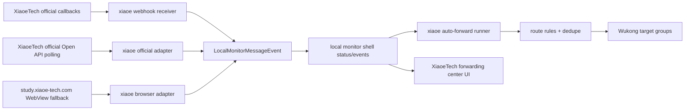

# Spec: XiaoeTech Message Forwarding Center

## Assumptions
1. The target product is the existing Flutter desktop/admin system in this repository.
2. The XiaoeTech web entry is `https://study.xiaoe-tech.com/#/muti_index`.
3. "Real-time forwarding" means source message observed to Wukong group delivery within about 1-3 seconds when the source is reachable.
4. XiaoeTech official APIs/webhooks should be preferred when credentials and message-push configuration are available.
5. Existing Feishu/local monitor infrastructure should be reused before adding XiaoeTech-specific equivalents.
6. Browser automation is required for the first version because official XiaoeTech Open API app credentials and message-push configuration are not available.

## Confirmed Scope
The target XiaoeTech sources are:

- Circle/community content.
- Course interaction content.
- Live comment / live interaction content, with each live comment's text forwarded as an individual message.

Confirmed constraints:

- There are no XiaoeTech Open API app credentials or message-push configuration permissions for the first version.
- Live comments must be forwarded as individual text comments, not only as aggregate comment counts or user-data changes.
- The shell should open `https://study.xiaoe-tech.com/#/muti_index`; the operator will manually navigate/stay on the target circle/course/live page for the MVP.
- Circle and course interaction image/file attachments are in MVP scope, not a later enhancement.
- The MVP runs as a local desktop shell like the existing Feishu monitor shell.
- The operator accepts that WebView-based monitoring requires a logged-in XiaoeTech session and may need selector maintenance when XiaoeTech changes its web UI.
- The MVP file forwarding limit is 20 MB per file; larger files are skipped with diagnostics.

This means the first implementation should be WebView-first for the XiaoeTech pages that display circle/course/live interaction content. Official message push and Open API integration remain the preferred long-term path, but they are not usable as the MVP transport under the current permissions.

## Objective
Build a XiaoeTech information forwarding center in the admin system that can monitor XiaoeTech messages and forward them into configured Wukong groups with route-based dedupe, diagnostics, and manual/automatic controls.

The user workflow should match the current Feishu information forwarding center:

- Open the XiaoeTech forwarding center from the management UI.
- Sign in or configure the official XiaoeTech app credentials.
- Observe available source rooms/groups/events.
- Create route rules from XiaoeTech source to Wukong target group.
- Enable auto-forwarding.
- View recent events, delivery counts, skipped duplicates, and errors.

## Research Summary

### Official XiaoeTech Capabilities
- XiaoeTech has an official Open API documentation site and a `消息推送` section for callback-based event delivery.
- The official platform documents access-token based Open API usage.
- The official platform exposes community/circle APIs such as circle participation/list style endpoints.
- The official platform exposes circle/community and activity APIs, including circle participants, circle member list, circle check-in task dynamic detail, activity diary lists, activity likes, and diary comment/review list APIs.
- The official platform exposes live interaction and live data APIs. The service-provider live interaction API returns aggregate fields such as thumbs count, comment user count, and comment count; it does not appear to return per-comment text in the public page I found.
- The official `直播用户数据推送` callback pushes changed live user data and includes fields such as `comment_num`, but this is user-data change notification rather than a per-comment message stream.
- I did not find official documentation for a live "group chat message stream", group robot webhook, or WebSocket subscription for the `study.xiaoe-tech.com` multi-index web chat/group UI.

Sources:

- [XiaoeTech message push introduction](https://api-doc.xiaoe-tech.com/api_list/news_push/intruduction.html)
- [XiaoeTech callback URL validation](https://api-doc.xiaoe-tech.com/api_list/news_push/call_back_url_check.html)
- [XiaoeTech access token guide](https://api-doc.xiaoe-tech.com/develop_guide/get_access_token.html)
- [XiaoeTech community API example](https://api-doc.xiaoe-tech.com/api_list/community/xe_community_user_list.html)
- [XiaoeTech community/circle API index](https://api-doc.xiaoe-tech.com/api_list/community.html)
- [XiaoeTech live interaction aggregate API](https://api-doc.xiaoe-tech.com/api_list/provider/live/live_interact_data_get.html)
- [XiaoeTech live user data push](https://api-doc.xiaoe-tech.com/api_list/news_push/alive_user_data.html)

### Consequence
The long-term architecture is hybrid:

1. Official callback receiver for all XiaoeTech events supported by message push.
2. Official polling adapters for circle/community, course interaction, activity/check-in, and live interaction resources that are not callback-based.
3. Browser-based shell fallback only for per-comment/live-comment content that official APIs do not expose as event detail.

The first version should implement item 3 first because official credentials are unavailable and per-comment live text is required. To keep this maintainable, the browser adapter must still normalize every captured item into the existing `LocalMonitorMessageEvent` shape and use the same route, dedupe, SSE, and forwarding code as Feishu/local monitor.

## Tech Stack
- Main app: Flutter/Dart, Riverpod-adjacent existing app patterns, `dio`, `shared_preferences`, Wukong IM SDK.
- Existing monitor shell: Dart HTTP/SSE shell API plus Flutter Windows WebView shell app.
- Existing forwarding core:
  - `LocalMonitorShellStatus`, `LocalMonitorMessageEvent`, `LocalMonitorObservedConversation`.
  - `LocalMonitorShellClient` HTTP/SSE client.
  - `LocalMonitorForwarding` relay identity and text sender primitives.
  - Feishu/DingTalk/Juliang/Mengxia monitor center patterns.
- New XiaoeTech adapters should use the existing local monitor event shape instead of creating a parallel event model.
- Image attachments can reuse the existing `image_attachments` event field and Feishu-style download/upload forwarding flow.
- File attachments need a small shared `file_attachments` extension to `LocalMonitorMessageEvent` because the current common monitor model only has image attachments.

## Commands
Use these after implementation starts:

```powershell
flutter test test/modules/xiaoe_monitor
flutter test test/modules/local_monitor
dart test tools/xiaoe_monitor_shell/test
flutter test tools/xiaoe_monitor_shell_app/test
flutter analyze
flutter build windows
```

If only the official webhook receiver is implemented first:

```powershell
flutter test test/modules/xiaoe_monitor
flutter analyze
```

## Project Structure
Planned file layout:

```text
lib/modules/xiaoe_monitor/
  xiaoe_monitor_center_page.dart              # Admin UI, built on monitor_center shared sections where practical
  xiaoe_monitor_shell_client.dart             # Thin wrapper over LocalMonitorShellClient
  xiaoe_monitor_shell_models.dart             # Xiaoe aliases/adapters around LocalMonitor* models
  xiaoe_monitor_forwarding_service.dart       # Reuse LocalMonitor forwarding and Wukong sender patterns
  xiaoe_monitor_auto_forward_runner.dart      # Poll/SSE runner modeled on Feishu/DingTalk runners
  xiaoe_official_webhook_parser.dart          # Official callback validation/decrypt/normalize
  xiaoe_open_api_client.dart                  # Access token and official API polling

tools/xiaoe_monitor_shell/
  lib/src/shell_server.dart                   # Reuse/extract from local_monitor_shell_core where possible
  lib/src/xiaoe_webhook_receiver.dart         # Official callback endpoint to LocalMonitorMessageEvent

tools/xiaoe_monitor_shell_app/
  lib/main.dart                               # WebView fallback for study.xiaoe-tech.com
  lib/src/xiaoe_page_probe.dart               # DOM/network probe adapters only if needed
  lib/src/xiaoe_network_capture_parser.dart   # Network parser only if official APIs are insufficient

lib/modules/local_monitor/
  local_monitor_shell_models.dart             # Add shared file_attachments support
  local_monitor_forwarding.dart               # Add shared file relay primitive if Wukong file content is available

test/modules/xiaoe_monitor/
tools/xiaoe_monitor_shell/test/
tools/xiaoe_monitor_shell_app/test/
```

## Existing Reuse Targets

Reuse these before adding Xiaoe-specific code:

- `lib/modules/local_monitor/local_monitor_shell_models.dart`
  - The common status, observed conversation, observed message, image attachment, and message event JSON contracts already match what XiaoeTech needs.
- `lib/modules/local_monitor/local_monitor_shell_client.dart`
  - Already supports `/status`, `/health`, `/capture/start`, `/capture/stop`, `/runtime/reload`, `/routing/sources`, and `/events` SSE.
- `lib/modules/local_monitor/local_monitor_forwarding.dart`
  - Provides relay identity and Wukong text forwarding primitives.
- `lib/modules/feishu_monitor/feishu_monitor_forwarding_service.dart`
  - Provides a reusable pattern for preparing browser-captured media, uploading through `FileApi`, and sending Wukong image content.
- `lib/modules/feishu_monitor/feishu_monitor_auto_forward_runner.dart`
  - Shows the correct auto-forward loop: settings load, route sync, status fetch, recent event merge, startup priming, SSE-triggered low-latency forwarding.
- `tools/feishu_monitor_shell_app/lib/main.dart`
  - Shows the browser shell pattern: WebView, injected page observer scripts, network capture bridge, periodic probe, status persistence, and shell server integration.
- `lib/modules/monitor_center/monitor_center_page_scaffold.dart`
  - Should be the shared UI scaffold for a new XiaoeTech center instead of copying the large Feishu page.

## Code Style
Keep adapters thin and platform-specific parsing isolated:

```dart
LocalMonitorMessageEvent normalizeXiaoeWebhookEvent(
  XiaoeWebhookEnvelope envelope,
  DateTime observedAt,
) {
  final sourceId = envelope.sourceId.trim();
  final messageId = envelope.messageId.trim();
  return LocalMonitorMessageEvent(
    eventId: 'xiaoe:$sourceId:$messageId',
    dedupeKey: '$sourceId:$messageId',
    accountId: envelope.appId,
    conversationId: sourceId,
    conversationName: envelope.sourceName,
    conversationType: envelope.sourceType,
    messageId: messageId,
    senderId: envelope.senderId,
    senderName: envelope.senderName,
    messageType: envelope.messageType,
    text: envelope.text,
    sentAt: envelope.sentAt,
    observedAt: observedAt.toUtc(),
    captureSource: 'xiaoe_official_webhook',
  );
}
```

Conventions:

- Normalize every inbound XiaoeTech event into `LocalMonitorMessageEvent`.
- Keep source-specific parsing in `xiaoe_*` files.
- Keep forwarding and dedupe generic unless XiaoeTech has a real platform-specific requirement.
- Use route matching by source id first, then normalized name fallback.
- Do not include cookies, tokens, request headers, or raw decrypted payloads in persistent diagnostics.

## Testing Strategy
Use test-driven development for implementation:

- Parser tests first:
  - XiaoeTech callback URL verification.
  - Encrypted/decrypted callback envelope normalization.
  - Unsupported event types are ignored with diagnostics.
  - Duplicate event ids produce stable dedupe keys.
- Forwarding tests:
  - Route matches source id before source name.
  - Disabled routes are skipped.
  - Startup priming does not replay historical events.
  - SSE snapshot updates trigger forwarding.
- Browser fallback tests:
  - DOM sample produces observed conversations.
  - DOM/network sample produces normalized events.
  - DOM/network sample extracts image attachments for circle/course interaction.
  - DOM/network sample extracts file name, source URL/local path, mime type, and size when a file attachment is visible/downloadable.
  - Missing selectors degrade to diagnostics, not crashes.
- Shared model tests:
  - `LocalMonitorMessageEvent` preserves `image_attachments`.
  - `LocalMonitorMessageEvent` preserves new `file_attachments`.
  - File attachment records without source URL/local path are ignored.
- Manual verification:
  - Start XiaoeTech shell.
  - Login to `study.xiaoe-tech.com`.
  - Manually open and stay on one target circle/course/live page from `muti_index`.
  - Confirm `/status`, `/events/recent`, and UI status update.
  - Send one test live text comment and verify one Wukong forwarded text message.
  - Send or expose one image interaction item and verify one Wukong forwarded image message.
  - Send or expose one file interaction item and verify one Wukong forwarded file message or explicit unsupported-file diagnostic if Wukong file content is not available.

## Boundaries

- Always:
  - Prefer official XiaoeTech webhook/API data.
  - Normalize to existing local monitor models.
  - Add failing tests before parser/forwarding behavior.
  - Keep secrets in local config or environment, never source code.
  - Record unsupported event types in diagnostics.
  - Preserve existing Feishu/DingTalk behavior.
  - Keep file attachment forwarding bounded to 20 MB per file and record skipped oversized files in diagnostics.

- Ask first:
  - Adding new third-party dependencies.
  - Storing XiaoeTech session cookies or decrypted payloads.
  - Database schema changes.
  - Cloud deployment/nginx/public callback changes.
  - Browser scraping selectors if official APIs can satisfy the use case.

- Never:
  - Hard-code XiaoeTech credentials.
  - Forward historical messages on startup before priming dedupe.
  - Modify Feishu-specific logic just to make XiaoeTech work.
  - Bypass XiaoeTech access controls or scrape data outside the logged-in account's permitted view.
  - Persist raw cookies, authorization headers, or full sensitive callback bodies in logs.

## Recommended Architecture



### Phase 1: WebView MVP For Per-Comment Text
Implement a XiaoeTech WebView shell for the authenticated pages that show circle/community, course interaction, and live comments.

Acceptance:

- WebView shell can load `https://study.xiaoe-tech.com/#/muti_index` and preserve login/session state locally.
- Probe detects login status and current page type.
- Probe observes the manually active source page using stable URL/title/text anchors.
- New visible circle/course/live comment items normalize into `LocalMonitorMessageEvent`.
- Each live comment text is emitted as an individual event.
- Circle/course images normalize into `image_attachments` and are forwardable.
- Circle/course files normalize into `file_attachments` and are forwardable when the Wukong file sender supports the file type.
- `/events` SSE emits `snapshot_updated` after new captured comments.
- The management UI can route XiaoeTech events to Wukong groups.
- Selector failures show diagnostics instead of silently stopping forwarding.

### Phase 2: Coverage Hardening
Improve the WebView adapter for the exact XiaoeTech surfaces used in production.

Acceptance:

- Route configuration supports specific circle/course/live-room URLs or names.
- The shell can keep configured live/comment pages warm and recover after reload.
- Startup priming prevents old visible comments from being forwarded on launch.
- Dedupe survives refreshes and page re-rendering.
- Diagnostics expose last selector hits, page URL, page title, visible comment count, and last captured comment time.

### Phase 3: Unified Admin Experience
Expose XiaoeTech in the monitor center with the same route and delivery model as Feishu.

Acceptance:

- XiaoeTech center uses shared monitor center sections where possible.
- Route import/export follows existing route CSV style.
- Auto-forward can be enabled/disabled.
- Manual "forward recent events" works.
- Recent logs show sent/skipped/failed counts.

### Phase 4: Official Integration When Available
Add XiaoeTech official message push/Open API integration after app credentials and message-push permissions are available.

Acceptance:

- Callback verification passes XiaoeTech's URL validation.
- Supported official callback/API payloads normalize into `LocalMonitorMessageEvent`.
- Official and WebView sources share the same forwarding settings and dedupe store.
- WebView remains available for per-comment live text if official APIs still do not expose comment text.

## Success Criteria

- A XiaoeTech source event can be forwarded to a configured Wukong group exactly once.
- A live comment text visible on the active XiaoeTech page can be forwarded as one Wukong text message.
- A circle/course image visible or downloadable from the active XiaoeTech page can be forwarded as one Wukong image message.
- A circle/course file visible or downloadable from the active XiaoeTech page can be forwarded as one Wukong file message, or skipped with an explicit unsupported-file diagnostic if the local Wukong sender cannot send that file type yet.
- Existing Feishu monitor tests continue passing.
- XiaoeTech parser/forwarding tests cover official callback, route matching, dedupe, disabled route, and malformed payload paths.
- If browser fallback is implemented, the fallback reports selector and login diagnostics in `/status`.
- No new duplicate forwarding pipeline is introduced; XiaoeTech uses the `LocalMonitor*` model and HTTP/SSE contract.

## Remaining Questions

No blocking questions remain for the MVP. The accepted defaults are local desktop shell runtime, logged-in WebView session requirement, selector maintenance risk, and 20 MB per-file forwarding limit.

## Implementation Tasks

- [x] Task: Confirm XiaoeTech source navigation and MVP attachment scope.
  - Acceptance: The MVP opens `muti_index`, the operator manually stays on the target page, and text/image/file capture are in scope.
  - Verify: Spec updated with selected source types and required credentials.
  - Files: `docs/superpowers/specs/2026-05-17-xiaoe-message-forwarding-center.md`

- [x] Task: Add shared local monitor file attachment model tests.
  - Acceptance: Tests fail until `LocalMonitorMessageEvent` and `LocalMonitorObservedMessage` parse and preserve `file_attachments`.
  - Verify: `flutter test test/modules/local_monitor/local_monitor_shell_models_test.dart`
  - Files: `test/modules/local_monitor/local_monitor_shell_models_test.dart`

- [x] Task: Implement shared local monitor file attachment model.
  - Acceptance: `file_attachments` supports source URL, local path, file name, mime type, and size bytes without breaking existing image attachment parsing.
  - Verify: `flutter test test/modules/local_monitor/local_monitor_shell_models_test.dart`
  - Files: `lib/modules/local_monitor/local_monitor_shell_models.dart`

- [x] Task: Scaffold XiaoeTech WebView shell and capture core.
  - Acceptance: The shell opens `https://study.xiaoe-tech.com/#/muti_index`, hosts the shared local monitor HTTP/SSE server, persists status, and uses a stable WebView profile for the operator login session.
  - Verify: `flutter test tools/xiaoe_monitor_shell_app/test`
  - Files: `tools/xiaoe_monitor_shell_app/**`

- [x] Task: Add XiaoeTech WebView probe/parser tests.
  - Acceptance: Tests fail on missing parser and cover visible circle/course/live comment samples, image/file attachment samples, malformed samples, and duplicate comment samples.
  - Verify: `flutter test tools/xiaoe_monitor_shell_app/test/xiaoe_page_probe_test.dart`
  - Files: `tools/xiaoe_monitor_shell_app/test/xiaoe_page_probe_test.dart`

- [x] Task: Implement XiaoeTech WebView probe and normalizer.
  - Acceptance: Visible XiaoeTech comments normalize to `LocalMonitorMessageEvent` with stable dedupe keys, per-comment live text, image attachments, and file attachments.
  - Verify: `flutter test tools/xiaoe_monitor_shell_app/test/xiaoe_page_probe_test.dart`
  - Files: `tools/xiaoe_monitor_shell_app/lib/src/xiaoe_page_probe.dart`

- [ ] Task: Add XiaoeTech shell client/model wrappers.
  - Acceptance: UI and runner can fetch status/events through `LocalMonitorShellClient` without Xiaoe-specific duplicate HTTP logic.
  - Verify: `flutter test test/modules/xiaoe_monitor/xiaoe_monitor_shell_client_test.dart`
  - Files: `lib/modules/xiaoe_monitor/xiaoe_monitor_shell_client.dart`, `lib/modules/xiaoe_monitor/xiaoe_monitor_shell_models.dart`

- [ ] Task: Add XiaoeTech forwarding service and settings store.
  - Acceptance: Route matching, dedupe, disabled route, text delivery, image delivery, and file delivery/unsupported-file diagnostics behave like Feishu/local monitor.
  - Verify: `flutter test test/modules/xiaoe_monitor/xiaoe_monitor_forwarding_service_test.dart`
  - Files: `lib/modules/xiaoe_monitor/xiaoe_monitor_forwarding_service.dart`

- [ ] Task: Add XiaoeTech auto-forward runner.
  - Acceptance: Runner primes startup events, listens to SSE, syncs configured sources, and forwards new route-matched events.
  - Verify: `flutter test test/modules/xiaoe_monitor/xiaoe_monitor_auto_forward_runner_test.dart`
  - Files: `lib/modules/xiaoe_monitor/xiaoe_monitor_auto_forward_runner.dart`

- [ ] Task: Add XiaoeTech management page.
  - Acceptance: Status, controls, routes, and logs are usable and consistent with existing monitor center UI.
  - Verify: `flutter test test/modules/xiaoe_monitor/xiaoe_monitor_center_page_test.dart`
  - Files: `lib/modules/xiaoe_monitor/xiaoe_monitor_center_page.dart`, route registration files

- [ ] Task: Add browser fallback only if official coverage is insufficient.
  - Acceptance: XiaoeTech WebView shell observes conversations/messages from `study.xiaoe-tech.com/#/muti_index` with diagnostics.
  - Verify: `flutter test tools/xiaoe_monitor_shell_app/test`
  - Files: `tools/xiaoe_monitor_shell_app/**`

- [ ] Task: Add official webhook/API integration later when permissions exist.
  - Acceptance: Official callback/API payloads normalize to the same `LocalMonitorMessageEvent` contract without changing forwarding routes.
  - Verify: `flutter test test/modules/xiaoe_monitor/xiaoe_official_webhook_parser_test.dart`
  - Files: `lib/modules/xiaoe_monitor/xiaoe_official_webhook_parser.dart`, `lib/modules/xiaoe_monitor/xiaoe_open_api_client.dart`

## Human Approval Gate

Approved on 2026-05-17. Implementation has started with the shared local monitor file attachment model. Given the confirmed lack of XiaoeTech Open API credentials, the requirement for per-comment live text forwarding, manual active-page navigation, and image/file attachment scope, the MVP remains WebView-first and should reuse the existing local monitor forwarding pipeline.
