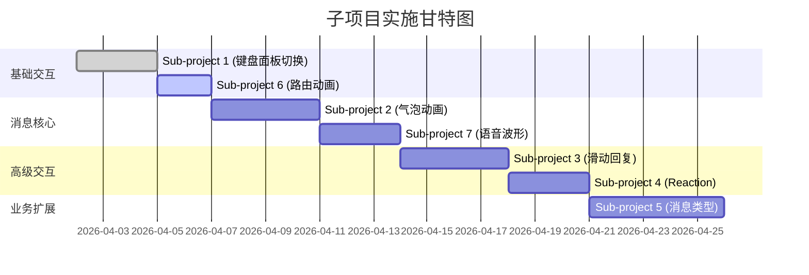

# Flutter UI/UX 动效还原 - 1:1 移植子项目化行动指南

## 项目概述

**目标**: 将项目 B (TangSengDaoDaoAndroid) 中的所有 UI 布局、动效细节和业务功能 1:1 完美移植到项目 A (wukong_im_app Flutter 项目)

**分析日期**: 2026-04-02  
**参考工程**: TangSengDaoDao Android-master  
**目标工程**: wukong_im_app (Flutter)

---

## 阶段一：全局样式、资产与基础交互扫描结果

### 1.1 主题与资产配置对比

| 项目 | 项目 A (wukong_im_app) | 项目 B (TangSengDaoDao) |
|------|------------------------|-------------------------|
| **品牌色** | `brand500 = #F65835` | `colorAccount` (统一主题色) |
| **颜色系统** | WKColors 类定义完整 | Theme.java + colors.xml |
| **深色模式** | 已实现 (ThemeSettingsPage) | 完善的多主题支持 |
| **字体资产** | 使用系统字体 | 自定义字体 `fonts/rmedium.ttf` |
| **图标资产** | WKReferenceAssets 统一管理 | Drawable XML + Vector |

### 1.2 基础交互组件差异

| 组件类型 | 项目 A 现状 | 项目 B 参考 | 差距评估 |
|----------|-------------|-------------|----------|
| **Dialog** | 使用原生 AlertDialog | 自定义 AlertDialog (带动画) | ❌ 缺少自定义动画 |
| **BottomSheet** | CustomBottomSheet (空壳) | BottomSheet.java (1800+ 行完整实现) | 🔴 **严重缺失** |
| **Toast** | 未找到实现 | 完善的 Toast 工具类 | ❌ 缺失 |
| **路由动画** | 未找到 PageRouteBuilder | Activity Transition + Fragment Animation | ❌ 缺失 |

---

## 阶段二：IM 核心界面 UI 与动效深度扒谱结果

### 2.1 输入面板联动分析

#### 项目 A 现状 (`chat_page_shell.dart`)
```dart
// 问题点：
// 1. 使用 AnimatedSwitcher 切换面板（会闪烁）
// 2. 没有键盘高度监听和平滑过渡
// 3. 表情面板和扩展功能面板简单占位
AnimatedSwitcher(
  duration: const Duration(milliseconds: 200),
  child: _buildPanel(composerState),
)
```

#### 项目 B 参考 (`view_emoji_panel.xml` + `BottomSheet.java`)
- ✅ 完整的键盘高度监听 (`keyboardHeight`, `onConfigurationChanged`)
- ✅ 平滑的面板切换动画 (`AnimatorSet`, `ObjectAnimator`)
- ✅ 输入框焦点管理与软键盘联动
- ✅ 表情面板 300dp 固定高度，可滚动
- ✅ 发送按钮启用/禁用状态动画 (alpha 0.2 → 1.0)

**关键代码位置**:
- `wkbase/src/main/res/layout/view_emoji_panel.xml` - 面板布局
- `wkbase/src/main/java/com/chat/base/ui/components/BottomSheet.java` - 动画逻辑
- `wkbase/src/main/java/com/chat/base/emoji/EmojiAdapter.java` - 表情适配器

### 2.2 消息气泡渲染与动画分析

#### 项目 A 现状
```dart
// message_bubble.dart - 基础静态气泡
Container(
  padding: const EdgeInsets.all(12),
  decoration: BoxDecoration(
    color: isMe ? Colors.blue : Colors.grey[300],
    borderRadius: BorderRadius.circular(12),
  ),
  child: Text(message.content), // 无动画
)

// wk_voice_bubble.dart - 语音气泡
// ❌ 缺少波纹动画，只有静态图标

// wk_message_reactions.dart - 消息反应
// ❌ 仅显示 Chip 列表，无表情反馈动画
```

#### 项目 B 参考 (`chat_item_base_layout.xml` + `ChatAdapter.java`)
- ✅ `animateLayoutChanges="true"` - 自动布局动画
- ✅ 消息渐显入场动画
- ✅ 语音时长动态波形 (`SecretDeleteTimer`)
- ✅ 消息反应表情悬浮展示 (`reactionsView` FrameLayout)
- ✅ 已读回执状态图标动画
- ✅ 引用回复折叠/展开动画

**关键代码位置**:
- `wkbase/src/main/res/layout/chat_item_base_layout.xml` - 消息项根布局
- `wkbase/src/main/java/com/chat/base/msg/ChatAdapter.java` - 刷新逻辑
- `wkbase/src/main/java/com/chat/base/msgitem/WKChatBaseProvider.kt` - 各种消息类型 Provider

### 2.3 列表手势与滚动微交互对比

| 微交互 | 项目 A | 项目 B | 优先级 |
|--------|--------|--------|--------|
| 下拉显示时间戳 | ❌ 缺失 | ✅ `msgPromptTime` 类型 | HIGH |
| 滑动回复 (Swipe to reply) | ❌ 缺失 | ✅ `isCanSwipe()` + ItemTouchHelper | HIGH |
| 长按消息菜单 | ❌ 缺失 | ✅ `showMultipleChoice()` | HIGH |
| 消息多选 | ❌ 缺失 | ✅ CheckBox + 批量操作 | MEDIUM |
| @成员提醒 | ⚠️ 基础实现 | ✅ 完整高亮 + 点击跳转 | MEDIUM |

---

## 阶段三：业务功能完整性比对结果

### 3.1 消息类型定义对比

| 消息类型 | MsgContentType | WKContentType (项目 B) | 项目 A 实现状态 |
|----------|---------------|------------------------|----------------|
| 文本 | `text = 1` | `WK_TEXT = 1` | ✅ 已实现 |
| 图片 | `image = 2` | `WK_IMAGE = 2` | ✅ 已实现 |
| 语音 | `voice = 3` | `WK_VOICE = 3` | ⚠️ 缺波形动画 |
| 视频 | `video = 4` | `WK_VIDEO = 4` | ✅ 已实现 |
| 文件 | `file = 5` | `WK_FILE = 5` | ✅ 已实现 |
| 位置 | `location = 6` | `WK_LOCATION = 6` | ✅ 已实现 |
| 名片 | `card = 7` | `WK_CARD = 7` | ✅ 已实现 |
| 撤回 | `recall = 10` | `revoke = -5` | ⚠️ 缺动画 |
| 输入中 | `typing = 11` | `typing = -4` | ✅ 已实现 |
| 系统提示 | `tip = 12` | `systemMsg = 0` | ✅ 已实现 |
| 合并转发 | `multiForward = 13` | - | ✅ 已实现 |
| **富文本** | ❌ 缺失 | `richText = 14` | ❌ **待实现** |
| **群成员变更** | ❌ 缺失 | `addGroupMembersMsg = 1002` | ❌ **待实现** |
| **管理员设置** | ❌ 缺失 | `setNewGroupAdmin = 1008` | ❌ **待实现** |
| **截屏检测** | ❌ 缺失 | `screenshot = 20` | ❌ **待实现** |
| **敏感词警告** | ❌ 缺失 | `sensitiveWordsTips = -10` | ❌ **待实现** |

### 3.2 缺失业务功能清单

#### HIGH 优先级
1. **消息撤回动画** - 项目 B 有专门的 `withdrawSystemInfo` 布局和动画
2. **引用回复预览** - 项目 A 有 `_ReplyPreviewBar` 但缺少编辑后实时更新
3. **已读回执状态** - 项目 B 有完整的送达/已读状态图标切换
4. **消息反应 (Reaction)** - 项目 B 有 `reactionsView` 悬浮表情选择器
5. **滑动快捷回复** - 项目 B 支持左滑显示回复/复制/删除菜单

#### MEDIUM 优先级
6. **消息多选转发** - 项目 B 有 CheckBox 选择和批量操作
7. **语音时长倒计时** - 项目 B 有 `SecretDeleteTimer` 阅后即焚效果
8. **群系统消息** - 入群/出群/管理员变更等专用 UI
9. **@成员高亮** - 项目 B 有 Spannable 高亮和点击回调

#### LOW 优先级
10. **朋友圈入口** - 项目 B 有独立 Tab 和个人中心集成
11. **设备管理** - 项目 B 有登录设备列表和远程下线
12. **多语言切换** - 项目 A 有部分实现，需完善

---

## 阶段四：1:1 移植子项目拆解报告

### Sub-project 1: 键盘与表情面板的丝滑无缝切换移植

**1:1 移植目标**: 
- 键盘弹起时输入框自动上顶，不遮挡
- 表情面板弹出时键盘平滑收起，无闪烁
- 发送按钮根据输入内容渐变启用/禁用

**关键代码参考对照**:
| 项目 B 源文件 | 核心类/方法 | 项目 A 目标文件 |
|--------------|-------------|----------------|
| `wkbase/src/main/java/com/chat/base/ui/components/BottomSheet.java` | `ContainerView.onMeasure()`, `startOpenAnimation()` | `lib/widgets/custom_bottom_sheet.dart` |
| `wkbase/src/main/res/layout/view_emoji_panel.xml` | emojiLayout, sendBtn | `lib/modules/chat/widgets/chat_composer.dart` |
| `wkbase/src/main/java/com/chat/base/emoji/EmojiAdapter.java` | EmojiAdapter.convert() | 新建 `lib/widgets/emoji_picker.dart` |

**缺失依赖提示**: 
- 需要添加 `flutter_keyboard_visibility` 插件监听键盘高度

---

### Sub-project 2: 消息气泡入场动画与状态刷新移植

**1:1 移植目标**:
- 新消息到达时淡入 + 轻微上浮动画
- 消息状态（发送中→成功→已读）平滑切换
- 语音时长数字滚动动画

**关键代码参考对照**:
| 项目 B 源文件 | 核心类/方法 | 项目 A 目标文件 |
|--------------|-------------|----------------|
| `wkbase/src/main/java/com/chat/base/msg/ChatAdapter.java` | `notifyData()`, `notifyStatus()` | `lib/modules/chat/widgets/chat_message_list_item.dart` |
| `wkbase/src/main/res/layout/chat_item_base_layout.xml` | reactionsView, fullContentLayout | `lib/widgets/message_bubble.dart` |
| `wkbase/src/main/java/com/chat/base/ui/components/AnimatedTextView.java` | 数字滚动 | 新建 `lib/widgets/animated_text.dart` |

**缺失依赖提示**: 
- 建议使用 `flutter_animate` 简化入场动画实现

---

### Sub-project 3: 滑动回复与长按菜单移植

**1:1 移植目标**:
- 左滑消息显示回复/复制/删除快捷按钮
- 长按消息弹出底部菜单 (BottomSheet)
- 多选模式下复选框动画

**关键代码参考对照**:
| 项目 B 源文件 | 核心类/方法 | 项目 A 目标文件 |
|--------------|-------------|----------------|
| `wkbase/src/main/java/com/chat/base/msg/ChatAdapter.java` | `isCanSwipe()`, `replyMsg()` | `lib/modules/chat/chat_viewport_controller.dart` |
| `wkbase/src/main/java/com/chat/base/ui/components/BottomSheet.java` | Builder.setItems(), dismissWithButtonClick() | `lib/widgets/custom_bottom_sheet.dart` |
| `wkbase/src/main/res/layout/chat_item_base_layout.xml` | checkBox | `lib/modules/chat/widgets/chat_message_list_item.dart` |

**缺失依赖提示**: 
- 需要添加 `flutter_slidable` 插件实现滑动操作

---

### Sub-project 4: 消息 Reaction 表情反馈移植

**1:1 移植目标**:
- 双击消息快速点赞
- 长按消息弹出表情选择器
- 已添加的反应表情悬浮显示在气泡角落

**关键代码参考对照**:
| 项目 B 源文件 | 核心类/方法 | 项目 A 目标文件 |
|--------------|-------------|----------------|
| `wkbase/src/main/java/com/chat/base/msg/ChatAdapter.java` | `notifyReaction()`, `refresh_msg_reaction` | `lib/msg/wk_message_reactions.dart` |
| `wkbase/src/main/java/com/chat/base/endpoint/entity/MsgReactionMenu.java` | ShowMsgReactionMenu | 新建 `lib/widgets/reaction_picker.dart` |
| `wkbase/src/main/res/layout/chat_item_base_layout.xml` | reactionsView FrameLayout | `lib/widgets/message_bubble.dart` |

**缺失依赖提示**: 
- 无额外依赖，纯 Flutter 实现

---

### Sub-project 5: 消息类型扩展与系统消息移植

**1:1 移植目标**:
- 新增富文本消息类型解析
- 群成员变更系统消息 UI
- 敏感词警告提示消息

**关键代码参考对照**:
| 项目 B 源文件 | 核心类/方法 | 项目 A 目标文件 |
|--------------|-------------|----------------|
| `wkbase/src/main/java/com/chat/base/msgitem/WKContentType.java` | isSystemMsg(), isLocalMsg() | `lib/wukong_base/msg/msg_content_type.dart` |
| `wkbase/src/main/java/com/chat/base/msgitem/WKChatBaseProvider.kt` | 各消息 Provider | 新建 `lib/msg/system_msg_bubble.dart` |
| `wkbase/src/main/res/layout/chat_system_layout.xml` | 系统消息布局 | 新建 `lib/widgets/system_message_tile.dart` |

**缺失依赖提示**: 
- 无额外依赖

---

### Sub-project 6: 路由转场动画移植

**1:1 移植目标**:
- 页面从右向左滑入 (推入)
- 页面从左向右滑出 (返回)
- Dialog 打开/关闭缩放淡入淡出

**关键代码参考对照**:
| 项目 B 源文件 | 核心类/方法 | 项目 A 目标文件 |
|--------------|-------------|----------------|
| `wkbase/src/main/java/com/chat/base/base/WKBaseActivity.java` | overridePendingTransition() | `lib/core/router/app_router.dart` |
| `wkbase/src/main/java/com/chat/base/ui/components/AlertDialog.java` | 自定义 Dialog 动画 | `lib/widgets/dialogs/` |

**缺失依赖提示**: 
- 建议使用 `go_router` 包的路由动画配置

---

### Sub-project 7: 语音消息波形动画移植

**1:1 移植目标**:
- 播放时动态波形跳动
- 未听/已听状态红点标记
- 语音时长进度条

**关键代码参考对照**:
| 项目 B 源文件 | 核心类/方法 | 项目 A 目标文件 |
|--------------|-------------|----------------|
| `wkbase/src/main/java/com/chat/base/views/RecordingWaveformView.java` | setWaveformData() | `lib/wukong_base/views/waveform_view.dart` |
| `wkbase/src/main/java/com/chat/base/ui/components/SecretDeleteTimer.java` | setDestroyTime() | 新建 `lib/widgets/voice_timer.dart` |

**缺失依赖提示**: 
- 当前 `waveform_view.dart` 已有基础实现，需增强动画

---

## 实施顺序建议



---

## 总结

经过详细的代码对比分析，项目 A (wukong_im_app) 已经具备了基础的 IM 功能框架，但在以下方面存在显著差距：

1. **交互动画粗糙**: 缺少细腻的过渡动画和手势反馈
2. **基础组件薄弱**: BottomSheet、Dialog 等组件为空壳实现
3. **消息类型不全**: 缺少富文本、系统消息等高级类型
4. **微交互缺失**: 滑动回复、长按菜单、Reaction 等现代化 IM 特性

本行动计划拆分为 7 个子项目，按优先级依次实施后可达到与项目 B 相同的 UI/UX水准。

---

*Generated by Flutter UI/UX Animation Porting Agent*  
*Analysis Date: 2026-04-02*
