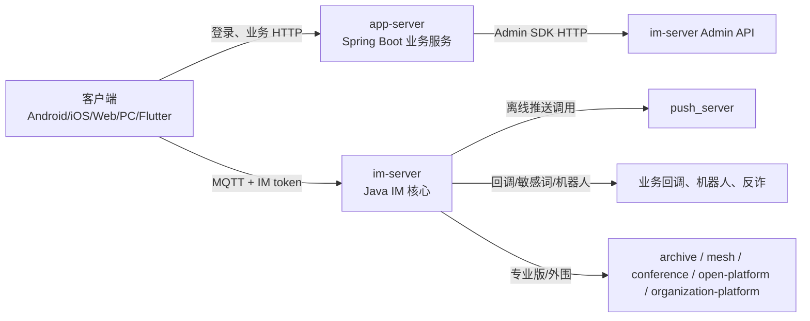
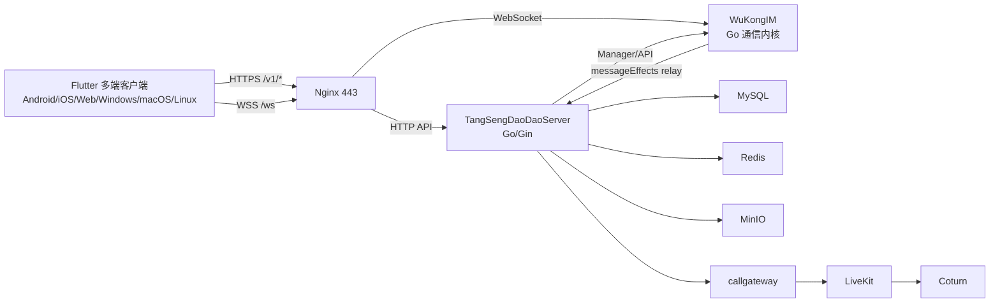

# WuKongIM 与 WildfireChat 深度对比报告

报告日期：2026-05-23
报告对象：WildfireChat 开源组织项目、WuKongIM 官方通信内核、当前 WuKong Flutter/TangSengDaoDao 生产工程
读者：准备选型、迁移、继续生产化改造或做二次开发的工程负责人
目标动作：读完后能判断两套 IM 的技术取舍、功能差距、性能边界、运维风险，以及下一阶段优化优先级。

## 1. 结论摘要

如果只看“开箱业务完整度”，WildfireChat 更像一套多年沉淀的企业 IM 生态：核心 IM、业务 app-server、Android/iOS/Web/PC 多端客户端、推送、机器人、开放平台、组织架构、频道平台、会议、归档、跨域 mesh、朋友圈等外围仓库都比较完整。它的优势不是单点性能最先进，而是“业务件齐全、集成路径成熟、移动端经验多”。代价是系统由大量 Java/Spring 服务和多个客户端仓库组成，专业版/付费 SDK 边界较多，核心 IM 社区版的架构仍偏传统：Java + MQTT/Moquette + MySQL/H2 + Hazelcast。

如果只看“通信内核架构与性能潜力”，WuKongIM 更激进：Go、gnet、WKProto 自研二进制协议、Pebble KV、自研面向 IM 的分布式存储、多组 Raft、去中心化集群、内置 Prometheus/manager/bench 能力。它的核心设计更贴近高吞吐长连接与频道日志系统，官方 README 明确强调单机 20 万级发送能力、10 万人群、节点自动故障转移和无外部中间件依赖。代价是业务生态需要 TangSengDaoDaoServer 或自研业务服务补齐；你的当前生产部署仍是单节点 WuKongIM 内核 + TSDD 业务层 + MySQL/Redis/MinIO/LiveKit/Coturn，并没有启用 WuKongIM 多节点去中心化集群。

你当前的 WuKong 工程已经不是普通 demo：Flutter 多端客户端、本地 SDK vendor、TSDD 后端、Nginx 边缘收口、MinIO 文件、LiveKit 通话、Coturn、Redis/MySQL、Web/PWA/通知、protobuf 控制协议灰度、消息本地 FTS/WAL、生产 smoke/doctor/perf 脚本都已经存在。它在“单产品工程化”和“你自己的业务闭环”上已经超过 WildfireChat demo 形态，但在“官方生态完整性、企业管理外围组件、成熟原生客户端和专业版功能件”上仍明显弱于 WildfireChat 组织。

最关键判断：

| 维度 | 更强一方 | 原因 |
| --- | --- | --- |
| 通信内核性能潜力 | WuKongIM | Go/gnet/Pebble/Raft/自研协议，少中间件依赖，面向频道日志和分布式存储设计 |
| 业务生态完整度 | WildfireChat | app-server、原生端、PC/Web、推送、组织、开放平台、频道、归档、会议、mesh、朋友圈等仓库齐全 |
| 当前你项目的落地完整度 | WuKong 当前工程 | 已部署生产栈并围绕 Flutter/TSDD 做了大量工程化增强 |
| 多端客户端成熟度 | WildfireChat | Android/iOS/Web/PC 原生与 Electron/UniApp/Flutter 等选择多，移动端 SDK/UIKit 更成熟 |
| Flutter 一套多端统一 | WuKong 当前工程 | 当前客户端以 Flutter 为主，统一 Android/iOS/Web/Windows/macOS/Linux 成本更低 |
| 集群高可用上限 | WuKongIM 官方内核 | 去中心化多组 Raft/节点互备是核心设计；WildfireChat 社区版更依赖外部 DB 和专业版能力 |
| 企业功能外围 | WildfireChat | 组织、开放平台、频道平台、mesh、archive、push admin、会议录制等现成仓库更多 |
| 运维简洁性 | 单节点 WuKongIM 更简单；完整业务栈两者都复杂 | WuKongIM 内核可单二进制运行，但你的业务栈已包含 9 个容器；WildfireChat 完整生态服务更多 |
| 二次开发边界清晰度 | WildfireChat 业务层清晰，WuKongIM 内核边界更先进 | WildfireChat 明确推荐业务改 app-server/API/回调；WuKongIM 通信内核与 TSDD 业务层也分层，但你项目已有较多定制 |

## 2. 对比对象边界

本报告把两边拆成三层，否则会把“通信内核能力”和“业务产品能力”混在一起。

| 层级 | WildfireChat | WuKongIM / 当前 WuKong |
| --- | --- | --- |
| 通信内核 | `im-server`，Java/Maven，多模块，MQTT 长连接，Admin/Robot/Channel API | 官方 `WuKongIM`，Go，WKProto/JSON RPC，gnet，Pebble，Raft，manager/bench/metrics |
| 业务服务 | `app-server`，Spring Boot，登录、SMS、PC 扫码、收藏、会议元数据、媒体上传等 | `TangSengDaoDaoServer`，Go/Gin，用户、群、消息、文件、机器人、搜索、监控、实时 session、callgateway 等 |
| 客户端/生态 | Android/iOS/Web/Electron/Flutter/UniApp/小程序/Harmony/PC 原生等多个仓库 | 当前 Flutter 多端客户端 + vendored `wukongimfluttersdk`；官方也有 Android/iOS/JS/UniApp/Flutter/Harmony SDK |
| 当前部署 | 本次未部署 WildfireChat，仅做源码级分析 | 已在 `ubuntu@42.194.218.158` 运行生产栈 |

重要限制：

- WildfireChat 的完整组织已做第一轮仓库级分析，但未在本机搭建完整生产集群压测。
- WuKongIM 官方核心仓库已临时缓存并阅读关键源码与 README；你的生产环境做了只读 SSH 检查。
- 报告中涉及性能数字时，区分“官方/仓库 benchmark 资料”和“当前服务器运行状态”。没有做新的正式压力测试，不把线上 idle stats 当吞吐能力证明。

## 3. 当前 WuKong 生产部署事实

服务器：`42.194.218.158`
主机：Ubuntu Linux 6.8，内存约 7.5 GiB，根分区约 178 GiB。

当前运行容器：

| 服务 | 镜像 | 状态 | 职责 |
| --- | --- | --- | --- |
| `nginx` | `nginx:1.27-alpine` | Up | 80/443 TLS 入口、HTTP API 与 WebSocket 反代 |
| `wukongim` | `wukongim/wukongim:v2.2.4-redacted-20260503` | Up healthy | IM 通信核心，容器内 5100/5200/5001，宿主仅绑定 `127.0.0.1:5001` |
| `tsdd-api` | `wukongim/tsdd-api:production-local` | Up healthy | TangSengDaoDao 业务 API |
| `callgateway` | 同 `tsdd-api` 镜像 | Up healthy | LiveKit 通话票据/信令网关 |
| `livekit` | `livekit/livekit-server:v1.9.8` | Up | WebRTC 媒体服务器 |
| `coturn` | `coturn/coturn:4.7.0-r2` | Up | TURN/TURNS/NAT 穿透 |
| `mysql` | `mysql:8.0` | Up healthy | TSDD 业务数据库 |
| `redis` | `redis:7-alpine` | Up healthy | 缓存、会话/实时控制辅助 |
| `minio` | `minio/minio` | Up healthy | 对象存储 |

当前配置要点：

- WuKongIM release 模式，内部 TCP `5100`、HTTP `5001`、WS `5200`。
- 外部 IM WebSocket 地址通过 Nginx 暴露为 `wss://infoequity.cn/ws`。
- 外部 API URL 为 `https://infoequity.cn`。
- WuKongIM `tokenAuthOn` 和 `managerToken` 已启用/配置，报告不记录密钥值。
- `messageEffects` 已开启，WuKongIM 通过内部 HTTP relay 到 TSDD 的 message-effects 持久化接口。
- TSDD 通过内部 `http://wukongim:5001` 调用 WuKongIM manager/API。
- 文件服务使用 MinIO，外部下载通过 HTTPS 域名路径转发。
- 健康检查显示 TSDD `/v1/ping` 返回成功，callgateway `/v1/callgateway/healthz` 返回成功。

安全注意：

- 渲染后的服务配置中包含管理密码、数据库 DSN、Redis 密码、短信 super code、对象存储 AK/SK 等敏感项。报告不保存具体值。
- `tsdd.yaml` 中仍能看到明文配置，这是容器化常见形态，但生产上应依赖严格文件权限、备份脱敏、CI/CD secret 管理和日志脱敏。
- 你当前已经把 WuKongIM API 管理端口绑定到 `127.0.0.1:5001`，比公网暴露更安全。

## 4. 总体架构对比

### 4.1 WildfireChat 架构

WildfireChat 的核心运行路径是：

核心特点：

- `im-server` 专注 IM 协议、长连接、消息路由、用户/好友/群组/频道/聊天室数据、Admin/Robot/Channel API。
- `app-server` 专注登录、业务 API、短信、密码、PC 扫码、收藏、群公告、会议元数据、媒体上传等。
- 外围能力通过独立仓库扩展：推送、归档、开放平台、组织平台、频道平台、跨域 mesh、会议、机器人、朋友圈等。
- 官方文档和源码都暗示：二次开发优先走 app-server、Admin API、回调、机器人、频道、自定义消息，不建议直接改 IM 核心。

### 4.2 WuKongIM / 当前 WuKong 架构

当前你的系统是：

核心特点：

- 官方 WuKongIM 内核是 Go 单体服务，包含 gateway、API、manager、存储、集群、Raft、metrics/diagnostics/bench 等能力。
- TSDD 是业务服务，补齐账号、群、文件、机器人、搜索、监控、实时 session、通话引导等产品能力。
- 你的客户端是 Flutter 主线，vendored `wukongimfluttersdk` 负责 IM TCP/WS、协议编解码、本地 SQLite、消息/会话/频道管理。
- 你的生产栈已经把公网入口基本收敛到 Nginx，WuKongIM 原始管理端口仅本地绑定。

### 4.3 架构取舍本质

| 维度 | WildfireChat | WuKongIM / 当前 WuKong |
| --- | --- | --- |
| 核心范式 | 传统 IM 服务 + 外部业务服务 + 外围组件生态 | 高性能通信内核 + Go 业务服务 + Flutter 一体化客户端 |
| 长连接协议 | MQTT 语义，Moquette/Mars/ProtoLogic 相关栈 | 自研 WKProto 二进制协议，WebSocket 可用 JSON RPC/WKProto |
| 存储思路 | IM 数据主要在 H2/MySQL，Hazelcast 做内存/集群辅助 | 官方内核内置 Pebble KV 和分布式日志；你的 TSDD 业务数据仍用 MySQL/Redis |
| 集群思路 | 社区版核心更偏传统部署；性能/百万连接/mesh 多依赖专业版资料 | 官方核心把去中心化、多组 Raft、节点互备作为主设计 |
| 业务扩展 | app-server + Admin API + 回调 + 机器人 + 平台仓库 | TSDD modules + WuKongIM manager/API + messageEffects + realtime session |
| 生态风格 | 多仓库、多服务、多客户端 | 当前工程偏单主仓 Flutter + 后端源码嵌入/部署脚本 |

## 5. 技术栈对比

| 领域 | WildfireChat | WuKongIM / 当前 WuKong |
| --- | --- | --- |
| IM 核心语言 | Java 8 | Go，官方仓库当前要求 Go 1.20+，当前源码 `go.mod` 为 Go 1.23 toolchain |
| IM 网络层 | Netty + Moquette MQTT 改造；Android 侧 Tencent Mars | gnet v2，TCP/WebSocket，WKProto/JSON RPC/WS mux |
| 消息编解码 | MQTT topic + protobuf payload + session AES | WKProto frame：CONNECT/SEND/SENDACK/RECV/RECVACK/PING/PONG/SUB 等 |
| 数据库 | H2/MySQL；JPA 业务服务；ClickHouse archive 可选 | 官方内核 Pebble；TSDD 业务 MySQL；Redis 辅助；客户端 SQLite |
| 集群/HA | Hazelcast；专业版压测/cluster/mesh 能力较多 | etcd raft v3、多组 Raft、slot/channel log、节点互备、动态扩容设计 |
| 客户端 | Android Java、iOS ObjC/Swift、Web/Vue、Electron、Flutter、UniApp、小程序、Harmony 等 | 当前 Flutter 主客户端；官方另有 Android/iOS/JS/UniApp/Flutter/Harmony SDK |
| 服务端业务框架 | Spring Boot、Shiro、JPA | TSDD Go/Gin、Viper、gocraft/dbr、Redis/MySQL、MinIO SDK |
| 音视频 | WildfireChat AVEngineKit + Janus/wf-janus + conference clients | Flutter WebRTC/LiveKit client + LiveKit server + Coturn + callgateway |
| 推送 | 独立 `push_server` 支持 APNs/FCM/华为/荣耀/小米/OPPO/vivo/个推/UniPush/Harmony | 当前 Flutter 依赖 FCM/local notifications/web notifications；厂商推送生态不如 WildfireChat 完整 |
| 监控 | 官方 docs、admin 截图、push/admin、archive status；核心监控需按部署整理 | 当前部署有 production doctor、edge health、mysql health、perf probe；官方 WuKongIM 有 Prometheus/manager/diagnostics |

## 6. 功能对比

### 6.1 IM 基础能力

| 功能 | WildfireChat | WuKongIM / 当前 WuKong | 评价 |
| --- | --- | --- | --- |
| 单聊 | 支持 | 支持 | 两者均具备 |
| 群聊 | 支持，群组权限/成员/通知链路成熟 | 支持，TSDD 群 API 很丰富 | 两者均具备；WuKong 官方强调群人数无上限/10 万群 |
| 聊天室/频道/订阅 | `im-server` 有 chatroom/channel；`channel-platform` 独立 | WuKongIM 核心是 channel-based pub/sub | WuKongIM 内核抽象更统一；WildfireChat 平台组件更现成 |
| 自定义消息 | 支持 | 支持 | 两者均具备 |
| 消息漫游/历史 | 支持，MySQL/H2，archive-server 可进 ClickHouse | 支持，频道 message_seq 同步；客户端本地分页/FTS 已强化 | WuKongIM 内核历史模型更像日志；WildfireChat archive 现成度高 |
| 多设备在线 | 支持 | 支持，当前还有设备 identity/session 控制改造 | 两者均具备 |
| 消息已读/回执/撤回 | 支持 | 当前 TSDD/Flutter 有已读、撤回/编辑/扩展相关 API | 两者均具备，但具体 UI/策略需按客户端核验 |
| 离线命令/控制消息 | 支持 | 支持 cmd/realtime session/event 体系 | WuKong 当前正在向 protobuf envelope + ack/gap repair 演进 |
| 机器人 | robot_server、robot-gateway、open-platform robot | TSDD robot API 和当前业务机器人/监控转发 | WildfireChat 机器人生态仓库更多；WuKong 当前业务更贴近你的场景 |
| Webhook | 支持回调、敏感词、GitHub webhook 等 | TSDD webhook/datasource/messageEffects | 两者都有；WildfireChat 样例更多 |

### 6.2 账号、组织与开放平台

| 功能 | WildfireChat | 当前 WuKong |
| --- | --- | --- |
| 登录/注册 | app-server SMS/password/LDAP/PC 扫码 | TSDD 用户名/短信/设备登录/扫码/第三方登录桥接等 |
| 组织架构 | `organization-platform` 独立仓库，支持组织、员工、导入、部门群 | 当前未看到同等成熟组织平台；有 workplace/manager/VIP/用户管理等模块 |
| 开放平台 | `open-platform` 管理第三方 app/robot/channel，带 admin/workbench | 当前有 `openapi`、robot、webhook，但不像 WildfireChat 有完整开放平台产品 |
| 频道平台 | `channel-platform` 管理公众号/频道菜单/自动回复/订阅 | WuKongIM channel 抽象强，但当前业务 UI/管理平台不等价 |
| 管理后台 | WildfireChat public `admin` 仓库只有截图/README，实际源码不完整；平台仓库自带 admin | 你本地有 `TangSengDaoDaoManager-main` 和 admin phase docs，但本报告未深挖管理端源码 |

结论：企业目录、开放平台、频道平台这些“B 端外围产品”，WildfireChat 现成度更高。当前 WuKong 更像面向你业务场景逐步搭建的主产品，通用平台化能力还需要继续产品化。

### 6.3 客户端功能

WildfireChat 客户端生态：

- Android 主仓包含 app、client、uikit、push、webrtc、avenginekit、pttclient、Mars native 等模块。
- iOS 主仓和 Swift demo 提供完整 iOS SDK/UIKit/AV 集成路径。
- Web 有 `vue-chat`、`vue-pc-chat`、旧 `web-chat`、React 变体、UniApp、小程序、Harmony 等。
- 多数客户端默认连官方 demo 地址，需要自托管时同时替换 app-server 与 im-server 地址。

当前 WuKong 客户端：

- Flutter 单工程覆盖 Android、iOS、Web、Windows、macOS、Linux。
- 使用 Riverpod、GoRouter、Dio、本地 vendored `wukongimfluttersdk`。
- 当前工程已实现或在代码中存在：登录、会话、聊天、图片/语音/文件相关、好友、群、黑名单、搜索、收藏、反应、提醒、机器人、监控转发、PWA、Web 通知、LiveKit 通话入口、VIP/启动策略等。
- 本地 SQLite 已有消息表、会话表、频道、成员、reaction、reminder，且已有 FTS5/WAL/索引优化记录。

客户端结论：

- 如果要“最快获得成熟原生移动体验”，WildfireChat Android/iOS 更强。
- 如果要“一套代码快速覆盖桌面/Web/移动，并深度贴合你的业务”，当前 WuKong Flutter 更合适。
- 你的 Flutter 客户端已经大量工程化，但仍要持续控制 `IMService` 这类上帝服务、平台差异 adapter、Web IndexedDB/Windows DB worker、通话体验和大文件上传等长期复杂度。

### 6.4 音视频与会议

| 维度 | WildfireChat | 当前 WuKong |
| --- | --- | --- |
| 核心媒体栈 | AVEngineKit + Janus/wf-janus | LiveKit + flutter_webrtc + Coturn |
| 会议客户端 | android-conference、ios-conference、voip-uni | Flutter `video_call`/callgateway/LiveKit 路线 |
| 录制/回放 | wf-conference-record-player 处理 Janus `.mjr` | 当前未看到同等会议录制后处理产品 |
| AI/ASR | minutes-server + asr-api 占位/外部服务 | 当前可扩展，但报告未确认同等会议纪要能力 |

结论：WildfireChat 的 AV 生态更“官方配套”，但依赖其 AV SDK/Janus 专业能力。你当前用 LiveKit 是更现代、通用、云原生的 RTC 选择，工程可控性高，但会议管理、录制、纪要、跨端 UI 完整度还需要继续补。

### 6.5 推送

WildfireChat `push_server` 是独立完整产品：

- 支持 APNs、FCM、华为、荣耀、小米、OPPO、vivo、个推、UniPush、Harmony 云推。
- 有 Vue 管理台、配置热刷新、测试推送、统计。
- 风险是 push 入口本身依赖网络隔离，默认 admin/admin123 和默认 secret 必须修改。

当前 WuKong：

- Flutter 侧有 FCM、local notifications、desktop notifier、Web Notification/PWA 等。
- Android 厂商推送适配不如 WildfireChat `push_server` 成熟完整。
- 如果目标是中国大陆 Android 后台到达率，WildfireChat 的厂商推送仓库价值明显；当前 WuKong 需要补齐华为/小米/OPPO/vivo/荣耀等厂商通道或接入统一推送供应商。

## 7. 性能与扩展性对比

### 7.1 官方/仓库性能资料

WildfireChat：

- `Performance_Test` 是专业版性能测试方法仓库，不包含压力工具本体。
- README 记录过单聊发送 1000 万消息，约 509 秒，约 19,646 msg/s；单聊收发约 13,908 msg/s。
- `C1000K_Test` 记录单节点百万长连接测试方案：1 台 16C32G IM、1 台 4C8G MySQL、20 台压测机，每台 5 万连接。
- 这些资料明确依赖专业版 IM 包和 `wfcstress`，不能直接等同社区版或任意硬件。

WuKongIM：

- 官方 README 声称开源中单机发送并发超 20 万、支持 10 万人群、内置自研分布式存储、无第三方中间件分布式 IM。
- 官方仓库内置 `wkbench` 黑盒压测工具，可通过 public HTTP、bench API、WKProto gateway 压测，不绕过集群语义。
- `wkbench capacity send` 支持搜索最大稳定 ingress send QPS；bench API 默认应只在受控压测环境开启。
- 官方内核在代码层可见 gnet、Pebble、Raft、slot/channel log、diagnostics/metrics/manager 等性能/观测设计。

### 7.2 核心架构对性能的影响

| 性能要素 | WildfireChat | WuKongIM |
| --- | --- | --- |
| 协议开销 | MQTT + protobuf + session 加密，生态成熟但通用协议开销较大 | 自研二进制帧，心跳 1 字节，面向 IM 定制 |
| 网络事件模型 | Netty/Mars，Java 生态成熟 | gnet 多 event loop，Go 高并发网络模型 |
| 持久化 | MySQL/H2，用户消息索引与消息分片表 | Pebble channel log + slot meta + Raft log，更像日志型存储 |
| 扇出 | 传统 IM fanout + DB 用户索引 | channel append、delivery runtime、presence route，设计上更贴近日志/订阅 |
| 集群扩容 | 社区版/专业版能力边界需确认；cluster 测试中跨节点 RPC 非线性 | 去中心化、多组 Raft、slot/channel 迁移是核心代码路径 |
| 压测工具 | 专业版 `wfcstress`，公开仓库主要是方法文档 | `wkbench` 在官方开源仓库内 |

从理论和源码结构看，WuKongIM 内核性能上限更高，尤其在高并发连接、频道日志、分布式副本方面更有现代设计感。WildfireChat 的优势是经过业务场景打磨，配套客户端和外围服务多，但社区版核心的存储/集群模型不如 WuKongIM 激进。

### 7.3 你当前生产部署的性能现实

当前服务器约 7.5 GiB 内存，所有服务共机运行：Nginx、WuKongIM、TSDD、MySQL、Redis、MinIO、LiveKit、Coturn。只读 `docker stats` 看到内存占用并不高，WuKongIM 约 200 MiB 量级，Redis/MySQL/MinIO 在数百 MiB 量级。但这只是当前运行状态，不是容量证明。

当前瓶颈更可能出现在：

- 单机资源：MySQL、Redis、MinIO、WuKongIM、LiveKit 共享 7.5 GiB 内存。
- Redis 已有较高 block IO 累计，AOF 和实时控制/缓存写入需要观察。
- MySQL 和 MinIO 与 IM 同机，压测时磁盘 IO 会互相干扰。
- LiveKit/Coturn 音视频会和 IM/API 共享带宽与 CPU。
- 当前未启用 WuKongIM 多节点集群，单点故障仍存在。
- TSDD 业务 API 的 SQL、文件上传、消息同步装配仍可能成为真实业务瓶颈。

### 7.4 性能结论

| 场景 | 更建议 |
| --- | --- |
| 十万级长连接、高吞吐消息通道、未来多节点去中心化 | WuKongIM |
| 快速上业务功能、企业 IM 常见外围、成熟移动端体验 | WildfireChat |
| 当前你的项目继续迭代 | 继续 WuKongIM，但必须补标准压测、观测和多节点 HA |
| 中国大陆移动端离线推送到达率 | WildfireChat push_server 思路可借鉴；WuKong 当前需补厂商推送 |
| 历史归档/审计搜索 | WildfireChat archive-server 现成；WuKong 可自建 ClickHouse/ES 归档但需要工程投入 |

## 8. 安全与运维对比

### 8.1 WildfireChat 风险点

- 多个仓库存在 demo 默认密钥、默认 admin 账号或示例地址，例如 `im.admin_secret=123456`、`token.key=testim`、`admin/admin123`。
- Admin API `18080` 必须内网化；官方文档也强调不能公网暴露。
- `push_server` push 入口源认证较弱，应只允许 `im-server` 访问。
- `mesh-bridge` 持有本地 IM Admin API 权限，内部端口依赖网络隔离。
- `archive-server` group archive 查询要谨慎做成员鉴权。
- 多个专业版外围依赖闭源/付费 SDK，升级、兼容、授权要纳入运维计划。
- Shiro DB session 在多个 Spring 服务中出现，规模上来后要换 Redis 或其他 session store。

### 8.2 当前 WuKong 风险点

- 单节点部署仍是最大可用性风险，WuKongIM 官方 HA 能力尚未在当前生产栈启用。
- TSDD 渲染配置中存在明文 secret，需要确保备份、日志、CI、文档不泄漏。
- TSDD 当前仍配置短信 super code 类能力，生产应确认只在受控测试场景可用。
- 文件上传和 MinIO 权限策略必须持续审计，避免匿名写、过大文件内存放大、路径污染。
- WebSocket `/ws` 已通过 Nginx 收口，但还需要持续做握手限流、连接数限制、异常协议日志控制。
- Redis/MySQL/MinIO 与 IM/RTC 同机，安全隔离和资源隔离都有限。
- 当前管理端/API/VIP/监控等本地有大量未提交改动和文档，发布节奏需要严格 release gate。

### 8.3 运维成熟度

WildfireChat 的运维难点是“组件多、专业版边界多、Java 服务多、默认配置要清理”。
当前 WuKong 的运维难点是“你已经做了较多定制，单仓/生产脚本复杂，需要标准化发布、压测和灾备”。

你当前的优势：

- 有 Docker Compose 生产模板。
- 有 Nginx edge health、MySQL health、production doctor、smoke、perf probe 脚本。
- 有备份/恢复脚本、MinIO 清理 cron、生产发布文档。
- 已做端口收口和 token 日志脱敏镜像。

你当前缺口：

- 没有正式多节点 WuKongIM cluster。
- 没有独立压测环境和固定基线报告。
- 没有完整 Prometheus/Grafana 仪表盘闭环。
- 没有把 MySQL/Redis/MinIO/LiveKit 从单机资源竞争中拆开。

## 9. 二次开发与可维护性

### 9.1 WildfireChat

优点：

- 核心/业务/外围边界清晰。
- Java/Spring 对传统企业后端团队友好。
- Android/iOS 原生栈成熟，适合要深度原生体验的团队。
- API/回调/机器人/频道/开放平台是成熟扩展方式。

缺点：

- 多仓库维护成本高。
- 一些能力依赖专业版或闭源二进制协议栈。
- 前端技术栈分散：Vue2/Vue3/React/Electron/UniApp/Harmony 等。
- Java 8/Spring Boot 2.x/Shiro/JPA 等栈需要安全补丁和现代化维护。
- 核心 IM 改动成本高，不建议直接改。

### 9.2 当前 WuKong

优点：

- Flutter 主客户端一套代码覆盖多端，产品迭代效率高。
- TSDD Go 后端模块丰富，和当前业务强绑定。
- 官方 WuKongIM 内核现代化，性能潜力高。
- 你已经围绕生产环境做了大量脚本、测试和文档。
- 本地 SDK 已 vendor，构建不依赖外部 sibling 目录。

缺点：

- Flutter 客户端已经较大，`IMService`、chat viewport、监控模块、PWA/通知/平台差异持续增加复杂度。
- TSDD 源码在当前仓库/远端部署中有较多业务定制，和官方上游差距会越来越大。
- 管理端与生产发布相关未提交文件很多，版本边界要收紧。
- 多节点高可用、厂商推送、企业平台外围、归档审计等仍需自研或借鉴 WildfireChat。

## 10. 迁移与借鉴建议

### 10.1 不建议整体换回 WildfireChat

你的后端已经部署 WuKongIM/TSDD，Flutter 多端客户端也已经围绕 WuKong SDK、TSDD API、LiveKit、MinIO、Web/PWA 等做了大量适配。现在整体切换到 WildfireChat 会产生：

- 客户端 SDK 替换成本。
- 登录/token/clientId 协议重做。
- 消息模型、message_seq、local DB、反应/提醒/撤回/编辑等模型迁移。
- LiveKit 与 WildfireChat AVEngineKit/Janus 路线冲突。
- 后端 TSDD 业务 API 与 WildfireChat app-server API 不兼容。

除非目标是直接采购/采用 WildfireChat 专业版生态，否则不建议整体迁移。

### 10.2 建议从 WildfireChat 借鉴的能力

| WildfireChat 能力 | 对当前 WuKong 的价值 | 建议 |
| --- | --- | --- |
| `push_server` 厂商推送矩阵 | 中国大陆 Android 到达率 | 设计 WuKong push service，支持 APNs/FCM/华为/荣耀/小米/OPPO/vivo |
| `archive-server` ClickHouse 归档 | 审计、合规、超长历史搜索 | 为 WuKong messageEffects 或消息同步链路加 ClickHouse archive |
| `open-platform` | 第三方机器人/应用生态 | 在 TSDD openapi/robot 基础上产品化应用注册、secret、工作台 |
| `organization-platform` | 企业通讯录/部门群 | 若目标客户是企业 IM，应补组织树、员工、导入、部门群维护 |
| `mesh-bridge` | 多域互通 | 只有多租户/跨域场景需要，短期不建议优先 |
| `anti-fraud` | 敏感词/风控闭环 | 当前已有 word sync/filter，可补管理端和审计流程 |
| `wf-conference-record-player` | 会议录制后处理 | 如果 LiveKit 会议要商用，应规划录制、回放、纪要 |

### 10.3 建议从 WuKongIM 官方内核继续吃透的能力

| 能力 | 当前状态 | 建议 |
| --- | --- | --- |
| 多节点 cluster | 当前生产未启用 | 搭三节点测试集群，验证 slot/channel 副本、故障转移、滚动升级 |
| wkbench | 官方仓库有工具 | 做独立压测环境，不在生产启 bench API |
| Prometheus/manager/diagnostics | 内核支持，当前需接入 | 建 Grafana 仪表盘：连接数、send QPS、sendack p95、message_seq lag、WS 错误 |
| messageEffects | 当前已开启 relay | 将其变成归档、风控、审计、搜索索引的统一事件出口 |
| plugin hook | 官方配置默认关闭 | 暂不启用，等隔离、超时、fail-close 策略成熟后再评估 |
| realtime protobuf envelope | 你已做客户端/服务端灰度基础 | 补 server proto v2、event_id/aggregate_id/schema_version 一等字段、ack/gap repair 监控 |

## 11. 下一阶段优先级

### P0：生产安全与稳定性

1. 明文 secret 管理收口：`.env`、rendered yaml、备份、日志、CI 产物统一脱敏和权限检查。
2. 保持公网只开放 80/443 和必要 RTC/TURN 端口，确认 `5100/5200/5001/6979/3306/6379/9000/9001` 不公网开放。
3. 对 `/ws` 加连接速率、握手失败日志采样、异常协议封禁。
4. 对文件上传链路做流式上传、大小限制、类型检查、MinIO 桶策略复核。
5. 建立正式备份恢复演练：MySQL、Redis、MinIO、WuKongIM data、TSDD data。

### P1：性能基线与观测

1. 独立压测环境启用 `wkbench`，不要在生产启 bench API。
2. 固定三类基线：连接数、单聊 send QPS、群聊 fanout、历史分页/search p95。
3. 接入 Prometheus/Grafana，最少覆盖 Nginx、WuKongIM、TSDD、MySQL、Redis、MinIO、LiveKit。
4. 将当前 `perf_probe.py` 变成发布门禁，记录每次版本基线。
5. 对 Redis AOF、MySQL buffer pool、MinIO IO 做资源隔离或迁出计划。

### P2：高可用与横向扩展

1. 搭 WuKongIM 三节点 staging cluster，验证节点宕机、leader 转移、slot/channel 迁移。
2. 将 MySQL/Redis/MinIO 迁出同机或至少做资源限制与备份副本。
3. TSDD API 做无状态化和多实例验证，Redis session/cache 兜底。
4. Nginx 加 upstream health/failover，证书续期自动化验证。
5. LiveKit/Coturn 单独规划带宽与公网 IP。

### P3：功能生态补齐

1. 厂商推送服务。
2. ClickHouse 归档/审计搜索。
3. 企业组织架构/部门群。
4. 第三方应用开放平台。
5. 会议录制/回放/纪要。
6. 管理端统一控制台和权限审计。

## 12. 选型建议

### 继续当前 WuKong 路线的条件

适合继续当前路线，如果目标是：

- 做你自己的 IM 产品，而不是直接部署通用企业 IM 套件。
- 希望 Flutter 一套多端快速迭代。
- 需要未来高并发通信内核潜力。
- 能接受自研/补齐推送、组织、归档、开放平台等外围。
- 团队能维护 Go + Flutter + Docker/云原生生产栈。

### 考虑 WildfireChat 的条件

适合考虑 WildfireChat，如果目标是：

- 快速得到成熟 Android/iOS 原生体验。
- 企业 IM 外围能力比通信内核上限更重要。
- 需要开放平台、组织、频道、mesh、会议、朋友圈、厂商推送等现成配套。
- 能接受 Java/Spring 多服务、多仓库和专业版授权边界。

### 本项目推荐

当前项目建议继续 WuKongIM 路线，不建议整体迁移到 WildfireChat。WildfireChat 应作为“功能生态和生产硬化参考库”，特别借鉴 push、archive、organization、open-platform、mesh 的产品边界和安全注意事项。

短期最有价值的路线不是换技术栈，而是：

1. 把当前单节点生产栈打磨成可观测、可回滚、可压测的稳定单节点版本。
2. 建 staging 三节点 WuKongIM cluster，验证官方高可用能力能否承接你的业务模型。
3. 补厂商推送和归档审计，这两个是当前与 WildfireChat 差距最大的实际生产能力。
4. 控制 Flutter/TSDD 定制复杂度，做模块边界和发布门禁。

## 13. 证据来源

本报告依据以下本地与远端证据整理：

- WildfireChat 全组织第一轮分析笔记：`docs/wildfirechat-analysis/PROJECT-NOTES.md` 及 `repos/*.md`。
- WildfireChat 本地源码缓存：`C:\Users\COLORFUL\Desktop\WuKong\.codex_tmp\wildfirechat`。
- WuKongIM 官方核心源码临时缓存：`C:\Users\COLORFUL\Desktop\WuKong\.codex_tmp\wukongim-official\WuKongIM`，提交 `4558380`。
- 当前 WuKong Flutter 工程：`C:\Users\COLORFUL\Desktop\WuKong`。
- 当前 vendored Flutter SDK：`packages/wukongimfluttersdk`。
- 当前 TSDD 后端源码缓存：`C:\Users\COLORFUL\Desktop\WuKong\.codex-backend-work\src`。
- 生产服务器只读检查：`ubuntu@42.194.218.158`，运行目录 `/opt/wukongim-prod/src/deploy/production`。
- 已有生产优化文档：`docs/2026-04-27-im-full-link-optimization-plan.md`、`docs/2026-04-29-im-remaining-optimization-completion-report.md`、`docs/production/*`。

## 14. 最终判断

WildfireChat 是“生态完整、业务件齐全、原生端成熟”的 IM 套件；WuKongIM 是“通信内核先进、性能潜力高、分布式设计更现代”的 IM 内核。你的当前项目已经基于 WuKongIM 走出了自己的产品工程路线，继续深挖 WuKongIM 比整体迁移更合理。

真正的差距不在“能不能聊天”，而在生产系统的四件事：

1. 能不能稳定支撑大量连接和历史消息。
2. 能不能在节点故障时无感恢复。
3. 能不能把推送、归档、组织、开放平台这些外围做成产品。
4. 能不能通过压测、观测、发布门禁把每次迭代控制住。

下一步应围绕这四件事推进，而不是重新选 IM 内核。
