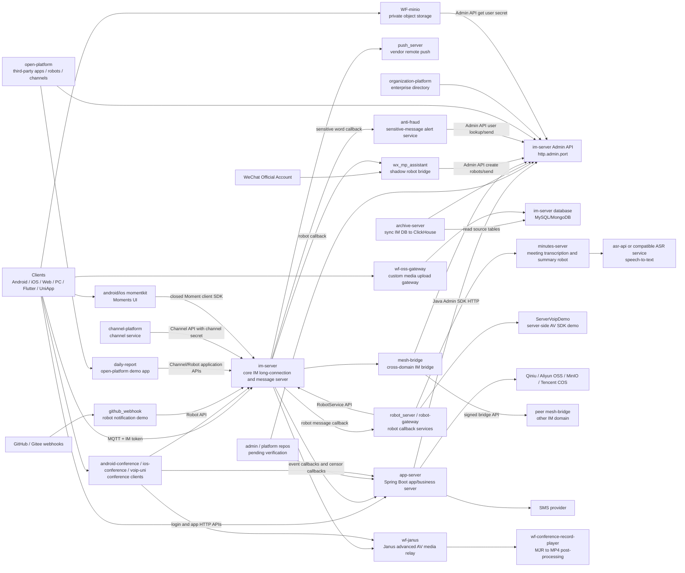
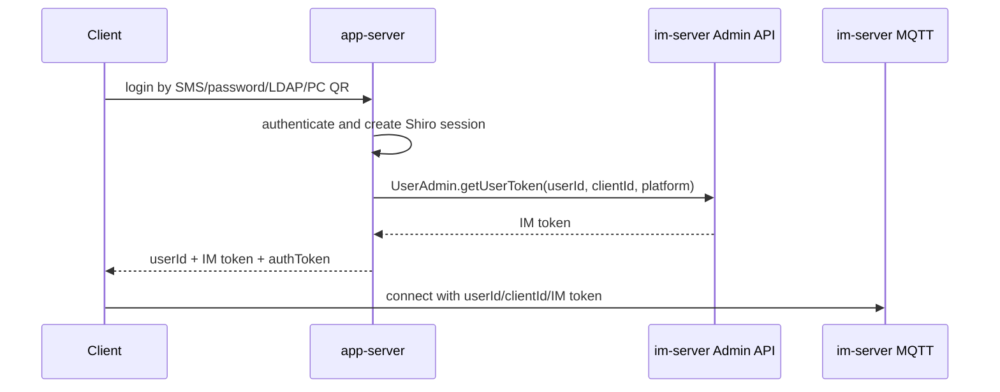
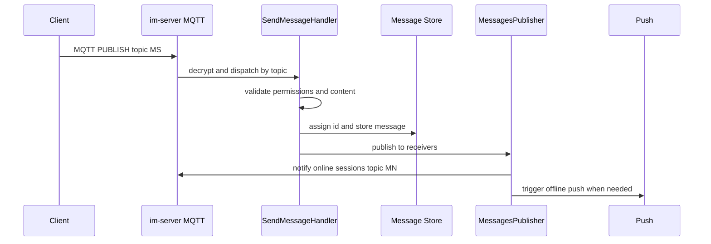
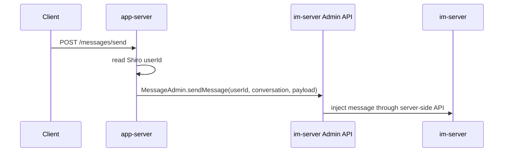

# WildfireChat Project Long-Term Notes

## Purpose
These notes are the durable memory for the WildfireChat organization analysis.

Primary reader: an engineer evaluating, deploying, migrating, or doing secondary development on WildfireChat/WuKong-style IM systems.

Post-read action: decide which repository owns a capability, where to extend behavior, and which areas are risky to modify directly.

## How to Resume
Read in this order:

1. `C:\Users\COLORFUL\Desktop\WuKong\docs\wildfirechat-analysis\SPEC.md`
2. `C:\Users\COLORFUL\Desktop\WuKong\docs\wildfirechat-analysis\TASKS.md`
3. `C:\Users\COLORFUL\Desktop\WuKong\docs\wildfirechat-analysis\PROJECT-NOTES.md`
4. relevant per-repository notes under `C:\Users\COLORFUL\Desktop\WuKong\docs\wildfirechat-analysis\repos`

Source cache:

```text
C:\Users\COLORFUL\Desktop\WuKong\.codex_tmp\wildfirechat
```

Analysis docs are intentionally kept under:

```text
C:\Users\COLORFUL\Desktop\WuKong\docs\wildfirechat-analysis
```

Do not modify WuKong business source for this analysis unless explicitly requested.

## Analysis Principles
- Facts must come from source, build files, README/docs, or GitHub repository pages.
- Mark inference explicitly when not directly confirmed.
- Prefer source/config/build files over README text when terminals show encoding issues.
- Analyze the complete IM main path first, then surrounding repos.
- Treat default secrets and demo behavior as deployment risks, not production recommendations.

## Current Status
Completed first-pass source notes:

- WuKongIM vs WildfireChat comparison report: `C:\Users\COLORFUL\Desktop\WuKong\docs\wildfirechat-analysis\2026-05-23-wukongim-vs-wildfirechat-report.md`
- WuKongIM optimization blueprint after the comparison: `C:\Users\COLORFUL\Desktop\WuKong\docs\wildfirechat-analysis\2026-05-23-wukongim-optimization-blueprint.md`
- `im-server`: `C:\Users\COLORFUL\Desktop\WuKong\docs\wildfirechat-analysis\repos\im-server.md`
- `app-server`: `C:\Users\COLORFUL\Desktop\WuKong\docs\wildfirechat-analysis\repos\app-server.md`
- `server-sdk.js`, `server-sdk-go`, `server-sdk-python`: `C:\Users\COLORFUL\Desktop\WuKong\docs\wildfirechat-analysis\repos\server-sdk.md`
- `vue-chat`: `C:\Users\COLORFUL\Desktop\WuKong\docs\wildfirechat-analysis\repos\vue-chat.md`
- `vue-pc-chat`: `C:\Users\COLORFUL\Desktop\WuKong\docs\wildfirechat-analysis\repos\vue-pc-chat.md`
- `android-chat`: `C:\Users\COLORFUL\Desktop\WuKong\docs\wildfirechat-analysis\repos\android-chat.md`
- `flutter-chat`: `C:\Users\COLORFUL\Desktop\WuKong\docs\wildfirechat-analysis\repos\flutter-chat.md`
- `ios-chat`: `C:\Users\COLORFUL\Desktop\WuKong\docs\wildfirechat-analysis\repos\ios-chat.md`
- `admin`: `C:\Users\COLORFUL\Desktop\WuKong\docs\wildfirechat-analysis\repos\admin.md`
- `open-platform`: `C:\Users\COLORFUL\Desktop\WuKong\docs\wildfirechat-analysis\repos\open-platform.md`
- `organization-platform`: `C:\Users\COLORFUL\Desktop\WuKong\docs\wildfirechat-analysis\repos\organization-platform.md`
- `channel-platform`: `C:\Users\COLORFUL\Desktop\WuKong\docs\wildfirechat-analysis\repos\channel-platform.md`
- `push_server`: `C:\Users\COLORFUL\Desktop\WuKong\docs\wildfirechat-analysis\repos\push_server.md`
- `robot_server`: `C:\Users\COLORFUL\Desktop\WuKong\docs\wildfirechat-analysis\repos\robot_server.md`
- `robot-gateway`: `C:\Users\COLORFUL\Desktop\WuKong\docs\wildfirechat-analysis\repos\robot-gateway.md`
- `archive-server`: `C:\Users\COLORFUL\Desktop\WuKong\docs\wildfirechat-analysis\repos\archive-server.md`
- `minutes-server`: `C:\Users\COLORFUL\Desktop\WuKong\docs\wildfirechat-analysis\repos\minutes-server.md`
- `wf-janus`: `C:\Users\COLORFUL\Desktop\WuKong\docs\wildfirechat-analysis\repos\wf-janus.md`
- `ServerVoipDemo`: `C:\Users\COLORFUL\Desktop\WuKong\docs\wildfirechat-analysis\repos\ServerVoipDemo.md`
- `wf-oss-gateway`: `C:\Users\COLORFUL\Desktop\WuKong\docs\wildfirechat-analysis\repos\wf-oss-gateway.md`
- `android-conference`: `C:\Users\COLORFUL\Desktop\WuKong\docs\wildfirechat-analysis\repos\android-conference.md`
- `ios-conference`: `C:\Users\COLORFUL\Desktop\WuKong\docs\wildfirechat-analysis\repos\ios-conference.md`
- `voip-uni`: `C:\Users\COLORFUL\Desktop\WuKong\docs\wildfirechat-analysis\repos\voip-uni.md`
- `wf-conference-record-player`: `C:\Users\COLORFUL\Desktop\WuKong\docs\wildfirechat-analysis\repos\wf-conference-record-player.md`
- `asr-api`: `C:\Users\COLORFUL\Desktop\WuKong\docs\wildfirechat-analysis\repos\asr-api.md`
- `docs`: `C:\Users\COLORFUL\Desktop\WuKong\docs\wildfirechat-analysis\repos\docs.md`
- `mesh-bridge`: `C:\Users\COLORFUL\Desktop\WuKong\docs\wildfirechat-analysis\repos\mesh-bridge.md`
- `github_webhook`: `C:\Users\COLORFUL\Desktop\WuKong\docs\wildfirechat-analysis\repos\github_webhook.md`
- `wx_mp_assistant`: `C:\Users\COLORFUL\Desktop\WuKong\docs\wildfirechat-analysis\repos\wx_mp_assistant.md`
- Additional client variants (`pc-chat`, `web-chat`, `react-chat`, `react-pc-chat`, `qt-pc-chat`, `uni-*`, `wx-chat`, `jq-chat-demo`, `hm-*`): `C:\Users\COLORFUL\Desktop\WuKong\docs\wildfirechat-analysis\repos\client-variants.md`
- SDK/tooling repositories (`CS-Client-SDK`, `WFSwiftDemo`, `Performance_Test`, `C1000K_Test`, `udp_port_detecter`, `udpPortChecker-android`): `C:\Users\COLORFUL\Desktop\WuKong\docs\wildfirechat-analysis\repos\sdk-and-tools.md`
- Auxiliary/content repositories (`android-momentkit`, `ios-momentkit`, `wf-gallery`, `daily-report`, `anti-fraud`, `WF-minio`, `libopencore-amr-ios-build`, `996.ICU`, `java_bullshitarticle`): `C:\Users\COLORFUL\Desktop\WuKong\docs\wildfirechat-analysis\repos\auxiliary-repos.md`

Known local source cache issue:

- `ios-chat` checkout is partially broken on Windows because long paths in `ZLPhotoBrowser.xcframework` exceeded checkout limits. Reclone into a shorter path or enable long paths before deep iOS analysis.
- Despite that checkout issue, the first-pass iOS note was written from readable core files: config, AppService, login controller, AppDelegate, and `WFCCNetworkService`.
- `hm-chat` and `hm-pc-chat` were inspected with shallow sparse checkouts and targeted `git show` reads because full clone was slow in this environment.

Tooling note:

- `rg` failed locally with `Access is denied`; use PowerShell `Get-ChildItem`, `Select-String`, and `git` commands.

## Organization Map
GitHub organization: `wildfirechat`

The organization page showed about 63 public repositories during the initial scrape. Repository names captured so far are saved in:

```text
C:\Users\COLORFUL\Desktop\WuKong\docs\wildfirechat-analysis\repo-list.txt
```

### Core Servers and Platforms
- `im-server`: core IM server.
- `app-server`: demo/application business server.
- `archive-server`: message archive/query service; syncs IM source DB into ClickHouse and exposes auth-code protected history APIs.
- `minutes-server`: meeting transcription and summary robot; joins AV conferences through the server-side AV SDK.
- `open-platform`: third-party application registry and workbench; creates robot/channel identities through `im-server` Admin API.
- `organization-platform`: enterprise organization directory; owns organization, employee, and department group data.
- `channel-platform`: application-side channel/public-account platform; uses `im-server` Channel API with channel id and channel secret.
- `admin`: public screenshot/README repository for a management console; source implementation not present in public repo.

### Clients
- `android-chat`
- `ios-chat`
- `flutter-chat`
- `vue-chat`
- `vue-pc-chat`
- `pc-chat`
- `qt-pc-chat`
- `react-chat`
- `react-pc-chat`
- `web-chat`
- `uni-chat`
- `uni-h5-chat`
- `uni-wx-chat`
- `uni-mp-demo`
- `uni-Android-SDK`
- `uni-wfc-client`
- `uni-chat-uts`
- `unix-chat`
- `wx-chat`
- `hm-chat`
- `hm-pc-chat`
- `jq-chat-demo`

### SDKs
- `server-sdk.js`
- `server-sdk-go`
- `server-sdk-python`
- `CS-Client-SDK`
- `WFSwiftDemo`

### Push, Bots, Bridges, Gateways
- `push_server`: independent offline remote-push dispatcher and push admin console.
- `robot_server`: direct robot callback demo plus webhook relay.
- `robot-gateway`: WebSocket bridge for robot clients plus optional BotFather robot factory.
- `wf-oss-gateway`: custom/private object-storage upload gateway for professional IM media.
- `mesh-bridge`: professional-edition IM cross-domain bridge service with admin UI, internal IM callback port, and signed external bridge API.
- `github_webhook`: GitHub/Gitee webhook-to-robot notification demo.
- `wx_mp_assistant`: WeChat Official Account assistant using per-user shadow robots.

### Audio/Video, Conference, Media
- `wf-janus`: Janus deployment/config repo for WildfireChat advanced AV media service.
- `ServerVoipDemo`: server-side AV SDK robot/demo for AI voice assistant and call automation.
- `android-conference`: standalone Android meeting client using `app-server` conference APIs and `AVEngineKit`.
- `ios-conference`: standalone iOS meeting client using `app-server` conference APIs and `WFAVEngineKit`.
- `voip-uni`: webview AV runtime for uni-app/WeChat mini-program style clients.
- `wf-conference-record-player`: Janus `.mjr` recording post-processing and demo playback tooling.
- `asr-api`: GitHub placeholder pointing to Gitee for speech-to-text service code; implementation source was not available from GitHub.

### Moments, Content, Auxiliary Features
- `android-momentkit`: Android Moments/Friends-Circle UI source; depends on closed paid Moment client AAR and professional IM.
- `ios-momentkit`: iOS Moments UI kit source; depends on closed paid `WFMomentClient` and professional IM with MongoDB.
- `wf-gallery`: static Vue screenshot gallery.
- `daily-report`: open-platform demo application using channel/robot application credentials.
- `anti-fraud`: sensitive-word callback service using IM Admin API to alert admins and warn users.
- `libopencore-amr-ios-build`: helper script to build iOS `opencore-amr` xcframeworks.

### Testing and Tools
- `Performance_Test`: professional IM performance-test methodology and benchmark notes.
- `C1000K_Test`: single-node million long-connection test guide and orchestration script.
- `udp_port_detecter`: Go/Java UDP reachability diagnostic.
- `udpPortChecker-android`: Android UDP reachability checker app.
- `WF-minio`: WildfireChat-adapted MinIO binary package and private object-storage deployment guide for professional IM.

### Documentation or Non-Core Repos
- `docs`
- `996.ICU`
- `java_bullshitarticle`

## Confirmed Core Architecture



## Core Responsibility Split

### im-server
Confirmed from source:

- Owns IM protocol and MQTT long connections.
- Owns user/session/friend/group/channel/chatroom/message storage.
- Owns message validation, routing, offline notification trigger, and Admin/Robot/Channel APIs.
- Built on Java 8, Maven modules, Moquette MQTT, Netty, Protobuf, Hazelcast, C3P0, Flyway, H2/MySQL.
- Main entry: `cn.wildfirechat.server.Server.main`.
- Main message-send topic: `MS`.
- Main new-message notify topic: `MN`.
- Detailed note: `repos/im-server.md`.

Important boundary: README/source guidance strongly implies business customization should avoid direct IM core modification when Admin API, callbacks, robots, channels, and custom messages are enough.

### app-server
Confirmed from source:

- Owns app/business login and HTTP APIs.
- Uses Spring Boot 2.2, Shiro, JPA.
- Main entry: `cn.wildfirechat.app.Application.main`.
- Connects to `im-server` through bundled Java Admin SDK `1.4.7`.
- Calls `AdminConfig.initAdmin(im.admin_url, im.admin_secret)`.
- Returns two credentials after login:
  - IM token from `UserAdmin.getUserToken`, used by clients to connect to `im-server`.
  - Shiro `authToken`, used for later `app-server` HTTP APIs.
- Stores app-side data such as SMS records, password hashes, Shiro sessions, PC login sessions, announcements, favorites, slide captcha, conference metadata and quota.
- Detailed note: `repos/app-server.md`.

Important boundary: this is the right place for login provider changes, registration policy, app business APIs, media storage glue, conference policy, and callbacks. It is not the right place for MQTT/message protocol internals.

### server SDKs
Confirmed from source:

- JS/Go/Python server SDKs wrap the same `im-server` HTTP APIs as the Java SDK used by `app-server`.
- Admin API calls use `adminUrl`, `adminSecret`, and request headers `nonce`, `timestamp`, `sign`.
- Admin signature formula is `sha1(nonce|adminSecret|timestampMillis)`.
- Robot service calls use public IM HTTP URL plus `rid` and robot secret.
- Channel service calls use public IM HTTP URL plus `cid` and channel secret.
- Detailed note: `repos/server-sdk.md`.

Important boundary: server SDKs are backend-only tools. They must not be embedded into clients because they require admin/robot/channel secrets.

### vue-chat
Confirmed from source:

- Web chat client built with Vue 3, Vue CLI, Pinia, Vue Router, axios, and bundled Web IM SDK code under `src/wfc`.
- Default `APP_SERVER` points to WildfireChat demo service and must be replaced for self-hosted deployments.
- Login APIs call `app-server`: `/send_code`, `/login_pwd`, `/login`, `/pc_session`, `/session_login/{token}`.
- Login requests include `platform = Config.getWFCPlatform()` and `clientId = wfc.getClientId()`.
- Password login, SMS login, auto-login, and PC QR login all eventually call `wfc.connect(userId, token)`.
- PC QR login renders `wildfirechat://pcsession/{token}` and polls app-server until mobile confirmation returns the IM token.
- Detailed note: `repos/vue-chat.md`.

### vue-pc-chat
Confirmed from source:

- Electron desktop client built with Vue 3, Electron 22, electron-builder tooling, and a native `marswrapper.node` IM protocol addon.
- Shares the same app-server login endpoints and PC session QR flow as `vue-chat`.
- Native addon variants are copied from `proto_addon/` to `marswrapper.node` by `scripts/copy-proto.js`.
- Electron main process imports `marswrapper.node` and calls `initProtoMain(proto)` on `app.ready`.
- Renderer windows call protocol functions through `proto_renderer_proxy` and Electron IPC.
- Detailed note: `repos/vue-pc-chat.md`.

### android-chat
Confirmed from source:

- Android client repository includes the runnable `chat` app, low-level `client` module, reusable `uikit`, native `mars-core-release`, push modules, WebRTC/AV/PTT modules, and support UI/media modules.
- Default app-server address is `https://app.wildfirechat.net`; default IM host is `wildfirechat.net`.
- `AppService.passwordLogin` calls `/login_pwd` with mobile/password, `clientId = ChatManagerHolder.gChatManager.getClientId()`, and platform from `ChatManager`.
- `AppService.smsLogin` calls `/login` with mobile/code, `clientId`, and platform `2` for Android phone. Comments describe platform `9` for Android pad.
- Login success in both password and SMS activities calls `ChatManagerHolder.gChatManager.connect(userId, token)` and stores `wf_userId` / `wf_token`.
- `MyApp` initializes `WfcUIKit`, app-service provider, push, custom message contents, collection/poll/archive providers, organization provider, then auto-connects from cached credentials.
- `WfcUIKit` calls `ChatManager.init(application, Config.IM_SERVER_HOST)`.
- `ClientService` wraps Tencent Mars/ProtoLogic and ultimately connects with `ProtoLogic.setAuthInfo(userName, userPwd)` plus `ProtoLogic.connect(mHost)`.
- Detailed note: `repos/android-chat.md`.

### flutter-chat
Confirmed from source:

- Flutter repository includes the `chat` app plus local `imclient` and `rtckit` plugins.
- Default `Config.IM_Host` is `wildfirechat.net`; default `APP_Server_Address` is `https://app.wildfirechat.net`.
- `AppServer.login` and `AppServer.passwordLogin` call `/login` and `/login_pwd` with `clientId = await Imclient.clientId` and platform `10`.
- Login success calls `Imclient.connect(Config.IM_Host, userId, token)` and stores `userId` / `token` in `SharedPreferences`.
- Startup initializes `Rtckit`, ICE servers, default portrait provider, `Imclient.init`, then auto-connects from cached credentials.
- Auth failure statuses clear `userId`, `token`, and `app_server_auth_token`, reset view models, and return to login.
- Android plugin bridge calls `ChatManager.Instance().setIMServerHost(host)` then `ChatManager.Instance().connect(userId, token)`.
- iOS plugin bridge calls `[[WFCCNetworkService sharedInstance] setServerAddress:host]` then `connect:userId token:token`.
- Detailed note: `repos/flutter-chat.md`.

### ios-chat
Confirmed from readable core source:

- iOS repository is structured as `wfchat` app, `wfclient` low-level IM communication library, and `wfuikit` UI component library.
- Default `IM_SERVER_HOST` is `wildfirechat.net`; default `APP_SERVER_ADDRESS` is `https://app.wildfirechat.net`.
- `AppDelegate` configures `WFCCNetworkService`, sets server address, starts logs, registers delegates, wires `WFCUConfigManager` providers, and auto-connects from keychain credentials.
- SMS login calls `/login` with `clientId = [[WFCCNetworkService sharedInstance] getClientId]` and platform `Platform_iOS` or `Platform_iPad`.
- Password login calls `/login_pwd` with mobile/password, same `clientId`, and platform `Platform_iOS` by default.
- Login success stores token/user ID in `SSKeychain` and calls `[[WFCCNetworkService sharedInstance] connect:userId token:token]`.
- App-server `authToken`/cookies are stored separately from the IM token.
- iOS supports PC QR confirmation through `/scan_pc/{sessionId}`, `/confirm_pc`, and `/cancel_pc`.
- Detailed note: `repos/ios-chat.md`.

### open-platform
Confirmed from source:

- Provides a Spring Boot backend plus Vue admin/workbench frontends for WildfireChat third-party application management.
- Maintains application records, application type, `targetId`, secret, menu, favorite, and user-facing workbench data.
- Uses the Java Admin SDK to create matching robot and/or channel identities inside `im-server`.
- Workbench login is based on an IM `authCode` obtained through the client-side WildfireChat JavaScript bridge, then validated on the backend.
- Application types are normal application, channel application, and robot application.
- Detailed note: `repos/open-platform.md`.

Important risk: source indicates `updateApplication` may create both robot and channel identities regardless of application type. Verify behavior before relying on it for production provisioning.

### organization-platform
Confirmed from source:

- Provides enterprise organization directory APIs and a Vue management console.
- Owns organization tree, employee records, employee-organization relationships, Excel import, and optional department work-group maintenance.
- Depends on `im-server` Admin API for user lookup, user creation/update, auth-code validation, and IM group creation/update/dismiss.
- Has an optional secondary datasource aimed at app-server-style `appdata`.
- Detailed note: `repos/organization-platform.md`.

Important risks:

- Shiro rule ordering appears to put broad `/**` behavior before more detailed permission rules, which may weaken intended authorization.
- `dismissOrganizationGroup` appears to clear `groupId` before calling `GroupAdmin.dismissGroup`; verify before using automatic department group cleanup.

### channel-platform
Confirmed from source:

- Provides a WildfireChat channel/public-account management service, adapted from a WeChat public-account project.
- Owns channel account registration, menu configuration, auto-reply rules, callback handling, subscriber/fan data, message history, articles, and article-message sending.
- Uses `ChannelServiceApi(imurl, appid/channelId, secret)`, not `im.admin_secret`.
- In inherited naming, `wx_account.appid` means WildfireChat channel id and `openid` means WildfireChat user id.
- Detailed note: `repos/channel-platform.md`.

Important risk: README callback URL examples and actual controller paths may not match exactly; verify callback routes in source and deployment config together.

### push_server
Confirmed from source:

- Independent Spring Boot push receiver/dispatcher with a Vue 3/Vite admin console.
- `im-server` calls `/android/push`, `/ios/push`, or `/harmony/push` after deciding remote push is needed.
- Uses two ports by default: `8085` for IM push calls and `8086` for admin UI/API.
- Dispatches push asynchronously by `pushType` to APNs, FCM, HMS, Honor, Xiaomi, OPPO, vivo, Getui, UniPush, or Harmony push implementations.
- Stores push vendor configs and uploaded credential files in its database, with 30-second config refresh for cluster nodes.
- Detailed note: `repos/push_server.md`.

Important risks:

- Push endpoints do not add a source shared-secret check in inspected source; restrict network access from `im-server` to `push_server`.
- Default admin account is `admin` / `admin123`; rotate immediately.
- Async thread-pool sizing can create high thread pressure under slow vendor APIs or push bursts.

### robot_server
Confirmed from source:

- Direct robot callback demo service.
- Receives robot messages from `im-server` at `/robot/recvmsg`.
- Uses `RobotService(im_url, robotId, robotSecret)` to call Robot API and send/reply messages.
- Demonstrates group mention handling, keyword replies, streaming text messages, VoIP signal handling, and webhook relay for GitHub/GitLab/Gitee/general callbacks.
- Robot config explicitly uses the public IM HTTP URL and robot secret, not Admin API URL or admin secret.
- Detailed note: `repos/robot_server.md`.

Important risk: webhook tokens use hard-coded DES key/IV and a hard-coded sign word, so this is demo-grade authorization.

### robot-gateway
Confirmed from source:

- WebSocket gateway that lets robot clients behind NAT connect outward instead of exposing their own callback endpoint.
- HTTP `server.port` receives `im-server` robot callbacks; `websocket.port` accepts robot clients at `/robot/gateway`.
- WebSocket client authenticates with robot id and robot secret; gateway validates through `RobotService.getProfile()`.
- Gateway stores a per-session `RobotService` instance and reflects allowed RobotService method calls from JSON requests.
- Includes Java, JavaScript, and Go client/adapter implementations plus OpenClaw integrations.
- Optional BotFather flow uses Admin API to create, list, update, reset, and delete user-owned robots.
- Detailed note: `repos/robot-gateway.md`.

Important risks:

- BotFather makes the gateway a privileged Admin API control plane.
- WebSocket CORS/origins are unrestricted in inspected source.
- Demo config includes default secrets, public IP samples, and a malformed callback URL.

### archive-server
Confirmed from source:

- Java 11 Spring Boot service for message archive sync and query.
- Reads IM source data from MySQL or MongoDB and writes denormalized rows to ClickHouse.
- Uses one sync node (`archive.task.enabled=true`) and any number of query nodes (`archive.task.enabled=false`).
- Syncs user-message shard tables and optionally group-message shard tables.
- Tracks progress in ClickHouse `archive_progress`.
- Client query APIs use IM `authCode` validated by `UserAdmin.applicationGetUserInfo`.
- Detailed note: `repos/archive-server.md`.

Important risks:

- No distributed lock/election is implemented for sync nodes; only one sync node should run.
- `AuthFilter` appears globally registered without visible exclusions for health/admin endpoints; verify runtime behavior before wiring probes.
- Group archive query path does not visibly verify group membership after auth-code validation.
- Source contains a likely typo in group message time filtering (`_dt >= ?` appears to receive `endTime`).

### minutes-server
Confirmed from source:

- Java 8 Spring Boot service plus Vue 3/Vite frontend for meeting transcription and summary.
- Receives robot callbacks at `/robot/recvmsg` and `/robot/recvmsg/conference`.
- Uses `RobotService(im_url, robotId, robotSecret)` and server-side `AVEngineKit`.
- Joins/answers conferences, streams resampled audio to an ASR WebSocket service, sends transcription messages, stores transcript records, and generates meeting summaries through an OpenAI-compatible LLM endpoint.
- Web/API auth uses in-memory sessions, `authToken` header or `minutes_session` cookie, and can also accept IM `authCode`.
- Detailed note: `repos/minutes-server.md`.

Important risks:

- Demo config includes DB, robot, and LLM-style secrets.
- In-memory sessions are not cluster-safe.
- Controllers use unrestricted CORS in inspected source.
- Native AV support is platform-sensitive; inspected docs/config point to Linux x86_64 and macOS arm64 support.

### wf-janus
Confirmed from source/docs:

- Deployment/config repository for WildfireChat advanced AV media service based on Janus.
- Provides Janus config and `janus-pp-rec` tools; modified Janus source is referenced externally.
- MQTT transport connects Janus to IM using `client_id`, `im_host`, `im_port`, and topics `to-janus` / `from-janus`.
- IM config must list all Janus `client_id` values in `conference.client_list`.
- Janus recording output is `.mjr`, post-processed with `janus-pp-rec` and ffmpeg.
- Detailed note: `repos/wf-janus.md`.

Important risks:

- UDP RTP range `20000-40000` must be exposed according to the deployment topology.
- Every Janus instance needs a unique `client_id`, and every id must be listed in IM config.
- `DOCKER_IP` must be the Janus public IP.
- Default Janus admin secret should be rotated.

### ServerVoipDemo
Confirmed from source:

- Java 8 Spring Boot demo for server-side AV SDK usage.
- Receives robot callbacks at `/robot/recvmsg` and `/robot/recvmsg/conference`.
- Routes call content types `400..420` into `CallService`.
- Demonstrates answering incoming calls, starting outbound calls from a text command, echo audio, file-backed video capture, and saving remote video frames.
- Robot config uses IM public HTTP URL plus robot secret, not Admin API.
- Detailed note: `repos/ServerVoipDemo.md`.

Important risks:

- Demo credentials and TURN config must be replaced.
- Demo frame dumping writes BMP files to the working directory.
- Local/system-scoped SDK jars and native dependencies make packaging platform-sensitive.

### wf-oss-gateway
Confirmed from source:

- Java 8 Maven multi-module object-storage upload gateway for professional IM custom/private storage.
- IM media config must set `media.server.media_type 4` and share `media.access_key` / `media.secret_key` with the gateway.
- Gateway starts a custom Netty HTTP server from `io.moquette.server.Server.main`.
- Main upload route is `POST /fs`.
- Upload token is decrypted with `media.secret_key`, validated against `media.access_key`, checked for age under 180 seconds, then used to read the user session secret from IM DB table `t_user_session`.
- File stream is decrypted with AES or SM4 and then written by the gateway/default storage hook.
- Detailed note: `repos/wf-oss-gateway.md`.

Important risks:

- Gateway must access the IM database directly.
- Default media AK/SK are demo values.
- Upload size is capped at about 200 MB in inspected source.
- Responses use `Access-Control-Allow-Origin: *`.
- Download bypasses the gateway and depends on object-storage ACL/domain/HTTPS configuration.

### android-conference
Confirmed from source:

- Standalone Android meeting client with modules `app`, `wf-client`, `mars-core-release`, `avenginekit`, and `webrtc`.
- Logs in through `app-server` `/send_code` and `/login`, using `clientId = ChatManager.Instance().getClientId()` and platform `2`.
- Connects to IM with `ChatManager.Instance().connect(userId, token)`.
- Initializes AV with `AVEngineKit.init`.
- Uses `app-server` `/conference/*` APIs for conference metadata.
- Joins/runs conference media through `AVEngineKit.Instance().startConference(...)`.
- Parses `wfzoom://` QR links with `id` and `pwd`.
- Detailed note: `repos/android-conference.md`.

Important risks:

- Defaults point to demo IM/app-server/TURN services.
- Default app-server URL is HTTP in inspected source.
- Broad Android permissions should be reviewed before production.
- Source appears to swap audio/video switches when applying initial mute state in `ConferenceInfoActivity.joinConference`; runtime-verify before shipping.

### ios-conference
Confirmed from source:

- Standalone iOS meeting client using `WFChatClient`, `WFAVEngineKit`, `WebRTC`, `SDWebImage`, and `CallKit`.
- Sets IM host through `WFCCNetworkService.setServerAddress(IM_SERVER_HOST)`.
- Logs in through `app-server` `/login`, using `clientId = WFCCNetworkService.getClientId` and platform `Platform_iOS`.
- Connects to IM with `WFCCNetworkService.connect:userId token:`.
- Uses `app-server` `/conference/*` APIs for metadata.
- Joins conference media through `WFAVEngineKit.joinConference(...)`.
- Generates and opens `wfzoom://conference?id=...&pwd=...` links.
- Detailed note: `repos/ios-conference.md`.

Important risks:

- README text was not reliably readable in terminal due to encoding, so source/project files are the primary evidence.
- App-server token/cookies are stored in `NSUserDefaults`; review hardening.
- Bundled binary frameworks limit source-level AV debugging in this repo.

### voip-uni
Confirmed from source:

- Vue 2 webview AV runtime for uni-app/WeChat mini-program style clients.
- README says mini-program AV is implemented through `webview`, supports single, multi, and conference calls, and currently does not support inviting new members.
- Host passes `appServer`, `authToken`, `server`, `userId`, `clientId`, `token`, and `options` through URL parameters.
- Runtime calls `wfc.setupShortLink(imServerAddress, userId, clientId, token)`.
- Builds one inline `voip-dist.html`; `build.sh` produces separate conference and multi-call HTML variants by swapping minified engine files.
- Uses `conferenceApi` for `/conference/*`, `/conference/put_info`, `/conference/recording/*`, and `/conference/focus/*`.
- Conference commands are sent as chatroom messages to `target = conferenceId`.
- Detailed note: `repos/voip-uni.md`.

Important risks:

- URL parameters carry IM token and app-server authToken; deploy only over HTTPS and avoid URL logging.
- `debug=true` enables vConsole and extra logs.
- Ordinary and advanced/conference AV engines are not interchangeable.
- Minified AV engine code limits debugging.

### wf-conference-record-player
Confirmed from source:

- Tooling/demo repo for Janus conference recording post-processing.
- Converts `.mjr` video/audio recordings to MP4/Opus with `janus-pp-rec`.
- Merges audio/video pairs with ffmpeg.
- Pads start times by conference timestamp, concatenates multiple segments per user, and builds final grid video with ffmpeg `xstack`.
- Includes a small Vue 2 demo player with hard-coded sample media paths.
- Detailed note: `repos/wf-conference-record-player.md`.

Important risks:

- Conversion scripts interpolate filenames into shell commands without escaping; use trusted recording directories only.
- Scripts are Linux-shell oriented and not Windows portable.
- Audio/video pairing by filename/timestamp is heuristic.
- Demo player is not a production recording UI.

### asr-api
Confirmed from GitHub source:

- GitHub repository contains only a README.
- README says model files are large and directs readers to Gitee: `https://gitee.com/wfchat/asr-api`.
- Local Gitee clone and `git ls-remote` timed out in this environment, so implementation details remain unverified.
- Detailed note: `repos/asr-api.md`.

Important risk: do not infer ASR service implementation from the GitHub placeholder. `minutes-server` can send meeting audio/transcripts to a configured ASR endpoint, so ASR deployment needs separate privacy and retention review.

### docs
Confirmed from official documentation:

- Official docs validate the core split: `im-server` owns IM protocol/data/signaling, while `app-server` or a customer business server owns registration/login and exchanges authenticated users for IM tokens through Server/Admin API.
- Native clients use IM `80` and `1883`; Web/mini-program clients use IM `80` and `8083`; Robot API and Channel API use public IM HTTP; Server/Admin API defaults to internal-only `18080`.
- Server/Admin API calls are POST JSON with lowercase `nonce`, `timestamp`, and `sign` headers; signature is `sha1(nonce + "|" + SECRET_KEY + "|" + timestamp)`.
- Robot API uses `rid` plus robot secret; Channel API uses `cid` plus channel secret.
- H2 is only for quick trials/small deployments; production should use MySQL or another supported external DB. MySQL should use `utf8mb4`, `READ COMMITTED`, and binary-safe backups with `--hex-blob`.
- Media upload is object-storage based and maps SDK media types to buckets: general, image, voice, video, file, portrait, favorite, sticker, and moments.
- Advanced AV is SFU-based, IM-signaling-coupled, and capacity is dominated by publisher count times subscriber count. Janus recordings are per-stream `.mjr` files that need post-processing.
- Official security guidance says to keep `18080` off the public Internet, rotate `http.admin.secret_key` and `token.key`, keep Admin API timestamp checks enabled, close version probing, and move sensitive client operations to business-server-reviewed flows.
- Detailed note: `repos/docs.md`.

Important correction/confirmation: official docs explicitly say `app-server`, robot demo, and many application-layer repos are reference/demo services tied to customer business logic; SDKs and IM service are the stable core.

### mesh-bridge
Confirmed from source/docs:

- Professional-edition cross-domain IM bridge; community edition does not support this mesh feature.
- Backend is Spring Boot 2.6.7 with Shiro/JPA; frontend is Vue 3/Vite management UI.
- Exposes three ports: `8200` external bridge API `/api`, `8100` local IM callback API `/internal`, and `8000` admin UI/API `/admin`.
- Startup initializes the local IM Admin SDK with `im.admin_url` and `im.admin_secret`.
- Local IM calls the bridge through `mesh.callback=http://<bridge-internal-ip>:8100/internal`.
- External bridge requests are signed with `nonce`, `timestamp`, `sign`, and `x-domain-id`.
- Domain IDs are appended to remote IDs as `targetId@domainId`; `DomainIdUtils` handles local/remote/third-domain ID conversion.
- `InService` calls local IM through `MeshAdmin`, `MessageAdmin`, and `RelationAdmin`; `OutService` converts IDs and forwards calls to remote domains.
- Detailed note: `repos/mesh-bridge.md`.

Important risks:

- This service holds local IM Admin API credentials.
- `/internal/**` relies on port/network isolation and is anonymous at the app-auth layer.
- Default admin account/password, DB password, and Admin API secret must be rotated.
- Partial mesh connectivity can break multi-domain group/message flows.
- Custom messages that embed IDs need explicit conversion in `OutService.convertMessagePayloadDomainId`.
- Cross-domain media requires object-storage URLs reachable by other domains or custom file transfer/URL rewriting.

### github_webhook
Confirmed from source:

- Spring Boot demo that receives GitHub and Gitee webhook events and sends formatted text into WildfireChat through `RobotService`.
- Uses robot URL/ID/secret, not Admin API.
- Entry points are `/github/payload` with `X-GitHub-Event` and `/gitee/payload` with `X-Gitee-Event`.
- Supports GitHub push, issues, star, issue_comment, fork, watch, ping, and pull_request events; supports Gitee Push Hook, Issue Hook, and Note Hook.
- Sends text payload type `1` to configured conversation type/target.
- Detailed note: `repos/github_webhook.md`.

Important risks:

- No visible GitHub/Gitee webhook signature verification in inspected source.
- Raw payloads are logged and sometimes forwarded to chat.
- The README says port `8090`, while inspected config uses `8890`; reconcile before deployment.
- Robot secret must be treated as production credential.

### wx_mp_assistant
Confirmed from source:

- Spring Boot demo that bridges WeChat Official Account messages to WildfireChat using per-WeChat-user shadow robots.
- Holds IM Admin API credentials and WeChat app credentials.
- Entry points are `/in/wx` for WeChat server events and `/robot/recvmsg` for WildfireChat robot callbacks.
- On first WeChat user message, creates a robot with ID `robot.shadow_prefix + wxOpenId` through `UserAdmin.createRobot`.
- Sends incoming WeChat text/image/placeholder messages to the configured admin user through `MessageAdmin.sendMessage`.
- Sends admin private text replies back to WeChat through `WxMpKefuMessage`.
- Detailed note: `repos/wx_mp_assistant.md`.

Important risks:

- Inspected source does not visibly verify WeChat request signatures or encrypted-message parameters before parsing XML.
- XML parser should be hardened against XXE/entity expansion.
- WeChat XML payloads are logged and no `MsgId` deduplication is visible.
- Robot callback endpoint relies on network/proxy restriction in inspected source.
- Bundled WildfireChat SDK/common jars are old (`0.21`); verify compatibility.

### client-variants
Confirmed from source/README/config:

- `pc-chat` and `web-chat` are README-only migration pointers. They redirect original code to `react-pc-chat` and `react-chat`, while recommending `vue-pc-chat` and `vue-chat` for new development.
- `react-chat` is an older React Web client in maintenance mode. It uses Node 10/NPM 6 era tooling, default demo app/IM/TURN endpoints, Web SDK app id/key, and QR/PC-session login through `/pc_session` and `/session_login/{token}`.
- `react-pc-chat` is an older Electron/React PC client. It imports `marswrapper.node`, copies native protocol addon builds from `proto_addon`, and uses PC QR login with `device_name = pc`.
- `qt-pc-chat` is a Qt 5/6 C++ desktop demo using a paid/trial PC SDK under `src/wfc/proto`. It supports Windows/macOS/Linux, calls app-server login and PC-session APIs with `ChatClient::getClientId()`, and does not support audio/video.
- `uni-chat` is the UniApp Android/iOS App demo using native plugins. README says Android's default protocol stack only connects to official services unless replaced with an unrestricted stack.
- `uni-chat-uts` is the preferred UniApp UTS direction for Android/iOS/HarmonyOS. It includes `uni_modules/wfc-client` UTS plugin wrappers for Android, iOS, and Harmony; Harmony SDK is paid/trial and Harmony AV is not yet supported in the inspected README.
- `uni-h5-chat` is an H5/mobile-browser client using paid Web SDK and professional IM Server.
- `uni-wx-chat` is a UniApp WeChat mini-program client using paid mini-program SDK and professional IM Server.
- `wx-chat` is a native mini-program SDK demo. Login sends `clientId = wfc.getClientId('wx')` and platform `6`; AV is implemented by loading `voip-uni` webview output and passing credentials in URL parameters.
- `uni-mp-demo` is a converted SDK capability test from `wx-chat`; README says UI display and UI message sending are known broken.
- `jq-chat-demo` is a minimal jQuery/Web SDK example for login, connect, receive, and send-to-robot testing.
- `uni-Android-SDK` is deprecated; README says the code split into `uni-wfc-client` and `uni-chat`.
- `uni-wfc-client` is a GitHub placeholder pointing to Gitee for the large Android/iOS plugin source.
- `unix-chat` is a UniApp X technical verification project and README says not to use it in practice.
- `hm-chat` is the native HarmonyOS demo. It contains ArkTS modules, `@wfc/client`, `libmarswrapper.so`, app-server wrapper, login, backups, online-state and PC-management APIs, and Harmony platform codes `10/11/12`.
- `hm-pc-chat` is an OHOS Electron wrapper that loads a packaged `vue-pc-chat` app; feature changes should be made in `vue-pc-chat`.
- Detailed note: `repos/client-variants.md`.

Important risks and selection guidance:

- Use `vue-chat` for new Web work and `vue-pc-chat` for new Electron PC work.
- Use `uni-chat-uts` when HarmonyOS or future UniApp UTS migration matters.
- Use `wx-chat` or `uni-wx-chat` only with the professional mini-program SDK/IM server.
- Old React/Electron clients carry old Node/Electron/webpack dependency risk.
- Web/H5/mini-program and webview AV flows require strict HTTPS/WSS alignment and URL log hygiene.
- Several SDKs are paid/trial or restricted to official services by default; self-hosting often requires replacing SDK binaries/plugins.

### SDKs and tooling
Confirmed from source/README/config:

- `CS-Client-SDK` contains Windows C++/C# native client SDK wrappers and demos. The C++ `ChatClient` wraps the paid protocol-stack `WFClient`; the C# demo uses a CLR bridge, gets `clientId`, posts `/login` with platform `3`, receives userId/token, and connects.
- `WFSwiftDemo` is a minimal Swift iOS integration demo. It embeds `WFChatClient`, `WFChatUIKit`, `WFAVEngineKit`, `WebRTC`, `SDWebImage`, and `ZLPhotoBrowser`, configures `IM_HOST`, posts `/login` with `Platform_iOS`, and connects through `WFCCNetworkService`.
- `Performance_Test` documents professional-edition single-chat, group-chat, chatroom, and cluster benchmark methodology. It assumes the official `wfcstress` binary from professional packages, not a binary in the repo.
- `C1000K_Test` documents a million long-connection test using 1 IM server, 1 MySQL server, and 20 pressure machines. Its script assumes `test1` through `test20`, offsets user ranges by 50,000, copies `wfcstress`, and starts it remotely.
- `udp_port_detecter` provides Go and Java UDP server/client tools to prove basic UDP round-trip reachability for AV/TURN troubleshooting.
- `udpPortChecker-android` is a Jetpack Compose Android UI that sends `"hello"` over UDP and waits up to 30 seconds for a response.
- Detailed note: `repos/sdk-and-tools.md`.

Important risks and selection guidance:

- These repos are not mandatory runtime services.
- Windows/Swift SDK demos use demo endpoints and paid/trial SDK binaries; do not ship defaults.
- Performance settings such as huge rate limits are for pressure tests, not production defaults.
- UDP reachability success does not prove TURN authentication, Janus room logic, WebRTC ICE, or IM signaling correctness.

### auxiliary repositories
Confirmed from source/README/config:

- `android-momentkit` is Android Moments/Friends-Circle UI source. It must be integrated beside `android-chat`, depends on paid closed `momentclient-release.aar`, and calls `MomentClient` for feeds, comments, likes, cache, user profile, and media upload.
- `ios-momentkit` is iOS Moments UIKit source. It builds `WFMomentUIKit` as an xcframework, imports closed `WFMomentClient`, uploads `Media_Type_MOMENTS` media through `WFCCIMService`, and posts/reads Moments through `WFMomentService`.
- `wf-gallery` is a Vue 2/lightgallery static screenshot gallery that builds one inline `wf-gallery.html` from hard-coded `static.wildfirechat.cn` screenshot URLs.
- `daily-report` is an open-platform demo app. Backend is Spring Boot `2.6.7` with Shiro/JPA and bundled SDK/common `0.87`; frontend is Vue 2. It uses open-platform application credentials, resolves users with `applicationGetUserInfo(authCode)`, and sends rich notification messages through Channel/Robot application APIs.
- `anti-fraud` is a Spring Boot `2.7.3` sensitive-word callback service. IM forwards hits to `/sensitive_message`; the service uses Admin SDK `0.92` to look up the sender, forward the hit to an admin/group, and send warning notifications back into the original conversation.
- `WF-minio` packages WildfireChat-adapted MinIO binaries and `mc` binaries. It implements professional-edition private object storage integration where MinIO verifies upload tokens and calls IM Admin API `/admin/minio/sk` to obtain user secrets for decrypting uploads.
- `libopencore-amr-ios-build` builds iOS `opencore-amrnb` and `opencore-amrwb` static libraries/xcframeworks for device and simulator architectures.
- `996.ICU` and `java_bullshitarticle` are not part of WildfireChat runtime architecture.
- Detailed note: `repos/auxiliary-repos.md`.

Important risks and selection guidance:

- Moments are Android/iOS only in inspected READMEs and require professional IM, MongoDB, object storage, and closed paid client SDKs.
- `daily-report` is a third-party app pattern, not core `app-server`; keep its database separate and rotate demo application secrets.
- `anti-fraud` holds IM Admin credentials and its callback endpoint should be network/auth protected before public exposure.
- `WF-minio` requires WildfireChat-provided MinIO binaries for private-storage mode; keep MinIO Admin API access internal, provide both HTTP and HTTPS as required by clients, and forward headers through Nginx/proxies.

## Confirmed Login and Token Invariant



Implications:

- `app-server` does not itself authenticate MQTT.
- `im-server` does not send SMS codes.
- `authToken` is for `app-server` HTTP routes.
- IM token is for `im-server` client connection.
- User creation can happen through `app-server` using `UserAdmin.createUser`.
- Web/PC clients must call `wfc.getClientId()` before login because the IM token returned by `app-server` is bound to that client ID.
- Android must call `ChatManager.getClientId()` before login; iOS must call `WFCCNetworkService.getClientId()` before login; Flutter bridges call the same native client-ID APIs through `Imclient.clientId`.
- PC QR login uses the cross-client URI scheme `wildfirechat://pcsession/{token}` and app-server session polling/confirmation.

Observed platform codes in inspected clients:

- iOS phone: `1`
- Android phone: `2`
- Windows desktop: `3`
- macOS desktop: `4`
- Web: `5`
- WeChat/miniprogram: `6` in Android comments
- Linux desktop: `7`
- iPad: `8`
- Android pad: `9`
- Flutter demo hard-codes `10` in `flutter-chat` login requests.
- Harmony phone: `10`
- Harmony Pad: `11`
- Harmony PC: `12`

Important: platform value `10` is used by both the inspected Flutter demo and Harmony client code. Treat these as source observations, not a universal enum guarantee; verify target `app-server` and `im-server` versions before relying on platform-specific behavior.

## Confirmed Message Send Path
Client direct IM message path:



App-server server-side message path:



## Deployment and Security Notes
- Keep `im-server` Admin/Server API port `18080` internal-only; official docs treat public exposure as full-system compromise risk.
- Replace demo secrets in both `im-server` and `app-server`, especially `http.admin.secret_key`, `token.key`, object-storage credentials, robot/channel secrets, JWT/session secrets, and SMS/provider credentials.
- Keep `http.admin.no_check_time=false` in production; disabling timestamp validation is only for testing.
- Consider `http.close_api_version=true`, `secret_key_encrypt=true`, `message.encrypt_message_content=true`, and `message.disable_remote_search=true` when security/compliance requirements justify them.
- Move high-risk client operations behind business-service review where appropriate: user search, friend requests, group operations, sensitive message types, stranger chat, and sensitive user-profile fields.
- Avoid H2 for production.
- For MySQL, use `utf8mb4`, consider `READ COMMITTED`, tune connection counts by node count, and use `--hex-blob` for backups.
- Keep the app database separate from the IM database.
- Do not co-host IM with unrelated services; the official launch checklist recommends a dedicated high-memory IM server.
- Restrict `push_server` push port to `im-server`; inspected push endpoints do not add their own shared secret.
- Rotate `push_server` admin account and JWT secret after first startup.
- Treat robot secrets as production credentials; any holder can act as that robot through `RobotService` or `robot-gateway`.
- Treat `mesh-bridge` as a privileged extension of IM; its `8100` internal port should only be reachable by local IM, and its `8200` external bridge port should use HTTPS, partner allowlists, and rate controls.
- Verify webhook signatures for `github_webhook` before accepting public GitHub/Gitee traffic.
- Verify WeChat signatures/decryption and harden XML parsing before exposing `wx_mp_assistant`.
- Run only one `archive-server` sync node; scale query nodes separately.
- Add membership authorization before exposing `archive-server` group archive search to normal clients.
- For advanced AV, ensure Janus `client_id`, IM `conference.client_list`, public `DOCKER_IP`, and UDP RTP range are configured together.
- For AV single-port or forced-TCP deployments, put TURN in front of Janus; expose only TURN `3478` externally if following official single-port guidance, and use forced TCP only when network quality is controlled.
- Conference clients use app-server conference APIs for metadata and AV SDK/Web engine for the media session; changing conference behavior often requires checking both app-server and the relevant client.
- The mini-program/webview AV runtime passes credentials in URL parameters; HTTPS and log hygiene are mandatory.
- Janus recording post-processing scripts should run only on trusted filenames/directories.
- For meeting minutes, treat ASR and LLM endpoints as production data processors because raw meeting audio/transcripts leave the IM core path.
- For `wf-oss-gateway`, restrict DB access and object-storage upload host exposure; it handles decrypted media content after token/session validation.
- For `WF-minio`, restrict management console access, use strong AK/SK, keep the IM Admin API reachable only from the storage service, and avoid HTTP-to-HTTPS forced redirects that break protocol-stack uploads.
- Moments require professional IM, MongoDB, closed paid Moment client SDKs, and compatible object storage; the open `*-momentkit` repos are UI layers only.
- Treat `anti-fraud` as a privileged Admin API service; add callback-origin authentication or strict network allowlists and consider bounded worker pools before production exposure.
- Treat `daily-report` as an open-platform demo app; replace demo application credentials and use a production DB before real deployment.
- Review `sms.super_code`; it is a login bypass when configured.
- Review anonymous callback/censor routes and protect them at network/proxy/auth layer.
- Review Shiro DB session storage before high-scale deployment.
- Review media upload temp file cleanup and object storage credentials.
- Treat `/amr2mp3?path=...` as SSRF-sensitive if exposed externally.

## Next Analysis Targets
Highest priority if continuing beyond first-pass organization coverage:

1. Cold-verify every per-repository note against the source cache and normalize any stale links or naming inconsistencies.
2. Produce a deployment decision matrix that separates community-edition, professional-edition, paid SDK, optional adjunct, and demo-only repositories.
3. Deep-dive production hardening for the privileged adjuncts: `push_server`, `mesh-bridge`, `wx_mp_assistant`, `anti-fraud`, `archive-server`, `wf-oss-gateway`, and `WF-minio`.
4. Revisit iOS checkout limitations in a shorter path if deeper `ios-chat` or `ios-momentkit` source reading is needed.
