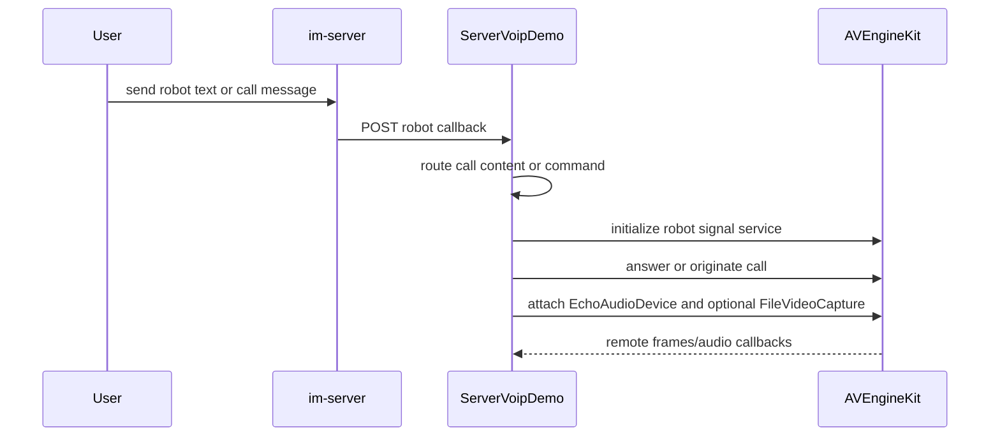

# ServerVoipDemo

## Repository Snapshot

- Local source: `C:\Users\COLORFUL\Desktop\WuKong\.codex_tmp\wildfirechat\ServerVoipDemo`
- Branch: `main`
- Commit inspected: `a47e5e2`
- Main parts:
  - Spring Boot server-side AV SDK demo.
  - Robot callback receiver.
  - Voice/video call robot logic.
  - Echo audio device and file video capture examples.

## Responsibility

`ServerVoipDemo` demonstrates how a backend/robot process can join or answer WildfireChat audio/video calls through the server-side AV SDK.

It is a demo for AI voice assistant and server-side robot call scenarios. It is not the core IM server, not the Janus media server, and not a production bot framework by itself.

Typical use cases demonstrated:

- Receive robot callback messages from `im-server`.
- Answer incoming private/group calls.
- Trigger an outbound call when a user sends a text command.
- Send/receive audio with an echo audio device.
- Send video from a local media file.
- Save remote video frames for inspection.

## Build and Run

Key requirements from build/config:

```text
Java 8
Maven
WildfireChat IM server
WildfireChat robot id and robot secret
WildfireChat server-side AV SDK native support
```

The inspected repository and README indicate platform support is limited to:

```text
Linux x86_64
macOS arm64
```

## Stack

- Java 8.
- Spring Boot `2.2.10.RELEASE`.
- WildfireChat server SDK `1.1.2`.
- WildfireChat AV SDK `1.2.2`.
- Java WebRTC / JavaCV related dependencies.
- Local/system-scoped SDK jars.

## Configuration

Robot config:

```text
config/robot.properties
```

Important fields:

```text
robot id
robot im_url
robot secret
```

The robot URL is the IM public HTTP URL, not the `im-server` admin port.

Application config:

```text
config/application.properties
```

Important fields:

```text
ice.url
ice.user
ice.pass
video.file.path=./config/foreman.mp4
```

Free AV uses TURN/ICE configuration. Advanced AV with Janus does not require TURN in the same way.

## Callback APIs

Robot callback endpoints:

```text
POST /robot/recvmsg
POST /robot/recvmsg/conference
```

`ServiceImpl` routes call messages with content types in the `400..420` range into `CallService`.

A text message containing `给我打电话` triggers an outbound private or group call if the caller has a previously recorded preferred engine.

## Main Runtime Flow



`CallService` initializes `AVEngineKit` with `RobotService`, answers incoming calls after a delay, uses `EchoAudioDevice` for audio, and uses `FileVideoCapture` for video when enabled.

`ImageVideoSink` writes remote video frames for demo/debug use.

## Source-Confirmed Risks

- Demo config includes example robot/TURN credentials and should not be reused.
- The demo writes BMP video frames to the working directory periodically; disable or redirect this before production-like runs.
- Local/system-scoped SDK jars and native dependencies make packaging platform-sensitive.
- The command-triggered outbound-call behavior is demo logic, not an access-controlled production workflow.
- Treat robot secrets as credentials; a holder can act as that robot through Robot API calls.
