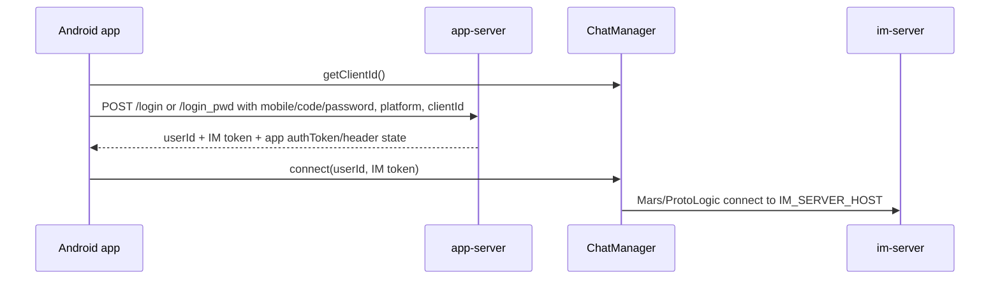

# Repository Note: android-chat

## Snapshot
- Repository: `wildfirechat/android-chat`
- Local cache: `C:\Users\COLORFUL\Desktop\WuKong\.codex_tmp\wildfirechat\android-chat`
- Branch/commit inspected: `master` / `0cfbd01`
- Primary role: Android IM SDK source, UIKit layer, push integration, audio/video glue, and demo chat app.
- Main stack: Android Gradle Plugin 8.7.2, Java 8 source compatibility, JDK 17 for development, Tencent Mars, native `mars-core-release`, WebRTC/AV modules, AndroidX, OKHttp, vendor push integrations.

## Responsibility
`android-chat` contains the Android client side of the WildfireChat system. It is both a demo app and the source distribution for the Android client SDK/UI stack.

Module split confirmed from `settings.gradle`:

- `chat`: runnable Android application and app-server business API glue.
- `client`: IM protocol facade and Android service around Tencent Mars/ProtoLogic.
- `uikit`: reusable UI/component layer, app service provider interfaces, message view holders, conversation/contact UI, VoIP/conference glue.
- `mars-core-release`: native Mars protocol binary.
- `push`, `push-getui`, `push-jpush`: push integration options.
- `webrtc`, `avenginekit`, `pttclient`: audio/video and push-to-talk related modules.
- auxiliary UI/media modules: `badgeview`, `menu`, `permission`, `cameraview`, `uvccamera`, `emojilibrary`, `imagepicker`.

High-level boundary: the app talks to `app-server` for login and app-level APIs, then connects directly to `im-server` through `client`/Mars after receiving an IM token.

## Build and Run Notes
Confirmed from root `build.gradle` and `chat/build.gradle`:

- Root uses Android Gradle plugin `8.7.2`.
- README says development uses JDK 17.
- `chat` application id defaults to `cn.wildfirechat.chat.open`.
- `compileSdkVersion = 34`, `targetSdkVersion = 34`, `minSdkVersion = 24`.
- `release` enables minify; `debug` does not by default.
- Native ABI filters: `armeabi-v7a`, `arm64-v8a`.

Likely build commands based on Gradle project shape and README examples:

```powershell
.\gradlew clean assembleDebug
.\gradlew clean assembleRelease
```

README also references shorthand tasks such as `aDebug` and `aR`; use Gradle task listing before relying on those in automation.

## Key Configuration
Confirmed from `chat/src/main/java/cn/wildfire/chat/app/AppService.java`:

- `APP_SERVER_ADDRESS = "https://app.wildfirechat.net"` by default.
- `validateConfig` rejects bad combinations such as IM host with `http`, IM host containing port, `127.0.0.1`, and mismatched demo/self-hosted app-server vs IM-server domains.

Confirmed from `uikit/src/main/java/cn/wildfire/chat/kit/Config.java`:

- `IM_SERVER_HOST = "wildfirechat.net"` by default.
- `ICE_SERVERS` defaults to WildfireChat TURN test service.
- Optional service addresses include organization, collection, poll, archive, online file preview, workspace/open-platform, ASR, AI robot, file transfer assistant, and privacy/user agreement URLs.
- `ENABLE_SLIDE_VERIFY = true` by default, and comments state app-server must be configured consistently.

Operational implication: self-hosted deployments must change both `APP_SERVER_ADDRESS` and `IM_SERVER_HOST`, and the IM host must be host/IP only, without scheme or port.

## App Startup and SDK Initialization
Confirmed from `chat/src/main/java/cn/wildfire/chat/app/MyApp.java`:

- `AppService.validateConfig(this)` runs on application startup.
- Initialization is guarded to the main process only.
- `WfcUIKit.getWfcUIKit().init(this)` initializes the client and UI layer.
- `WfcUIKit` registers `AppService.Instance()` as the app-service provider.
- `PushService.init(this, BuildConfig.APPLICATION_ID)` initializes push.
- The app registers custom message contents such as poll messages.
- Optional collection, poll, archive, and organization service providers are wired from `Config`.
- Cached `wf_userId` and `wf_token` are loaded from `KeyStoreUtil`, with a migration fallback from old SharedPreferences keys.
- If cached credentials exist, the app calls `ChatManagerHolder.gChatManager.connect(id, token)`.

Confirmed from `uikit/src/main/java/cn/wildfire/chat/kit/WfcUIKit.java`:

- `initWFClient` calls `ChatManager.init(application, Config.IM_SERVER_HOST)`.
- `ChatManagerHolder.gChatManager = ChatManager.Instance()`.
- The UI layer starts logs, sets the send-log command, and attaches receive/recall/friend listeners.
- AV engine and ICE servers are initialized when available.
- PTT and conference managers are initialized from the UI layer.

## Login and Token Flow
Confirmed from `AppService.java`:

Password login:

- POST `APP_SERVER_ADDRESS + "/login_pwd"`.
- Body includes `mobile`, `password`, optional `slideVerifyToken`.
- Body includes `platform = ChatManager.Instance().getPlatform().value()`.
- Body includes `clientId = ChatManagerHolder.gChatManager.getClientId()`.

SMS login:

- POST `APP_SERVER_ADDRESS + "/login"`.
- Body includes `mobile`, `code`, optional `slideVerifyToken`.
- Platform is hard-coded to Android phone `2`; comments describe Android pad platform `9`.
- Body includes `clientId = ChatManagerHolder.gChatManager.getClientId()`.

Confirmed from `LoginActivity.java` and `SMSLoginActivity.java`:

- Both password and SMS login success paths call `ChatManagerHolder.gChatManager.connect(loginResult.getUserId(), loginResult.getToken())`.
- Both save `wf_userId` and `wf_token` via `KeyStoreUtil`.
- Source comments explicitly warn that token and `clientId` are strongly bound: token must be issued for the same client ID returned by `getClientId()`.

Core Android sequence:



## IM Protocol Layer
Confirmed from `client/src/main/java/cn/wildfirechat/remote/ChatManager.java`:

- `ChatManager.init(context, imServerHost)` sets and validates the IM server host.
- `getClientId()` persists and returns the device identity used for token binding.
- `connect(userId, token)` rejects empty `userId`, `token`, or server host, then delegates to the remote client service.
- Comments warn not to call `connect` repeatedly; user switching should disconnect first, then reconnect after a delay for automatic switches.
- `setIMServerHost` updates the local host and remote service address.

Confirmed from `client/src/main/java/cn/wildfirechat/client/ClientService.java`:

- Imports Tencent Mars APIs such as `Mars`, `AppLogic`, `ProtoLogic`, `SdtLogic`, and `StnLogic`.
- On service creation, it loads Mars native libraries and initializes Mars callbacks.
- `onBind` receives the `clientId` from `ChatManager`.
- `protoConnect` calls `ProtoLogic.setAuthInfo(userName, userPwd)` and `ProtoLogic.connect(mHost)`.
- Device info platform is `2` for Android phone and `9` for Android pad.
- Conversation list size is capped at `1000` in the service.

Important boundary: `ChatManager` is the Android app-facing facade, while `ClientService` owns the long-running protocol/Mars integration.

## PC QR Login Support
Confirmed from `AppService.java`:

- `/scan_pc/{token}`
- `/confirm_pc`
- `/cancel_pc`

Mobile confirms PC/web login by passing the current user ID and session token:

```text
token = scanned PC session token
user_id = current mobile user
quick_login = 1
```

Confirmed from `WfcUIKit.java`: receiving a `PCLoginRequestMessageContent` within a short time window triggers `appServiceProvider.showPCLoginActivity(...)`.

## App-Server API Surface
Beyond login, `AppService.java` calls app-server APIs for:

- password reset/change
- group announcements
- favorites
- conference create/query/favorite/recording/focus/quota APIs
- group default portrait generation
- log upload
- slide captcha generation/verification
- profile name change

This mirrors the app-server feature set seen in `app-server` and the Web/PC clients.

## Push and Notification Notes
- README states that background delivery needs vendor push and points to `push_server`.
- The project has direct vendor push module `push` and optional Getui/JPush modules.
- `chat/build.gradle` contains placeholders for Huawei, Honor, Xiaomi, OPPO, Vivo, Meizu, JPush, and Getui configuration.
- For production, application ID/package name, push service JSON files, and vendor credentials must be replaced.

## Security and Deployment Notes
- README says the open protocol stack defaults to official WildfireChat service restrictions; self-hosted connection may require an unrestricted official build of `mars-core-release.aar`.
- Default signing config uses demo `wildfirechat` keystore values; do not use in production.
- Default public app-server, IM host, TURN, ASR, organization, collection, and poll service URLs are demo/test defaults.
- README recommends HTTPS for app-server and disabling cleartext traffic before release.
- `usesCleartextTraffic` should be reviewed in `AndroidManifest.xml`.
- `APP_SERVER_ADDRESS` must include scheme; `IM_SERVER_HOST` must not include scheme or port.
- `Config.ENABLE_SLIDE_VERIFY` and app-server slide verification must be kept in sync.

## Relationship to Other Repositories
- Talks to `app-server` for login, PC login confirmation, favorites, conference metadata, group announcements, profile changes, slide captcha, and other app APIs.
- Connects to `im-server` through the Android client/Mars protocol stack.
- Uses `push_server` indirectly for offline/vendor push delivery.
- Optional integration points correspond to `organization-platform`, `open-platform`, `archive-server`, collection/poll services, ASR, and conference/VoIP components.

## Open Questions
- The native `mars-core-release.aar` behavior cannot be fully inspected from Java source alone.
- A production hardening pass should separately inspect `AndroidManifest.xml`, push service declarations, exported activities/services, and cleartext network config.
- Compare current Android repository with any published AAR integration guidance in official `docs` before writing final deployment steps.
