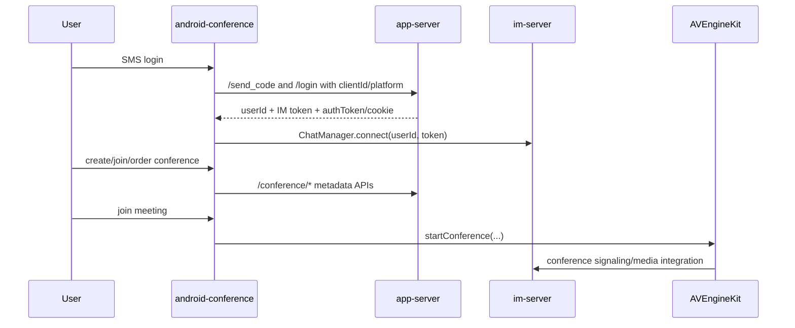

# android-conference

## Repository Snapshot

- Local source: `C:\Users\COLORFUL\Desktop\WuKong\.codex_tmp\wildfirechat\android-conference`
- Branch: `master`
- Commit inspected: `7c65c03`
- Main parts:
  - Android application module `app`.
  - Bundled low-level IM client AAR module `wf-client`.
  - Bundled Mars core module `mars-core-release`.
  - Bundled AV SDK AAR module `avenginekit`.
  - Bundled WebRTC module `webrtc`.

## Responsibility

`android-conference` is a standalone Android meeting client for WildfireChat conference scenarios.

It is not the full Android IM chat app. It focuses on:

- SMS login through `app-server`.
- IM long-connection login through `ChatManager`.
- Meeting creation, reservation, lookup, favorite, and destroy through `app-server` conference APIs.
- Joining/running a conference through `AVEngineKit`.
- Conference UI for audio/video, participants, floating view, and mode changes.

## Build and Run

Android project:

```text
Gradle Android plugin 7.0.2
compileSdk 31
minSdk 21
targetSdk 27
applicationId cn.wildfirechat.zoom
```

Included modules:

```text
app
mars-core-release
wf-client
avenginekit
webrtc
```

Key dependencies:

```text
AndroidX AppCompat / ConstraintLayout / GridLayout / Lifecycle
Material Components
Gson
OkHttp 5 alpha
Glide
ButterKnife
ZXing lite
```

## Configuration

Default IM host:

```text
Config.IM_SERVER_HOST = wildfirechat.net
```

Default app-server:

```text
AppService.APP_SERVER_ADDRESS = http://wildfirechat.net:8888
```

Default ICE/TURN config:

```text
turn:turn.wildfirechat.net:3478
user: wfchat
password: wfchat
```

Source comments state:

- `IM_SERVER_HOST` is only a host, not an `http://` URL and not a host:port string.
- Commercial deployment should use HTTPS for the app server.
- Free/single/multi AV needs TURN; advanced AV should keep the ICE server array empty.

`AppService.validateConfig()` enforces several config constraints, including avoiding `127.0.0.1`, avoiding `http` in `IM_SERVER_HOST`, and keeping demo domain/app-server choices consistent.

## Login and Token Flow

SMS login:

```text
POST /send_code
POST /login
```

`AppService.smsLogin()` sends:

```text
mobile
code
platform = 2
clientId = ChatManager.Instance().getClientId()
```

On login success, `SMSLoginActivity` calls:

```text
ChatManager.Instance().connect(userId, token)
```

and stores:

```text
id
token
```

in `Config.SP_CONFIG_FILE_NAME`.

`MyApp` initializes:

```text
ChatManager.init(application, Config.IM_SERVER_HOST)
AVEngineKit.init(application, callback)
OKHttpHelper.init(application)
```

Then it auto-connects with cached `id` and `token`.

Important invariant repeated in source comments: IM tokens are bound to `clientId`; the same `clientId` used for login must be the one used by `connect`.

## App-Server Conference APIs

`AppService` uses:

```text
POST /conference/get_my_id
POST /conference/create
POST /conference/info
POST /conference/destroy/{conferenceId}
POST /conference/fav/{conferenceId}
POST /conference/unfav/{conferenceId}
POST /conference/is_fav/{conferenceId}
POST /conference/fav_conferences
POST /logs/{userId}/upload
```

`OKHttpHelper` stores/uses app-server auth using:

```text
Header: authToken
fallback: cookies
```

This is the app-server HTTP credential, separate from the IM token.

## Conference Runtime

Main user flow:



`MainActivity` offers:

- Start conference.
- Join conference manually.
- Order/reserve conference.
- Scan `wfzoom://` QR link.

`ConferenceInfoActivity.joinConference()` starts the session with:

```text
AVEngineKit.Instance().startConference(
  conferenceId,
  audioOnly=false,
  pin,
  host=userId/owner,
  title,
  desc,
  audience,
  advanced,
  ...
)
```

`ConferenceActivity` chooses `ConferenceAudioFragment` or `ConferenceVideoFragment` based on `session.isAudioOnly()`, delegates AV callbacks into the fragment, and handles rejoin/recreate cases such as `RoomNotExist` and `RoomParticipantsFull`.

## QR Link

The Android client parses conference QR links with prefix:

```text
wfzoom://
```

Expected query-like payload:

```text
id=<conferenceId>&pwd=<password>
```

It opens `ConferenceInfoActivity` with `conferenceId` and `password`.

## Source-Confirmed Risks

- Default IM/app-server/TURN values point to WildfireChat demo services and must be replaced.
- Default app-server URL is HTTP in inspected source; production should use HTTPS.
- The app requests broad permissions including camera, microphone, overlay, storage, location, phone state, and foreground service; production apps should trim or justify permissions.
- `ConferenceInfoActivity.joinConference()` appears to call `session.muteAudio(!videoSwitch.isChecked())` and `session.muteVideo(!audioSwitch.isChecked())`; switch names look reversed and should be runtime-verified.
- Source comments indicate advanced AV should remove TURN config. Keeping demo TURN while using advanced AV may cause confusion when diagnosing media routing.
