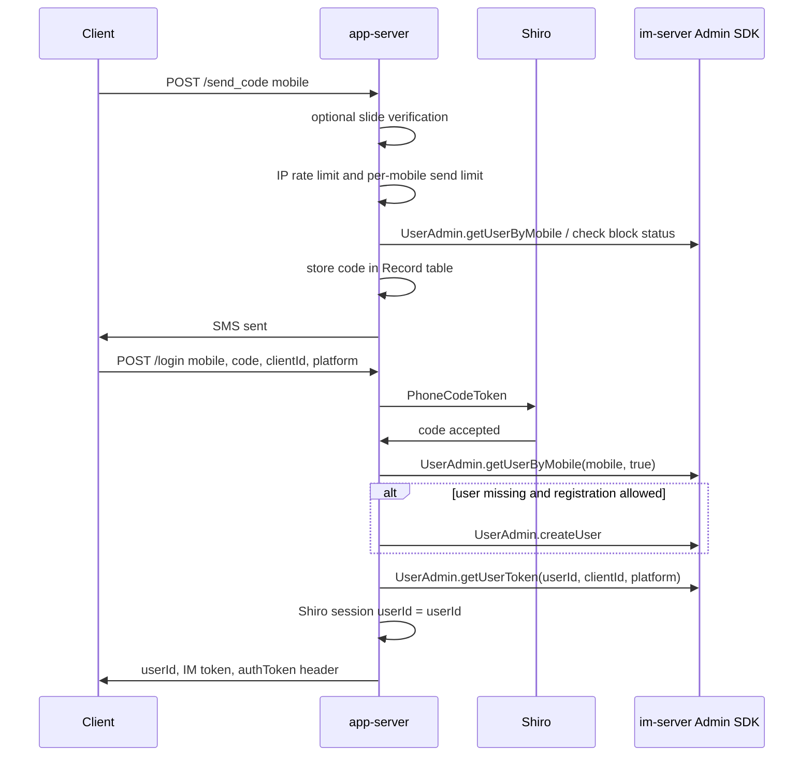
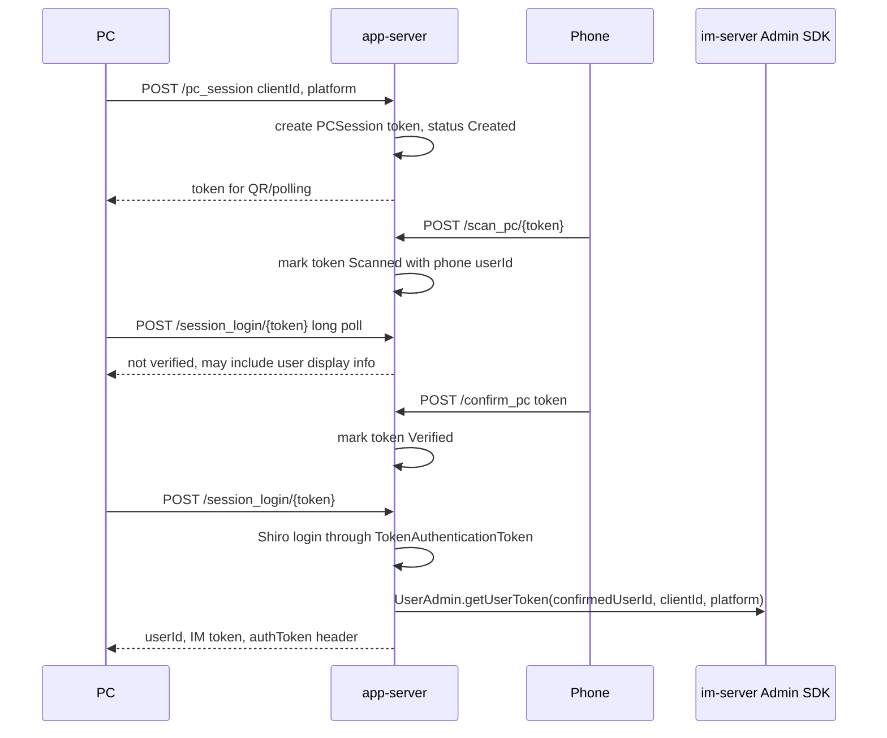
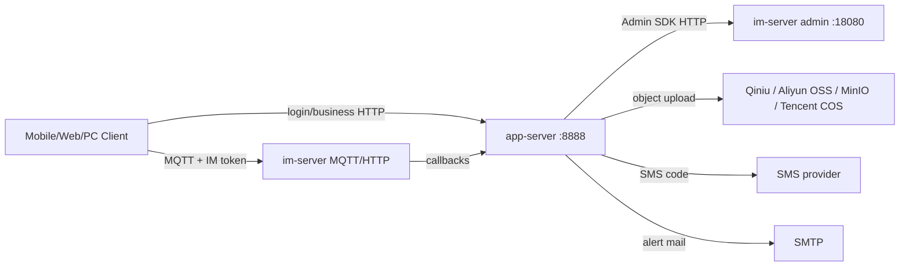

# app-server source analysis notes

## Reading Status
First source-level pass completed for the application server:

- build file and runtime configuration
- Spring Boot entry point
- HTTP routes
- Shiro authentication/session model
- SMS/password/LDAP login flows
- PC QR-code login flow
- local JPA data model
- IM server Admin SDK calls
- callbacks, media upload, favorites, conference, avatar, audio conversion

Source cache:

```text
C:\Users\COLORFUL\Desktop\WuKong\.codex_tmp\wildfirechat\app-server
```

Clone metadata:

- Branch: `master`
- Commit: `bedf1ab`
- Maven artifact: `cn.wildfirechat:app:0.74`

## Repository Role
`app-server` is the demo/application business server that sits beside `im-server`.

It is not the IM core. It provides application-level capabilities that clients need before or around IM connectivity:

- user login and registration by SMS code
- password login, password reset, and account destroy flow
- optional LDAP login
- PC/web QR-code login coordination
- application-side HTTP session using Apache Shiro
- group announcement storage
- client log upload
- media upload for iOS share extension and other app-side uploads
- favorites
- IoT device helper endpoints
- user message sending through the Admin SDK
- generated avatars and group avatars
- AMR-to-MP3 conversion for clients that cannot play AMR
- conference metadata, favorite conferences, and quota bookkeeping
- sample IM callback and message censor endpoints
- IM exception alert mail forwarding

The main architectural point: clients use `app-server` for app login/business APIs, then use the IM token returned by `app-server` to connect to `im-server`.

## Tech Stack
- Java 8
- Spring Boot `2.2.10.RELEASE`
- Spring MVC
- Spring Data JPA
- Apache Shiro `1.7.1`
- H2 by default, with MySQL, Dameng, and Kingbase configuration examples
- WildfireChat Java server SDK `1.4.7`, bundled as `src/lib/sdk-1.4.7.jar`
- WildfireChat common library `1.4.7`, bundled as `src/lib/common-1.4.7.jar`
- Gson, protobuf Java `2.5.0`
- Qiniu, Aliyun OSS, MinIO, Tencent COS SDKs
- Tencent/Aliyun SMS SDKs
- Java mail
- `ws.schild:jave` for audio conversion

Build command:

```powershell
.\mvnw.cmd clean package
```

Common runtime command:

```powershell
java -jar target\app-0.74.jar
```

## Startup and Configuration
Entry point:

```text
cn.wildfirechat.app.Application.main
```

Startup behavior:

- starts Spring Boot
- enables servlet component scanning
- enables scheduled jobs
- configures multipart upload limits: 20 MB per file, 100 MB per request
- hourly cleanup for expired PC sessions
- hourly cleanup for expired slide verification records

Primary configuration files:

```text
config\application.properties
config\im.properties
```

Important configuration values:

- `server.port=8888`
- `im.admin_url=http://localhost:18080`
- `im.admin_secret=123456`
- `im.admin_user_id=admin`
- `sms.super_code=66666`
- `spring.datasource.url=jdbc:h2:file:./appdata`
- `spring.jpa.hibernate.ddl-auto=update`
- `wfc.user_register_forbidden=true`
- `wfc.default_user_password=false`
- `wfc.compat_pc_quick_login=false`
- `media.server.media_type=1`
- `slide.verify.force=false`

Production cautions confirmed from config/source:

- H2 is demo/development-oriented; production should use a real database such as MySQL.
- The app database must not reuse the `im-server` database.
- `sms.super_code=66666` is a demo backdoor code. It must be removed or replaced before production.
- The default `im.admin_secret=123456` must match `im-server`'s admin secret, but production must replace it.
- `DBSessionDao` stores Shiro sessions in the app database; config comments warn this can become a bottleneck and should be replaced by Redis or another suitable session store for larger deployments.
- Object storage sample credentials/domains are placeholders and must be configured.

## HTTP Surface
Main controllers:

- `AppController`: login, PC login, account, group announcements, logs, devices, media, favorites
- `ConferenceController`: conference metadata and quota APIs
- `IMCallbackController`: sample callbacks from `im-server`
- `IMExceptionEventController`: IM exception alert receiver
- `AudioController`: AMR to MP3 conversion
- `AvatarController`: generated avatars and group avatars

Notable public or anonymous routes in Shiro config:

- `/`
- `/slide_verify/generate`
- `/slide_verify/verify`
- `/send_code`
- `/login`
- `/login_pwd`
- `/send_reset_code`
- `/reset_pwd`
- `/pc_session`
- `/session_login/**`
- `/logs/**`
- `/im_event/**`
- `/im_exception_event/**`
- `/message/censor`
- `/amr2mp3`
- `/avatar/**`

Authenticated routes include:

- `/change_pwd`
- `/send_destroy_code`
- `/destroy`
- `/scan_pc/**`
- `/confirm_pc`
- `/cancel_pc`
- `/change_name`
- `/put_group_announcement`
- `/get_group_announcement`
- `/things/add_device`
- `/things/list_device`
- `/things/del_device`
- `/messages/send`
- `/media/upload/{media_type}`
- `/fav/add`
- `/fav/del/{fav_id}`
- `/fav/list`
- `/group/members_for_portrait`
- `/conference/...`

## Authentication and Session Model
`app-server` uses Shiro for its own HTTP session. This is separate from the IM token.

Realms:

- `PhoneCodeRealm`: validates SMS code through `AuthDataSource.verifyCode`.
- `UserPasswordRealm`: validates SHA-1 salted password records stored in `UserPassword`.
- `LdapRealm`: optional LDAP authentication when `ldap.enable=true`.
- `ScanCodeRealm`: validates a PC QR-code login token through `TokenMatcher`.

Session storage:

- `DBSessionDao` serializes Shiro `Session` objects into the `ShiroSession` JPA table.
- `ShiroSessionManager` accepts session id from cookie/header behavior, then `AppController` returns `authToken` in login responses.
- Shiro global session timeout is set to `Long.MAX_VALUE`; practical validity depends on stored session records and app logic.

## SMS Login Flow
Flow:



Key details:

- `sendLoginCode` validates optional or forced slide verification.
- IP-level rate limiting is `new RateLimiter(60, 200)`.
- Per-mobile code state is stored in `Record`.
- If `wfc.user_register_forbidden=true`, unknown users cannot receive login/reset code and cannot be auto-created.
- `getUserStatus` checks whether the IM user is blocked before code send/login.
- After successful login, `onLoginSuccess` returns a `LoginResponse` with:
  - `userId`
  - IM `token`
  - `register` flag
  - `portrait`
  - `userName`
  - optional `resetCode`
- The HTTP response also includes `authToken`, the Shiro session id.

## Password and LDAP Login
Password login:

- Route: `POST /login_pwd`
- Finds IM user by mobile through `UserAdmin.getUserByMobile`.
- Loads app-side password record from `UserPassword`.
- Password storage uses SHA-1 with random salt and Base64 encoded digest.
- Failed attempts are counted in `UserPassword.tryCount`; more than 5 attempts within 5 minutes returns `ERROR_FAILURE_TOO_MUCH_TIMES`.
- If `wfc.default_user_password=true`, first login can initialize a default password from the last six mobile digits.
- After authentication it uses the same `onLoginSuccess` path to get an IM token.

LDAP login:

- Enabled by `ldap.enable=true`.
- Password login delegates to `loginWithLdap`.
- Finds LDAP user by phone, authenticates through `LdapToken`, then calls `onLoginSuccess`.

## PC QR-Code Login
This is a two-device flow coordinated by app-server JPA state.

Entities and state:

- `PCSession.token`: QR/session token
- `PCSession.clientId`
- `PCSession.platform`
- `PCSession.confirmedUserId`
- `PCSession.status`

Session statuses:

- `Session_Created`
- `Session_Scanned`
- `Session_Pre_Verify`
- `Session_Verified`
- `Session_Canceled`

Flow:



Notes:

- `/session_login/{token}` uses long polling with a 50-second timeout.
- Once a session is consumed successfully, `authDataSource.getSession(token, true)` deletes it.
- `createPcSession` can send an IM message type `94` to the already logged-in user to request PC login confirmation.
- PC sessions expire after 300 seconds by `PCSession.duration`; stale rows older than one hour are cleaned hourly.

## Relationship to im-server
`ServiceImpl.init()` calls:

```text
AdminConfig.initAdmin(mIMConfig.admin_url, mIMConfig.admin_secret)
```

This binds the bundled Java Admin SDK to the configured `im-server` admin endpoint.

Important Admin SDK calls:

- `UserAdmin.getUserByMobile`
- `UserAdmin.getUserByUserId`
- `UserAdmin.getUserByName`
- `UserAdmin.createUser`
- `UserAdmin.getUserToken`
- `UserAdmin.checkUserBlockStatus`
- `UserAdmin.destroyUser`
- `MessageAdmin.sendMessage`
- `RelationAdmin.setUserFriend`
- `GeneralAdmin.subscribeChannel`
- `GeneralAdmin.isUserSubscribedChannel`
- `GroupAdmin.getGroupMembers`
- `ConferenceAdmin.createRoom`
- `ConferenceAdmin.destroy`
- `ConferenceAdmin.enableRecording`
- `ConferenceAdmin.listConferences`

`app-server` therefore acts as an Admin SDK client of `im-server`.

## Post-Login Side Effects
`onLoginSuccess` does more than return a token:

- auto-creates the IM user when allowed
- restores deleted user records by calling `UserAdmin.createUser` with `deleted=0`
- stores `userId` in the Shiro session
- sends welcome text to new/back users if configured
- optionally adds the configured robot as a friend
- optionally sends robot welcome message
- optionally subscribes the user to configured channels
- optionally sends prompt text and image message

This means login is not side-effect-free. Any production customization should audit `config/im.properties`.

## Local JPA Data Model
`app-server` stores only app/business state, not IM message history.

Main JPA entities:

- `Record`: SMS code and send frequency state by mobile.
- `UserPassword`: app-side password hash, salt, reset code, retry counters.
- `ShiroSession`: serialized Shiro HTTP sessions.
- `PCSession`: PC/web QR login state.
- `Announcement`: group announcement text by group id.
- `FavoriteItem`: user favorites, including message/media metadata.
- `SlideVerify`: slide captcha state.
- `UserNameEntry`: helper for generated usernames.
- `ConferenceEntity`: conference metadata.
- `UserPrivateConferenceId`: stable private conference id per user.
- `UserConference`: user favorite conference relation.
- `UserConferenceQuota`: configured conference quota per user.
- `UserQuotaUsage`: monthly conference quota usage.
- `ConferenceRecord`: planned/actual conference duration and quota accounting.

## Media Upload and Storage
Route:

```text
POST /media/upload/{media_type}
```

Behavior:

- requires Shiro login
- writes uploaded file into `local.media.temp_storage`
- chooses bucket/domain based on `media_type`
- supports Qiniu, Aliyun OSS, MinIO, placeholder gateway mode, and Tencent COS depending on `media.server.media_type`
- returns the generated media URL

Media type comments in source:

- `0`: general
- `1`: image
- `2`: voice
- `3`: video
- `4`: file
- `5`: portrait
- `6`: favorite
- `7`: sticker
- `8`: moments

Implementation note: the switch in `uploadMedia` maps case `7` to moments bucket and case `8` to sticker bucket, which appears reversed relative to the source comment. Treat this as a risk to verify before production changes.

## Favorites
Routes:

- `POST /fav/add`
- `POST /fav/del/{fav_id}`
- `POST /fav/list`

Behavior:

- favorites are app-server data in `FavoriteItem`
- when a favorite has a media URL, `putFavoriteItem` tries to copy the object into the favorite bucket for long-term storage
- object-copy behavior supports Qiniu, Aliyun OSS, MinIO, and Tencent COS

## Conference Module
Routes are under `/conference/...`.

Responsibilities:

- private conference id per user
- conference info lookup and update
- conference creation/destruction through `ConferenceAdmin`
- recording toggle through `ConferenceAdmin.enableRecording`
- focus user
- favorite/unfavorite/list conference
- user quota query
- planned/actual duration bookkeeping

Creation flow:

1. resolve logged-in user as owner
2. normalize start time and max participants
3. if an end time exists, check monthly quota
4. generate conference id when not provided
5. call `ConferenceAdmin.createRoom`
6. store `ConferenceEntity`
7. create `ConferenceRecord` for quota tracking when the conference has an end time
8. favorite the conference for the owner

Destroy flow:

1. verify logged-in user is the owner
2. call `ConferenceAdmin.destroy`
3. mark conference ended and update quota usage
4. delete favorite relations for the conference
5. delete `ConferenceEntity`

## IM Callbacks and Censoring
`IMCallbackController` exposes sample callback routes for:

- user online status
- user relation update
- user info update
- message send
- recall message
- IoT message
- message read
- group info/member update
- channel info update
- chatroom info/member update
- conference create/destroy/member events
- moments feed/comment events

`/message/censor` is a sample synchronous message censor endpoint:

- returns empty body to allow original message
- throws `ForbiddenException` to reject a message
- returns modified payload JSON to replace message content

Source comments warn that IM callbacks are handled by `im-server` callback threads. Production callbacks should return quickly and handle slow work asynchronously.

## IM Exception Events
`IMExceptionEventController` exposes:

```text
POST /im_exception_event
```

It queues `IMExceptionEvent` objects and sends mail notifications from a background thread. This is operational alert glue for exceptions reported by `im-server`.

## Avatar and Audio Utilities
Avatar:

- `GET /avatar?name=...`
- `GET /avatar/group?request=...`
- generates single-user or group avatar images

Audio:

- `GET /amr2mp3?path=...`
- downloads/converts a remote AMR URL into MP3 using JAVE/ffmpeg wrappers
- caches generated MP3 files under `wfc.audio.cache.dir`

Security note: `amr2mp3` accepts a URL from the caller and passes it to `new URL(sourceUrl)`. Treat this as an SSRF-sensitive endpoint if exposed to untrusted clients.

## Boundaries for Secondary Development
Prefer changing `app-server` when implementing app/business behavior such as:

- replacing SMS provider or login policy
- integrating enterprise SSO/LDAP
- blocking registration or provisioning users externally
- adding post-login welcome/business messages
- custom media storage
- favorites/business metadata
- conference quotas and app-side policies
- callback handling for audit, compliance, bots, or business workflows

Avoid changing `app-server` for IM protocol internals such as:

- MQTT topic handling
- client session secret negotiation
- message routing/storage internals
- group/member protocol behavior
- offline push core strategy

Those belong to `im-server` or should be extended via Admin API, callbacks, robots, channels, or custom message types.

## Risks and Review Notes
- Demo secrets are present in config. Production deployment must rotate them.
- `sms.super_code` is a login bypass when configured.
- Password hashing uses salted SHA-1, not a modern password KDF.
- Shiro sessions are persisted through Java serialization into the database.
- Shiro global timeout is effectively unlimited.
- Callback/censor endpoints are anonymous by Shiro config; production should rely on trusted network boundaries, reverse proxy policy, or request authentication.
- The media upload path writes local temp files and does not clearly delete them after successful object storage upload.
- `amr2mp3` can fetch arbitrary URLs and should be controlled if exposed.
- The repository is explicitly a demo app server; production should review all default behavior instead of deploying as-is.

## Confirmed Architecture Relationship



The login/token invariant:

1. client authenticates to `app-server`
2. `app-server` asks `im-server` Admin API for an IM token
3. client uses that IM token to connect to `im-server`
4. Shiro `authToken` is only for later `app-server` HTTP APIs
