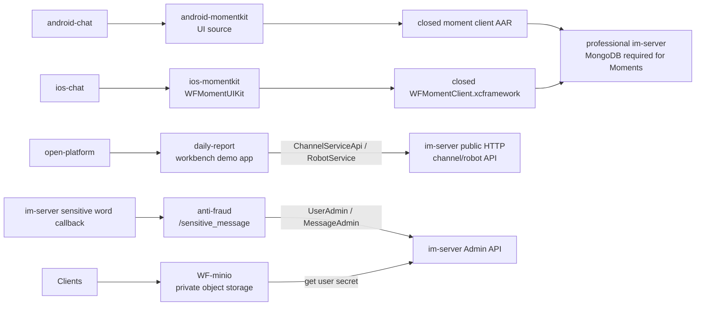

# Repository Note: Auxiliary Repositories

## Reader and Action

Primary reader: an engineer deciding whether WildfireChat auxiliary/content repositories are part of a production deployment or only references, demos, tooling, or unrelated community material.

Post-read action: identify which auxiliary repos interact with IM, which require professional/commercial components, and which can be ignored for normal IM deployment.

## Snapshot

Local sources inspected under `C:\Users\COLORFUL\Desktop\WuKong\.codex_tmp\wildfirechat`.

Commits inspected:

- `android-momentkit`: `92ba485`
- `ios-momentkit`: `b0f74ce`
- `wf-gallery`: `0847671`
- `daily-report`: `19244be`
- `anti-fraud`: `9e6418a`
- `WF-minio`: `d39ac1b`
- `libopencore-amr-ios-build`: `40c8e8e`
- `996.ICU`: `6f34dff`
- `java_bullshitarticle`: `b40f02c`

`WF-minio` clone previously timed out in the terminal, but the checkout is readable and `git rev-parse` returned `d39ac1b`.

## Classification

IM-adjacent and potentially relevant:

- `android-momentkit`: Android Moments/Friends-Circle UI code, depends on paid closed `moment client` AAR and professional IM.
- `ios-momentkit`: iOS Moments/Friends-Circle UIKit, depends on closed paid `WFMomentClient` and professional IM with MongoDB.
- `daily-report`: open-platform demo application with Spring Boot backend and Vue 2 frontend.
- `anti-fraud`: sensitive-word callback service that sends admin alerts and anti-fraud warning messages through IM Admin API.
- `WF-minio`: WildfireChat-adapted MinIO binary release and deployment docs for private object storage in professional IM.

Presentation, build helper, or non-core:

- `wf-gallery`: static Vue screenshot gallery for WildfireChat product screenshots.
- `libopencore-amr-ios-build`: iOS build script for `opencore-amr` static libraries/xcframeworks.
- `996.ICU`: anti-996 labor-rights community repository, unrelated to WildfireChat runtime.
- `java_bullshitarticle`: Java port of a joke "bullshit article" generator, unrelated to WildfireChat runtime.

## Auxiliary Architecture

## android-momentkit

### Responsibility

`android-momentkit` is the Android UI layer for WildfireChat Moments/Friends-Circle.

It is not a standalone app and not a backend. The README says it depends on a closed `moment client` library, which is paid and must be obtained from WildfireChat.

### Source-Confirmed Behavior

- Source is organized as Java UI and resources under `src/main/java` and `src/main/res-moment`.
- README integration expects the repository to sit next to `android-chat` as `android-momentkit`.
- Integration steps require:
  - adding `momentclient-release.aar` under `android-chat/momentclient`;
  - enabling `:momentclient` in `android-chat/settings.gradle`;
  - adding this repo's Java and resource directories into `android-chat/uikit/build.gradle`;
  - enabling Moment activities in `android-chat/uikit/src/main/AndroidManifest.xml`.
- Manifest declares Moment activities:
  - `PublishFeedActivity`
  - `FeedMessageActivity`
  - `FeedDetailActivity`
  - `FeedListActivity`
  - `FeedVisibleScopeActivity`
- UI code imports and calls `cn.wildfirechat.moment.MomentClient`.
- `FeedListActivity` loads feeds, restores/stores feed cache, receives moment messages, updates user profile background, and uploads media through `MomentClient.uploadMediaSync`.
- `PublishFeedActivity` uploads image/video media through `MomentClient.uploadMediaSync` and posts feeds through `MomentClient.getInstance().postFeed`.
- `BaseFeedActivity` handles comments, likes, delete-feed, and delete-comment through `MomentClient`.

### Deployment Implications

- Moments require professional IM and the closed Moment client library.
- Android UI customization can happen in this repo, but backend protocol/storage behavior lives in the closed Moment client plus professional IM service.
- README integration is coupled to `android-chat` source layout, not a generic Gradle module layout.

### Risks and Boundaries

- Do not assume the open UI repo is enough to enable Moments.
- The required AAR is closed and licensed.
- Self-hosted deployments must verify professional IM, MongoDB, media storage, and Moment client compatibility together.

## ios-momentkit

### Responsibility

`ios-momentkit` is the iOS UI framework source for WildfireChat Moments.

The README states:

- Moments backend requires professional IM.
- Professional IM must use MongoDB for Moments.
- Frontend exists only for Android and iOS, not Web/PC.
- UI kit is open source, while Moment client SDK is closed, paid, and domain-bound.

### Source-Confirmed Behavior

- Frameworks included:
  - `WFChatClient.xcframework`
  - `WFChatUIKit.xcframework`
  - `WFMomentClient.xcframework`
- `build.sh` builds an iPhoneOS and simulator framework, then creates an xcframework under `bin`.
- UIKit source imports `<WFMomentClient/WFMomentClient.h>` from multiple controllers/cells.
- `CreateFeedViewController` uploads Moments media through `WFCCIMService syncUploadMedia` with `Media_Type_MOMENTS`, then posts feeds through `WFMomentService`.
- Settings controllers read/update Moment profile visibility and block/black lists through `WFMomentService`.
- Message/detail cells render `WFMComment`, `WFMCommentMessageContent`, and feed media from the closed Moment client types.

### Deployment Implications

- Use this repo to customize iOS Moments UI.
- Integrate the built kit plus closed client SDK into `ios-chat`.
- Treat the closed `WFMomentClient` as the owner of network/protocol/storage behavior.

### Risks and Boundaries

- Not a standalone app.
- Not sufficient without the closed paid client SDK and professional server.
- Web/PC Moments are explicitly not supported by README.

## wf-gallery

### Responsibility

`wf-gallery` is a static screenshot gallery for WildfireChat product screenshots.

### Source-Confirmed Behavior

- Vue 2 project using Vue CLI 4 and `lightgallery`.
- `vue.config.js` outputs `wf-gallery.html` and inlines JS/CSS into the generated HTML.
- `Gallery.vue` hard-codes screenshot URLs from `https://static.wildfirechat.cn/`.
- Categories include Android, iOS, mini-program, uni-app, PC, Web, admin, open platform, and channel management.

### Deployment Implications

This is marketing/product documentation support. It is not an IM feature, client baseline, or server dependency.

## daily-report

### Responsibility

`daily-report` is a demo application for WildfireChat open-platform/workbench integration.

It shows how a third-party app can authenticate through open-platform auth code, store its own business data, and send rich notification messages into WildfireChat.

### Source-Confirmed Stack

Backend:

- Spring Boot `2.6.7`.
- Java 8.
- Spring Web, JPA, Shiro.
- H2 by default, MySQL optional.
- Bundled WildfireChat Java SDK/common jars version `0.87`.
- Main class: `cn.wildfirechat.app.Application`.

Frontend:

- Vue 2.6, Vue CLI 4.
- `dsbridge` for workbench/native bridge.
- Build copies `dist` into backend static resources.
- Multiple entry pages: index/report list/report/new report.

### Source-Confirmed Behavior

Configuration:

- `server.port=8881`.
- Default H2 file database `./daily_report`.
- `im.url` is the public IM HTTP URL, not Admin API.
- `application.id` and `application.secret` are open-platform application credentials.

Backend behavior:

- Initializes `ChannelServiceApi(mImUrl, mApplicationId, mApplicationSecret)`.
- Initializes `RobotService(mImUrl, mApplicationId, mApplicationSecret)`.
- `/api/user/login` accepts `appId`, `appType`, and `authCode`.
- `AuthCodeRealm` calls `channelServiceApi.applicationGetUserInfo(authCode)` to resolve WildfireChat user identity.
- `/api/user/config` calls `mRobotService.getApplicationSignature()` and returns app signature data to the frontend.
- Report creation stores app-owned report data, builds a rich notification payload, and sends it through `ChannelServiceApi.sendMessage`.

### Deployment Implications

- This is a third-party/open-platform app pattern, not core app-server.
- It keeps its own database for report data.
- It uses channel/robot application credentials rather than IM Admin API credentials.
- Production should switch from default H2 to MySQL or another managed relational DB.

### Risks and Boundaries

- Demo default `application.secret=123456` must be replaced.
- Bundled SDK/common jars are old; verify compatibility with target IM/open-platform versions.
- Do not treat the report DB as IM DB.

## anti-fraud

### Responsibility

`anti-fraud` is a Spring Boot service for sensitive-word hit callbacks.

The intended flow is:

1. Configure `im-server` `message.sensitive.forward.url` to this service.
2. Add sensitive words in IM server/admin tooling.
3. When a user message hits sensitive words, IM forwards the message to `/sensitive_message`.
4. This service notifies an administrator/group and sends warning messages back into the conversation.

### Source-Confirmed Stack

- Spring Boot `2.7.3`.
- Java 8.
- WildfireChat Java SDK/common jars version `0.92`.
- Main class: `cn.wildfirechat.app.Application`.
- Controller endpoint: `POST /sensitive_message`.

### Source-Confirmed Behavior

Configuration:

- default port `8895`;
- `im.admin_url`;
- `im.admin_secret`;
- two warning text values;
- forward conversation type and target.

Service behavior:

- Initializes Admin SDK with `AdminConfig.initAdmin(mImUrl, mImSecret)`.
- Ignores messages involving `FireRobot`, `robot_` prefixed IDs, and `admin`.
- Looks up the sender with `UserAdmin.getUserByUserId`.
- Sends a text summary to the configured admin/group conversation.
- Sends the original sensitive payload to the same admin/group conversation.
- Sends two warning notification payloads of type `90` back into the original conversation through `MessageAdmin.sendMessage`.

### Deployment Implications

- This service holds IM Admin API credentials and must be treated as privileged.
- It should be reachable by IM server callback, but not broadly exposed without network/proxy protection.
- It is a practical example for moderation workflows triggered by `im-server` callbacks.

### Risks and Boundaries

- The endpoint does not visibly authenticate callback origin in inspected source.
- It uses `Executors.newCachedThreadPool`; under high sensitive-message volume this is unbounded.
- Warning payload type `90` should be verified against the target clients' message-content handling.
- Default admin secret is demo-only.

## WF-minio

### Responsibility

`WF-minio` packages WildfireChat-adapted MinIO binaries, `mc` client binaries, Nginx sample config, and deployment docs for private object storage.

The README states it is based on MinIO and only changes WildfireChat integration behavior. It depends on professional IM and is not supported by the community edition.

### Source-Confirmed Contents

- `minio_release` contains compressed MinIO binaries for Darwin, Linux, Windows, and multiple CPU architectures.
- `mc` contains compressed MinIO client binaries for common platforms.
- `nginx/minio.conf` includes HTTP and HTTPS reverse-proxy examples with large upload limits and header forwarding.
- Docs explain IM integration through MinIO admin config keys:
  - `WFChat IMAdminUrl=http://${im_server_address}:18080/admin/minio/sk`
  - `WFChat IMAdminSecret=${im_server_admin_secret}`
  - optional `WFChat SM4Encrypt=on`.

### Source-Confirmed Media Flow

Upload flow from README:

- Client asks IM for an upload token.
- IM computes token from config and returns it to the client.
- Client encrypts data with its private key and uploads directly to object storage.
- WildfireChat-adapted MinIO verifies token.
- MinIO calls IM Server/Admin API to obtain the user's secret key and decrypt/store the file.

Download flow from README:

- Client downloads directly from object storage.
- Private buckets can require authorized media URLs.
- Avatar/sticker-like buckets are often public-read; sensitive file buckets can be private-read.

Required IM config includes:

- `media.server.media_type 3` for private object storage.
- media host/port/ssl-port.
- access key and secret key.
- bucket name/domain settings for general, image, voice, video, file, sticker, moments, portrait, and favorite.

### Deployment Implications

- Object storage must be reachable directly by clients for upload/download.
- MinIO must be able to reach IM Admin API internally for user-secret lookup.
- The Admin API endpoint must remain internal even though object storage HTTP/HTTPS endpoints are public.
- HTTP must remain available for small protocol-stack uploads; HTTPS is recommended for downloads and large-file upload.
- Nginx/proxy must forward headers because uploaded requests carry user identity information needed for decryption.

### Risks and Boundaries

- Do not use upstream official MinIO binaries for this WildfireChat private-storage mode; README says to use WildfireChat-provided binaries.
- Default MinIO AK/SK values are simple and must be replaced.
- Management console port must be IP-restricted or closed after setup.
- Open files limits should be high on MinIO and proxy hosts.
- Misconfigured Admin URL/secret breaks uploads with user-secret lookup errors.
- Forcing HTTP to HTTPS can break small protocol-stack uploads; dual HTTP/HTTPS support is expected.

## libopencore-amr-ios-build

### Responsibility

`libopencore-amr-ios-build` is a build helper for producing iOS `opencore-amr` libraries.

### Source-Confirmed Behavior

- Bundles `opencore-amr-0.1.5.tar.gz`.
- `build_libopencore_amr.sh` extracts source, configures builds for:
  - device `arm64`;
  - simulator `x86_64`;
  - simulator `arm64`;
- Builds static `opencore-amrnb` and `opencore-amrwb` libraries.
- Creates xcframework outputs with `xcodebuild -create-xcframework`.

This repo is relevant only if rebuilding iOS AMR audio dependencies is needed.

## 996.ICU

### Responsibility

`996.ICU` is an anti-996 labor-rights community repository with multilingual READMEs, license drafts, proposal docs, blacklist/whitelist lists, and related community materials.

It is not WildfireChat runtime code and has no source-observed dependency on the IM architecture.

## java_bullshitarticle

### Responsibility

`java_bullshitarticle` is a small Java joke/demo that generates a long pseudo-essay from a topic.

### Source-Confirmed Behavior

- Single Java class `BullshitGenerator`.
- Stores phrase arrays and randomly builds text until about 6000 characters.
- Not connected to IM server, app-server, clients, or deployment tooling.

## Practical Selection Guide

- Need Moments on Android/iOS: plan for professional IM, MongoDB, paid closed Moment client SDK, object storage, and UI integration with `android-chat`/`ios-chat`.
- Need an open-platform app example: study `daily-report`.
- Need sensitive-word callback automation: study `anti-fraud`, but harden callback authentication and thread limits first.
- Need private object storage for professional IM: study `WF-minio`.
- Need screenshot/product gallery: `wf-gallery`.
- Need iOS AMR library rebuild: `libopencore-amr-ios-build`.
- Ignore `996.ICU` and `java_bullshitarticle` for IM deployment decisions.
