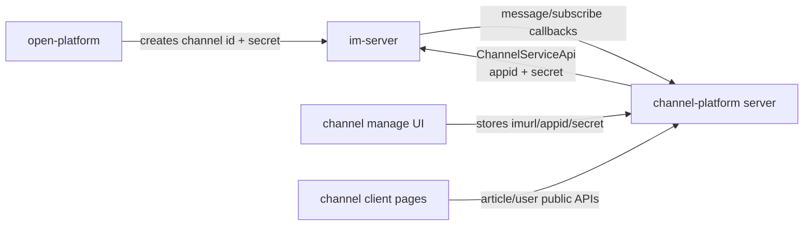

# channel-platform

## Repository Snapshot

- Local source: `C:\Users\COLORFUL\Desktop\WuKong\.codex_tmp\wildfirechat\channel-platform`
- Branch: `master`
- Commit inspected: `ebc7c00`
- Main parts:
  - `server`: Spring Boot backend.
  - `manage`: Vue 2 management console.
  - `client`: Vue mobile/client article pages.

The project is based on `niefy/wx-api`; many package names, table names, comments, and UI labels still use `wx` / public-account terminology. In the WildfireChat adaptation, “appid” is the WildfireChat channel id and “secret” is the channel secret.

## Responsibility

`channel-platform` is the application-side service for WildfireChat channels. It provides:

- Channel account registration in a local management console.
- Channel menu management.
- Auto-reply rules.
- Incoming message callback handling.
- Subscribe/unsubscribe callback handling.
- Subscriber/fan management.
- Message history recording.
- Article/CMS management.
- Sending text messages and article messages through the channel API.

It complements `open-platform`:

1. Use `open-platform` or `im-server` management tooling to create a channel.
2. Copy the channel id and channel secret into `channel-platform`.
3. Configure the channel callback URL to this service.
4. `channel-platform` uses the channel secret, not `im.admin_secret`, to talk to `im-server`.

## Build and Run

Confirmed commands from README and build files:

```text
manage: npm install
manage: npm run build
client: npm install
client: npm run build
server: mvn clean package
run:    java -jar channel-server-0.1.0.jar
```

README notes that frontend assets are copied into `server/src/main/resources/static`.

Build-copy behavior:

- `manage` deletes and copies its build output to `server/src/main/resources/static`.
- `client` deletes and copies its build output to `server/src/main/resources/static/client`.

Backend artifact from Maven is `channel-server`, version `0.1.2` in the inspected `pom.xml`; README still mentions `channel-server-0.1.0.jar`.

## Backend Stack

`server`:

- Java 8.
- Spring Boot `2.6.4`.
- MyBatis-Plus `3.5.1`.
- Spring Data JPA also present.
- Apache Shiro `1.8.0`.
- JWT via `jjwt 0.9.1`.
- Kaptcha.
- Swagger dependencies, disabled by default.
- H2 default database, MySQL optional.
- Object storage clients: Qiniu, Aliyun OSS, MinIO, Tencent COS.
- Fastjson `1.2.79`.
- WildfireChat Java SDK jars:
  - `sdk-0.95.jar`
  - `common-0.95.jar`

Startup entry:

```text
com.github.niefy.BootApplication.main
```

Default config:

```text
server.port=${SERVER_PORT:8088}
spring.datasource.url=jdbc:h2:file:./channel_server;AUTO_SERVER=TRUE;MODE=MySQL
renren.jwt.header=token
renren.jwt.expire=604800
```

Default management login from README:

```text
admin / 123456
```

## Data Model

Important tables from `sql/data.sql`:

- `wx_account`
  - `appid`: WildfireChat channel id.
  - `imurl`: public IM HTTP URL, README says the channel API uses port `80`, not the admin port `18080`.
  - `name`, `type`, `verified`.
  - `secret`: channel secret.
  - `token`, `aes_key`: inherited public-account fields.
- `wx_msg`
  - Incoming/outgoing channel message log.
  - Stores `appid`, `openid` user id, direction, message type, JSON detail, create time.
- `wx_msg_reply_rule`
  - Auto-reply rules.
  - Includes global rules where `appid` is empty and channel-scoped rules where `appid` matches the selected channel.
- `wx_user`
  - Subscriber/fan cache.
  - `openid` is WildfireChat user id.
  - `appid` is channel id.
  - Stores nickname, avatar, subscribe state, subscribe time and inherited tag fields.
- `cms_article`
  - Article/content management.
- `sys_*`
  - Renren-style admin users, roles, menus, tokens, logs, captcha, config.
- `sys_oss`
  - Uploaded file records.

## Auth Model

The management API uses Renren/Shiro token auth:

- `POST /sys/login` checks captcha, username, SHA-256 password hash with salt.
- Login returns a token stored in `sys_user_token`.
- The management frontend sends the token in request header `token`.
- The management frontend also sends selected channel id in request header `appid`.

Shiro filter chain:

- `/sys/login` is anonymous.
- `/sys/**` and `/manage/**` require `oauth2`.
- `/wx/**`, `/client/**`, and everything else are anonymous.

Public callback/content endpoints are intentionally unauthenticated.

## Channel Account Flow

Management UI stores channel connection settings through:

- `GET /manage/wxAccount/list`
- `GET /manage/wxAccount/info/{appid}`
- `POST /manage/wxAccount/save`
- `POST /manage/wxAccount/delete`

The UI form labels confirm:

- `imurl`: IM service address; channel uses port `80`, not `18080`.
- `appId`: channel id created by admin/open platform.
- `appSecret`: channel secret created by admin/open platform.

Runtime API construction:

```text
new ChannelServiceApi(account.imurl, account.appid, account.secret)
```

This is the key boundary: `channel-platform` is a channel-service client, not an Admin API client.

## Callback Endpoints

WildfireChat callback endpoints implemented by `WxMpPortalController`:

- `POST /{appid}/message`
- `POST /{appid}/subscribe`

`/{appid}/message` receives `OutputMessageData`.

Behavior:

- Ignores payload type `91`.
- Persists messages when `persistFlag` is `1` or `3`, or when payload type is `73`.
- Text payload type `1` triggers auto-reply matching.
- Menu event payload type `73` parses `OutputGetChannelInfo.OutputMenu` and triggers auto-reply by menu key when menu type is `click`.

`/{appid}/subscribe` receives `OutputNotifyChannelSubscribeStatus`.

Behavior:

- When status is positive, it refreshes subscriber user info through channel API and triggers the `subscribe` auto-reply.
- Otherwise it marks the local user as unsubscribed.

This matches the `open-platform` source pattern where channel callback is set to `serverUrl + "/" + targetId`; `im-server` is inferred to append message/subscribe event paths.

## Channel API Usage

`WxAccountServiceImpl.getApi(appid)` returns `ChannelServiceApi`.

Observed channel API calls:

- `getChannelInfo()`: read menu info.
- `modifyChannelInfo(Modify_Channel_Menu, menuJson)`: update menu.
- `sendMessage(0, null, payload)`: broadcast/send channel message.
- `sendMessage(0, [toUser], payload)`: direct reply to one subscriber.
- `getUserInfo(openid)`: sync subscriber profile.
- `getSubscriberList()`: sync subscribers.

Message/content send paths:

- Management `POST /manage/wxMsg/send/{appid}` sends text through `WxMsgService.send`.
- Auto-reply sends text through `MsgReplyServiceImpl.replyText`.
- Article management `POST /manage/article/send/{articleid}/{appid}` sends `ArticleContent` payload.
- `POST /manage/article/save_and_send/{appid}` saves and immediately sends an article.

Menu conversion:

- `WxMenuButton.toWFMenu()` converts management UI buttons into `OutputGetChannelInfo.OutputMenu`.
- Supports `view`, `click`, and `miniprogram` style fields.
- Nested submenus are converted recursively.

## Public Client Pages

`client` is a lightweight Vue 2 mobile page set.

Routes include:

- `/`
- `/article/:articleId`
- `/questionSearch`
- `/questionCategory`
- `/subscribe`
- `/wxLogin`

It uses global CDN/external Vue, Vue Router, and Fly request library style configuration.

Public backend content APIs:

- `GET /article/detail`
- `GET /article/category`
- `GET /article/search`
- `GET /wxUser/getUserInfo`

`Article.vue` renders article content through `v-html`, so CMS content must be trusted or sanitized before storage/rendering.

## Management Console

`manage` is Vue 2 with Element UI, Vuex, TinyMCE, Axios, and Vue cookie.

Main capabilities:

- Login with captcha.
- Select active channel account.
- Manage channel accounts.
- Manage channel menus.
- Manage auto-reply rules.
- Manage subscribers.
- View/reply/send messages.
- Manage articles and send articles.
- Manage OSS settings and system admin users/roles/menus/logs.

Each request includes:

- `token`: management auth token.
- `appid`: selected channel id.

## Deployment Notes

For a normal deployment:

1. Deploy `im-server`.
2. Create a channel through `open-platform` or admin tooling.
3. Configure channel callback base URL to this service plus channel id, for example `https://channel.example.com/<channelId>`.
4. Run `channel-platform`.
5. Login to management console.
6. Add a channel account using:
   - `imurl`: public IM HTTP URL.
   - `appid`: channel id.
   - `secret`: channel secret.
7. Configure menus, auto-replies, articles, and message handling.

## Risks and Source-Confirmed Oddities

- The codebase is heavily inherited from WeChat public-account tooling. Names like `wx_account`, `openid`, `appid`, `WxMp*`, and many comments are compatibility naming, not actual WeChat integration in the inspected WildfireChat paths.
- `WxMpService` is an empty class and many old WxJava-style handlers remain. Do not assume old WeChat APIs are functional without tracing the specific controller/service path.
- README says generated jar is `channel-server-0.1.0.jar`; inspected Maven version is `0.1.2`.
- Management UI account-info component references `/wx/wx/msg/{appid}` style access info, while inspected callback controller exposes `/{appid}/message` and `/{appid}/subscribe`. Confirm the actual callback URL configured in `im-server` before deployment.
- Public article rendering uses `v-html`; stored article HTML is a trust boundary.
- `WxAccountManageController.info` uses route `/info/{appid}` but annotates `@PathVariable("id")`; this endpoint may fail if called as written.
- Maven is configured to skip tests.
- Fastjson `1.2.79` and old frontend dependency versions should be reviewed for production security.
- H2 is default; MySQL deployment requires manual schema initialization.

## Relationship to Core Notes

`channel-platform` is an application-side channel service. It receives callbacks from `im-server` and uses `ChannelServiceApi` with a channel id and channel secret. It does not participate in normal app-server login or IM-token issuance.


