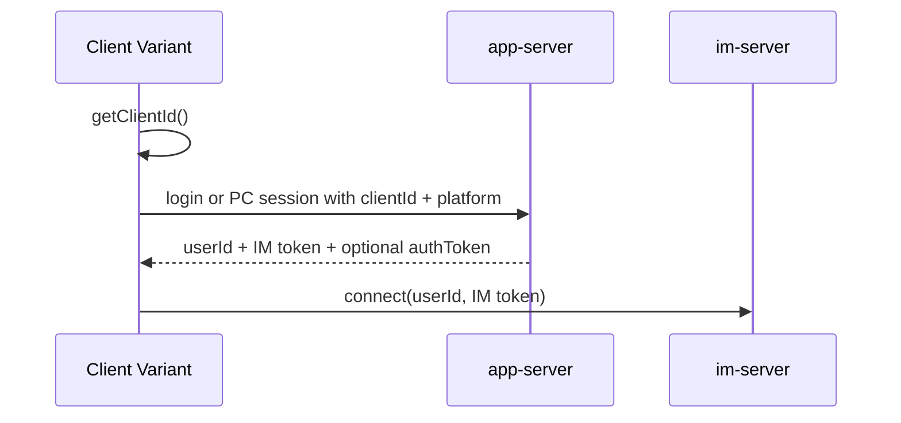

# Repository Note: Client Variants

## Reader and Action

Primary reader: an engineer deciding which WildfireChat client repository to use for deployment, migration, or secondary development.

Post-read action: choose the correct client baseline for a target platform and avoid spending time on deprecated, wrapper-only, or SDK-demo repositories.

## Snapshot

Local sources inspected under `C:\Users\COLORFUL\Desktop\WuKong\.codex_tmp\wildfirechat`.

Commits inspected:

- `pc-chat`: `cac9c45`
- `web-chat`: `e97d899`
- `react-chat`: `4a5fe30`
- `react-pc-chat`: `c62b706`
- `qt-pc-chat`: `c6199ad`
- `uni-chat`: `2a9d462`
- `uni-h5-chat`: `02aa930`
- `uni-wx-chat`: `647cab1`
- `wx-chat`: `1e5deee`
- `uni-mp-demo`: `0e1ec9c`
- `jq-chat-demo`: `6612822`
- `uni-Android-SDK`: `3ac6980`
- `uni-wfc-client`: `780dd77`
- `uni-chat-uts`: `43c94d6`
- `unix-chat`: `5db59af`
- `hm-chat`: `f93337f`
- `hm-pc-chat`: `cdee032`

`hm-chat` and `hm-pc-chat` were inspected with shallow sparse checkouts plus `git show` against known paths because full clone was previously slow.

## Classification

Use these as current primary baselines:

- Web: `vue-chat` rather than `react-chat` or `web-chat`.
- Electron PC: `vue-pc-chat` rather than `react-pc-chat` or `pc-chat`.
- Native mobile: `android-chat` and `ios-chat`.
- Flutter: `flutter-chat`.
- UniApp App: `uni-chat-uts` for Android/iOS/HarmonyOS, with `uni-chat` still relevant for Android/iOS native-plugin deployments.
- WeChat/native mini-program: `wx-chat` if not using uni-app.
- Harmony native: `hm-chat`.

Treat these as legacy, wrappers, or demos:

- `pc-chat`: README-only migration pointer to `react-pc-chat`, while recommending `vue-pc-chat`.
- `web-chat`: README-only migration pointer to `react-chat`, while recommending `vue-chat`.
- `react-chat`: older React Web implementation in maintenance mode.
- `react-pc-chat`: older Electron/React PC implementation, functional but no longer the recommended branch.
- `uni-mp-demo`: SDK capability test converted from `wx-chat`; README says UI and sending messages have known issues.
- `jq-chat-demo`: minimal Web SDK integration demo, not a product UI.
- `uni-Android-SDK`: deprecated; split into `uni-wfc-client` plugin and `uni-chat` demo.
- `uni-wfc-client`: GitHub placeholder; README points to Gitee because full plugin source is too large for GitHub.
- `unix-chat`: uni-app x technical verification; README explicitly says not to use it in practice.
- `hm-pc-chat`: Harmony PC wrapper around an ohos Electron runtime loading a packaged `vue-pc-chat` app.

## Shared Client Invariant

The extra client variants still follow the same credential chain:

Important points:

- `clientId` must be generated by the relevant SDK before requesting the IM token.
- `platform` must match the target platform because the token is client/platform scoped.
- `APP_SERVER` and the IM server host must point to the same deployment. Several UniApp READMEs explicitly warn that mismatching them leads to immediate logout after login.
- `authToken` is for app-server HTTP APIs. The IM `token` is for IM connection.

Observed platform codes across these variants:

- iOS phone: `1`
- Android phone: `2`
- Windows: `3`
- macOS: `4`
- Web/H5: `5`
- WeChat/mini-program: `6`
- Linux: `7`
- iPad: `8`
- Android Pad: `9`
- Harmony phone: `10`
- Harmony Pad: `11`
- Harmony PC: `12`

Note: the separate `flutter-chat` note found that the Flutter demo also hard-codes platform `10` in login requests. Treat platform `10` as source-observed overlap between demos, not as a universal enum guarantee. Verify the target app-server/IM-server version before relying on platform-specific policy for Flutter or Harmony clients.

## Legacy Web and PC Repositories

### pc-chat

`pc-chat` now contains only README and license. The README says the original source migrated to `react-pc-chat`, and that `vue-pc-chat` is the future development focus. Use it as a historical pointer only.

### web-chat

`web-chat` now contains only README and license. The README says the original source migrated to `react-chat`, and that `vue-chat` is the future development focus. Use it as a historical pointer only.

### react-chat

`react-chat` is an older React Web client.

Confirmed from README and package/config/login source:

- Stack: React 16, MobX 4, webpack 4, Node 10/NPM 6 era.
- README says the React version is in maintenance mode and serious-bug-fix only.
- Default config points to WildfireChat demo services:
  - `APP_SERVER = https://app.wildfirechat.net`
  - `IM_SERVER_HOST = wildfirechat.net`
  - `USE_WSS = true`
  - route port `443`, WS port `8083`, WSS port `8084`
  - demo TURN credentials
  - `WEB_APP_ID` and `WEB_APP_KEY` bound to professional Web SDK/server.
- `CLIENT_ID_STRATEGY = 0` by default, meaning refreshes generate a new client ID unless changed.
- Login is PC/QR-session based:
  - creates `/pc_session` with `flag`, `device_name = web`, `clientId = wfc.getClientId()`, and `platform = Config.getWFCPlatform()`;
  - renders `wildfirechat://pcsession/{token}`;
  - polls `/session_login/{token}`;
  - calls `connect(userId, imToken)` when app-server returns code `0`.

Use `react-chat` mainly when maintaining an existing React deployment. New Web work should start from `vue-chat`.

### react-pc-chat

`react-pc-chat` is an older Electron/React PC client.

Confirmed from README, package/config/main/login source:

- Stack: Electron `8.2.3`, React 16, MobX 5, webpack 4, Node 10/Python 2 build requirements.
- README says it is feature-complete but no longer maintained; use `vue-pc-chat` for new development.
- `main.js` imports `./marswrapper.node` and exposes it as `global.sharedObj.proto`.
- Per-platform scripts copy native protocol addons from `proto_addon` into `marswrapper.node`.
- Default config points to `https://app.wildfirechat.net` and demo TURN credentials.
- Login is PC/QR-session based:
  - creates `/pc_session` with `device_name = pc`, `clientId = wfc.getClientId()`, and platform from Electron OS detection;
  - polls `/session_login/{token}`;
  - connects with native `proto.connect(userId, token)`.

Use this repo only for maintaining existing React/Electron PC deployments or studying the old native-addon bridge. Prefer `vue-pc-chat` otherwise.

### qt-pc-chat

`qt-pc-chat` is a Qt PC SDK demo, not a full-feature-equivalent replacement for the Electron PC clients.

Confirmed from README, `.pro`, config, and `appservice` source:

- Stack: Qt 5/6, C++17, WildfireChat C++/Qt client wrapper under `src/wfc`.
- Supports Windows, macOS, Linux, and domestic Linux/CPU environments.
- README says the PC SDK is paid/trial and the default SDK connects only to the official service.
- Self-hosting requires replacing SDK files under `src/wfc/proto` and updating `src/config.cpp`.
- Default app-server is `https://app.wildfirechat.net`.
- App-service calls `/pc_session`, `/session_login/{token}`, `/login`, and `/login_pwd`.
- Login requests include `WFCLib::ChatClient::Instance()->getClientId()` and platform.
- Platform compile-time defaults are Windows `3`, macOS `4`, Linux `7`.
- README says audio/video is not supported and may stay unsupported for a long time.

Use this repo when a native Qt desktop client is required and AV is not mandatory. For feature-complete PC with AV, use Electron-based clients.

## UniApp and Mini-Program Family

### uni-chat

`uni-chat` is the UniApp App demo for Android/iOS using native language plugins.

Confirmed from README, package/config/API source:

- Stack: Vue 3, Vite 2, Pinia, HBuilderX, UniApp native plugins.
- README says Android default protocol stack can only connect to official services because of anti-fraud compliance; an unrestricted stack must be obtained/replaced for self-hosting.
- README says native language plugins do not support HarmonyOS 5.0 and recommends `uni-chat-uts` for Harmony and future migration.
- Default config:
  - `APP_SERVER = https://app.wildfirechat.net`
  - `ORGANIZATION_SERVER = https://org.wildfirechat.cn`
  - `WORKSPACE_URL = https://open.wildfirechat.cn/work.html`
  - `IM_SERVER_HOST = wildfirechat.net`, host only, no protocol/port
  - demo TURN credentials
- Platform detection returns iOS phone/iPad `1/8`, Android phone/pad `2/9`, otherwise unset.
- Login APIs call `/login_pwd` and `/login` with `platform = Config.getWFCPlatform()` and `clientId = wfc.getClientId()`.
- On successful login it calls `wfc.connect(userId, token)` and stores app-server authToken separately.
- AV supports Android/iOS via WildfireChat RTC UniApp plugins; README says the project switched to the smaller plugin/UniApp UI scheme on 2023-11-29.
- Offline push integration uses uniPush 1.0 plus `push_server`.

Use `uni-chat` for established Android/iOS UniApp deployments using native language plugins. For new cross-platform/Harmony work, evaluate `uni-chat-uts`.

### uni-chat-uts

`uni-chat-uts` is the UniApp UTS demo for Android, iOS, and HarmonyOS.

Confirmed from README, config, UTS plugin package, and API/proto wrappers:

- Stack: Vue 3, Vite, Pinia, UniApp UTS plugin.
- README says Android/iOS are free, Harmony SDK is paid/trial, and Harmony 5.0 default SDK can only connect to the official service unless a trial/paid SDK is used.
- README says Android unrestricted self-hosting requires replacing `uni_modules/wfc-client/utssdk/app-android/libs/mars-core-release.aar`.
- Included `uni_modules/wfc-client` package identifies itself as official WildfireChat IM UTS plugin version `0.7.4`.
- UTS wrappers exist for Android, iOS, and Harmony:
  - Android wraps `cn.wildfirechat.uni.client.ClientModule`.
  - iOS wraps `WFClientUniPlugin`.
  - Harmony wraps `@wfc/marswrapper`.
- `wfc/client/wfc.js` exposes `getClientId()` and `connect(userId, token)` through the same upper API as `uni-chat`.
- `proto.min.js` calls the UTS client with `Config.IM_SERVER_HOST`.
- Login flow matches `uni-chat`: `/login_pwd` or `/login`, `clientId`, platform, then `wfc.connect`.
- Config defaults to demo app/org/open-platform services and host-only `IM_SERVER_HOST`.
- README says HarmonyOS currently does not support AV calls; Android/iOS AV still uses native RTC plugins.
- Push integration uses uniPush 2.0 because Harmony support requires it.

Use this repo as the preferred UniApp direction when HarmonyOS support or UTS plugin migration matters.

### uni-h5-chat

`uni-h5-chat` is a mobile-browser/H5 UniApp client.

Confirmed from README, package/config/API source:

- Stack: Vue 3, Vite, Pinia, HBuilderX.
- README says the Web SDK is paid and depends on professional-edition IM Server.
- Default SDK connects only to official services; self-hosting requires replacing the Web SDK after purchase/trial.
- Config sets `APP_SERVER`, `ORGANIZATION_SERVER`, `IM_SERVER_HOST`, `USE_WSS = true`, route port `443`, demo TURN, and platform `5`.
- Login APIs call `/login_pwd` and `/login` with `clientId = wfc.getClientId()` and platform.
- AMR conversion defaults to `Config.APP_SERVER + '/amr2mp3?path='`.

Use this when H5/mobile-browser is the target and the professional Web SDK/server are available.

### uni-wx-chat

`uni-wx-chat` is a UniApp WeChat mini-program client.

Confirmed from README, package/config/API source:

- README says the mini-program SDK is paid and depends on professional-edition IM Server.
- Default SDK connects only to official services; self-hosting requires replacing the mini-program SDK after purchase/trial.
- Config uses `USE_WSS = true`, route port `443`, `APP_SERVER`, `IM_SERVER_HOST`, demo TURN, and platform `6`.
- Login APIs call `/login_pwd` and `/login` with `clientId = wfc.getClientId()` and platform.

Use this when you want a UniApp-style WeChat mini-program rather than the native mini-program code in `wx-chat`.

### wx-chat

`wx-chat` is the native mini-program SDK demo.

Confirmed from README, config, login, and AV webview page:

- README says the mini-program SDK is paid and depends on professional-edition IM Server.
- Supports WeChat, QQ, Baidu, Alipay, and Toutiao mini-program platforms at the SDK layer.
- The `wfc` directory and `config.js` must remain sibling paths for SDK integration.
- Config defaults to demo app/IM/static/TURN services, WSS, route port `443`, mini-program app id/key, and platform `6`.
- Login calls `/login` with `mobile`, `code`, `clientId = wfc.getClientId('wx')`, and `platform = 6`.
- On successful login it calls `wfc.connect(userId, token, 'wx')` and stores `userId`, `token`, and app-server `authToken`.
- `pages/voip/voip.js` implements AV by loading a webview from the `voip-uni` output and passing `appServer`, `authToken`, IM server, `userId`, IM token, `clientId`, and call options in URL parameters.

Use this for native mini-program projects. For AV, treat the embedded webview URL as sensitive because it carries credentials.

### uni-mp-demo

`uni-mp-demo` is a converted mini-program test project, not a production client baseline.

Confirmed from README and login source:

- README says it was converted from `wx-chat` by a mini-program-to-UniApp converter to test multi-platform mini-program SDK capability.
- Known issues: UI display is abnormal and UI message sending is abnormal, but conversation/contact pull works, proving SDK behavior.
- Login calls `/login` with `mobile`, `code`, and `clientId = wfc.getClientId()`, then connects with `wfc.connect(userId, token, 'uni')`.
- README says platform testing can switch the platform name among `wx`, `ali`, `qq`, `bd`, and `tt`.

Use it as SDK/platform test material only.

## Minimal Web SDK Demo

### jq-chat-demo

`jq-chat-demo` is a minimal jQuery/Web SDK integration example.

Confirmed from README, package, and `src/index.js`:

- Stack: jQuery, webpack 5, bundled Web SDK files.
- README says it demonstrates login, connect, send, and receive.
- Calls `wfc.init()` and listens for connection/message events.
- Reuses stored `userId` and IM token from `localStorage`.
- Sends `/send_code` and `/login` to `https://app.wildfirechat.net`.
- Login sends `platform = Config.SDK_PLATFORM_WEB` and `clientId = wfc.getClientId()`.
- After login it calls `wfc.connect(userId, token)`.
- Send demo sends `TextMessageContent('hello world')` to `FireRobot`.

Use this to understand the smallest browser integration path. Do not use it as an application UI.

## UniApp Plugin Placeholders and Deprecated Repos

### uni-Android-SDK

README says this repository is deprecated. The newer code is split into:

- Plugin project: `uni-wfc-client`
- Demo project: `uni-chat`

Do not start new work from `uni-Android-SDK`.

### uni-wfc-client

GitHub contains only README and license. README says the Android/iOS plugin source is too large for GitHub and should be downloaded from Gitee.

The `uni-chat-uts` repository includes an installed `uni_modules/wfc-client` UTS plugin copy, so some interface behavior can be inspected there, but treat the GitHub `uni-wfc-client` repository itself as a pointer.

### unix-chat

`unix-chat` is a UniApp X technical verification project.

Confirmed from README and config/source:

- README says the project is in technical verification and should not be used in practice.
- Config uses Harmony platform constants `10`, `11`, and `12`, with `CURRENT_PLATFORM = SDK_PLATFORM_HARMONY`.
- `wfc/client/wfc.uts` and proto wrappers expose `getClientId()` and `connect(userId, token)`.
- It shares app-server, IM host, AMR conversion, open-platform, and file-helper configuration patterns with other UniApp variants.

Use this only to track UniApp X experimentation.

## Harmony Repositories

### hm-chat

`hm-chat` is the native HarmonyOS demo.

Confirmed from README, repo tree, config, login page, app-server wrapper, and client wrapper:

- Stack: HarmonyOS/DevEco Studio, ArkTS/ETS modules.
- README says `libmarswrapper.so` is paid/trial and default build can only connect to the official service until the SDK is replaced.
- Repository contains modules such as `chat`, `client`, and `uikit`.
- Native libs exist under `client/libs/*/libmarswrapper.so`.
- Root `oh-package.json5` depends on `@ohos/pinyin4js`; `client/oh-package.json5` declares `@wfc/client`.
- Config includes:
  - `APP_SERVER = https://app.wildfirechat.net`
  - organization, collection, poll, archive, open-platform URLs
  - QR login scheme
  - demo TURN
  - Harmony platform constants `10/11/12`
  - `CURRENT_PLATFORM = SDK_PLATFORM_HARMONY`
  - slide verification, PTT, AI robot, recall limits, backup-address helpers
- App-server wrapper sends `/login`, `/login_pwd`, `/send_code`, `/pc_session`, `session_login/{token}`, scan/confirm/cancel PC login, favorites, slide verification, and conference APIs.
- Login requests include `platform = Config.getWFCPlatform()` and `clientId = wfc.getClientId()`.
- Login success stores `userId` and IM token in Harmony preferences, then calls `wfc.connect(userId, token)`.
- `@wfc/client` wrapper exposes the same major IM surface: `getClientId`, `connect`, `disconnect`, backup address, TLS/KCP, device token, media upload, receipts, file records, online state, open-platform auth code, and locks.

Use this as the native Harmony reference. Treat its binary protocol stack as a replaceable SDK artifact.

### hm-pc-chat

`hm-pc-chat` is a Harmony PC wrapper, not an independent IM UI codebase.

Confirmed from README and build files:

- README says the project adapts `ohos` Electron itself.
- Runtime loads `web_engine/src/main/resources/resfile/resources/app`.
- That app bundle is generated by `vue-pc-chat`.
- The project has `electron` and `web_engine` modules.
- `web_engine` depends on `libadapter.so`, `inversify`, and `reflect-metadata`.
- README says PC feature updates should follow `vue-pc-chat` Harmony/OHOS packaging guidance.

Use `hm-pc-chat` for Harmony PC packaging/runtime investigation. Use `vue-pc-chat` for UI and IM feature behavior.

## Deployment and Security Notes

- Most client variants default to official WildfireChat demo endpoints and demo TURN credentials. Replace all service URLs and ICE credentials for production.
- Several SDKs are paid/trial or restricted by default: Web SDK, mini-program SDK, PC SDK, Harmony SDK, and some UniApp native protocol stacks.
- Web/H5/mini-program deployments require HTTPS/WSS alignment across app-server and IM route endpoints. IM server itself usually sits behind an HTTPS/WSS proxy.
- Tokens are stored in browser localStorage/sessionStorage, mini-program storage, Harmony preferences, or UniApp storage depending on platform. XSS, webview URL logging, and device backup policies matter.
- `wx-chat` and `voip-uni` style AV pass IM/app-server credentials through URL parameters into a webview. Deploy only over HTTPS and avoid URL logging.
- Old React/Electron stacks depend on old Node, Python 2, Electron, webpack, React, MobX, and native addons. Treat dependency/security modernization as a separate migration project.
- Qt and Harmony native builds depend on binary/proprietary protocol SDK artifacts. Source-level debugging is limited around those binaries.
- Do not reuse demo signing certificates, debug profiles, app IDs, Web app keys, mini-program app keys, or package identifiers from sample repos.

## Recommended Baseline Matrix

| Target | Recommended repo | Avoid starting from |
|---|---|---|
| Browser Web | `vue-chat` | `web-chat`, `react-chat`, `jq-chat-demo` |
| Electron PC | `vue-pc-chat` | `pc-chat`, `react-pc-chat` |
| Qt desktop | `qt-pc-chat` | Electron repos if Qt/native desktop is mandatory |
| Android native | `android-chat` | UniApp repos unless cross-platform is required |
| iOS native | `ios-chat` | UniApp repos unless cross-platform is required |
| Flutter | `flutter-chat` | UniApp repos |
| UniApp Android/iOS | `uni-chat-uts` or `uni-chat` | `uni-Android-SDK`, `uni-mp-demo` |
| UniApp Harmony | `uni-chat-uts` | `uni-chat`, `unix-chat` |
| H5/mobile browser | `uni-h5-chat` or `vue-chat` depending product shell | `jq-chat-demo` |
| Native mini-program | `wx-chat` | `uni-mp-demo` |
| UniApp mini-program | `uni-wx-chat` | `uni-mp-demo` |
| Harmony native | `hm-chat` | `unix-chat` |
| Harmony PC | `hm-pc-chat` packaging + `vue-pc-chat` UI | treating `hm-pc-chat` as the source UI |
