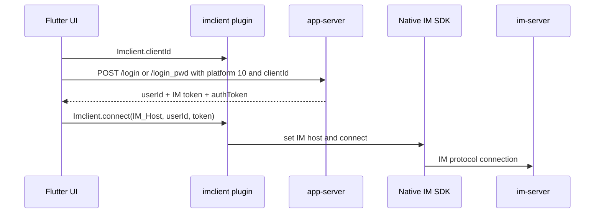

# Repository Note: flutter-chat

## Snapshot
- Repository: `wildfirechat/flutter-chat`
- Local cache: `C:\Users\COLORFUL\Desktop\WuKong\.codex_tmp\wildfirechat\flutter-chat`
- Branch/commit inspected: `master` / `d59ff47`
- Primary role: Flutter cross-platform client app plus Flutter plugins that wrap native WildfireChat client SDKs.
- Main stack: Flutter/Dart, local `imclient` plugin, local `rtckit` plugin, provider, shared_preferences, http, native Android/iOS/HarmonyOS bridges.

## Responsibility
`flutter-chat` is a cross-platform client implementation. The Flutter UI owns app screens, state models, local notifications, login UI, and app-server HTTP calls. The IM protocol is delegated to native SDKs through the `imclient` plugin:

- Android plugin path wraps Android `ChatManager`.
- iOS plugin path wraps `WFCCNetworkService` and `WFCCIMService`.
- `rtckit` wraps audio/video calling capabilities.

It follows the same system boundary as the native clients: app-server handles login and app APIs; im-server handles long connection, IM state, and message operations.

## Project Structure
Confirmed from repository layout and `chat/pubspec.yaml`:

- `chat`: Flutter app.
- `imclient`: Flutter plugin exposing IM client APIs to Dart.
- `rtckit`: Flutter plugin exposing RTC/audio-video APIs.
- `momentclient`: present but not enabled in the inspected app config.

`chat/pubspec.yaml` describes the app as supporting Android, iOS, and HarmonyOS. It depends on local path packages `../imclient/` and `../rtckit/`.

## Build and Run Commands
Typical Flutter commands for the inspected app directory:

```powershell
flutter pub get
flutter run
flutter build apk
flutter build ios
```

No project-specific wrapper script was confirmed in the inspected files. HarmonyOS builds likely require the OpenHarmony-specific dependency/toolchain setup implied by the git dependencies.

## Key Configuration
Confirmed from `chat/lib/config.dart`:

- `IM_Host = 'wildfirechat.net'`.
- `APP_Server_Address = 'https://app.wildfirechat.net'`.
- Optional addresses: organization, workspace/open-platform, ASR, collection, poll.
- `ICE_SERVERS` defaults to WildfireChat TURN test service.
- Default portraits and AI robot IDs are configured in Dart.
- User/privacy agreement URLs default to `example.com`.

Operational implication: self-hosted deployments must replace `IM_Host`, `APP_Server_Address`, TURN, and optional service URLs. `IM_Host` is passed to native client connect and should match the same host-only convention as native clients.

## App-Server API Usage
Confirmed from `chat/lib/app_server.dart`:

Login and auth:

- `/send_code`
- `/login`
- `/login_pwd`
- `/send_reset_code`
- `/reset_pwd`
- `/change_pwd`
- `/slide_verify/generate`
- `/slide_verify/verify`

PC QR confirmation:

- `/scan_pc/{token}`
- `/confirm_pc`
- `/cancel_pc`

App features:

- `/change_name`
- `/get_group_announcement`
- `/put_group_announcement`
- `/fav/list`, `/fav/add`, `/fav/del/{id}`
- conference APIs such as `/conference/create`, `/conference/info`, `/conference/quota`, `/conference/recording/{id}`, `/conference/focus/{id}`
- `/group/members_for_portrait`
- `/avatar/group?request=...`

`postJson` sends JSON to `Config.APP_Server_Address + request`, includes stored `app_server_auth_token` as `authToken`, and persists an updated `authToken` response header.

## Login and Token Flow
Confirmed from `AppServer.login` and `AppServer.passwordLogin`:

- SMS login calls `/login` with `mobile`, `code`, `clientId = await Imclient.clientId`, and `platform = 10`.
- Password login calls `/login_pwd` with `mobile`, `password`, `clientId = await Imclient.clientId`, and `platform = 10`.
- Both support optional `slideVerifyToken`.
- Both return `userId` and `token` from `result`.

Confirmed from `chat/lib/login_screen.dart`:

- `_handleLoginSuccess(userId, token)` calls `Imclient.connect(Config.IM_Host, userId, token)`.
- It then stores `userId` and `token` in `SharedPreferences`.
- SMS and password login both flow through `_handleLoginSuccess`.

Confirmed from `chat/lib/main.dart`:

- On startup, after `Imclient.init(...)`, cached `userId` and `token` are loaded from `SharedPreferences`.
- If present, the app calls `Imclient.connect(Config.IM_Host, userId, token)`.
- On auth/connection failure statuses such as secret mismatch, token incorrect, rejected, kicked off, or logout, the app removes `userId`, `token`, and `app_server_auth_token`, resets view models, and navigates to login.

Core Flutter sequence:



## Native Android Bridge
Confirmed from `imclient/android/src/main/java/cn/wildfirechat/imclient/ImclientPlugin.java`:

- The plugin creates a Flutter `MethodChannel` named `imclient`.
- On first attachment it calls `ChatManager.init(applicationContext, null)`.
- `connect` receives `host`, `userId`, and `token`, then calls:
  - `ChatManager.Instance().setIMServerHost(host)`
  - `ChatManager.Instance().connect(userId, token)`
- `getClientId` returns `ChatManager.Instance().getClientId()`.
- `disconnect`, logs, proxy, backup address, device token, conversation/message APIs, and many IM operations are exposed through MethodChannel.
- Listeners are registered dynamically by reflecting `ChatManager` listener methods and forwarding events to Flutter.

## Native iOS Bridge
Confirmed from `imclient/ios/Classes/ImclientPlugin.m`:

- The plugin creates a Flutter `MethodChannel` named `imclient`.
- `connect` receives `host`, `userId`, and `token`, then calls:
  - `[[WFCCNetworkService sharedInstance] setServerAddress:host]`
  - `[[WFCCNetworkService sharedInstance] connect:userId token:token]`
- `getClientId` returns `[[WFCCNetworkService sharedInstance] getClientId]`.
- IM service operations are delegated to `WFCCIMService`.
- Native notifications from the iOS SDK are observed and forwarded back to Flutter.

## RTC and Notification Flow
Confirmed from `chat/lib/main.dart`:

- `Rtckit.init(...)` wires receive-call, ring, stop-ring, and call-ended callbacks.
- ICE servers from `Config.ICE_SERVERS` are added to `Rtckit`.
- `Imclient.IMEventBus` is used for receive-message and friend-request events.
- When the app is backgrounded, `WfcNotificationManager` creates local notifications for messages and friend requests.
- iOS app badge is calculated from conversation unread counts and friend request status.

## Security and Deployment Notes
- Default public app-server, IM host, TURN, ASR, organization, collection, poll, and workspace URLs are demo/test defaults.
- The app stores IM token and app-server `authToken` in `SharedPreferences`.
- Platform code `10` is hard-coded for Flutter login token issuance; `app-server` and `im-server` must understand that platform value.
- The Android and iOS bridges expose a broad IM API surface to Dart through MethodChannel. Treat Dart/UI-layer input as untrusted at this boundary if embedding web content or plugin extensions.
- HarmonyOS-specific git dependencies mean dependency availability and reproducibility should be checked before production builds.

## Relationship to Other Repositories
- Talks to `app-server` for login and app business APIs.
- Connects to `im-server` through native Android/iOS client SDKs wrapped by `imclient`.
- Uses `rtckit` for calls and configured TURN/ICE services.
- Optional app features correspond to organization, open-platform, collection, poll, ASR, conference, and favorite APIs.

## Open Questions
- HarmonyOS native bridge behavior was not deeply inspected in this pass.
- `imclient` exposes many methods; a security review should enumerate sensitive methods before embedding untrusted Flutter routes or web views.
- Compare Flutter platform code `10` with official docs before relying on it outside the demo app.
