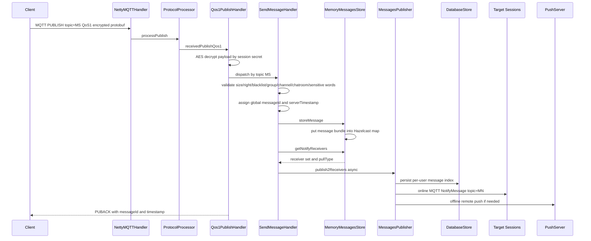

# im-server 源码分析笔记

## 阅读状态
已完成第一轮源码级结构分析：README、Maven 模块、启动入口、配置、MQTT/HTTP 入口、消息发送链路、存储层和数据库迁移。

源码缓存位置：`.codex_tmp/wildfirechat/im-server`

当前克隆信息：
- Branch: `wildfirechat`
- Commit: `fd0ee5c`

## 仓库职责
`im-server` 是 WildfireChat 社区版 IM 核心服务。它负责：
- 客户端长连接接入。
- MQTT topic 到 IM 业务 handler 的分发。
- 用户、会话、好友、群组、频道、聊天室等核心 IM 数据。
- 消息校验、敏感词、回调、通知、在线状态、远程推送触发。
- Server API / Admin API / Robot API / Channel API 等 HTTP 接口。
- H2/MySQL 数据库迁移与基础存储。

README 明确建议业务系统把 IM 当作通信管道使用，不建议直接修改 IM 服务源码；业务扩展应优先通过 Server API、自定义消息、回调、机器人、频道等机制完成。

## 技术栈
- Java 8
- Maven 多模块项目
- Netty
- Moquette MQTT broker 改造版
- Protobuf
- Hazelcast
- C3P0
- Flyway
- H2 / MySQL
- Log4j2
- Qiniu SDK、OkHttp、Hutool 等辅助依赖

父 POM 版本：`cn.wildfirechat:wildfirechat-parent:1.4.7`

## Maven 模块
- `common`：通用常量、APIPath、ErrorCode、POJO、Protobuf 生成类。
- `broker`：核心服务端，包含 MQTT broker、HTTP API、IM handler、存储层、配置和迁移脚本。
- `sdk`：Java server SDK/检查工具，依赖 common。
- `distribution`：打包模块，生成 tar/deb 分发包并包含运行脚本和 release 配置。

构建命令：
```powershell
mvn clean package
```

生成包位置按 README 描述在：
```text
distribution/target/distribution-<version>-bundle-tar.tar.gz
```

## 启动路径
外层入口：
- `cn.wildfirechat.server.Server.main`
- 直接调用 `io.moquette.server.Server.start(args)`

核心启动流程：
1. `io.moquette.server.Server.start`
2. 读取默认配置文件 `wildfirechat.conf`
3. `DBUtil.init(config)` 初始化 H2/MySQL、C3P0、Flyway 迁移
4. 创建线程池：
   - `dbScheduler`
   - `imBusinessScheduler`
   - `callbackScheduler`
5. 初始化 `MemoryStorageService`
6. 初始化 `ProtocolProcessor`
7. 创建 `NettyAcceptor` 绑定 MQTT 长连接端口
8. 创建 `LoServer` 绑定 HTTP 短连接端口和 Admin HTTP 端口
9. 初始化 `PushServer`
10. 注册 shutdown hook

## 配置模型
主要配置文件：
- 开发调试配置：`broker/config/wildfirechat.conf`
- 分发包配置：`distribution/src/main/resources/wildfirechat.conf`

关键配置项：
- `server.ip`：客户端可访问服务地址。
- `port`：原生客户端 MQTT 长连接端口，默认 `1883`。
- `http_port`：客户端短连接端口，默认 `80`。
- `http.admin.port`：管理接口端口，默认 `18080`。
- `http.admin.secret_key`：管理 API 密钥。
- `token.key`：生成 IM token 的私钥。
- `embed.db`：`1` 使用 H2，其他配置使用 MySQL。
- `message.roaming`、`message.remote_history_message`、`message.max_queue`：历史消息/漫游/队列策略。
- `message.forward.*`、`robot.callback.*`、`channel.callback.*`：业务回调和转发。
- `message.disable_remote_search`、`message.encrypt_message_content`：消息搜索/内容加密相关。
- `client.request_rate_limit`：客户端 topic 请求限频。

安全注意：
- 示例配置中的 `http.admin.secret_key=123456`、`token.key=testim` 是默认值，生产必须更换。
- 配置中明确提示 `http.admin.no_check_time` 上线前应改为 `false`。

## 网络入口
### MQTT 长连接
`NettyAcceptor` 初始化 MQTT Netty pipeline，最终由 `NettyMQTTHandler` 分发：
- `CONNECT` -> `ProtocolProcessor.processConnect`
- `PUBLISH` -> `ProtocolProcessor.processPublish`
- `PUBACK` -> `ProtocolProcessor.processPubAck`
- `PINGREQ` -> `PINGRESP`
- `DISCONNECT` / `channelInactive` -> 离线处理

`ProtocolProcessor` 当前只实际处理 QoS1 publish：
- QoS0：不支持
- QoS1：进入 `Qos1PublishHandler.receivedPublishQos1`
- QoS2：未使用

### HTTP 短连接与管理接口
`LoServer` 创建两个 Netty HTTP server：
- 普通 HTTP 端口使用 `IMActionHandler`
- Admin 端口使用 `AdminActionHandler`

Action 通过扫描 `Action` 子类和 `@Route` 注解注册。已确认入口包括：
- `/api/version`
- `/route`
- `/im`
- `/api/verify_token`
- `/fs`
- `/admin/...`
- `/robot/...`
- `/channel/...`

API 路径常量集中在 `common/src/main/java/cn/wildfirechat/common/APIPath.java`。

## MQTT Topic 和 Handler
Topic 常量集中在 `win.liyufan.im.IMTopic`。核心 topic 示例：
- `MS`：发送消息
- `MP`：拉取消息
- `MN`：通知有新消息
- `MR`：撤回消息
- `GC` / `GAM` / `GKM` / `GQ` / `GD`：群组操作
- `UPUI` / `MMI`：用户信息
- `FAR` / `FHR` / `FP`：好友关系
- `CRJ` / `CRQ`：聊天室
- `CHC` / `CHL` / `CHP`：频道
- `GETTOKEN`：获取 token/路由阶段相关

`Qos1PublishHandler` 启动时扫描所有 `IMHandler` 子类和 `@Handler` 注解，建立 topic 到 handler 实例的 map。

主要业务 handler：
- `SendMessageHandler`
- `PullMessageHandler`
- `CreateGroupHandler`
- `AddGroupMember`
- `GetUserInfoHandler`
- `UploadDeviceTokenHandler`
- `JoinChatroomHandler`
- `CreateChannelHandler`
- `GetTokenHandler`

## 连接认证
`ProtocolProcessor.processConnect` 的主要逻辑：
1. 校验 MQTT 协议版本和 clientId。
2. 从 username 查询用户状态，禁止状态直接拒绝。
3. 从 session store 加载 active session。
4. 使用 session secret 解密 password。
5. Android/APad 会额外校验应用签名。
6. 使用 `TokenAuthenticator` 校验 clientId、username、password。
7. 返回 `ConnectAckPayload`，包含：
   - message head
   - friend head
   - friend request head
   - setting head
   - server time
8. 更新在线状态，并触发在线状态回调。

会话实体主要由 `MemorySessionStore` 管理，并与 `t_user_session` 表关联。

## 消息发送链路
客户端发送消息主链路：



`SendMessageHandler` 做的关键校验：
- 消息内容总长度不得超过 64KB。
- 普通客户端不能直接发送撤回和群通知类保留消息。
- 禁止客户端发送配置中列出的敏感业务消息类型。
- 校验全局禁言、黑名单、陌生人聊天、群/频道/聊天室权限。
- 管理 API 消息跳过部分客户端权限校验，但仍校验目标对象存在性。
- 支持本地敏感词、远程敏感词服务、敏感消息转发。
- 支持消息转发 URL、@消息转发 URL、频道/机器人回调。

## 消息存储模型
重要事实：`MemoryMessagesStore.storeMessage` 第一层把消息 `MessageBundle` 放入 Hazelcast `MESSAGES_MAP`：
- 透明消息保留 10 秒。
- 普通消息保留 7 天。

然后 `MessagesPublisher.publish2Receivers` 为每个接收用户调用：
- `insertUserMessages(...)`
- 或聊天室消息调用 `insertChatroomMessages(...)`

`insertUserMessages` 做两件事：
- 在内存 `TreeMap<messageSeq, messageId>` 中维护用户消息队列。
- 调用 `DatabaseStore.persistUserMessage` 持久化用户消息索引。

远程历史消息：
- `loadRemoteMessages` 会在配置允许时从 `DatabaseStore.loadRemoteMessages(...)` 读取数据库历史。
- `message.remote_history_message` 控制普通会话远程历史。
- `message.chatroom_remote_history_message` 控制聊天室远程历史。

## 数据库
数据库初始化由 `DBUtil.init` 完成：
- `embed.db=1`：H2，Flyway location `filesystem:./migrate/h2`
- 其他：MySQL，Flyway location `filesystem:./migrate/mysql`

MySQL 基础表来自 `broker/migrate/mysql/V2__create_table.sql`，包括：
- `t_messages`
- `t_user_messages`
- `t_user`
- `t_user_status`
- `t_user_session`
- `t_friend`
- `t_friend_request`
- `t_group`
- `t_group_member`
- `t_channel`
- `t_channel_listener`
- `t_chatroom`
- `t_robot`
- `t_thing`
- `t_user_setting`
- `t_sensitiveword`

MySQL 分片表来自 `V3__create_sharding_table.sql`：
- `t_messages_0...`
- `t_user_messages_0...`

后续迁移还增加：
- `t_user_device`
- `t_user_read_report`
- `t_user_delivery_report`
- `t_sensitive_messages`
- `t_files`
- `t_conference`
- 超级群 `t_group_messages_0..127` 等。

## 推送和通知
在线端：
- `MessagesPublisher` 通过 MQTT topic `MN` 向目标在线 session 发送 `NotifyMessage`。
- 客户端收到通知后再拉取消息。

离线端：
- 如果目标 session 不在线且有 device token，`MessagesPublisher` 调用 `PersistentQueueMessageSender.sendPush`。
- 推送会考虑会话免打扰、全局静音、PC 在线静音、VoIP 静音、强制推送类型、push 内容、角标等策略。

机器人/频道：
- 如果接收者是机器人且有 callback，会通过 callback scheduler POST 消息。
- 频道有 callback 时会按新旧 callback feature 逻辑转发。

## 线程模型
核心线程池：
- `dbScheduler`：数据库相关调度。
- `imBusinessScheduler`：IM 业务 handler、消息分发、踢下线等。
- `callbackScheduler`：在线状态、消息转发、机器人/频道回调等 HTTP callback。

`IMHandler.doHandler` 会把具体 topic 处理提交到 `imBusinessScheduler`，避免直接阻塞 Netty IO 线程。

## 架构风险和注意点
- README 强烈建议不要直接修改 `im-server`，否则容易破坏客户端协议兼容性和未来迁移。
- 默认配置里有示例密钥，生产必须替换。
- H2 被明确定位为开发或小规模验证用途，正式上线应使用 MySQL。
- 服务端消息正文部分依赖 Hazelcast 内存生命周期，历史消息能力受配置和存储策略影响，做审计/长期归档应评估 `archive-server` 或外部转存。
- 群成员消息分发会遍历成员；README 也提示普通群性能不是线性，超大群应使用专门超级群能力。
- `ios-chat` 在 Windows 分析缓存 checkout 失败是路径过长问题，与 `im-server` 无关。

## 待继续确认
- `GetTokenHandler`、`RouteHandler` 与 `app-server` 登录换取 IM token 的完整交互。
- Server SDK 对 `/admin/...` API 的签名方式和调用封装。
- `archive-server` 是否承担生产级消息归档和合规保存。
- 超级群链路和普通群链路的差异。
