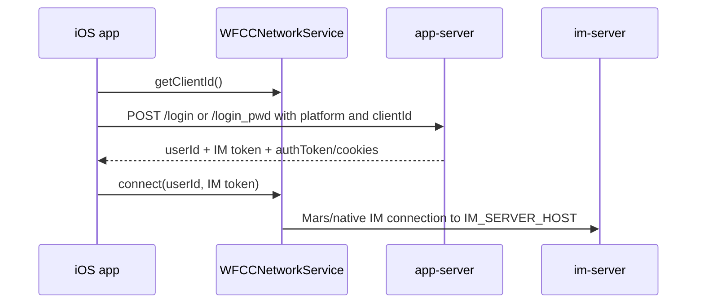

# Repository Note: ios-chat

## Snapshot
- Repository: `wildfirechat/ios-chat`
- Local cache: `C:\Users\COLORFUL\Desktop\WuKong\.codex_tmp\wildfirechat\ios-chat`
- Branch/commit inspected: `master` / `6fb5596`
- Primary role: iOS IM SDK source, UIKit layer, share/broadcast extensions, VoIP glue, push handling, and demo chat app.
- Main stack: Objective-C / Objective-C++, Xcode workspace, Tencent Mars native client, `wfclient`, `wfuikit`, `wfchat` app.

## Local Checkout Warning
The local checkout is dirty/broken on Windows. `git status --short` reports many files as both deleted and untracked, consistent with an earlier checkout/long-path issue around large `xcframework` paths such as `ZLPhotoBrowser.xcframework`.

The core source files below were readable and used for this note:

- `wfchat/WildFireChat/WFCConfig.*`
- `wfchat/WildFireChat/AppService/AppService.*`
- `wfchat/WildFireChat/Login/WFCLoginViewController.m`
- `wfchat/WildFireChat/AppDelegate.m`
- `wfclient/WFChatClient/Client/WFCCNetworkService.*`

Because of the checkout issue, treat this as a source-supported first pass, not a complete iOS repository audit. A full iOS pass should reclone into a shorter path or enable long paths.

## Responsibility
README describes three main projects:

- `wfchat`: demo iOS app.
- `wfclient`: low-level IM communication library.
- `wfuikit`: IM UI component library built on `wfclient`.

The app follows the same WildfireChat client pattern:

- `app-server` handles SMS/password login and app-level APIs.
- `app-server` returns an IM token generated by `im-server`.
- `wfclient` connects to `im-server` with `userId + token`.

## Key Configuration
Confirmed from `wfchat/WildFireChat/WFCConfig.m`:

- `IM_SERVER_HOST = @"wildfirechat.net"` by default.
- `APP_SERVER_ADDRESS = @"https://app.wildfirechat.net"` by default.
- Optional service addresses include:
  - `ORG_SERVER_ADDRESS`
  - `COLLECTION_SERVER_ADDRESS`
  - `POLL_SERVER_ADDRESS`
  - `PAN_SERVER_ADDRESS`
  - `ARCHIVE_SERVER_ADDRESS`
  - `WORK_PLATFORM_URL`
  - `ASR_SERVICE_URL`
- TURN config defaults to:
  - `ICE_ADDRESS = @"turn:turn.wildfirechat.net:3478"`
  - `ICE_USERNAME = @"wfchat"`
  - `ICE_PASSWORD = @"wfchatpwd"`
- `Prefer_Password_Login = YES`.
- `ENABLE_SLIDE_VERIFY = YES`.
- `Send_Log_Command = @"*#marslog#"`.
- `FILE_TRANSFER_ID = @"wfc_file_transfer"`.

Configuration comments state:

- `IM_SERVER_HOST` must be a host/IP only, without HTTP scheme or port.
- HTTPS is recommended for app-server because it protects tokens.
- `wfc.all_client_support_ssl` on app-server must match the client HTTPS/HTTP mode.

## App Startup and SDK Initialization
Confirmed from `wfchat/WildFireChat/AppDelegate.m`:

- In debug builds, startup rejects `IM_SERVER_HOST` if it includes `http` or `:`.
- `WFCCNetworkService` is configured with:
  - `sendLogCommand = Send_Log_Command`
  - `startLog`
  - connection status delegate
  - connect-to-server delegate
  - receive-message delegate
  - `setServerAddress:IM_SERVER_HOST`
  - backup address strategy
  - default portrait provider from `AppService`
  - URL redirector
- `WFCUConfigManager` is configured with:
  - app-service provider: `AppService`
  - file transfer ID
  - organization service provider
  - optional collection, poll, pan, and archive providers
  - ASR service URL
  - AI/dial-in robot IDs
- If cached `savedUserId` and `savedToken` exist in keychain, the app calls `[[WFCCNetworkService sharedInstance] connect:savedUserId token:savedToken]`.
- If no cached credentials exist, it shows `WFCLoginViewController`, using `Prefer_Password_Login`.

## Login and Token Flow
Confirmed from `wfchat/WildFireChat/AppService/AppService.m`:

SMS login:

- Method: `loginWithMobile:verifyCode:success:error:`
- POST path: `/login`
- Body includes:
  - `mobile`
  - `code`
  - `clientId = [[WFCCNetworkService sharedInstance] getClientId]`
  - `platform = Platform_iPad` when `WFCCNetworkService.isPad`, otherwise `Platform_iOS`
- Response result provides `userId`, `token`, `register`, and optional `resetCode`.

Password login:

- Method: `loginWithMobile:password:success:error:`
- POST path: `/login_pwd`
- Body includes:
  - `mobile`
  - `password`
  - `clientId = [[WFCCNetworkService sharedInstance] getClientId]`
  - `platform = Platform_iOS` by default, with comments for iPad changes.

Confirmed from `wfchat/WildFireChat/Login/WFCLoginViewController.m`:

- Login success stores:
  - token in `SSKeychain` service `savedToken`
  - user ID in `SSKeychain` service `savedUserId`
  - saved phone/account name in `NSUserDefaults`
- Login success calls `[[WFCCNetworkService sharedInstance] connect:userId token:token]`.
- Source comments repeat the core invariant: token and `clientId` are strongly bound; the token must be requested with the same `clientId` used for connect.

Core iOS sequence:

## App-Server Session/Auth Handling
Confirmed from `AppService.m`:

- `AUTHORIZATION_HEADER` is `authToken`.
- App-server cookies are stored under `WFC_APPSERVER_COOKIES`.
- App-server auth token is stored under `WFC_APPSERVER_AUTH_TOKEN`.
- The HTTP helper posts to `[APP_SERVER_ADDRESS stringByAppendingPathComponent:path]`.
- When response headers include an app token, it is persisted; otherwise app-server cookies for the app-server URL are persisted.
- `clearAppServiceAuthInfos` removes app-server cookies/auth token and clears share-extension app-service auth state.

This matches the cross-platform invariant: app-server `authToken`/cookies are separate from the IM token used by `WFCCNetworkService`.

## PC QR Login Support
Confirmed from `AppService.m`:

- `pcScaned` calls `/scan_pc/{sessionId}`.
- `pcConfirmLogin` calls `/confirm_pc` with `token`, current `user_id`, and `quick_login = 1`.
- `pcCancelLogin` calls `/cancel_pc`.
- `showPCSessionViewController` opens the PC session UI for an online PC client.

The iOS client therefore acts as the mobile confirmer for web/desktop QR login, same as Android/Flutter.

## Native IM Client Layer
Confirmed from `wfclient/WFChatClient/Client/WFCCNetworkService.mm`:

- `setServerAddress:` validates and stores the IM server host.
- `getClientId` persists a client ID in `NSUserDefaults` under `wfc_client_id`; comments explain why a generated UUID is preferred over IDFV to avoid multiple apps on the same device sharing a client ID.
- `connect:userId token:` refuses repeated connect in debug builds and delegates to the native Mars connect path through the stored server host.
- `isPad` is set based on `UI_USER_INTERFACE_IDIOM()` and affects platform selection in login.

Important boundary: `WFCCNetworkService` owns network/protocol connection, while `WFCCIMService` owns higher-level IM operations.

## Push, VoIP, and Badge Notes
Confirmed from `AppDelegate.m`:

- APNS device token registration calls `setDeviceToken:pushType:` on `WFCCNetworkService` when not using Getui.
- Getui integration calls `setDeviceToken:pushType:7`.
- VoIP/AV uses `WFAVEngineKit`, optional CallKit, configured ICE server, and incoming call callbacks.
- Badge count is calculated from unread conversations/friend requests and uploaded back through `WFCCIMService uploadBadgeNumber`.

README says iOS background delivery requires APNS and `push_server`.

## App-Server API Surface
Confirmed from `AppService.m`, the iOS app calls app-server for:

- login and password reset/change
- SMS code and slide verification
- PC QR scan/confirm/cancel
- group announcements
- conference info/quota/favorite/recording APIs
- profile name change
- IoT/things devices
- favorites
- app-generated avatars/group portraits

This is consistent with Android, Flutter, Web, and PC clients.

## Security and Deployment Notes
- Default public service URLs and TURN credentials are demo/test defaults.
- `IM_SERVER_HOST` must not include scheme or port.
- app-server HTTPS mode and `wfc.all_client_support_ssl` must be consistent.
- IM token is stored in keychain; app-server auth state is stored in `NSUserDefaults` and cookie storage.
- Share extension uses an app group; its auth state must be cleared alongside app logout.
- A full production pass must inspect entitlements, app groups, push certificates, URL schemes, and extension data sharing after a clean checkout.

## Relationship to Other Repositories
- Talks to `app-server` for login and app-level APIs.
- Connects to `im-server` through `WFCCNetworkService`/Mars.
- Uses `push_server` for APNS/offline push delivery.
- Optional integration points match organization, open-platform, archive, collection, poll, ASR, pan/netdisk, and conference services.

## Open Questions
- Full Xcode project, entitlements, vendor frameworks, and extension resources were not fully audited because of local checkout corruption.
- Need a clean macOS or short-path Windows clone before final iOS build/deployment instructions.
- Need compare iOS SDK update/migration notes in official `docs` before making version upgrade recommendations.
