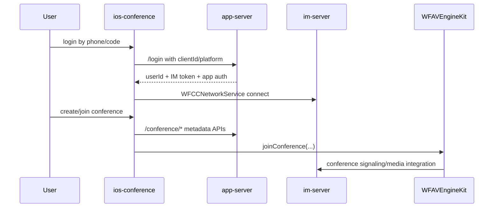

# ios-conference

## Repository Snapshot

- Local source: `C:\Users\COLORFUL\Desktop\WuKong\.codex_tmp\wildfirechat\ios-conference`
- Branch: `main`
- Commit inspected: `909e0c3`
- Main parts:
  - Xcode project `WFZoom.xcodeproj`.
  - iOS app source under `WFZoom`.
  - Bundled WildfireChat frameworks under `WildfireSDK`.
  - Conference UI and management code under `Conference`.
  - Home/login/settings utility code.
  - Vendored AFNetworking and UI helper code.

## Responsibility

`ios-conference` is the standalone iOS meeting client for WildfireChat conference scenarios.

It mirrors the Android conference client at a high level:

- Login through `app-server`.
- IM connection through `WFCCNetworkService`.
- Conference metadata through `app-server` `/conference/*` APIs.
- Conference media/signaling through `WFAVEngineKit`.
- Deep-link/QR conference join through `wfzoom://conference?id=...&pwd=...`.

It is not the full iOS IM chat application.

## Build and Dependencies

Xcode project bundle id:

```text
cn.wildfirechat.zoom
```

Frameworks referenced by the project:

```text
WFAVEngineKit.framework
WFChatClient.framework
WebRTC.framework
SDWebImage.framework
CallKit.framework
```

Vendored source includes AFNetworking and local UI helper categories.

## Configuration

`WFCConfig.h` declares:

```text
IM_SERVER_HOST
APP_SERVER_ADDRESS
USER_PRIVACY_URL
USER_AGREEMENT_URL
```

`AppDelegate` applies the IM host with:

```text
[[WFCCNetworkService sharedInstance] setServerAddress:IM_SERVER_HOST]
```

It configures AV with:

```text
[[WFAVEngineKit sharedEngineKit] setVideoProfile:kWFAVVideoProfile360P swapWidthHeight:YES]
[WFAVEngineKit sharedEngineKit].delegate = self
```

## Login and Token Flow

`AppService.login()` calls:

```text
POST /login
```

with:

```text
mobile
code
clientId = [[WFCCNetworkService sharedInstance] getClientId]
platform = Platform_iOS
```

On success it extracts:

```text
result.userId
result.token
result.register
```

`AppDelegate` reads cached:

```text
savedToken
savedUserId
```

and connects:

```text
[[WFCCNetworkService sharedInstance] connect:savedUserId token:savedToken]
```

Rejected/token/secret mismatch states clear cached IM credentials and app-server auth.

## App-Server Conference APIs

`AppService` wraps:

```text
POST /conference/get_my_id
POST /conference/create
POST /conference/info
POST /conference/destroy/{conferenceId}
POST /conference/fav/{conferenceId}
POST /conference/unfav/{conferenceId}
POST /conference/is_fav/{conferenceId}
POST /conference/fav_conferences
```

It also includes app-service calls for:

```text
POST /send_code
POST /scan_pc/{sessionId}
POST /confirm_pc
POST /cancel_pc
POST /logs/{userId}/upload
POST /complain
```

HTTP auth behavior:

- Prefer `authToken` header when present.
- Otherwise restore app-server cookies.
- On login response, store returned `authToken` or cookies.

## Conference Runtime



`WFCUConferenceViewController.initWithConferenceInfo()` calls:

```text
[[WFAVEngineKit sharedEngineKit] joinConference:conferenceId
                                      audioOnly:NO
                                            pin:pin
                                           host:owner
                                          title:title
                                           desc:nil
                                       audience:audience
                                       advanced:advance
                                      muteAudio:muteAudio
                                      muteVideo:muteVideo
                                sessionDelegate:self]
```

`WFCUConferenceManager` owns client-side conference controls:

- Mute/unmute audio and video.
- Switch audience/speaker mode.
- Receive conference change-mode messages.
- Send change-mode requests as IM messages.
- Generate conference links.

Conference links:

```text
wfzoom://conference?id=<conferenceId>
wfzoom://conference?id=<conferenceId>&pwd=<password>
```

`AppDelegate.openURL` parses these and opens `WFZConferenceInfoViewController` if the user is logged in.

## Source-Confirmed Risks

- README text is not reliably readable in the local terminal due to encoding; source/config/project files were used as the primary evidence.
- App-server auth is stored in `NSUserDefaults` as token or archived cookies; review storage hardening before production.
- Default config values are not shown in `WFCConfig.h`; inspect the linked `.m` or build-time definitions before deployment.
- Bundled binary frameworks make source-level AV debugging dependent on SDK symbol/source availability.
- PC scan/confirm/cancel APIs are present even though this repo is a conference client; keep app-server route exposure consistent with the broader app policy.
