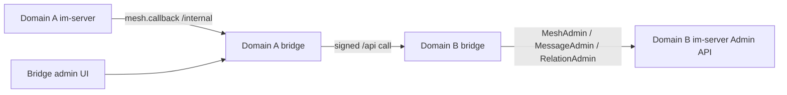

# mesh-bridge

## Repository Snapshot

- Local source: `C:\Users\COLORFUL\Desktop\WuKong\.codex_tmp\wildfirechat\mesh-bridge`
- Branch: `master`
- Commit inspected: `6530bb4`
- Main modules:
  - `mesh-bridge-server`: Spring Boot backend.
  - `mesh-bridge-web`: Vue 3/Vite management frontend copied into backend static resources during build.

## Responsibility

`mesh-bridge` is the WildfireChat inter-domain bridge service. It is for professional-edition IM mesh/interconnect deployments, not for the community single-node IM server.

Its purpose is to connect multiple independent WildfireChat IM domains so users in different domains can search, add friends, send messages, perform group operations, and bridge some AV conference events with external IDs such as:

```text
targetId@domainId
```

The README stresses that each domain has its own IM service, users, and bridge service. Bridges connect pairwise to form a mesh.

## Tech Stack

Backend:

- Java 8
- Spring Boot `2.6.7`
- Spring MVC
- Spring Data JPA
- MySQL/H2 dependencies, with MySQL configured by default
- Shiro
- OkHttp
- Gson
- Bundled WildfireChat Java SDK/common jars `1.4.3`

Frontend:

- Vue 3 through `@vue/compat`
- Vite 5
- Pinia
- Vue Router
- Element Plus
- axios

## Configuration

Key backend config in `mesh-bridge-server/src/main/resources/application.properties`:

```properties
server.port=8200
server.internalPort=8100
server.internalPathPrefix=/internal/
server.adminPort=8000
server.adminPathPrefix=/admin/

im.admin_url=http://localhost:18080
im.admin_secret=123456

bridge.my_domain_id=wildfirechat.cn
bridge.domain_divider=@

spring.datasource.url=jdbc:mysql://localhost:3306/bridge...
spring.datasource.username=root
spring.datasource.password=123456
```

`StartupEventListener` calls:

```java
AdminConfig.initAdmin(adminUrl, adminSecret)
```

So the bridge backend is a high-privilege internal service that can call the local IM Server/Admin API.

## Ports and Entry Points

The backend creates three Tomcat connectors:

- `8200`: external bridge API used by other domains, controller path `/api`.
- `8100`: internal callback API used by the local IM service, controller path `/internal`.
- `8000`: admin UI/API, controller path `/admin` plus static frontend.

Controllers:

- `InternalController`: receives callbacks from local IM and delegates to `OutService`, which signs and forwards to remote domains.
- `ExternalController`: receives signed calls from remote bridges and delegates to `InService`, which calls local IM Admin/Mesh APIs.
- `AdminController`: manages domains and tests connectivity.

IM-side configuration from README:

```properties
mesh.callback=http://${bridge-internal-ip}:8100/internal
```

## Authentication Model

`InternalEndpointsFilter` enforces port/path separation and external request signing.

External `/api/**` requests, except `/api/hello`, require headers:

```text
nonce
timestamp
sign
x-domain-id
```

Signature:

```text
sha1(nonce + "|" + mySecretForThatDomain + "|" + timestamp)
```

Incoming `x-domain-id` is looked up in the local `domain` table, and the local `mySecret` field is used to validate the request.

Outbound remote calls are signed by `HttpUtils` with the remote domain's `secret`, and include the local `bridge.my_domain_id` as `x-domain-id`.

Admin UI/API uses Shiro. `data.sql` creates the default `admin/admin123` account described in the README. Sessions are persisted via database-backed Shiro session DAO.

Internal `/internal/**` is anonymous at the Shiro layer and relies on port/network isolation so only the local IM service can call it.

## Data Model

JPA entities include:

- `Domain`: remote domain id, remote secret, remote URL, domain metadata, and this side's `mySecret`.
- `User`: admin users.
- `ShiroSession`: persisted admin sessions.
- `InMessageIds`: remote-to-local message UID mapping.
- `OutMessageIds`: local-to-remote message UID mapping.

The bridge keeps message UID mappings so recall/update/republish behavior can operate across domains.

## Core Flow



`OutService` handles local-to-remote transformations:

- Looks up the remote domain.
- Converts local IDs to the remote-domain perspective.
- Converts message payload references, mentions, quote info, recall/reference message ids, group IDs, and conference event IDs where implemented.
- Calls the remote bridge API with signed headers.

`InService` handles remote-to-local execution:

- Uses `MeshAdmin`, `MessageAdmin`, and `RelationAdmin`.
- Supports search, friend operations, message send/publish/update/recall, user/group info fetch, group membership/ownership/info operations, group sync, and conference request/event calls.

## ID Conversion Rule

`DomainIdUtils` implements the core ID conversion:

- Outbound to another domain:
  - If an ID is local, append `@localDomainId`.
  - If an ID already belongs to the target remote domain, strip that remote domain suffix.
  - If an ID belongs to a third domain, preserve it.

- Inbound response from another domain:
  - If an ID has no domain suffix, append `@remoteDomainId`.
  - If an ID has the local domain suffix, strip it.
  - If it belongs to a third domain, preserve it.

Important constraint from README: `targetId + "@" + domainId` must fit within IM database ID length limits, so domain IDs should be short.

## Build and Run

Frontend:

```powershell
cd C:\Users\COLORFUL\Desktop\WuKong\.codex_tmp\wildfirechat\mesh-bridge\mesh-bridge-web
npm install
npm run build
```

Backend:

```powershell
cd C:\Users\COLORFUL\Desktop\WuKong\.codex_tmp\wildfirechat\mesh-bridge\mesh-bridge-server
mvn clean package
java -jar target\bridge-0.2.jar
```

The frontend build copies static assets into backend resources.

## Source-Confirmed Risks

- The service holds local IM Admin API credentials. Treat it as a high-privilege internal component.
- Default `im.admin_secret=123456`, DB password, and `admin/admin123` must be replaced.
- `/internal/**` has no app-level shared-secret authentication in inspected source; it depends on binding/firewall separation so only local IM can reach `8100`.
- External bridge APIs are signed, but they are public-facing and should still use HTTPS and strict source/rate controls.
- `InternalEndpointsFilter` checks timestamp freshness only as `System.currentTimeMillis() - ts < 2 hours`; future timestamps may pass that condition. Verify behavior before production exposure.
- Admin Shiro session timeout and cookie max age are effectively unbounded in inspected config; review for production.
- Bridge mesh topology must be complete enough for intended user/group flows. README warns partial mesh connectivity can cause message loss or missing user/group data in multi-domain groups.
- Custom message payloads that embed user/group/channel/message IDs need explicit conversion in `OutService.convertMessagePayloadDomainId`; otherwise remote domains may receive local-only IDs.
- If object storage URLs are not reachable cross-domain, media files require custom transfer/URL rewriting; source only leaves a comment hook for this.
- Free and advanced AV modes cannot be mixed across domains; all connected domains must use compatible AV deployment and reachable TURN/Janus topology.
