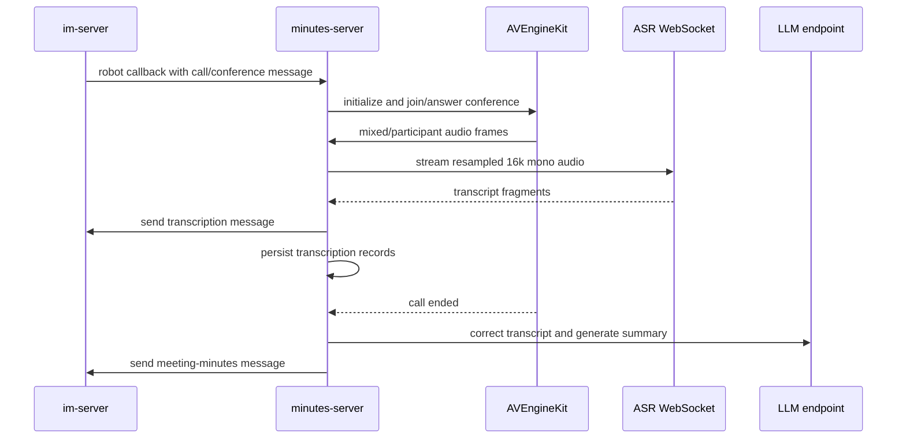

# minutes-server

## Repository Snapshot

- Local source: `C:\Users\COLORFUL\Desktop\WuKong\.codex_tmp\wildfirechat\minutes-server`
- Branch: `main`
- Commit inspected: `4adb475`
- Main parts:
  - Spring Boot meeting-minutes robot backend.
  - Vue 3/Vite web UI.
  - WildfireChat Robot API integration.
  - WildfireChat AV SDK integration.
  - ASR WebSocket client and transcription persistence.
  - LLM-backed transcript correction and summary generation.
  - `upload2oss` helper for local audio upload/transcoding.

## Responsibility

`minutes-server` is a meeting transcription and summary adjunct for WildfireChat audio/video conferences.

It behaves like a robot service:

- `im-server` sends robot callbacks to `minutes-server`.
- The robot receives call/conference messages.
- The service joins or answers conference calls with the AV SDK.
- Audio is captured from the conference, resampled, and streamed to an ASR WebSocket service.
- ASR text is saved as transcription records and sent back into the IM conversation.
- After the call ends, the service uses an OpenAI-compatible LLM endpoint to correct transcripts and generate meeting minutes.

It is not the core conference media server. Janus/media relay belongs to `wf-janus`; the IM/conference signal path belongs to `im-server` plus AV SDK components.

## Build and Run

The Java backend is a Maven/Spring Boot app.

Key requirements inferred from build/config:

```text
Java 8
Maven
MySQL-compatible database
ASR WebSocket service
WildfireChat IM server
WildfireChat AV SDK native support for the host platform
```

The repository also contains a Vue 3/Vite frontend under `web`.

The `upload2oss` subproject is separate from the main app. It scans local `.wav` files, optionally transcodes them with ffmpeg, and uploads to Aliyun OSS.

## Stack

- Java 8.
- Spring Boot `2.2.10.RELEASE`.
- Spring Data JPA.
- MySQL connector.
- WildfireChat server SDK `1.4.7`.
- WildfireChat AV SDK `1.2.2`.
- Java WebRTC / JavaCV related native dependencies.
- Vue 3 and Vite frontend.
- OpenAI-compatible LLM configuration for summary generation.

Startup entry is the Spring Boot application in the backend source.

## Configuration

Important config keys observed:

```text
server.port=8883
asr.ws.url
robot.im_id=robotminutes
robot.im_url
robot.im_secret
janus.ip.replace.map
audio.base.url
```

The LLM section is OpenAI-compatible and includes model, URL, and API-key style configuration.

Important boundary:

- `robot.im_url` is the public IM HTTP URL used by Robot API calls.
- `robot.im_secret` is the robot secret, not the `im-server` admin secret.

## Callback APIs

Robot callback endpoints:

```text
POST /robot/recvmsg
POST /robot/recvmsg/conference
```

`ServiceImpl` receives message callbacks and routes call-related messages into `CallService`.

The inspected flow treats content type `408` as conference-join logic.

## Main Runtime Flow



## Audio and Transcription

`CallService` initializes `AVEngineKit` with `RobotSignalServer`, joins/answers conferences, and wires audio into `AsrAudioDevice`.

`AsrAudioDevice`:

- Receives 48k stereo audio from the AV SDK.
- Resamples to 16k mono.
- Streams audio to the configured ASR WebSocket endpoint.
- Handles ASR text shaped like `[timestamp+duration]text`.
- Sends `TranscriptionMessageContent` back to participants.
- Saves `TranscriptionRecord` rows.

`MeetingSummaryService`:

- Reads transcript records.
- Corrects transcript content.
- Generates a summary through the configured OpenAI-compatible LLM endpoint.
- Stores `MeetingSummary`.
- Sends `MeetingMinutesMessageContent` to participants.

## Web/API Auth

`FilterConfig` registers `AuthFilter` for:

```text
/api/*
/webapi/*
```

Public endpoints:

```text
/webapi/login
/webapi/config
```

Session model:

- In-memory sessions.
- 30-minute timeout.
- Accepts `authToken` header or `minutes_session` cookie.
- Also accepts IM `authCode`.

`RecordController` checks participant permission before exposing meeting records.

## Source-Confirmed Risks

- Demo config contains database, robot, and LLM-style secrets. Treat them as examples only.
- Sessions are in memory and are not cluster-safe.
- Controllers use `@CrossOrigin(origins="*")` in inspected source; production deployments should restrict allowed origins.
- `AsrAudioDevice` uses one shared write buffer per device. Concurrent recorder behavior should be load-tested for multi-speaker or multi-stream conferences.
- Native AV support is platform-sensitive; inspected docs/config point to Linux x86_64 and macOS arm64 support.
- ASR, LLM, IM, Janus, and database availability all affect the end-to-end minutes feature; design retries and failure visibility before production use.
