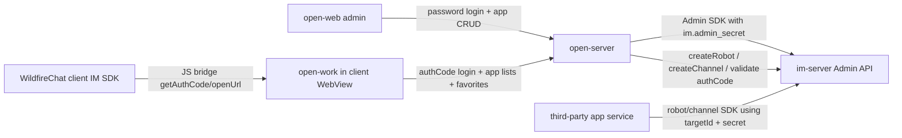

# open-platform

## Repository Snapshot

- Local source: `C:\Users\COLORFUL\Desktop\WuKong\.codex_tmp\wildfirechat\open-platform`
- Branch: `main`
- Commit inspected: `05d29a1`
- Main parts:
  - `open-server`: Spring Boot backend for the open platform.
  - `open-web`: Vue 2 admin console for creating and managing open-platform applications.
  - `open-work`: Vue 2 client workspace page intended to run inside a WildfireChat embedded browser/WebView.

## Responsibility

`open-platform` manages third-party applications that integrate with WildfireChat. It is not the core IM server and not the normal app login server.

Its main responsibilities are:

- Keep a registry of applications, channels, and robots.
- Issue per-application `targetId` and `secret`.
- Create the matching robot and/or channel inside `im-server` through the Java Admin SDK.
- Serve a workbench page where end users see global applications and favorite their own applications.
- Authenticate the workbench user with an IM `authCode` obtained through the client-side JS bridge.

README states that each application has a robot account and a channel. Source confirms three application types:

- `type = 0`: normal application, creates both robot and channel.
- `type = 1`: channel application, creates channel only.
- `type = 2`: robot application, creates robot only.

## Build and Run

Confirmed commands from README and package files:

```text
open-work:  npm run build
open-web:   npm run build
open-server: mvn clean package
run:        nohup java -jar open-platform-server-xxx.jar 2>&1 &
```

Build order matters because frontend builds copy assets into the backend resources:

- `open-work` builds a single-file `dist/output.html` and copies it to `open-server/src/main/resources/static/work.html`.
- `open-web` builds `dist/` and copies it to `open-server/src/main/resources/static`.
- `open-server` packages the backend and static assets together.

## Backend Stack

`open-server`:

- Java 8.
- Spring Boot `2.6.7`.
- Maven jar artifact `open-platform-server`, version `0.3`.
- Spring Web, Spring Data JPA.
- H2 default database with optional MySQL config.
- Apache Shiro `1.7.1` for session and authorization.
- Log4j2 `2.17.1`.
- Bundled WildfireChat Java SDK jars:
  - `sdk-0.87.jar`
  - `common-0.87.jar`
- Object storage clients: Qiniu, Aliyun OSS, MinIO, Tencent COS.

Startup entry:

```text
cn.wildfirechat.app.Application.main
```

Default backend config:

```text
server.port=8880
spring.datasource.url=jdbc:h2:file:./open_server;AUTO_SERVER=TRUE;MODE=MySQL
im.admin_url=http://localhost:18080
im.admin_secret=123456
wfc.all_client_support_ssl=false
media.server.media_type=-1
```

Default seed data creates an admin user. README states default login is:

```text
admin / admin123
```

## Backend API Surface

All main APIs are under `/api/`.

Admin/login:

- `POST /api/login`: admin console login with local account/password.
- `POST /api/update_pwd`: update admin password.
- `GET /api/account`: current account. For IM-authenticated users it fetches user display info from `im-server`.

Workbench/client login:

- `POST /api/user_login`: receives `appId`, `appType`, `authCode`; validates auth code through `im-server`.

Application management:

- `POST /api/application/create`
- `POST /api/application/update`
- `DELETE /api/application/del/{targetId}`
- `POST /api/application/media/upload`
- `GET /api/application/get/{targetId}`
- `GET /api/application/list`
- `GET /api/application/list_all`
- `GET /api/application/list_global`

User favorites:

- `PUT /api/user/fav/{targetId}`
- `DELETE /api/user/fav/{targetId}`
- `GET /api/user/fav_list`

There are also compatibility web routes:

- `GET /` redirects to `/index.html`.
- `POST /login` delegates to the same login service.
- `POST /account` delegates to account lookup.

## Auth and Session Model

`open-server` uses two Shiro realms:

- `PasswordRealm`: local admin/user password login from table `t_user`.
- `AuthCodeRealm`: workbench user login by validating an IM auth code through `UserAdmin.applicationGetUserInfo(authCode)`.

Password hashing is:

```text
Base64(MD5(password + salt))
```

Session behavior:

- Login responses set an `authToken` response header.
- Frontends store `authToken` in `localStorage`.
- Later requests send `authToken` as a request header.
- `ShiroSessionManager` reads the Shiro session id from that header before falling back to cookies.
- Sessions are serialized into table `shiro_session` through `DBSessionDao`.
- Global session timeout is set to `Long.MAX_VALUE`.

Authorization observed in source:

- Password admin role gets `user:view` and `user:admin`.
- Auth-code users get only `user:view`.
- Admin-only actions are intended to require `perms[user:admin]`.

## IM Server Integration

On startup:

```text
AdminConfig.initAdmin(im.admin_url, im.admin_secret)
```

Creating a normal application:

1. Generate `targetId` when not provided.
2. Generate `secret` when not provided.
3. Save `t_application`.
4. Call `UserAdmin.createRobot`.
5. Call `GeneralAdmin.createChannel`.

Robot creation:

- Robot user id is the application `targetId`.
- Robot display name and portrait come from application metadata.
- Robot owner is hard-coded as `admin`.
- Robot secret is the application `secret`.
- Robot callback is `serverUrl`.

Channel creation:

- Channel target id is the application `targetId`.
- Channel owner is the same `targetId`.
- Channel secret is the application `secret`.
- Channel callback is `serverUrl + "/" + targetId` when `serverUrl` is present.
- Channel state is assembled from `ProtoConstants.ChannelState` masks.
- Normal app channels are private and auto-subscribed.
- Channel applications can be global/broadcast style when `global = true`.

Deleting an application:

- Deletes local `t_application`.
- Calls `GeneralAdmin.destroyChannel(targetId)`.
- Calls `UserAdmin.destroyRobot(targetId)`.

`ServiceImpl` also contains a private `sendTextMessage` helper using `MessageAdmin.sendMessage`, but it is not wired to a public controller in the inspected source.

## Data Model

Local JPA tables/entities:

- `t_user`: admin/user account, mobile, email, role, salt, password hash.
- `t_application`: target id, secret, name, description, portrait, mobile URL, desktop URL, server URL, global flag, type, timestamps.
- `t_user_application`: user favorite mapping with composite key `userId + applicationId`.
- `shiro_session`: serialized Shiro session bytes.

The local database stores open-platform metadata and sessions. IM identities, auth-code validation, robots, and channels are owned by `im-server`.

## open-web Admin Console

Tech stack:

- Vue `2.6.11`
- Vue Router `3`
- Vuex `3`
- Element UI `2.15.8`
- Axios `0.27.2`

Axios config:

- `baseURL: './api'`
- `withCredentials: true`
- Sends `authToken` header from `localStorage`.
- Stores `authToken` response header after `/login`.

Main admin routes:

- `/login`
- `/dev/app`
- `/dev/channel`
- `/dev/robot`
- `/updatePwd`

The admin console can create three kinds of records by setting `AppInfo.type`:

- `new AppInfo(0)` for normal app.
- `new AppInfo(1)` for channel.
- `new AppInfo(2)` for robot.

It uses the same backend create/update/delete API for all three types.

## open-work Client Workbench

Tech stack:

- Vue `2.6.11`
- Vuex `3`
- Axios `0.27.2`
- `dsbridge` for native mobile WebView bridge.
- Custom JS bridge wrappers for PC/Electron, Web iframe, UniApp, and native mobile.

Build output:

- `vue.config.js` disables CSS extraction and split chunks.
- `HtmlWebpackInlineSourcePlugin` creates one inline `output.html`.
- Build copies that file to backend static `work.html`.

Workbench flow:

1. Page loads and calls `/api/application/list`.
2. Page calls `/api/account`.
3. If not logged in, it calls `wf.biz.getAuthCode('wfcadmin', 2, callback)`.
4. JS bridge calls native/client IM SDK `getAuthCode`.
5. Page posts `{ appId: 'wfcadmin', appType: 2, authCode }` to `/api/user_login`.
6. Backend validates the auth code through `im-server` and returns an `authToken` header.
7. Page can call favorite APIs and `/api/user/fav_list`.
8. Opening an application calls `wf.openUrl(url, { name: app.name })`.

The workbench splits application lists into:

- Favorite apps from `/api/user/fav_list`.
- Non-global apps from `/api/application/list`.
- Global apps where `global === true`.

## JS Bridge Surface Observed

The local JS SDK wrapper exposes:

- `wf.biz.getAuthCode(appId, type, successCB, failCB)`
- `wf.biz.chooseContacts(options, successCB, failCB)`
- `wf.openUrl(url, options)`
- `wf.ready(callback)`
- `wf.error(callback)`
- `wf.config(obj)`
- `wf.toast(text)`

Bridge implementations:

- Electron/PC uses `window.__wf_bridge_`.
- Desktop web iframe implementation uses `window.postMessage` with `wf-op-request` and `wf-op-response`.
- UniApp implementation uses `uni.postMessage`.
- Native mobile falls back to `dsbridge`.

README also describes JS SDK `config` signing, but the inspected `open-server` source does not expose a config-signature endpoint. That may live in another repo or in client/IM SDK behavior not included here.

## Deployment and Extension Notes

Use `open-platform` when the goal is to manage third-party app entries and hand each application a robot/channel identity plus secret.

Use `channel-platform` or `robot_server` style services when the goal is to implement the application-side callback/business service behind those entries.

For production:

- Replace default `im.admin_secret`.
- Replace the default admin password.
- Move from H2 to MySQL or another supported relational database.
- Configure object storage before enabling icon upload.
- Decide whether frontend and backend stay co-hosted or split, then update `baseURL`.
- Review Shiro session timeout and storage behavior.
- Review cookie/SameSite settings if clients are HTTPS-only.

## Risks and Source-Confirmed Oddities

- Default config contains demo admin secret and demo object-storage keys; treat them as examples only.
- `media.server.media_type=-1` means upload API returns `ERROR_CODE_NOT_CONFIG_OSS` until storage is configured.
- `updateApplication` always calls both `createRobotByApplicationEntity` and `createChannelByApplicationEntity`, regardless of `type`; this may fail or create unwanted IM-side resources for channel-only or robot-only entries. Creation has type-specific branching, update does not.
- Shiro rule for delete is `/api/application/del`, while the controller route is `/api/application/del/{targetId}`. Because the final catch-all requires login, deletion may require login but not necessarily `user:admin`; this should be tested before production use.
- Shiro config references `/api/application/list_foreground` and `/api/application/list_background`, but the inspected controller does not expose those routes.
- `ApplicationEntityRepository` has native queries using a `background` column, but `ApplicationEntity` does not define that column.
- `ApplicationEntityDTO` exposes `isBackground()`, but current table/entity use `global` and `type`, not `background`.
- `favApplication` and `unfavApplication` do not verify that `getUserId()` is non-null or that the target application exists before saving/deleting.
- `DBSessionDao.delete` removes from an in-memory map but does not delete persisted `shiro_session` rows.
- Session timeout is effectively infinite.
- Workbench `openApp` checks `process ? app.desktopUrl : app.mobileUrl`; in browser-like environments, direct `process` reference can be environment-sensitive depending on bundler/runtime injection.

## Relationship to Core Notes

`open-platform` sits next to `app-server`, not inside the core login chain. The normal user login flow still uses `app-server` to obtain an IM token. `open-platform` assumes the user is already inside a WildfireChat client and uses JS bridge `authCode` to prove that user identity to the open-platform backend.


