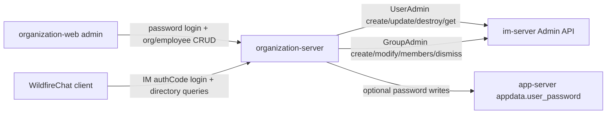

# organization-platform

## Repository Snapshot

- Local source: `C:\Users\COLORFUL\Desktop\WuKong\.codex_tmp\wildfirechat\organization-platform`
- Branch: `main`
- Commit inspected: `d391f3b`
- Main parts:
  - `organization-server`: Spring Boot backend for organization directory APIs.
  - `organization-web`: Vue admin console for organization and employee management.

## Responsibility

`organization-platform` provides an enterprise organization directory service for WildfireChat.

It owns:

- Organization tree data.
- Employee profile data.
- Employee-to-organization relationship data.
- Organization import from Excel.
- Optional department work-group creation and repair.
- Admin console APIs for modifying organization data.
- Client query APIs for reading organization data after IM auth-code login.

It is not the core IM server and not the normal user login server. It depends on `im-server` Admin API for user lookup, user creation/update, auth-code validation, and group maintenance.

## Build and Run

Confirmed commands from README and build files:

```text
organization-web:    npm install
organization-web:    npm run build
organization-server: mvn clean package
run:                 nohup java -jar organization-platform-server-*.jar 2>&1 &
```

README explicitly says to use `npm`, not `yarn`, because frontend build output is copied into the backend static resource directory.

The frontend build command copies:

```text
organization-web/dist/ -> organization-server/src/main/resources/static
```

Backend artifact:

```text
organization-platform-server-XXX.jar
```

## Backend Stack

`organization-server`:

- Java 8.
- Spring Boot `2.6.7`.
- Maven jar artifact `organization-platform-server`, version `0.2`.
- Spring Web, Spring Data JPA.
- Apache Shiro `1.7.1`.
- MySQL default configuration.
- Optional Dameng database jars and dialect.
- Optional secondary datasource pointing at app-server style `appdata`.
- Apache POI `5.2.3` for Excel import.
- WildfireChat Java SDK jars:
  - `sdk-0.87.jar`
  - `common-0.87.jar`
- Object storage clients: Qiniu, Aliyun OSS, MinIO, Tencent COS.

Startup entry:

```text
cn.wildfirechat.org.Application.main
```

Default backend config highlights:

```text
server.port=8880
spring.datasource.hikari.jdbc-url=jdbc:mysql://localhost:3306/organization_server...
spring.secondary-datasource.hikari.jdbc-url=jdbc:mysql://localhost:3306/appdata...
im.admin_url=http://localhost:18080
im.admin_secret=123456
im.admin_id=admin
organization.allow_external_staff_access=true
media.server.media_type=1
```

Default seed data creates an admin user. README states default login is:

```text
admin / admin123
```

## API Surface

All main APIs are under `/api/`.

Auth and account:

- `POST /api/login`: admin console login with local account/password.
- `POST /api/user_login`: client login using IM auth code.
- `POST /api/update_pwd`: update admin password.
- `GET /api/account`: current account from `im-server` user info.

Media:

- `POST /api/media/upload`

Organization:

- `POST /api/organization/create`
- `POST /api/organization/update`
- `POST /api/organization/move`
- `POST /api/organization/query`
- `POST /api/organization/query_ex`
- `POST /api/organization/query_list`
- `POST /api/organization/root`
- `POST /api/organization/search`
- `POST /api/organization/delete`
- `POST /api/organization/employees`
- `POST /api/organization/batch_employees`
- `POST /api/organization/create_group`
- `POST /api/organization/dismiss_group`
- `POST /api/organization/repair_group`

Employee:

- `POST /api/employee/create`
- `POST /api/employee/update`
- `POST /api/employee/move`
- `POST /api/employee/query`
- `POST /api/employee/query_ex`
- `POST /api/employee/query_list`
- `POST /api/employee/delete`
- `POST /api/employee/update_password`
- `POST /api/employee/search`

Relationship:

- `POST /api/relationship/employee`

Import, reset, logs:

- `GET /api/template`: download `Import_template.xlsx`.
- `POST /api/import`: import organization data from uploaded Excel.
- `POST /api/reset_all`: delete organization, employee, and relationship data.
- `POST /api/logs`: paged operation log query.

## Auth and Session Model

The Shiro model mirrors `open-platform`:

- `PasswordRealm`: local admin/user login from `t_user`.
- `AuthCodeRealm`: client login by validating an IM auth code through `UserAdmin.applicationGetUserInfo(authCode)`.
- Login responses set `authToken` response header.
- Requests send `authToken` request header.
- `ShiroSessionManager` reads `authToken` before falling back to cookie.
- `DBSessionDao` serializes sessions into table `shiro_session`.
- Session timeout is `Long.MAX_VALUE`.

Client access control:

- Auth-code users receive `user:view`.
- If `organization.allow_external_staff_access=false`, auth-code login is rejected unless the IM user id exists in `t_employee`.
- Password admin receives `user:view` and `user:admin`.

## Data Model

Primary local entities:

- `t_organization`
  - `id`, `parent_id`, `manager_id`, `name`, `description`, `portraitUrl`, `tel`, `office`, `group_id`, `member_count`, `sort`, timestamps.
- `t_employee`
  - `employee_id`, primary organization id, title, name, level, mobile, email, ext, office, portrait, job number, join time, city, type, gender, sort, timestamps.
- `t_relationship`
  - Composite key: `employee_id`, `organization_id`, `depth`, `bottom`.
  - Stores employee membership along every ancestor organization path.
  - `bottom=true` marks the direct department membership.
- `t_user`
  - Admin console users.
- `shiro_session`
  - Serialized sessions.
- `t_operation_log`
  - Operation audit log.

README explains the relationship table intentionally stores redundant path data. Example: if one employee belongs to `Company / Tech / Mobile / Android`, multiple relationship rows are stored, one for each path segment. This makes reads efficient but makes moves/deletes more complex.

Secondary datasource:

- `spring.secondary-datasource.hikari.*` points to an `appdata` database.
- `UserPassword` maps table `user_password`.
- Excel import and `employee/update_password` can write password hashes for app-server style login.

Secondary password hashing observed:

```text
Base64(SHA1(salt + password))
```

Admin-console password hashing remains:

```text
Base64(MD5(password + salt))
```

## IM Server Integration

On startup:

```text
AdminConfig.initAdmin(im.admin_url, im.admin_secret)
```

Employee creation:

- If `employeeId` is provided, it calls `UserAdmin.getUserByUserId`.
- If no `employeeId` but mobile exists, it calls `UserAdmin.getUserByMobile`.
- If the IM user exists, it updates IM user display name, gender, portrait, mobile, and email.
- If the IM user does not exist, it calls `UserAdmin.createUser`.
- The resulting IM user id becomes `employeeId`.

Employee update:

- Fetches IM user by id.
- Builds an update mask for changed display name, mobile, portrait, gender, and email.
- Calls `UserAdmin.updateUserInfo`.

Employee delete:

- Deletes local employee and relationship rows.
- Removes employee from department groups.
- If request has `destroyIMUser=true`, calls `UserAdmin.destroyUser(employeeId)`.

Organization group operations:

- `createOrganizationGroup` creates an IM group using `GroupAdmin.createGroup`.
- Group type is set to `3` for organization group creation.
- Group owner is the organization manager.
- Members are all employees under the organization.
- `updateOrganization` can transfer group owner and modify group name/portrait.
- `moveOrganization` and `moveEmployee` add/remove members from affected groups.
- `repairOrganizationGroup` compares local organization members with IM group members and fixes missing/extra membership.
- `deleteOrganization` dismisses the group when `groupId` exists.

Important source finding: `dismissOrganizationGroup` sets `entity.groupId = null` and saves before calling `GroupAdmin.dismissGroup(mAdminId, entity.groupId, ...)`. That means the IM call appears to receive `null`, not the old group id. This should be verified and fixed before relying on dismissal.

## Import Flow

The backend ships `Import_template.xlsx`.

Import flow:

1. Parse first sheet with Apache POI.
2. Skip description/header rows.
3. Read user id, name, mobile, email, department paths, job number, gender, city, type, manager flags, office, ext, join time, title, level, password.
4. Require mobile.
5. Reject duplicate mobile, email, and user id within the import.
6. Build an in-memory organization tree from comma-separated department paths.
7. Save organization tree first.
8. Create employees and IM users.
9. Move employees into multiple departments when needed.
10. Assign organization managers.
11. Update organization member counts.
12. Save optional employee passwords into the secondary datasource.

README notes that when the database is empty, the intended workflow is to import initial data first; manual creation is restricted until initial data exists.

## organization-web Admin Console

Tech stack:

- Vue `2.7.14`
- Vue Router `3`
- Pinia `2.3.1`
- Element UI `2.15.14`
- Axios `1.8.2`

Axios config:

- `baseURL: '/api'`
- `withCredentials: true`
- Sends `authToken` header from `localStorage`.
- Stores `authToken` response header after `/login`.

Admin API usage includes:

- Root organization loading.
- Organization query with children.
- Employee create/query/move/delete/update password.
- Organization create/update/delete.
- Organization group create/dismiss.
- Password update.
- Template download and import upload.

## Deployment and Extension Notes

Use this repo when the application needs enterprise address-book behavior:

- Browse organization tree.
- Pick employees without adding friends.
- Show employee business cards and department paths.
- Create department work groups tied to organization membership.
- Bootstrap users into `im-server` from an enterprise directory.

For production:

- Replace `im.admin_secret`.
- Replace default admin password.
- Use production MySQL/Dameng settings.
- Verify whether the secondary app-server password datasource is needed.
- Decide whether external non-employees may view organization data.
- Configure object storage for portraits.
- Review Shiro authorization order.
- Review destructive operations such as reset/import/delete before exposing admin console.

## Risks and Source-Confirmed Oddities

- Default config contains demo admin secret, demo database passwords, and demo object-storage keys.
- `ShiroConfig` places `filterChainDefinitionMap.put("/**", "login")` before the detailed `perms[user:admin]` and `perms[user:view]` rules. In Shiro URL filter chains, order matters; this likely turns many routes into “login required” rather than enforcing the intended permission. This is a high-priority production review item.
- `dismissOrganizationGroup` clears `groupId` before calling `GroupAdmin.dismissGroup`, likely causing the IM dismissal to use `null`.
- `resetAll` deletes local organization, employee, and relationship tables but does not destroy IM users or dismiss IM groups.
- `deleteOrganization` has a TODO for deleting all employees when deleting a root organization.
- Passwords can be written into a secondary datasource matching app-server’s `user_password` table. That creates a tight deployment coupling with the app-server database schema.
- Session timeout is effectively infinite.
- `DBSessionDao.delete` behavior should be reviewed for persisted session cleanup, same pattern as other platform repos.
- Group operations are interleaved with local DB changes; partial IM failure can leave local org data and IM group membership out of sync. `repairOrganizationGroup` mitigates group drift after the fact.

## Relationship to Core Notes

`organization-platform` is an adjunct business platform. It uses `im-server` Admin API, but it does not replace `app-server` normal login or the client IM-token connection chain.


