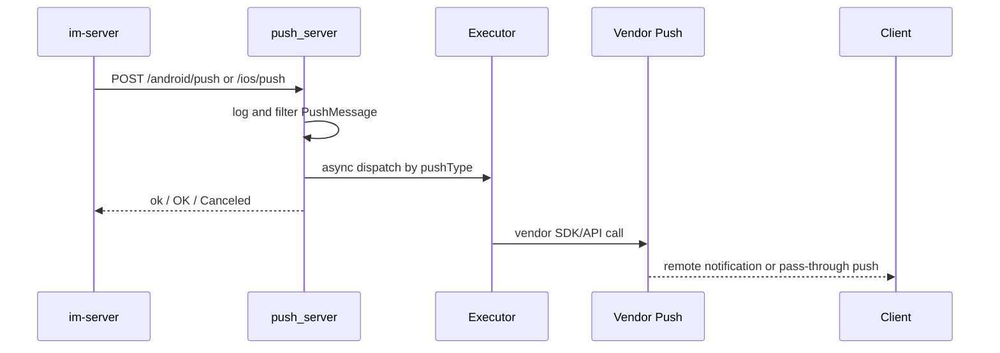

# push_server

## Repository Snapshot

- Local source: `C:\Users\COLORFUL\Desktop\WuKong\.codex_tmp\wildfirechat\push_server`
- Branch: `master`
- Commit inspected: `c7471d9`
- Main parts:
  - Spring Boot push receiver and dispatcher.
  - Vendor push integrations under `src/main/java/cn/wildfirechat/push`.
  - Vue 3 / Vite admin console under `web`.
  - Local bundled vendor SDK jars under `src/main/libs`.

## Responsibility

`push_server` is the independent offline remote-push subsystem for WildfireChat.

It is not the core IM server and does not decide whether a message should be pushed. `im-server` decides that a receiver needs remote push, packages `PushMessage`, then calls this service. `push_server` returns quickly and dispatches the request asynchronously to the selected vendor channel.

Confirmed supported paths:

- Android push: `POST /android/push`
- iOS push: `POST /ios/push`
- Harmony push: `POST /harmony/push`
- Admin console/API: `http://<host>:8086/admin/` and `/api/admin/*`

Confirmed vendor integrations:

- APNs through Pushy.
- FCM through Firebase Admin.
- Huawei HMS.
- Honor.
- Xiaomi.
- OPPO.
- vivo.
- Getui.
- UniPush.
- Harmony OS cloud push.

README still mentions Meizu in some text, but source marks Meizu support as removed in `AndroidPushType`.

## Build and Run

Confirmed commands:

```text
mvn package
nohup java -jar push-xxxx.jar 2>&1 &
```

Maven also builds the admin frontend through `frontend-maven-plugin`:

```text
web: npm install
web: npm run build
```

Frontend stack:

- Vue `^3.2.45`
- Vue Router `^4.1.6`
- Vite `^3.2.11`

## Backend Stack

- Java 8.
- Spring Boot `2.0.6.RELEASE`.
- Spring Web.
- Spring Data JPA.
- H2, MySQL, PostgreSQL, Kingbase, and Dameng database dependencies/config samples.
- Log4j2 `2.17.1`.
- Pushy `0.13.10`.
- Firebase Admin `7.1.0`.
- Java JWT `3.8.1`.
- BCrypt through Spring Security Crypto.

Startup entry:

```text
cn.wildfirechat.push.PushApplication.main
```

Default ports:

```text
server.port=8085
admin.server.port=8086
```

## Configuration

Current `application.properties` uses two ports:

- `8085`: push endpoint port, intended for `im-server`.
- `8086`: admin management port.

`PortAccessFilter` enforces path separation:

- Push port allows only `/android/push`, `/ios/push`, and `/harmony/push`.
- Admin port allows only `/api/admin*` and `/admin*`.

Push vendor configuration is stored in the database through `PushConfig` rows and loaded into in-memory beans by `ConfigService`.

Cluster config refresh:

- `ConfigRefreshTask` runs every 30 seconds.
- `ConfigService.checkAndRefresh()` reloads changed config from DB based on `ConfigVersion`.

Admin default seed:

```text
username=admin
password=admin123
secretKey=push_server_default_secret_key_change_me
```

Source logs a warning on first initialization, but production deployments must still rotate it.

## Push Request Model

`PushMessage` contains the data `im-server` sends to this service:

- sender / senderName / senderPortrait
- convType / target / targetName / targetPortrait / line
- userId
- cntType
- serverTime
- pushMessageType
- pushType
- pushContent / pushData
- unReceivedMsg
- mentionedType
- packageName
- deviceToken / voipDeviceToken
- isHiddenDetail
- language
- messageId
- callStartUid
- republish
- existBadgeNumber

Push message types:

```text
0 normal
1 voip invite
2 voip bye
3 friend request
4 voip answer
5 recalled
6 deleted
7 secret chat
```

Android push types:

```text
1 Xiaomi
2 Huawei
4 vivo
5 OPPO
6 FCM
7 Getui
8 JPush placeholder
9 Honor
10 UniPush v2
```

iOS push types:

```text
0 APNs distribution
1 APNs development
```

## Processing Flow



`AndroidPushServiceImpl`, `IOSPushServiceImpl`, and `HMPushServiceImpl` all use async executors for normal push handling. If a task waits more than 15 seconds before execution, the implementation logs and drops it.

`Utility.filterPush()` filters some VoIP end/answer push cases:

- VoIP bye from receiver to self is cancelled.
- Group call bye is pushed only for selected end reasons.
- VoIP answer is only used for self-to-self stop-ringing behavior.

## Admin Console

Admin APIs include:

- Login.
- Config listing and update.
- Config validation.
- Stats and daily stats.
- Password change.
- Supported platform list.
- Certificate/credential upload.
- Test push.
- Push record query.

Auth model:

- `/api/admin/login` returns a JWT signed with the admin user's `secretKey`.
- `AdminAuthFilter` verifies `Authorization: Bearer <token>` for `/api/admin/*`.
- Static admin assets are allowed without JWT.
- Login has a simple in-memory five-failure lockout per username for one hour.

## IM Server Integration

`im-server` should point push config to this service, for example:

```text
push.android.server.address http://localhost:8085/android/push
push.ios.server.address http://localhost:8085/ios/push
```

Client-side push setup remains separate:

1. Client registers with a vendor SDK.
2. Client obtains `deviceToken`.
3. Client calls IM SDK `setDeviceToken(token, pushType)`.
4. `im-server` stores token/type in user session data.
5. `im-server` sends token/type to `push_server` when remote push is needed.

## Source-Confirmed Risks

- Default admin credentials and JWT secret are unsafe for production until changed.
- Current checked-in `application.properties` contains a concrete MySQL host/user/password sample. Treat it as demo/local config and replace before deployment.
- Push endpoints on port `8085` do not add their own shared-secret authentication in inspected source. Network-level restriction between `im-server` and `push_server` is important.
- Async executors use a `SynchronousQueue` and max threads based on CPU count times 100. Under vendor slowness or traffic spikes this can create high thread pressure.
- README and source differ on Meizu support; source indicates it is removed.
- Vendor configs and uploaded credential files are stored in the database. Confirm DB encryption/backup/access policy before storing production APNs/FCM/HMS secrets.
