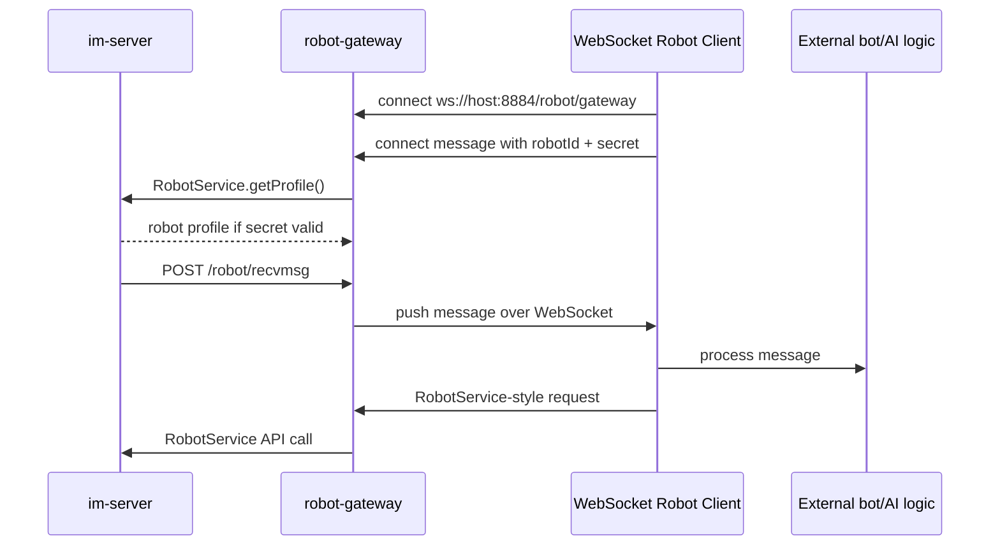

# robot-gateway

## Repository Snapshot

- Local source: `C:\Users\COLORFUL\Desktop\WuKong\.codex_tmp\wildfirechat\robot-gateway`
- Branch: `main`
- Commit inspected: `fcd8319`
- Main parts:
  - `gateway`: Spring Boot WebSocket/HTTP robot gateway.
  - `client`: Java WebSocket client SDK.
  - `client.js`: JavaScript/Node WebSocket client SDK.
  - `demo`: Java demo using the client SDK.
  - `openclaw-adapter`: Java OpenClaw adapter.
  - `openclaw-adapter.js`: JavaScript OpenClaw adapter.
  - `openclaw-plugin.js`: TypeScript OpenClaw plugin.
  - `go`: Go SDK and OpenClaw adapter.

## Responsibility

`robot-gateway` solves a deployment problem in the direct robot model: a normal robot service must expose an HTTP callback that `im-server` can reach. This gateway allows robot clients behind NAT or inside private networks to connect outward to a public WebSocket gateway.

High-level flow:



It can also run a BotFather-like robot factory that creates user-owned robots through the `im-server` Admin API.

## Build and Run

Confirmed commands:

```text
./build.sh
mvn clean package -DskipTests
nohup java -jar gateway/target/gateway-1.0.0.jar 2>&1 &
```

Build artifacts described by README:

```text
gateway/target/gateway-1.0.0.jar
client/target/client-1.0.0.jar
demo/target/demo-1.0.0.jar
openclaw-adapter/target/openclaw-adapter-1.0.0.jar
```

Risk: `build.sh` has a hard-coded local `PROJECT_DIR="/Users/rain/Workspace/robot_server"`, so use Maven directly or patch the script before relying on it outside the author's machine.

## Stack

Parent project:

- Java 8.
- Maven multi-module project.
- WildfireChat Java SDK `1.4.6`.
- Spring Boot `2.2.10.RELEASE`.
- Gson `2.8.9`.
- Netty `4.1.119.Final`.
- Tomcat `9.0.98`.

Gateway module:

- Spring Web.
- Spring WebSocket.
- WildfireChat Java SDK.

Java client module:

- Java-WebSocket `1.5.3`.
- WildfireChat Java SDK model jars.

JavaScript client module:

- Package name `@wildfirechat/robot-gateway-client-sdk`.
- Version `1.0.4`.
- Uses `ws`.
- Depends on `@wildfirechat/server-sdk`.

## Gateway Configuration

Default config:

```text
server.port=8885
websocket.port=8884
im.url=http://wildfirechat.net
botfather.enabled=true
botfather.robot.id=robotfather
botfather.robot.secret=123456
botfather.admin.url=http://wildfirechat:18080
botfather.admin.secret=123456
botfather.callbackUrl=http:///43.143.148.156:8885/robot/recvmsg
botfather.publicAddr=ws://82.157.141.188:8884/robot/gateway
```

Deployment must replace demo hosts, malformed callback URL, and demo secrets.

## Gateway HTTP and WebSocket Entrypoints

HTTP:

```text
POST /robot/recvmsg
POST /robot/recvmsg/conference?rid={robotId}
```

WebSocket:

```text
ws://<host>:8884/robot/gateway
```

`WebSocketConfig` registers the gateway endpoint and allows all origins:

```text
.setAllowedOrigins("*")
```

WebSocket text/binary buffer sizes are 60 KB.

## Authentication and Session Model

Client authentication message:

```json
{
  "type": "connect",
  "robotId": "FireRobot",
  "secret": "123456"
}
```

`AuthHandler` verifies by constructing:

```text
new RobotService(im.url, robotId, secret)
```

Then it calls:

```text
RobotService.getProfile()
```

If the IM service accepts the robot credentials, the gateway stores a per-session `RobotService` instance in `SessionManager`.

Session behavior:

- Multiple sessions can authenticate as the same robot.
- Incoming IM messages are broadcast to active sessions for the target robot.
- Unauthenticated sessions are cleaned after 1 minute.
- Authenticated sessions are cleaned after 5 minutes without heartbeat.
- Client SDK default heartbeat interval is 270 seconds.

## RobotService Proxy

`RobotProxy` accepts JSON requests with:

```json
{
  "requestId": "uuid",
  "method": "sendMessage",
  "params": [...]
}
```

It finds a matching `RobotService` method by reflection, converts params with Gson, invokes the method, and returns a response.

Explicitly blocked methods:

```text
setCallback
getCallback
deleteCallback
```

For `getProfile`, the gateway strips callback and secret from the returned robot profile before sending it back to the WebSocket client.

## BotFather

When enabled, BotFather routes messages sent to `botfather.robot.id` into `RobotCommandHandler`.

Supported commands include:

- `/help`
- `/create`
- `/info` or `/my`
- `/list`
- `/delete`
- `/reset`
- `/update name <name>`
- `/update portrait <url>`
- `/update extra <extra>`

`RobotFatherService` initializes Admin SDK:

```text
AdminHttpUtils.init(botfather.admin.url, botfather.admin.secret)
```

It uses Admin APIs such as:

- `UserAdmin.getUserRobots`
- `UserAdmin.getRobotInfo`
- `UserAdmin.createRobot`
- `UserAdmin.destroyRobot`
- `UserAdmin.updateUserInfo`
- `RelationAdmin.setUserFriend`

New robot secrets are UUID strings without hyphens.

## Source-Confirmed Risks

- Demo config includes public IPs, default robot/admin secrets, and a malformed `botfather.callbackUrl`.
- `WebSocketConfig` allows all origins. That may be acceptable for a public SDK endpoint, but it should be a deliberate deployment decision.
- The gateway exposes broad reflected `RobotService` method access to any party with a valid robot id and secret. The secret is the main authorization boundary.
- `build.sh` has a hard-coded local path and is not portable as checked in.
- BotFather requires `im-server` Admin API secret. If enabled, this gateway becomes a privileged robot-provisioning control plane and needs stronger operational protection than a plain robot callback service.
- README instructs direct DB insertion for the BotFather robot identity. That requires restart of `im-server` per README and should be replaced with Admin API provisioning where possible.
