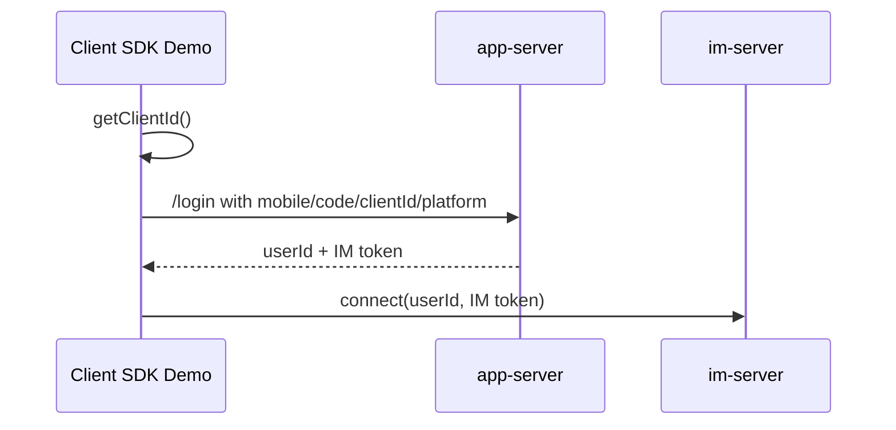

# Repository Note: SDKs and Tools

## Reader and Action

Primary reader: an engineer deciding whether the remaining SDK/demo/tooling repositories are needed for a WildfireChat deployment, port, or validation plan.

Post-read action: choose the right client SDK example, reproduce official performance tests when relevant, and use UDP diagnostics without confusing them with production services.

## Snapshot

Local sources inspected under `C:\Users\COLORFUL\Desktop\WuKong\.codex_tmp\wildfirechat`.

Commits inspected:

- `CS-Client-SDK`: `9d8a32d`
- `WFSwiftDemo`: `d17df1d`
- `Performance_Test`: `4e7566e`
- `C1000K_Test`: `e44fed3`
- `udp_port_detecter`: `114bf8a`
- `udpPortChecker-android`: `1e5f225`

## Classification

Use as integration references:

- `CS-Client-SDK`: Windows C++/C# native client SDK wrapper and API demo.
- `WFSwiftDemo`: Swift integration demo for iOS frameworks.

Use as validation or operations references:

- `Performance_Test`: professional-edition IM service performance methodology and benchmark notes.
- `C1000K_Test`: single-node million long-connection test guide and launcher script.
- `udp_port_detecter`: UDP reachability server/client tools for AV/TURN port checks.
- `udpPortChecker-android`: Android UI wrapper for `udp_port_detecter`.

None of these repositories is a mandatory runtime service in the normal IM deployment path. They are examples, test plans, or diagnostics.

## Shared SDK Invariant

The inspected client SDK demos follow the same credential chain as the main clients:

Important points:

- SDK demos do not mint IM tokens by themselves.
- `clientId` must come from the SDK/protocol stack before calling the business login API.
- `platform` is part of the login/token request. The Windows C# demo uses platform `3`; the Swift demo uses `Platform_iOS`.
- App-server URL and IM host must be changed together for self-hosted deployments.

## CS-Client-SDK

### Responsibility

`CS-Client-SDK` contains native Windows client SDK wrappers and simple API-test demos:

- C++ SDK wrapper: `CppChatClient`.
- C++ test program: `CppChatDemo`.
- C# wrapper: `CsChatClient`.
- C# demo: `CsChatDemo`.
- CLR bridge between C++ protocol stack and C#: `ClrChatClient`.
- Visual Studio solution under the inner `CS-Client-SDK` directory.

The repository depends on WildfireChat's paid protocol stack. The protocol binaries and headers are under `proto` directories in the solution layout, including `dll`, `lib`, and `include`.

### Source-Confirmed Behavior

- The Visual Studio solution wires five projects: `ClrChatClient`, `CppChatClient`, `CppChatDemo`, `CsChatClient`, and `CsChatDemo`.
- `CppChatClient::ChatClient` wraps `WFClient` and exposes familiar client operations: listeners, `getClientId`, `connect`, local conversations, messages, groups, users, channels, chatrooms, media upload, and custom messages.
- `ChatClient::connect(userId, token)` registers callbacks with `WFClient` and calls `WFClient::connect2Server`.
- The C# demo:
  - calls `ChatClient.Instance().SetAppName("TextIM")`;
  - calls `GetClientId()`;
  - sends `mobile`, `code`, `clientId`, and `platform: 3` to `/login`;
  - reads `result.userId` and `result.token`;
  - calls `Connect(userId, token)`.
- The demo's hard-coded default login URL is `http://wildfirechat.net:8888/login`.

### Integration Guidance

Use this repo when building or maintaining a native Windows integration that cannot use the Electron clients.

For a self-hosted deployment:

- Replace the app-server URL in the demo/business layer.
- Use the matching paid/trial protocol stack for the target IM server.
- Copy the required protocol DLLs to the executable directory.
- Keep admin/server SDK secrets out of the desktop app; this is a client SDK, not a server SDK.

### Risks and Boundaries

- The protocol stack is paid/trial and server-bound; the default stack may only connect to official services.
- Demo code logs/prints token-related values and uses demo endpoints; do not ship it unchanged.
- The wrappers are broad API surfaces. For production, isolate UI/business policy outside the SDK wrapper and keep token acquisition on the business server.

## WFSwiftDemo

### Responsibility

`WFSwiftDemo` is a minimal Swift iOS app demonstrating how to embed WildfireChat iOS frameworks from Swift.

It is not the main iOS product client. The main full client remains `ios-chat`; this repository is useful when a Swift project needs to compare framework setup, bridging, login, connect, and AV initialization.

### Source-Confirmed Behavior

- Frameworks included under `Frameworks`:
  - `WFChatClient.xcframework`
  - `WFChatUIKit.xcframework`
  - `WFAVEngineKit.xcframework`
  - `WebRTC.xcframework`
  - `SDWebImage.xcframework`
  - `ZLPhotoBrowser.xcframework`
- `Config.swift` defines:
  - `DEMO_APP_URL = "http://wildfirechat.net:8888"`
  - `IM_HOST = "wildfirechat.net"`
- `AppDelegate`:
  - sets `WFCCNetworkService.sharedInstance()?.connectionStatusDelegate`;
  - calls `setServerAddress(IM_HOST)`;
  - starts client logging;
  - configures a demo TURN server on `turn:turn.liyufan.win:3478` with demo credentials;
  - configures `WFAVEngineKit` video profile and delegate;
  - presents `WFCUVideoViewController` for incoming AV sessions.
- `ViewController`:
  - collects phone number and SuperCode;
  - calls `WFCCNetworkService.sharedInstance()?.getClientId()`;
  - posts `/login` with `mobile`, `code`, `clientId`, and `platform: Platform_iOS`;
  - connects with `WFCCNetworkService.sharedInstance()?.connect(userId, token:)`;
  - switches root UI to a conversation/contact tab after login.

### Integration Guidance

Use this repo as a Swift embedding reference:

- Replace `DEMO_APP_URL` and `IM_HOST`.
- Replace the demo TURN/ICE configuration for production AV.
- Ensure all dynamic frameworks are embedded in the app target.
- Keep the full `ios-chat` note as the richer reference for production client behavior.

### Risks and Boundaries

- Default endpoints and TURN credentials are demo-only.
- The app has minimal login/error handling and no production account lifecycle.
- It demonstrates framework integration, not complete app architecture.

## Performance_Test

### Responsibility

`Performance_Test` is a documentation repository for professional-edition IM service performance testing.

It covers:

- single-message tests;
- group-message tests;
- chatroom-message tests;
- cluster-message tests;
- pointer to separate C1000K long-connection testing.

### Source-Confirmed Methodology

The repository is mainly README-based and assumes the official/professional `wfcstress` binary from a professional IM package.

Common setup guidance across test folders:

- Linux/CentOS test machines.
- Java 8 for IM service runtime.
- MySQL service separate from IM.
- `embed.db 0` for MySQL.
- high rate-limit values for pressure tests.
- `netty.epoll true`.
- tuned heap in `bin/wildfirechat.sh`.
- app-server is used only for observation-account login, then may be stopped to avoid test noise.
- test users are generated by prefix and numeric ranges; client IDs are generated with a `c_` prefix pattern in the stress tool.

Performance test topics:

- Single chat: send-only and send/receive tests; validates DB row counts in message tables and user-message tables.
- Group chat: creates groups, sends to 100/200/1000-member scenarios, and evaluates fan-out.
- Chatroom: separates senders and simulated members; notes chatroom messages may intentionally drop under design constraints.
- Cluster: uses multiple IM nodes with Hazelcast TCP members, unique `node_id`, and estimates local-vs-RPC message cost.

### Benchmark Numbers Captured In README

Representative figures documented by the repo:

- Single-chat send test: 10 million messages, 509 seconds, about 19,646 messages/second on 16 total CPU cores counted across IM and MySQL resources.
- Single-chat send/receive test: 10 million messages, 719 seconds, about 13,908 messages/second.
- Group fan-out tests show that send-message rate falls as group size rises, while per-core fan-out is estimated around the high thousands per second.
- Cluster test explains that adding nodes does not scale linearly because cross-node RPC consumes resources; the README estimates each additional node adds roughly half of a single node's capacity in the tested setup.

Treat these as vendor benchmark notes, not a guarantee for arbitrary hardware, database state, network topology, or message payload size.

### Risks and Boundaries

- The actual `wfcstress` binary is not in this repository.
- The tests require professional-edition packages and sometimes licensed server IPs.
- Several examples expose/admin-use `18080` during testing. Keep Admin API internal in production.
- Test settings such as huge rate limits and queue sizes are for pressure testing, not normal production defaults.

## C1000K_Test

### Responsibility

`C1000K_Test` documents and automates a single-node million long-connection test for professional WildfireChat IM.

### Source-Confirmed Setup

The README specifies:

- one IM server, 16C32G;
- one MySQL server, 4C8G;
- twenty pressure machines, each 2C4G;
- each pressure machine creates 50,000 long connections;
- CentOS 7.6;
- Java 8 on the IM server;
- kernel and file-descriptor tuning for million-connection scale;
- MySQL tuning, especially buffer pool sizing;
- professional IM server package and stress tool.

The included `config.toml` enables `TestLonglinkConfig`:

- `Host` points to the professional licensed IM address;
- `HttpPort = 80`;
- `AdminPort = 18080`;
- `AdminSecret = 123456` in sample config;
- `Lite = true`;
- `UserCount = 50000`;
- `ConnDuration = 3600`;
- `SkipConfirm = true`.

The included `startTest.sh`:

- assumes SSH host aliases `test1` through `test20`;
- sets TCP port/sysctl values on each pressure machine;
- replaces `UserStartIndex` with offsets of `50000` per machine;
- copies `config.toml` and `wfcstress`;
- starts `nohup ./wfcstress` on all machines.

### Risks and Boundaries

- This is a high-cost, professional-edition test plan.
- The sample `AdminSecret` is the common demo secret and must not be reused.
- The script is tailored to Linux/macOS shell, SSH aliases, and a fixed 20-node layout.
- The README explicitly says Windows/WSL was not verified for running the local orchestration.

## udp_port_detecter

### Responsibility

`udp_port_detecter` is a small UDP reachability diagnostic for audio/video and TURN deployments.

It has Go and Java implementations of:

- UDP server: listen on a specified UDP port.
- UDP client: send a message to host/port and wait for a response.

### Source-Confirmed Behavior

Go server:

- usage is `udp_server <port>`;
- listens on UDP `:<port>`;
- prints incoming client address and message;
- replies with a Chinese "received" message plus the original payload.

Go client:

- usage is `udp_client <server_ip> <server_port> <message>`;
- sends one UDP packet;
- waits for and prints one response.

Java implementations mirror the same diagnostic role.

### Deployment Use

Use this before debugging AV at the SDK level:

- run the server on the TURN/AV host or on the same network path;
- run a desktop or mobile client from the user's network;
- verify that UDP reaches the intended port and that replies return.

This tool does not test TURN authentication, Janus room logic, WebRTC ICE negotiation, or IM signaling. It only proves basic UDP round-trip reachability.

## udpPortChecker-android

### Responsibility

`udpPortChecker-android` is an Android app wrapper for the UDP reachability test.

### Source-Confirmed Behavior

- Android app built with Gradle, Kotlin, and Jetpack Compose.
- `minSdk = 21`, `compileSdk = 33`, `targetSdk = 33`.
- Main UI asks for Host and Port.
- Host input is validated by `InetAddress.getByName`.
- Port input is validated as a positive integer.
- On test, it sends `"hello"` using `UDPClient.connectAndSend`.
- `UDPClient` uses `DatagramSocket`, sends one packet, waits up to 30 seconds, and returns the server response or failure.

### Risks and Boundaries

- Like `udp_port_detecter`, this only proves UDP round-trip connectivity.
- It expects a compatible `udp_port_detecter` server to be listening.
- A successful response does not prove TURN/Janus/AV configuration is correct.

## Practical Selection Guide

- Need a Windows native client SDK reference: use `CS-Client-SDK`.
- Need a Swift framework embedding reference: use `WFSwiftDemo`.
- Need to capacity-plan professional IM message throughput: read `Performance_Test`, then reproduce with your hardware and data shape.
- Need to prove million long-connection capability: use `C1000K_Test` as a lab guide, not as a normal staging test.
- Need to debug AV/TURN network reachability: use `udp_port_detecter` and optionally `udpPortChecker-android`.

## Cross-Repository Implications

- Performance repositories reinforce the earlier architecture note: the normal high-performance path is still one IM service plus database, with optional clustering only when needed.
- Media messages are expected to put most pressure on object storage, not IM message routing.
- Heavy forced refresh of user/group information is explicitly called out as a server pressure risk in the performance docs.
- AV troubleshooting should check network ports/TURN before assuming client SDK defects.
