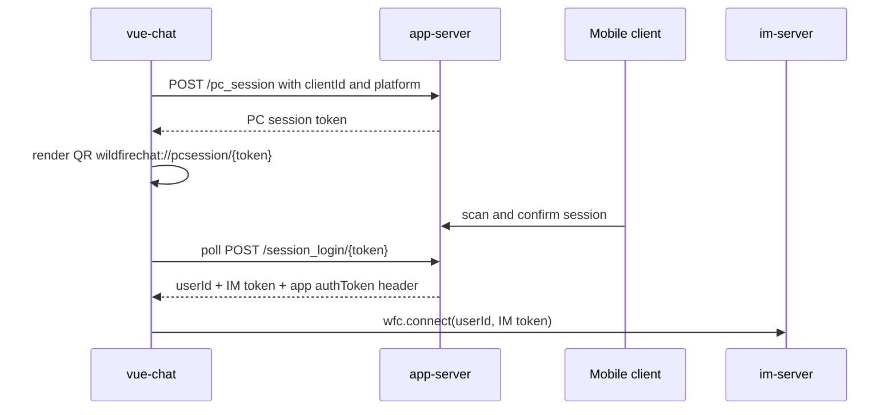

# Repository Note: vue-chat

## Snapshot
- Repository: `wildfirechat/vue-chat`
- Local cache: `C:\Users\COLORFUL\Desktop\WuKong\.codex_tmp\wildfirechat\vue-chat`
- Branch/commit inspected: `master` / `5420d8b`
- Primary role: Web chat client demo/application for WildfireChat.
- Main stack: Vue 3, Vue CLI 5, Pinia, Vue Router, axios, bundled JavaScript/Web IM SDK under `src/wfc`.

## Responsibility
`vue-chat` is a browser-first client application. It owns the web UI, login screen, conversation/contact views, message rendering/input, favorites, organization UI integration, collection/poll helpers, voice/video UI glue, and custom message registration.

It does not authenticate users by itself. Login and app business APIs go to `app-server`; IM long connection and message operations go through the bundled Web IM SDK.

## Build and Run Commands
Confirmed from `package.json`:

```powershell
npm run serve
npm run serve-https
npm run build
npm run lint
```

The scripts use `vue-cli-service` and skip the eslint plugin for serve/build.

## Key Configuration
Confirmed from `src/config.js`:

- `APP_SERVER = 'https://app.wildfirechat.net'` by default.
- `USE_WSS = true`.
- `ROUTE_PORT = 443`.
- `CLIENT_ID_STRATEGY = 1`, meaning web `clientId` is stored in `sessionStorage`.
- `QR_CODE_PREFIX_PC_SESSION = "wildfirechat://pcsession/"`.
- `ICE_SERVERS` defaults to WildfireChat test TURN credentials.
- Optional adjunct services are configured with `COLLECTION_SERVER`, `POLL_SERVER`, `ASR_SERVER`, `ORGANIZATION_SERVER`, and `OPEN_PLATFORM_WORK_SPACE_URL`.
- `AMR_TO_MP3_SERVER_ADDRESS` is built from `APP_SERVER + '/amr2mp3?path='`.

Deployment implication: for a self-hosted deployment, at minimum replace `APP_SERVER`, and make `USE_WSS`/`ROUTE_PORT` match the HTTPS/WSS route exposed in front of `im-server`.

## App-Server API Usage
Confirmed from `src/api/appServerApi.js`:

- `/send_code`: request SMS auth code.
- `/login_pwd`: password login.
- `/login`: SMS code login.
- `/pc_session`: create PC/web scan-login session.
- `/session_login/{appToken}`: poll/complete PC scan-login session.
- `/change_pwd`, `/send_reset_code`, `/reset_pwd`: password management.
- `/get_group_announcement`, `/put_group_announcement`: app-side group announcement.
- `/fav/*`: favorites.
- `/slide_verify/*`: login slide captcha.

Login requests include:

- `mobile` and password/code when applicable.
- `platform = Config.getWFCPlatform()`.
- `clientId = wfc.getClientId()`.

Successful login stores the app-server `authToken` response header under a host-scoped key and returns `response.data.result` containing at least `userId`, `token`, and often `portrait`.

Important invariant: the `token` returned by `app-server` is the IM token from `im-server`, and it is bound to the `clientId` used in the login request.

## IM SDK Initialization and Connection
Confirmed from `src/main.js` and `src/wfc/client/wfc.js`:

- Browser path calls `wfc.init()`, registers custom messages, then calls `store.init(true)`.
- Electron-detection branches exist, but this repository is primarily the web build; the PC-specific repo has stronger Electron/native handling.
- `WfcManager.connect(userId, token)` delegates to the bundled SDK `impl.connect(userId, token)`.
- `wfc.getClientId()` delegates to the SDK and must be used when requesting a token.

Confirmed login call sites in `src/ui/main/LoginPage.vue`:

- Auto-login reads `userId` and `token` from storage, then calls `wfc.connect(userId, token)`.
- Password login calls `appServerApi.loinWithPassword(...)`, then `wfc.connect(userId, token)`.
- SMS-code login calls `appServerApi.loginWithAuthCode(...)`, then `wfc.connect(userId, token)`.
- PC scan login calls `appServerApi.loginWithPCSession(appToken)`, then `wfc.connect(userId, imToken)` after status `code === 0`.

## PC Scan Login Flow
Confirmed from `LoginPage.vue` and `wfcScheme.js`:



Observed status handling:

- `code === 9`: mobile has scanned; UI shows portrait/user name and keeps polling.
- `code === 0`: login accepted; client connects to IM.
- `code === 18`: session canceled; local login state is cleared.

## Storage Model
Confirmed from `src/ui/util/storageHelper.js`:

- In browser mode, `CLIENT_ID_STRATEGY = 1` uses `sessionStorage`; `2` uses `localStorage`; other values disable storage.
- In Electron mode, storage uses `localStorage`.
- Login state stores `userId`, `token`, `userPortrait`, and host-scoped `authToken-*`.

Operational implication: changing client ID persistence strategy changes whether a refreshed browser session can reuse the previous IM token.

## Security and Deployment Notes
- Default public WildfireChat service URLs are demo defaults, not a production configuration.
- `authToken` is stored in Web storage; XSS risk matters because the app renders rich content and uses `xss` sanitization in `main.js`.
- `AMR_TO_MP3_SERVER_ADDRESS` exposes a URL-based conversion endpoint from `app-server`; treat it as SSRF-sensitive at the server side.
- TURN credentials in `config.js` are shared demo credentials and should be replaced.
- HTTPS/WSS mismatch is explicitly validated in `Config.validate()`.

## Relationship to Other Repositories
- Talks to `app-server` for login and app business APIs.
- Talks to `im-server` through the bundled Web IM SDK after receiving an IM token.
- Optionally talks to organization, collection, poll, ASR, open-platform, TURN, and media services depending on config and enabled UI features.

## Open Questions
- The bundled `src/wfc/proto/proto.min.js` is minified; deeper protocol internals should be read from SDK/source equivalents where available.
- Web SDK replacement/versioning guidance should be cross-checked against official `docs` before production migration notes are finalized.
