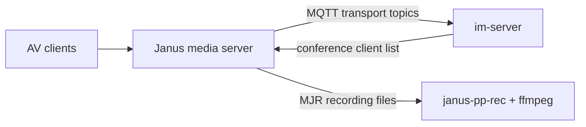

# wf-janus

## Repository Snapshot

- Local source: `C:\Users\COLORFUL\Desktop\WuKong\.codex_tmp\wildfirechat\wf-janus`
- Branch: `master`
- Commit inspected: `dacc3e1`
- Main parts:
  - Janus configuration examples.
  - WildfireChat Janus deployment README.
  - `janus-pp-rec` post-processing tools/binaries.

## Responsibility

`wf-janus` is the deployment/configuration repository for WildfireChat advanced audio/video media service based on Janus.

It is not a normal Java or frontend application. The modified Janus source is referenced as a separate repository under `heavyrain2012/janus-gateway`; this repository packages the configuration and operational guidance used with WildfireChat.

In the WildfireChat architecture:

- `im-server` owns IM users, messages, and AV signaling integration points.
- Janus owns media relay/SFU behavior for advanced audio/video.
- Clients and AV SDKs connect through the WildfireChat conference/AV stack.
- `minutes-server` and `ServerVoipDemo` consume the AV SDK as robots/demos; they do not replace Janus.

## Key Configuration

Important files under `janus_config`:

```text
janus.transport.mqtt.jcfg
janus.jcfg
janus.plugin.videoroom.jcfg
```

Important `janus.transport.mqtt.jcfg` values:

```text
enabled=true
im_host
im_port=80
client_id=conference_server_1
topics: to-janus, from-janus
```

Important `janus.jcfg` values:

```text
rtp_port_range="20000-40000"
ice_lite=true
admin_secret="janusoverlord"
recordings_tmp_ext="tmp"
```

Important `janus.plugin.videoroom.jcfg` value:

```text
string_ids=true
```

The `client_id` identifies a Janus conference server to IM. It must be unique per Janus instance.

## Deployment Model

The README describes downloading Docker images from WildfireChat static URLs by IM version and architecture.

Typical run shape:

```text
docker run --net host --privileged \
  -e DOCKER_IP=<Janus public IP> \
  -v <janus_config>:/opt/janus/etc/janus \
  -v <recordings>:/opt/janus/share/janus/recordings \
  --restart=always ...
```

Important IM-side configuration:

```text
conference.client_list=<all Janus client_id values>
conference.signal_server_address=<IM server internal IP>
```

README guidance says `conference.signal_server_address` should be the IM server internal IP, not a DNS domain.

## Media and Recording

Janus recording output is `.mjr`.

The repository includes `janus-pp-rec` tooling for post-processing Janus recordings, followed by ffmpeg to combine/transcode outputs.

Recording responsibility boundary:

- Janus records raw media streams.
- `wf-conference-record-player` likely owns playback UX or playback tooling; pending source verification.
- `minutes-server` owns transcript/minutes generation, not raw Janus post-processing.

## Deployment Flow



## Source-Confirmed Risks

- UDP RTP port range `20000-40000` must be reachable according to deployment topology.
- `client_id` must be unique for every Janus node and must be listed in `im-server` conference config.
- `DOCKER_IP` must be the Janus public IP, not the IM server IP or IM domain.
- Default `admin_secret` appears in config and should be rotated for production.
- `--net host` and `--privileged` are broad Docker privileges; production deployments should understand and constrain host exposure where possible.
- This repo ships config and binary tooling, not the full modified Janus source. Source-level media-server changes require the referenced Janus source repository.
