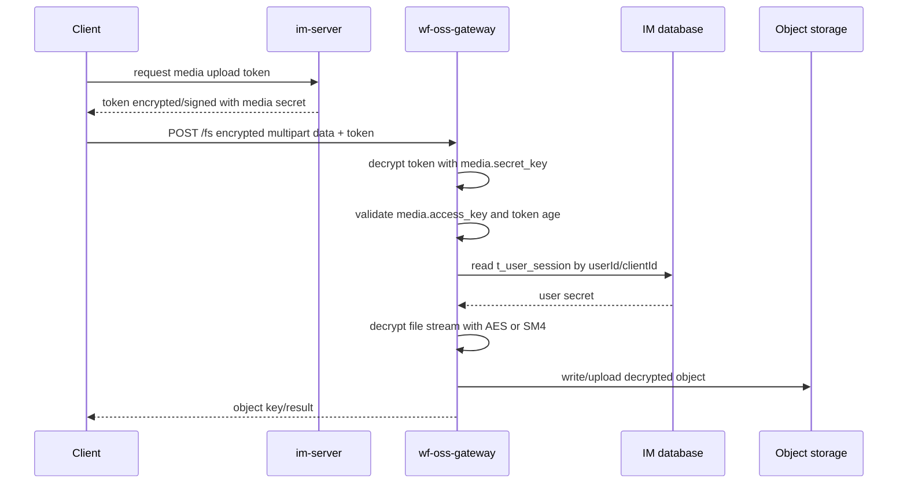

# wf-oss-gateway

## Repository Snapshot

- Local source: `C:\Users\COLORFUL\Desktop\WuKong\.codex_tmp\wildfirechat\wf-oss-gateway`
- Branch: `master`
- Commit inspected: `23a69cf`
- Main parts:
  - Maven parent project.
  - `broker` module with custom Netty HTTP server and upload handling.
  - `distribution` module for release packaging.

## Responsibility

`wf-oss-gateway` is an object-storage upload gateway for WildfireChat professional IM deployments that need custom or private object storage.

It sits in the media upload path. The client receives an upload token from IM, uploads encrypted multipart data to the gateway, and the gateway decrypts/validates the request before forwarding or writing the decrypted object.

Important boundary:

- Upload can go through the gateway.
- Download is expected to go directly from the configured object storage/CDN/domain.
- The gateway must be able to read IM database session data to decrypt uploaded file content.

## Build and Run

Build:

```text
mvn clean package
```

Distribution artifact:

```text
distribution/target/distribution-xxxx-bundle-tar.tar.gz
```

Run script after unpacking:

```text
sh ./wildfirechat.sh
```

IDEA/debug note from README: the working directory should be the `broker/config` path.

## Stack

- Java 8.
- Maven multi-module project.
- Custom Netty HTTP server.
- Moquette-derived server entrypoint naming.
- SQL database access for IM data.
- Optional database modes for MySQL, MongoDB, Kingbase, Dameng, SQL Server, and PostgreSQL.

Startup entry:

```text
io.moquette.server.Server.main
```

## IM and Gateway Configuration

IM-side configuration must use media type `4`:

```text
media.server.media_type 4
media.access_key
media.secret_key
```

Gateway config includes:

```text
local_port
embed.db
media.access_key
media.secret_key
encrypt.use_sm4
```

Observed `embed.db` meanings in source/config comments:

```text
0 = mysql
1 = h2 disabled/invalid for gateway path
2 = mysql + mongodb
3 = kingbase
4 = dameng
5 = sql server
6 = postgresql
```

The `media.access_key` and `media.secret_key` must match the IM server media configuration.

## Upload API and Flow

Main upload route:

```text
POST /fs
```

The route is annotated with `@RequireAuthentication`.

Confirmed upload flow:



Token age limit observed:

```text
180 seconds
```

Default demo behavior writes decrypted files under the configured root path/bucket.

Extension points for custom object storage:

```text
beforeData()
onData(pos, data, length)
afterData()
```

These methods are the intended place to stream decrypted content to a third-party object store and set the final returned key.

## Source-Confirmed Risks

- Default media access key/secret in config are demo values; rotate before any real deployment.
- H2/embedded DB is not valid for the gateway source path despite generic database-mode naming.
- Upload maximum size is hard-coded to about 200 MB in inspected source.
- Responses include `Access-Control-Allow-Origin: *`; restrict this for production deployments.
- The gateway must read IM DB session data directly, so DB permissions and network exposure need tight control.
- Download bypasses the gateway; object storage ACL, HTTPS, custom domain, and CDN behavior must be configured on the storage side.
- The upload gateway handles decrypted media content. Its host, logs, temp directories, and crash dumps should be treated as sensitive.
