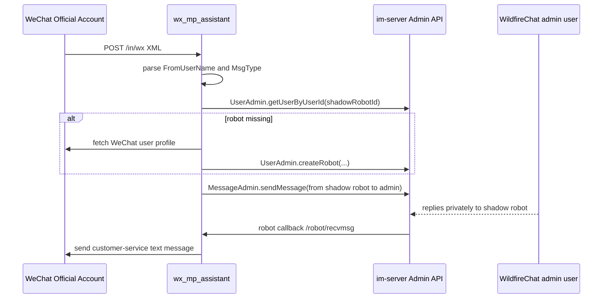

# wx_mp_assistant

## Repository Snapshot

- Local source: `C:\Users\COLORFUL\Desktop\WuKong\.codex_tmp\wildfirechat\wx_mp_assistant`
- Branch: `master`
- Commit inspected: `923dbaf`
- Main entry: `cn.wildfirechat.app.Application`

## Responsibility

`wx_mp_assistant` is a WeChat Official Account assistant demo. It bridges WeChat Official Account private messages into WildfireChat and lets a WildfireChat administrator reply back to WeChat users.

The repository uses a "shadow robot" model:

- Each WeChat user maps to one WildfireChat robot account.
- Incoming WeChat messages are sent to the configured WildfireChat admin account from that shadow robot.
- Admin replies to the robot are received through the robot callback and sent back to the WeChat user through WeChat customer-service APIs.

## Tech Stack

- Java 8
- Spring Boot `2.0.6.RELEASE`
- Spring MVC
- `com.github.binarywang:weixin-java-mp:3.7.6.B`
- Gson
- Apache HttpClient dependencies
- Bundled WildfireChat Java SDK/common jars `0.21`

## Configuration

Main config in `src/main/resources/application.properties`:

```properties
server.port=8000

robot.callback=http://192.168.2.4/robot/recvmsg
admin.admin_id=cgc8c8VV

admin.url=http://192.168.2.15:18080
admin.secret=123456

robot.shadow_prefix=RB_

wx.app_id=...
wx.secret=...
wx.token=...
wx.aeskey=...

wx.subscribe_welcome=欢迎关注！
```

Unlike `github_webhook`, this service uses IM Admin API credentials because it creates robot accounts and sends server-side messages.

`ServiceImpl.init()` calls:

```java
ChatConfig.initAdmin(mAdminUrl, mAdminSecret)
```

It also initializes `WxMpService` with WeChat app id, app secret, token, and AES key.

## HTTP Entry Points

`Controller` exposes:

- `POST /in/wx`
  - Receives WeChat Official Account XML payloads.
  - Delegates to `ServiceImpl.onReceiveWXData`.

- `GET /in/wx`
  - Echo endpoint for WeChat "server configuration" verification.
  - Returns `echostr` directly.

- `POST /robot/recvmsg`
  - Receives WildfireChat robot callbacks as `SendMessageData`.
  - Delegates to `ServiceImpl.onReceiveMessage`.

## WeChat to WildfireChat Flow



Message handling in inspected source:

- `event/subscribe`: sends configured welcome text to WeChat and forwards welcome text into IM.
- `text`: forwards text content into IM.
- `image`: forwards image URL as IM image payload.
- `voice`, `location`, unknown types: forwards placeholder text.

## Robot Creation

When a WeChat user first appears:

- Robot id is `robot.shadow_prefix + wxOpenId`.
- User profile is fetched through `wxService.getUserService().userInfo(wxId)`.
- `UserAdmin.createRobot` creates a robot with display name, portrait, address, callback URL, and owner `"admin"`.

When the admin replies:

- The callback target conversation must be private.
- `conv.target` must start with the shadow prefix.
- The message's `searchableContent` is sent to the WeChat user through `wxService.getKefuService().sendKefuMessage`.

## Build and Run

```powershell
cd C:\Users\COLORFUL\Desktop\WuKong\.codex_tmp\wildfirechat\wx_mp_assistant
mvn package
java -jar target\wx_mp_assistant-0.1.jar
```

## Source-Confirmed Risks

- The service holds IM Admin API credentials and WeChat app credentials. Treat it as a high-privilege integration service.
- Default/demo `admin.secret=123456` and example WeChat credentials must be replaced.
- Inspected `/in/wx` controller does not visibly verify WeChat `signature`, `timestamp`, `nonce`, or decrypt encrypted messages. It parses the raw XML body directly. Production deployments should use the WeChat SDK's signature/check/decrypt path.
- `GET /in/wx` returns `echostr` without signature validation in inspected source.
- XML parsing uses default `DocumentBuilderFactory` settings; harden against XXE/entity expansion before exposing to the Internet.
- Incoming WeChat XML payloads are logged.
- There is no visible deduplication by WeChat `MsgId`, so retries can create duplicate IM messages.
- Robot callback `/robot/recvmsg` has no visible source authentication in this service. It should be network-restricted to IM server callbacks or protected at a gateway.
- The service sends only text back to WeChat for admin replies; media reply handling is not implemented.
- Bundled SDK/common jars are old (`0.21`) relative to newer repos in this analysis; verify compatibility with the target IM server.
